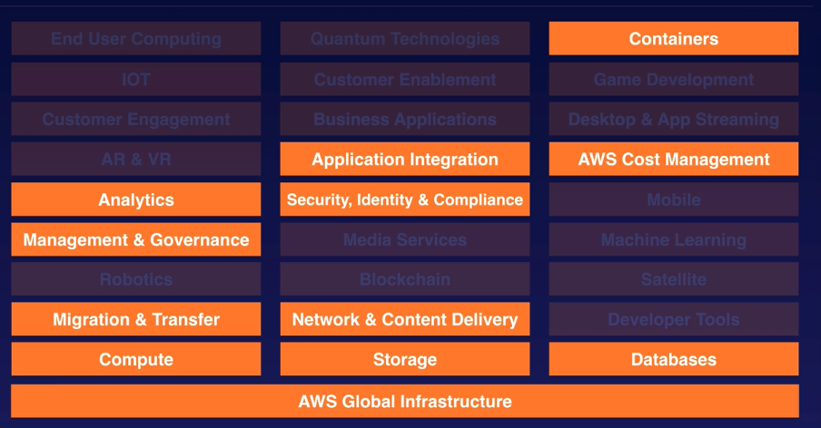
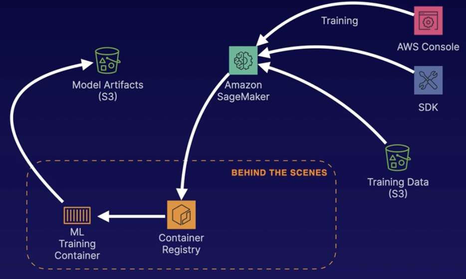

# AWS - Solution Architect Associate

# Introduction

**Exam Response Types:**

- **Scenario based:** Large majority of questions based on real-world scenarios
- **Multiple choice:** Has one correct response and three incorrect responses (distractors)
- **Multiple response:** Has two correct responses out of five response options

**SAA-C03 Exam Domains:**

- Design Resilient Architectures - 26%
- Design High-Performing Architectures - 24%
- Design Secure Architectures - 30%
- Design Cost-Optimized Architectures - 20%

**Design Resilient Arch:**

- Design a **multi-tier architecture** solution.
- Design **highly available and/or fault-tolerant** architectures.
- Design **decoupling mechanisms** using AWS services.
- Choose **appropriate resilient** storage.

**Design High-Performing Architectures**

- Identify **elastic and scalable compute** solutions for a workload.
- Select **high-performing and scalable storage** solutions for a workload
- Select **high-performing networking solutions** for a workload.
- Choose **high-performing database solutions** for a workload.

**Design Secure Architectures**

- Design **secure access** to AWS resources.
- Design **secure application tiers.**
- Select **appropriate data security options**.

**Design Cost-optimized Architectures**

- Identify cost-effective **storage solutions**.
- Identify cost-effective **compute and database services**.
- Design cost-optimized **network architectures**

**Exam Tips**

- Score between 100-1000 you need 720 to pass.
- 65 questions 2h10min to complete the exam
- Don't spend too much time on **hard questions** at first - **flag them** and **review later**!
- Watch for **keyword indicators** in certain scenarios.
- Remember the **Well-Architected Framework** pillars.

# AWS Fundamentals

## Availability Zones and Regions

AWS Global Infra

24 Regions, 77 AZ, changes along  time

## AWS Service Types

A lot of services, you only need to know a few to pass the exam.



**Exam Tips** 

- **A Region** is a physical location in the world that consists of two or more Availability Zones (AZs).
- **An AZ** is one or more discrete data centers - each with redundant power, networking, and connectivity - housed in separate facilities (>100km).
- **Edge locations** are endpoints for AWS that are used for caching content. Typically, this consists of CloudFront, Amazon's CDN.

## Who owns what in the cloud?

Shared responsibility model


**Can you do this yourself in the AWS Management Console?**

- **If yes, you are likely responsible:** Security groups, IAM users, patching EC2 operating systems, patching databases running on EC2, etc.
- **If not, AWS is likely responsible:** Management of data centers, security cameras, cabling, patching RDS operating systems, etc.
- **Encryption is a shared responsibility.**

## Compute, Storage, Databases and Networking

Key Services to know for the exam

1. **Compute**: EC2, Lambda, Elastic Beanstalk (provisioning engine)
2. **Storage**: S3, EBS (Block), EFS, FSx, Storage Gateway
3. **Databases**: RDS, DynamoDB, Redshift
4. **Networking**: VPCs, Direct Connect, Route 53, API Gateway, AWS Global Accelerator

## What is the Well-architected Framework?

AWS has hundreds of whitepapers available. You can filter a WAfR has its own category.

<aside>
💡 Read them as we go at the end of the course and before the exam

</aside>

**Six Pillars WAfR**

1. **Operational Excellence:**  Running and monitoring systems to deliver business value, and continually improving processes and procedures
2. **Performance Efficiency:** Using IT and computing resources efficiently
3. **Security:** Protecting information and systems
4. **Cost Optimization:** Avoiding unnecessary costs
5. **Reliability:** Ensuring a workload performs its intended function correctly and consistently when it's expected to
6. **Sustainability:** Minimizing the environmental impacts of running cloud workloads

# Identity and Access Management

## Securing the root account

lAM allows you to manage users and their level of access to the AWS console.

- Create users and grant permissions to those users.
- Create groups and roles.
- Control access to AWS resources.

The **root account** is the email address you used to sign up for AWS. The root account has **full administrative access** to AWS. For this reason, it is important to secure this account:

- Enable multi-factor authentication on the root account.
- Create an admin group for your administrators, and assign the appropriate permissions to this group.
- Create user accounts for your administrators.
- Add your users to the admin group

## Controlling Users’ Action with IAM Policy Documents

**Permissions with IAM**

We assign permissions using a **policy document** which is a JSON document. Example

```bash
{
	"Version": "2012-10-17"
	"Statement": [
		{
			"Effect": "Allow",
			"Action": "*",
			"Resource": "*"
		}
	]
}
```

This example allows everything to any resource

We will assign this policy docs to Groups, Users or Roles.

Typically assigned to groups not to the users

**IAM is global**

**IAM > Policies**

- There are some AWS managed (It has an AWS logo on them)
- You can create your own (Custom inline)

And explicitly deny will always override any allow in any other policy

## Permanent IAM Credentials

The **Building Blocks** of Identity and Access Management

1. **Users**: A physical person
2. **Groups**: Functions, such as administrator, developer, etc. Contains users
3. **Roles**: Internal usage

It's best practice for users to inherit permissions from groups:


**Users** and **People** Best Practices

**USER == PHYSICAL PERSON**

- Always work on the principle that one user equals one physical person.
- Never share user accounts across multiple people.

**The Principle of Least Privilege**

Only assign a user the minimum amount of privileges they need to do their job.

- **IAM is Universal:** It does not apply to regions at this time.
- **The Root Account:** The account created when you first set up your AWS account and which has complete admin access. Secure it as soon as possible and do not use it to log in day to day.
- **New Users:** No permissions when first created.

**User security**

- **Access key ID and secret access keys are not the same as usernames and passwords**. You cannot use the access key ID and secret access key to log in to the console. However, you would use them to access AWS via the APIs and Command Line.
- **You only get to view these once.** If you lose them, you have to regenerate them. So, save them in a secure location.
- **Always set up password rotations.** You can create and customize your own password rotation policies.

**Identity Federation:**

- **IAM Federation:** You can combine your existing user account with AWS. For example, when you log on to your PC (usually using Microsoft Active Directory), you can use the same credentials to log in to AWS if you set up federation.
- **Identity Federation:** Uses the SAML standard, which is Active Directory.

**ARN: Amazon Resource Name**: it is an unique identifier for a resource in AWS.


EAR = Effect, Action, Resource in a Policy Doc

# Simple Storage Service(S3)

## S3 Overview

**Object Storage**: S3 provides secure, durable, highly scalable object storage.

**Scalable**: S3 allows you to store and retrieve any amount of data from anywhere on the web at a very low cost.

**Simple**: Amazon S3 is easy to use, with a simple web service interface.

**S3 IS OBJECT-BASED STORAGE**

Manages data as objects rather than in file systems or data blocks.

- Upload any file type you can think of to S3.
- Examples include photos, videos, code, documents, and text files.
- Cannot be used to run an operating system or database.

**Features:**

- **Unlimited Storage:** The total volume of data and the number of objects you can store is unlimited.
- **Objects up to 5 TB in Size:** S3 objects can range in size from a minimum of 0 bytes to a maximum of 5 terabytes.
- **S3 Buckets:** Store files in buckets (similar to folders).

⚠️ **Working with S3 Buckets:**

1. **Universal Namespace:** All AWS accounts share the S3 namespace. Each S3 bucket name is globally unique.
2. **Example S3 URLs**
[https://bucket-name.s3.Region.amazonaws.com/key-name](https://bucket-name.s3.region.amazonaws.com/key-name)
[https://acloudguru.s3.us-east-1.amazonaws.com/Ralphie.jpg](https://acloudguru.s3.us-east-1.amazonaws.com/Ralphie.jpg)
3. **Uploading Files:** When you upload a file to an S3 bucket, you will receive an HTTP 200 code if the upload was successful.

⚠️  **Key-value Store**

- **Key:** The name of the object (e.g., Ralphie. jpg)
- **Value:** The data itself, which is made up of a sequence of bytes
- **Version ID:** Important for storing multiple versions of the same object
- **Metadata:** Data about the data you are storing (e.g., content -type, last-modified, etc.)

**S3 is a safe place to store your files.**
The data is spread across multiple devices and facilities to ensure availability and durability.

**Highly Available and Highly Durable**

- **Built for Availability:** Built for 99.95% - 99.99% service availability, depending on the S3 tier.
- **Designed for Durability:** Designed for 99.999999999% (9 decimal places durability for data stored in S3.

There are different storage classes, the default one is **S3 Standard** (See below)

**Features**

1. **Tiered Storage:** S3 offers a range of storage classes designed for different use cases.
2. **Lifecycle Management:** Define rules to automatically transition obiects to a cheaper storage tier or delete objects that are no longer required after a set period of time.
3. **Versioning:** With versioning, all versions of an object are stored and can be retrieved, including deleted objects.

**Securing our data**

1. **Server-Side Encryption:** You can set default encryption on a bucket to encrypt all new objects when they are stored in the bucket.
2. **Access Control Lists (ACLs):** Define which AWS accounts or groups are granted access and the type of access. You can attach S3 ACLs to individual objects within a bucket.
3. **Bucket Policies:** S3 bucket policies specify what actions are allowed or denied (e.g., allow user Alice to PUT but not DELETE objects in the bucket).

**Strong Read-After-Write Consistency**

- After a successful write of a new object (PUT) or an overwrite of an existing object, any subsequent read request immediately receives the latest version of the object.
- Strong consistency for list operations, so after a write, you can immediately perform a listing of the objects in a bucket with all changes reflected.

**What to Know for the Exam**

1. **Object Based:** Object-based storage allows you to upload files
2. **Not OS or DB Storage:** Not suitable to install an operating system or run a database on.
3. **Files up to 5 TB:** Files can be from 0 bytes to 5 TB.
4. **Unlimited Storage:** The total volume of data and the number of objects you can store is unlimited.

## Securing Your bucket with S3 Block Public Access

**ACCESS CONTROL LIST**
Object ACLs
Obiect ACLs work on an individual object level.

**BUCKET POLICY**
Bucket Policy
Bucket policies work on an entire bucket level.

**What to Know for the Exam**

1. **Buckets are private by default:** When you create an S3 bucket, it is private by default (including all objects within it). You have to allow public access on both the **bucket** and its **objects** in order to make the bucket public.
2. **Object ACLs:** You can make individual objects public using object ACLs.
3. **Bucket policies:** You can make entire buckets public using bucket policies.
4. **HTTP status code:** When you upload an object to S3 and it's successful, you will receive an
HTTP 200 code.

## Hosting a Static Website using S3

**S3 scales automatically to meet demand.**

Many enterprises will put static websites on S3 when they think there is going to be a large number of requests (e.g., for a movie preview).

We’ll use bucket policies, add them in the permissions tab

```bash
{
	"Version": "2012-10-17"
	"Statement": [
		{
			"Sid": "PublicReadGetObject"
			"Effect": "Allow"
			"Principal": "*"
			"Action": [
				"s3:GetObject"
			],
			"Resource": [
				"arn:aws:s3:::BUCKET _NAME/*"
			]		
		}
	]
}
```

Then activate in the bucket the configuration, after it will provide you an url


**What to Know for the Exam**

1. **Bucket Policies:** Make entire buckets public using bucket policies.
2. **Static Content:** Use S3 to host static content only (not dynamic).
3. **Automatic Scaling:** S3 scales automatically with demand.

## Versioning Objects in S3

⚠️ **Advantages of Versioning**

1. **All Versions:** All versions of an object are stored in S3. This includes all writes and even if you delete an object.
2. **Backup:** Can be a great backup tool.
3. **Lifecycle Rules:** Can be integrated with lifecycle rules
4. **Supports MFA:** Can support multi-factor authentication.
5. **Cannot Be Disabled:** Once enabled, versioning cannot be disabled - only suspended.

Even when you have a bucket policy for publish your bucket objects, it does not apply to previous versions. WE can make them available via ACL.

The way to restore an object we have deleted, this deleted file will appear in the GUI with a deletion marker, you just need to delete the deletion marker file to retrieve the latest version.

## S3 Storage Classes

**S3 Standard**

1. **High Availability and Durability:** Data is stored redundantly across multiple devices in multiple facilities (>=3 AZs):
    - 99.99% availability
    - 99.999999999% durability (11 9's)
2. **Designed for Frequent Access :** Perfect for frequently accessed data.
3. **Suitable for Most Workloads**
    - The default storage class.
    - Use cases include websites, content distribution, mobile and gaming applications, and big data analytics

**S3 Standard-Infrequent Access (S3 Standard-IA)**
Designed for infrequently accessed data

Features:

1. **Rapid Access:** Used for data that is accessed less frequently but requires rapid access when needed.
2. **You Pay to Access the Data:** There is a low per-GB storage price and a per-GB retrieval fee.
3. **Use Cases:** Great for long-term storage, backups, and as a data store for disaster recovery files.
    - 99.9% Availability
    - 99.999999999% (11 9's) Durability

**S3 One Zone-Infrequent Access**

Like S3 Standard-IA, but data is stored redundantly within a single AZ.

- Costs 20% less than regular S3 Standard-IA
- Great for long-lived, infrequently accessed, non-critical data
    - 99.5% Availability
    - 99.999999999% (11 9's) Durability

**S3 Intelligent-Tiering**

Automatically moves your data to the most cost-effective tier based on how frequently you access each object. 

2 Tiers

- Frequent Access
- Infrequent Access

**Optimizes Cost:** Monthly fee of $0.0025 per 1,000 objects

- **99.99% Availability**
- **99.999999999% (11 9's) Durability**

**Three  Glacier Options**

- You pay each time you access your data.
- Use only for archiving data.
- Glacier is cheap storage.
- Optimized for data that is very infrequently accessed.
- **99.99% Availability**
- **99.999999999% (11 9's) Durability**

**OPTION 1: Glacier Instant Retrieval**

Provides long-term data archiving with instant retrieval time for your data.

**OPTION 2: Glacier Flexible Retrieval**

Ideal storage class for archive data that does not require immediate access but needs the flexibility to retrieve large sets of data at no cost, such as backup or disaster recovery use cases. Can be minutes or up to 12 hours.

**OPTION 3: Glacier Deep Archive**
Cheapest storage class and designed for customers that retain data sets for 7-10 years or longer to meet customer needs and regulatory compliance requirements. The standard retrieval time is 12 hours, and the bulk retrieval time is 48 hours


## Lifecycle Management with S3

**What Is Lifecycle Management?**
Lifecycle management automates moving your objects between the different storage tiers, thereby maximizing cost effectiveness.


**Combining Lifecycle Management with Versioning:** You can use lifecycle management to move different versions of objects to different storage tiers.

**3 Tips for Lifecycle Management**

1. Automates moving objects between different storage tiers.
2. Can be used in conjunction with versioning.
3. Can be applied to current versions and previous versions.

Lifecycle policies can't work backwards. You can use a lifecycle policy to migrate objects from the more frequently accessed storage classes to the longer-term options, but not the other way aroundOMF

## S3 Object Lock and Glacier Vault Lock

**S3 Object Lock**

You can use S3 Object Lock to store objects using a **write once, read many (WORM)** model. It can help prevent objects from being deleted or modified for a fixed amount of time or indefinitely.

You can use **S3 Object Lock** to meet regulatory requirements that require WORM storage, or add an extra layer of protection against object changes and deletion.

Two modes:

1. **Governance Mode**
In governance mode, **users can't overwrite or delete an object version or alter its lock settings** unless they have special permissions.
With governance mode, you protect objects against being deleted by most users, but you can still grant some users **permission to alter the retention settings** or delete the object if necessary.
2. **Compliance Mode**
In compliance mode, **a protected object version can't be overwritten or deleted by any user**, including the root user in your AWS account. When an object is locked in compliance mode, its retention mode can't be changed and its retention period can't be shortened. Compliance mode ensures an object version **can't be overwritten or deleted** for the duration of the retention period.

**Retention Periods**

A retention period **protects an object version for a fixed amount of time**. When you place a retention period on an object version, Amazon S3 stores a timestamp in the object version's metadata to indicate when the retention period expires.

After the retention period expires, the object version can be **overwritten or deleted** unless you also placed a legal hold on the object version.

**Legal Holds**

S3 Object Lock also enables you to place a legal hold on an object version. Like a retention period, a legal hold **prevents an object version from being overwritten or deleted**. However, a legal hold doesn't have an associated retention period and remains in effect until removed.
Legal holds can be freely placed and removed by any user who has the `s3:PutObjectLegalHold` permission.

**Glacier Vault Lock**

S3 Glacier Vault Lock allows you to **easily deploy and enforce compliance controls for individual S3 Glacier vaults with a vault lock policy.** You can specify controls, such as WORM, in a vault lock policy and lock the policy from future edits. Once locked, the policy can no longer be changed.

**3 object Lock Tips**

1. Use **S3 Object Lock** to store objects using a write once, read many (WORM) model.
2. Object Lock can be on **individual objects** or applied **across the bucket** as a whole.
3. Object Lock comes in two modes: **governance mode** and **compliance mode**
    1. **Compliance Mode**
    With compliance mode, a protected object version can't be overwritten or deleted by any user, including the root user in your AWS account.
    2. **Governance Mode**
    With governance mode, users can't overwrite or delete an object version or alter its lock settings unless they have special permissions.

**S3 Glacier Vault Lock Exam Tips**

1. S3 Glacier Vault Lock allows you to **easily deploy** and **enforce compliance controls** for individual S3 Glacier vaults with a vault lock policy.
2. You can **specify controls, such as WORM, in a vault lock policy and lock the policy from future edits**. Once locked, the policy can no longer be changed.

## Encrypting S3 objects

**Types of Encryption**

1. Encryption in Transit
    - SSL/TLS
    - HTTPS
2. Encryption at Rest: Server-Side Encryption
    - **SSE-S3**: S3-managed keys, using AES 256-bit encryption
    - **SSE-KMS**: AWS Key Management Service-managed keys
    - **SSE-C**: Customer-provided keys
3. Encryption at Rest: Client-Side Encryption
    - You encrypt the files yourself before you upload them to S3.

**Enforcing Server-Side Encryption**

Two Ways to Do lt:

1. **Console**
    1. Select the encryption setting on your S3 bucket.
    2. The easiest way is just a checkbox in the console.
2. **Bucket Policy**
    1. You can also enforce encryption using a bucket policy. 
    2. This method sometimes comes up in the exam.

S3 PUT Request

Every time a file is uploaded to S3, a PUT request is initiated.

```bash
PUT /myFile HTTP/1.1
Host: myBucket.s3.amazonaws.com
Date: Wed, 25 Nov 2020 09:50:00 GMT
Authorization: authorization string
Content-Type: text/plain
Content-Length: 27364 x-amz-meta-author: Ryan
Expect: 100-continue
[27364 bytes of object data]
```

**Enforcing Server-Side Encryption**

1. `x-amz-server-side-encryption`
If the file is to be encrypted at upload time, the `x-amz-server-side-encryption` parameter will be included in the request header.
2. **Two Options:**
    1. `x-amz-server-side-encryption: AES256`
    (SSE-S3 - S3-managed keys)
    `x-amz-server-side-encryption: aws:kms`
    (SSE-KMS - KMS-managed keys)
3. **PUT Request Header**
When this parameter is included in the header of the PUT request, it tells S3 to encrypt the object at the time of upload, using the specified encryption method.

**S3 PUT Request**

This request header tells S3 to encrypt the file using SSE-S3 (AES 256-bit) at the time of upload.

You can create a bucket policy that denies any S3 PUT request that doesn't include the `x-amz-server-side-encryption` parameter in the request header.

```bash
PUT /myFile HTTP/1.1
Host: myBucket.s3.amazonaws.com
Date: Wed, 25 Nov 2020 09:50:00 GMT
Authorization: authorization string
Content-Type: text/plain
Content-Length: 27364 
x-amz-meta-author: Ryan
Expect: 100-continue 
**x-amz-server-side-encryption: AES256**
[27364 bytes of object data]
```

## Optimizing S3 Performance

**S3 Prefixes Explained**

| mybucketname/folder1/subfolder1/myfile.jpg | → | /folder1/subfolder1 |
| --- | --- | --- |
| mybucketname/folder2/subfolder1/myfile.jpg | → | /folder2/subfolder1 |
| mybucketname/folder3/myfile.jpg | → | /folder3 |
| mybucketname/folder4/subfolder4/myfile.jpg | → | /folder4/subfolder4 |

Just the folders = S3 Prefixes

**S3 Performance**

S3 has extremely low latency. You can get the first byte out of S3 within 100-200 milliseconds.

You can also achieve a high number of requests: 3,500 PUT/COPY/POST/DELETE and 5,500 GET/HEAD requests per second, per prefix

1. You can get better performance by spreading your reads across **different prefixes**. For example, if you are using **2 prefixes**, you can achieve **11,000 requests per second**
2. If we used all **4 prefixes** in the last example, you would achieve **22,000 requests per second**.

**S3 LIMITATIONS WHEN USING KMS**

- If you are using **SSE-KMS** to encrypt your objects in S3, you must keep in mind the **KMS limits**
- When you **upload** a file, you will call `GenerateDataKey` in the KMS API.
- When you **download** a file, you will call `Decrypt` in the KMS API.

**KMS Request Rates**

1. Uploading/downloading will count toward the **KMS quota**.
2. Region-specific, however, it's either **5,500, 10,000**, or **30,000** requests per second.
3. Currently, you **cannot** request a quota increase for KMS.

**Multipart Uploads**

- Recommended for files **over 100 MB**
- Required for files **over 5 GB**
- Parallelize uploads (increases **efficiency**)

**S3 Performance: Downloads**

S3 Byte-Range Fetches

- Parallelize **downloads** by specifying byte ranges.
    - Can be used to speed up downloads
    - Can be used to download partial amounts of the file (e.g. header information)
- If there's a failure in the download, it's only for a specific byte range.

**Exam Tips**

1. mybucketname/folder1/subfolder1/myfile.jpg → /folder1/subfolder1
2. You can also achieve a high number of requests: **3,500 PUT/COPY/POST/DELETE** and **5,500 GET/HEAD** requests per second, per prefix.
3. You can get better performance by spreading your reads across **different prefixes**. For example, if you are using **2 prefixes**, you can achieve **11,000 requests per second**
4. If you are using SSE-KMS to encrypt your objects in S3, you must keep in mind the KMS limits.
    1. Uploading/downloading will count toward the **KMS quota**
    2. Region-specific, however, it's either **5,500, 10,000**, or **30,000** requests per second.
    3. Currently, you **cannot** request a quota increase for KMS
5. Use **multipart uploads** to increase performance when **uploading files** to S3
6. Should be used for any files **over 100 MB** and must be used for any file **over 5 GB.**
7. Use **S3 byte-range fetches** to increase performance when **downloading files** to S3.

## Backing up data with S3 Replication

Used to be cross region replication, you can do it now between the same region bucket too.

⚠️ **S3 Replication**

1. **You can replicate objects from one bucket to another.**
Versioning must be enabled on both the source and destination buckets.
2. **Objects in an existing bucket are not replicated automatically.**
Once replication is turned on, all subsequent updated objects will be replicated automatically.
3. **Delete markers are not replicated by default.**
Deleting individual versions or delete markers will not be replicated.

<aside>
💡 AWS announced a new **Amazon S3 Batch Replication** feature on 08 FEB 2022, which allows replication of existing objects to different buckets on demand. Note that new AWS products, services or features must be generally available (GA) for at least 6 months prior to it appearing on certification exams. Check the resources section of the lesson for more details.

</aside>

# Elastic Compute Cloud

## EC2 Overview

Super important with the exam together with S3 too.

**Secure, resizable compute capacity in the cloud.**

Like a VM, only hosted in AWS instead of your own data center.

Designed to make web-scale cloud computing easier for developers.

The capacity you want when you need it.

You are in complete control of your own instances.

Launched in 2006 

- Pay only for what you use
- No wasted capacity. Grow and shrink your service as you go.

### Pricing Options:

**On-Demand**

- **Pay by the hour or the second**, depending on the type of instance you run.
- Great for flexibility.

**Spot**

- **Purchase unused capacity at a discount of up to 90%.**
- Prices fluctuate with supply and demand.
- Great for applications with flexible start and end times.

**Reserved**

- **Reserved capacity for 1 or 3 years.**
- Up to 72% discount on the hourly charge.
- Great if you have known, fixed requirements.

**Dedicated**

- **A physical EC2 server dedicated for your use.**
- Great if you have server-bound licenses to reuse or compliance requirements.

### On-demand Instances

1. **Flexible:** Low cost and flexibility of Amazon EC2 without any upfront payment or long-term commitment.
2. **Short-Term:** Applications with short-term, spiky, or unpredictable workloads that cannot be interrupted.
3. **Testing the Water:** Applications being developed or tested on Amazon EC2 for the first time.

### Reserved instances

1. **Predictable Usage:** Applications with steady state or predictable usage.
2. **Specific Capacity Requirements:** Applications that require reserved capacity.
3. **Pay up Front:** You can make upfront payments to reduce the total computing costs even further.
4. **Standard RIs:** Up to 72% off the on-demand price.
5. **Convertible RIs:** Up to 54% off the on-demand price. Has the option to change to a different RI type of equal or greater value
6. **Scheduled RIs:** Launch within the time window you define. Match your capacity reservation to a predictable recurring schedule that only requires a fraction of a day, week, or month.
7. Reserved instances operate at a regional level

**Savings Plans with Reserved Instances**

1. **Save up to 72%**: All AWS compute usage, regardless of instance type or Region.
2. **Commit to 1 or 3 Years:** Commit to use a specific amount of compute power (measured by the hour) for a 1-year or 3-year period.
3. **Super Flexible:** Not only EC2, this also includes serverless technologies like Lambda and Fargate

### Spot Instances

When to Use Spot Instances


Ejemplos: Image rendering, Genomic sequencing, Algorithmic trading engines

### Dedicated hosts

1. **Compliance:** Regulatory requirements that may not support multi-tenant virtualization.
2. **Licensing:** Great for licensing that does not support multi-tenancy or cloud deployments
3. **On-Demand:** Can be purchased on-demand (hourly).
4. **Reserved:** Can be purchased as a reservation for up to 70% off the on-demand price.

NOTE: Have a look at the AWS pricing calculator: https://calculator.aws.com

## Demo: Launching an EC2 instance

We have used EC2 Connect to SSH into the VM.

## AWS Command Line

AWS Console ⇒ Web based

AWS Command Line ⇒ You can also interact with AWS using the Command Line.

The AWS command line allows you to interact with AWS simply by typing commands. In this example we will list all our buckets in S3: `aws s3 ls`

Accessing a EC2 instance from CLI

```bash
chmod 400 your-key-file.pem
ssh ec2-user@public-ip -i your-key-file.pem
```

On EC2 instances, the AWS CLI is already installed by default

```bash
aws s3 ls
aws configure
# It will prompt for an Access Key ID and secret Key ID
```

Go to the Console → IAM. We need to create:

1. a new group (attach a policy to it, eg. S3Full access) to use the AWS CLI
2.  a new user(enable programmatic access) and 

Then we will get the Access Key ID and Secret Key ID

```bash
aws s3 mb s3://name-of-the-bucket
aws s3 cp file s3://name-of-the-bucket
```

### Exam tips

**Least Privilege**

- Always give your users the minimum amount of access required to do their job.

**Use Groups**

- **Create IAM groups** and assign your users to groups.
- Group permissions are assigned using lAM policy documents.
- Your users will **automatically inherit** the permissions of the group.

**AWS CLI Exam Tips**

1. **Secret Access Key:** You will only see this once! If you lose it, you can delete the access key ID and secret access key and regenerate them. You will need to run `aws configure` again.
2. **Don't Share Key Pairs:** Each developer should have their own access key ID and secret access key. Just like passwords, they should not be shared.
3. **Supports Linux, Windows, MacOS:** You can install the CLI on your Mac, Linux, or Windows PC. You can also use it on EC2 instances.

### Using Roles

A role is an identity you can create in IAM that has specific permissions. A role is similar to a user, as it is an AWS identity with permission policies that determine what the identity can and cannot do in AWS.

However, instead of being uniquely associated with one person, a role is intended to be assumable by anyone who needs it.

**Roles Are Temporary:** A role does not have standard long-term credentials the same way passwords or access keys do. Instead, when you assume a role, it provides you with temporary security credentials for your role session.

**What Else Can Roles Do?**

- Roles can be assumed by people, AWS architecture, or other system-level accounts.
- Roles can allow cross-account access. This allows one AWS account the ability to interact with resources in other AWS accounts.

**Roles are global**

During EC2 creation you can attach a IAM role to it and then use the AWS CLI to do any action that the role policy allows.

### Exam tips

What to Remember When Using Roles

1. **The Preferred Option:** Roles are preferred from a security perspective.
2. **Avoid Hard-Coding Your Credentials:** Roles allow you to provide access without the use of access key IDs and secret access keys
3. **Policies:** Policies control a role's permissions.
4. **Updates:** You can update a policy attached to a role, and it will take immediate effect.
5. **Attaching and Detaching:** You can attach and detach roles to running EC2 instances without having to stop or terminate those instances.

## Security Groups and Bootstrap scripts

Ports for different services: SSH, RDP, HTTP or HTTPS.

### Security Groups

Security groups are **virtual firewalls for your EC2 instance**. By default, everything is blocked.

**TO LET EVERYTHING IN: 0.0.0.0/0**

In order to be able to **communicate to your EC2 instances via SSH/RDP/HTTP**, you will need to **open up the correct ports**

### Bootstrap Scripts

- A script that runs **when the instance first runs** (with root permission)
- Adding these tasks at boot time adds to the amount of time it takes to boot the instance. However, it allows you to automate the installation/updates of applications.
    
    ```bash
    #! /bin/bash
    yum install httpd -y #installs apache
    yum service httpd start #starts apache
    ```
    

Passed the script under the field user-data when creating the EC2 and the system will do the magic.

**Security Groups Exam Tips**

- **Tip 1:** Changes to security groups take effect immediately.
- **Tip 2:** You can have any number of EC2 instances within a security group.
- **Tip 3:** You can have multiple security groups attached to EC2 instances.
- **Tip 4:** All inbound traffic is blocked by default.
- **Tip 5:** All outbound traffic is allowed.

## EC2 Metadata and User Data

EC2 metadata is simply data about your EC2 instance.

This can include information such as private IP address, public IP address, hostname, security groups, etc.

**Combining User Data and Metadata**

In this simple bootstrap (user data) script, we use the curl command to save our EC2 metadata.

```bash
#! /bin/bash 
curl http://169.254.169.254/latest/meta-data/local-ipv4 > myIP.txt
```

You can also query your user-data in the same address changing /meta-data by /user-data and you will the bootstrap script.

**User Data vs. Metadata**

- User data is simply bootstrap scripts
- Metadata is data about your EC2 instances
- You can use bootstrap scripts (user data) to access metadata.

**Comparing User Data and Metadata**

**User Data**

- User data are simply bootstrap scripts

**VS**

**Metadata**

- Metadata is data about your EC2 instances
- You can use bootstrap scripts (user data) to access metadata

## Networking with EC2

You can attach 3 different types of virtual networking cards to your EC2 instances:

1. **ENI: Elastic Network Interface**
    1. For basic, day-to-day networking
2. **EN: Enhanced Networking**
    1. Uses single root I/O virtualization (SR-IOV) to provide high performance
3. **EFA: Elastic Fabric Adapter**
    1. Accelerates High Performance Computing (HPC) and machine learning applications

An **ENI** is simply a virtual network card that allows:

- Private IPv4 Addresses
- Public IPv4 Address
- MAC Address
- 1 or More Security Groups
- Many IPv6 Addresses

**Common ENI Use Cases**

- Create a management network.
- Use network and security appliances in your VPC.
- Create dual-homed instances with workloads/ roles on distinct subnets
- Create a low-budget, high-availability solution.

**What Is Enhanced Networking(EN)?**

For High-Performance Networking between 10 Gbps - 100 Gbps

- **SINGLE ROOT I/O VIRTUALIZATION (SR-I0V)**
SR-IOV provides higher 1/0 performance and lower CPU utilization
- **PERFORMANCE**
Provides higher bandwidth, higher packet per second (PPS) performance, and consistently lower inter-instance latencies

Depending on your instance type, enhanced networking can be enabled using:

- ELASTIC NETWORK ADAPTER (ENA)
    - Supports network speeds of up to 100 Gbps for supported instance types.
- INTEL 82599 VIRTUAL FUNCTION (VF) INTERFACE
    - Supports network speeds of up to 10 Gbps for supported instance types.
    - Typically used on older instances.

<aside>
💡 STUDY TIP:  In any scenario question: Choose ENA over VF interface

</aside>

**What Is an EFA? Elastic Fabric Adapter**

- A network device you can attach to your Amazon EC2 instance to accelerate High Performance Computing (HPC) and machine learning applications.
- Provides lower and more consistent latency and higher throughput than the TCP transport traditionally used in cloud-based HPC systems.
- **EFA CAN USE OS-BYPASS**
    - It makes it a lot faster with much lower latency.
    - **OS-bypass** enables HPC and machine learning applications to bypass the operating system kernel and communicate directly with the EFA device. Not currently supported with Windows - only Linux.

For different scenarios **on the exam**, choose the correct networking device.

1. **ENI**
For basic networking. Perhaps you need a separate management network from your production network or a separate logging network, and you need to do this at a low cost. In this scenario, use multiple ENIs for each network.
2. **Enhanced Networking**
For when you need speeds between 10 Gbps and 100 Gbps. Anywhere you need reliable, high throughput.
3. **EFA**
For when you need to accelerate High
Performance Computing (HPC) and machine learning applications or if you need to do an OS-bypass. If you see a scenario question mentioning HPC or ML and asking what network adapter you want, choose EFA.

## Optimizing with EC2 Placement Groups

3 Types of Placement Groups

1. **Cluster Placement Groups**
    1. **Grouping of instances within a single Availability Zone.** Recommended for applications that need low network latency, high network throughput, or both.
    2. **Fact:** Only certain instance types can be launched into a cluster placement group.
2. **Spread Placement Groups**
    1. A spread placement group is a group of instances that are **each placed on distinct underlying hardware**
    2. Spread placement groups are recommended for applications that have a small number of critical instances that should be kept separate from each other.
        
        
        
    
    <aside>
    💡 **STUDY TIP:** Scenario Questions →Used for Individual Instances
    
    </aside>
    
3. **Partition placement groups**
- Multiple EC2 instances; HDFS, HBase, and Cassandra
- Each partition placement group has its own set of racks. Each rack has its own network and power source. No two partitions within a placement group share the same racks allowing you to isolate the impact of hardware failure within your application.
- EC2 DIVIDES EACH GROUP INTO LOGICAL SEGMENTS CALLED PARTITIONS.


Other notes about placement groups:

- A **cluster placement group** can't span multiple Availability Zones, whereas a spread placement group and partition placement group can.
- Only **certain types of instances** can be launched in a placement group (compute optimized,
GPU, memory optimized, storage optimized)
- **AWS recommends homogenous instances** within cluster placement groups.
- **You can't merge placement groups.**
- You can **move an existing instance into a placement group.** Before you move the instance, the instance must be in the stopped state. You can move or remove an instance using the AWS CLI or an AWS SDK, but you can't do it via the console yet.

## Solving licensing issues with dedicated hosts

Recap on **the Different Pricing Models for EC2**

- **On-Demand:** Pay by the hour or the second, depending on the type of instance you run.
- **Reserved:** Reserved capacity for 1 or 3 years. Up to 72% discount on the hourly charge.
- **Spot:** Purchase unused capacity at a discount of up to 90%. Prices fluctuate with supply and demand.
- **Dedicated:** A physical EC2 server dedicated for your use. The most expensive option.

### Dedicated hosts

- **Compliance:** Regulatory requirements that may not support multi-tenant virtualization.
- **Licensing:** Great for licensing that does not support multi-tenancy or cloud deployments.
- **Reserved:** Can be purchased as a reservation for up to 70% off the on-demand price.
- **On-Demand:** Can be purchased on-demand (hourly).

**Exam tips**

<aside>
💡 Any question that talks about special licensing requirements.

</aside>

An **Amazon EC2 Dedicated Host** is a **physical server** with EC2 instance capacity fully dedicated to your use. Dedicated Hosts allow you to **use your existing** per-socket, per-core, or per-VM software **licenses**, including Windows Server, Microsoft SQL Server, and SUSE Linux Enterprise Server.

## Timing workload with Spot Instances and Spot Fleets

**Amazon EC2 Spot Instances** let you take advantage of unused C2 capacity in the
AWS Cloud. Spot Instances are available at up to a 90% discount compared to On-Demand prices.

**WHEN TO USE SPOT INSTANCES**

Stateless, fault-tolerant, or flexible applications

Applications such as big data, containerized workloads, C/CD, high-performance computing (HPC), and other test and development workloads.

To use **Spot Instances**, you must first decide on your maximum Spot price. The instance will be provisioned so long as the Spot price is BELOW your maximum Spot price.

- The **hourly Spot price** varies depending on capacity and region.
- If the Spot price goes above your maximum, you have **2 minutes** to choose whether to stop or terminate your instance.

You can get all the historical data and break down by OS, Region, Instance Type, date ranges,…

Spot Instances **are useful** for the following tasks:

- Big data and analytics
- Containerized workloads
- CI/CD and testing
- Image and media rendering
- High-performance computing

Spot Instances are not good for:

- Persistent workloads
- Critical jobs
- Databases

Terminating Spot Instances


Reference: [https://docs.aws.amazon.com/AWSEC2/latest/UserGuide/spot-requests.html](https://docs.aws.amazon.com/AWSEC2/latest/UserGuide/spot-requests.html)

If the request is persistent, you need to deactivate the request before terminating the instance

**Spot Fleets**

**A Spot Fleet is a collection of Spot Instances and (optionally) On-Demand Instances.**

The **Spot Fleet** attempts to launch the number of Spot instances and On-Demand instances to meet the target capacity you specified in the Spot Fleet request. The request for Spot Instances is fulfilled if there is available capacity and the **maximum price you specified in the request exceeds the current Spot price**. The Spot Fleet also attempts to maintain its target capacity fleet if your Spot Instances are interrupted.

**Spot Fleets will try and match the target capacity with your price restraints.**

1. Set up different launch pools. Define things like **EC2** instance type, operating system, and Availability Zone.
2. You can have **multiple** pools, and the fleet will choose the best way to implement depending on the strategy you define
3. Spot fleets will **stop launching instances** once you reach your price threshold or capacity desire.

**You can have the following strategies with Spot Fleets.**

1. `capacityOptimized`: The Spot Instances come from the pool with optimal capacity for the number of instances launching.
2. `lowestPrice`: The Spot Instances come from the pool with the lowest price. This is the default strategy.
3. `diversified`: The Spot Instances are distributed across all pools.
4. `InstancePoolsToUseCount`:The Spot Instances are distributed across the number of Spot Instance pools you specify. This parameter is valid only when used in combination with `lowestPrice`

**Exam tips**

- Spot Instances save up to **90%** of the cost of On-Demand instances.
- You can block Spot Instances from terminating by using a **Spot block.**
- Useful for any type of computing where you don't need **persistent storage.**
- A Spot Fleet is a collection of Spot Instances and (optionally) On-Demand instances.

## Deploying vCenter in AWS with VMware Cloud on AWS

**Why Use VMware on AWS?**

VMware is used by organizations around the world for private cloud deployments. Some organizations opt for a hybrid cloud strategy and would like to leverage AWS services.

**Use Cases for VMware**

1. **Hybrid Cloud:** Connect your on-premises cloud to the AWS public cloud, and manage a hybrid workload.
2. **Disaster Recovery:** VMware is famous for its disaster recovery technology. Using hybrid cloud, you can have an inexpensive disaster recovery environment on AWS.
3. **Cloud Migration:** Migrate your existing cloud environment to AWS using VMware's built-in tools.
4. **Leverage AWS:** Use over 200 AWS services to update your applications or to create new ones.

**How is it deployed?**

- It runs on dedicated hardware hosted in AWS using a single AWS account.
- Each host has two sockets with 18 cores per socket, 512 GiB RAM, and 15.2 TB Raw SSD storage.
- Each host is capable of running multiple VMware instances (up to the hundreds).
- Clusters can start with two hosts up to a maximum of 16 hosts per cluster.

<aside>
💡 Exam Tips:

You can deploy Center on the AWS Cloud using **VMware.**
Perfect solution for extending your private VMware Cloud into the
AWS public cloud

</aside>

## Extended AWS beyond the Cloud with AWS Outposts

Recently added to the exam so important to remember.

**What Is Outposts?**
Outposts brings the AWS data center directly to you, on-premises. Outposts allows you to have the large variety of AWS services in your data center. You can have Outposts in sizes such as 1U and 2U servers all the way up to 42U racks and multiple-rack deployments.

**Benefits of Outposts**

1. **Hybrid Cloud:** Create a hybrid cloud where you can leverage AWS services inside your own data center.
2. **Consistency:** Bring the AWS Management Console, APis, and SDKs into your data center, allowing uniform consistency in your hybrid environment.
3. **Fully Managed Infrastructure:** AWS can manage the infrastructure for you. You do not need a dedicated team to look after your Outposts infrastructure.

**Outposts Family Members**

|  | Outposts Rack
 | Outposts Servers |
| --- | --- | --- |
| Hardware | Available starting with a single 42U rack and scale up to 96 racks | Individual servers in 1U or 2U form factor |
| Services | Provides AWS compute storage, database, and other services locally | Useful for small space requirements, such as retail stores, branch offices, healthcare provider locations, or factory floors |
| Results | Gives the same AWS infrastructure, services, and APIs in your own data center | Provides local compute and networking services |

**Process**

1. **Order:** Log in to the AWS Management Console, and order your Outposts configuration.
2. **Install:** AWS staff will come on-site to install and deploy the hardware, including power, networking, and connectivity.
3. **Launch:**Using the AWS Management Console, you can launch instances on your Outpost on-site.
4. **Build:** Start building your on-site AWS environment.

<aside>
💡 EXAM TIPS - **Scenario about extending AWS to your data center?**

Think AWS Outposts.

- AWS Outposts rack for large deployments
- AWS Outposts servers for smaller deployments
</aside>

# Elastics Block Storage (EBS) and Elastic File System (EFS)

## EBS Overview

What are EBS volumes? What you need to know:

- The different types of EBS volumes available.
- Use cases for each type.
- Install your Amazon Linux OS, your app, or store your data. Install all kind of things it is a virtual hard disk in the cloud.
- Storage volumes you can attach to your EC2 instances.

Use them the same way you would use any system disk:

- Create a file system.
- Run a database.
- Run an operating system.
- Store data.
- Install applications.

Mission Critical

1. **Production Workloads:** Designed for mission-critical workloads.
2. **Highly Available:** Automatically replicated within a single Availability Zone to protect against hardware failures.
3. **Scalable:** Dynamically increase capacity and change the volume type with no downtime or performance impact to your live systems.

**EBS Volume Types - SSD**

- General purpose SSD (gp2) - Balance between price and performance:
    - 3 IOPS per GiB, **up to a maximum of 16,000 lOPS per volume**
    - **gp2** volumes **smaller than 1 TB** can burst up to 3,000 lOPS
    - **Good for boot volumes** or development and test applications that are not latency sensitive
- General purpose SSD (gp3)
    - Predictable **3,000 lOPS baseline performance** and 125
    MiB/s regardless of volume size.
    - Ideal for applications that **require high performance at a low cost**, such as MySQL, Cassandra, virtual desktops, and Hadoop analytics.
    - Customers looking for higher performance **can scale up** to 16,000 IOPS and 1,000 MiB/s for an additional fee.
    - The top performance of **gp3** is **4 times faster than max** throughput of gp2 volumes

NOTE: Only need to know the use cases

- Provisioned IOPS SSD (io1) - Legacy one and the most expensive.
    - Up to 64,000 IOPS per volume. 50 IOPS per GiB.
    - Use if you need more than 16,000 lOPS.
    - Designed for I/O-intensive applications, large databases, and latency-sensitive workloads
- Provisioned IOPS SSD (io2) - Latest generation
    - High durability and more IOPS
    - It has the same price io1
    - 500 IOPS per GiB. Up to 64,000 IOPS.
    - 99.999% durability instead of up to 99.9%.
    - I/O-intensive apps, large databases, and latency-sensitive workloads.
    **Applications that need high levels of durability.**

**EBS Volume Types - HDD (MB/s-intensive) - Magnetic**

- Throughput Optimized HDD (st1)
    - Low-cost HDD volume
        - Baseline throughput of 40 MB/s per TB
        - Ability to burst up to 250 MB/s per TB
        - Maximum throughput of 500 MB/s per volume
        - Frequently accessed, throughput-intensive workloads
        - Big data, data warehouses, ETL, and log processing
        - A cost-effective way to store mountains of data
        - Cannot be a boot volume

NOTE: Big Data ⇒ Throughput

- Cold HDD (sc1) - Lowest Cost Option
    - Baseline throughput of 12 MB/s per TB
    - Ability to burst up to 80 MB/s per TB
    - Max throughput of 250 MB/s per volume
    - A good choice for colder data requiring fewer scans per day
    - Good for applications that need the lowest cost and performance is not a factor
    - Cannot be a boot volume

**IOPS vs Throughput**

| IOPS | VS | Throughput |
| --- | --- | --- |
| Measures the number of read and write operations per second |  | Measures the number of bits read or written per second (MB/s) |
| Important metric for quick transactions, low-latency apps, transactional workloads |  | Important metric for large datasets, large 1/O sizes, complex queries
 |
| The ability to action reads and writes very quickly |  | The ability to deal with large datasets |
| Choose Provisioned IOPS SSD (i01 or io2) |  | Choose Throughput Optimized HDD (st1) |

Note: Provisioned IOPS = PIOPS

Exam tips:

- Learning EBS: SSD Volumes
Highly available and scalable storage volumes you can attach to an EC2 instance.

| gp2 | gp3 | io1 | io2 |
| --- | --- | --- | --- |
| General Purpose SSD | General Purpose SSD | Provisioned IOPS SSD | Provisioned IOPS SSD |
| • Suitable for boot disks and general applications
• Up to 16,000 IOPS per volume
• Up to 99.9% durability | • Suitable for high
performance applications
• Predictable 3,000 IOPS
baseline performance and
125 MiB/s regardless of volume size
• Up to 99.9% durability | • Suitable for OLTP and latency-sensitive applications
• 50 IOPS/GiB
• Up to 64,000 IOPS per volume
• High performance and most expensive
• Up to 99.9% durability | • Suitable for OLTP and latency-sensitive applications
• 500 IOPS/GiB
• Up to 64,000 lOPS per volume
• 99.999% durability
• Latest generation
Provisioned IOPS volume |

If you need more than 16K IOPS go to io1/io2

- EBS: HDD Volumes
Highly available and scalable storage volumes you can attach to an EC2 instance.
    
    
    | st1 | sc1 |
    | --- | --- |
    | Throughput Optimized HDD | Cold HDD |
    | • Suitable for big data, data warehouses, and ETL
    • Max throughput is 500 MB/s per volume
    • Cannot be a boot volume
    • Up to 99.9% durability | • Max throughput of 250 MB/s per volume
    • Less frequently accessed data
    • Cannot be a boot volume
    • Lowest cost
    • Up to 99.9% durability |

## Volumes and Snapshots

**What are volumes?**

- Volumes exist on EBS:
    
    THINK OF IT AS A VIRTUAL HARD DISK
    Volumes are simply virtual hard disks. You need a minimum of 1 volume per EC2 instance. This is called the root device volume.
    

**What are snapshots?**

1. **Snapshots exist on S3:** Think of snapshots as a photograph of the virtual disk/volume.
2. **Snapshots are point in time:** When you take a snapshot, it is a point-in-time copy of a volume.
3. **Snapshots are incremental:** This means only the data that has been changed since your last snapshot are moved to S3. This saves dramatically on space and the time it takes to take a snapshot.
4. **The first snapshot:** If it is your first snapshot, it may take some time to create as there is no previous point-in-time copy.

**3 TIPS for Snapshots**

1. **Consistent Snapshots:** Snapshots only capture data that has been written to your Amazon EBS volume, which might exclude any data that has been locally cached by your application or OS. For a consistent snapshot, it is recommended you stop the instance and take a snap.
2. **Encrypted Snapshots:** If you take a snapshot of an encrypted EBS volume, the snapshot will be encrypted automatically.
3. **Sharing Snapshots:** You can share snapshots, but only in the region in which they were created. To share to other regions, you will need to copy them to the destination region first.

**What to know about EBS volumes?**

1. **LOCATION: EBS volumes will always be in the same AZ as EC2.**
Your EBS volumes will always be in the same AZ as the EC2 instance to which it is attached.
2. **RESIZING: Resize on the fly.**
You can resize EBS volumes on the fly. You do not need to stop or restart the instance. However, you will need to extend the filesystem in the OS so the OS can see the resized volume.
3. **VOLUME TYPE: Switch volume types.**
You can change volume types on the fly (e.g., go from gp2 to io2). You do not need to stop or restart the instance.

**Exam tips**

5 Tips for EBS Volumes and Snapshots

1. Volumes exist on EBS, whereas snapshots exist on S3.
2. Snapshots are point-in-time photographs of volumes and are incremental in nature.
3. The first snapshot will take some time to create. For consistent snapshots, stop the instance and detach the volume.
4. You can share snapshots between AWS accounts as well as between regions, but first you need to copy that snapshot to the target region.
5. You can resize EBS volumes on the fly as well as changing the volume types.

## Protecting EBS Volumes with Encryption

**EBS Encryption**

EBS encrypts your volume with a data key using the industry-standard AES-256 algorithm. Amazon EBS encryption uses AWS
Key Management Service (AWS KMS) customer master keys (CMK) when creating encrypted volumes and snapshots.

⚠️ **What Happens When You Encrypt an EBS Volume?**

1. Data at rest is encrypted inside the volume.
2. All data in flight moving between the instance and the volume is encrypted.
3. All snapshots are encrypted.
4. All volumes created from the snapshot are encrypted.

**EBS Encryption Features**

1. **Handled Transparently:** Encryption and decryption are handled transparently (you don't need to do anything).
2. **Latency:** Encryption has a minimal impact on latency.
3. **Copying:** Copying an unencrypted snapshot allows encryption.
4. **Snapshots:** Snapshots of encrypted volumes are encrypted.
5. **Root Device Volumes:** You can now encrypt root device volumes upon creation.

**How to encrypt existing volumes**

⚠️ 4 Steps to Encrypt an Unencrypted Volume

1. Create a snapshot of the unencrypted root device volume.
2. Create a copy of the snapshot and select the encrypt option.
3. Create an AMI from the encrypted snapshot.
4. Use that AMI to launch new encrypted instances.

Very popular exam topic

Copy a snapshot within the same region and enable encryption, then create an image and then launch a VM from the image

## EC2 Hibernation

**EBS Behaviors Reviewed**

We have learned so far we can stop and terminate EC2 instances. If we stop the instance, the data is kept on the disk (with EBS) and will remain on the disk until the EC2 instance is started. If the instance is terminated, then by default the root device volume will also be terminated.

When we **start our EC2 instance**, the following happens:

1. **Operating system** boots up
2. User data script is run (**bootstrap scripts**)
3. **Applications start** (can take some time)

**What is EC2 Hibernation?**

When you hibernate an EC2 instance, the operating system is told to perform hibernation (suspend-to-disk). Hibernation saves the contents from the instance memory (RAM) to your Amazon EBS root volume. We persist the instance's Amazon EBS root volume and any attached Amazon EBS data volumes.

When you start your instance out of hibernation:

- The **Amazon EBS** root volume is restored to its previous state.
- The **RAM** contents are reloaded.
- The processes that were previously running on the instance are resumed.
- Previously attached data volumes are **reattached and the instance retains its instance ID.**


Reference: [https://docs.aws.amazon.com/AWSEC2/latest/UserGuide/Hibernate.html](https://docs.aws.amazon.com/AWSEC2/latest/UserGuide/Hibernate.html)

With EC2 hibernation, the instance boots much faster. The operating system does not need to reboot because the in-memory state (RAM) is preserved. This is useful for:

1. **Long-running processes**
2. **Services that take time to initialize**

Exam TIPS

**What You Need to Know about EC2 Hibernation**

- **EC2 hibernation** preserves the in-memory RAM on persistent storage (EBS).
- **Much faster to boot up** because you **do not need to reload the operating system.**
- **Instance RAM** must be less than **150 GB**
- **Instance families include** C3, C4, C5, M3, M4, M5, R3, R4, and R5.
- **Available for** Windows, Amazon Linux 2 AMI, and Ubuntu.
- **Instances can't be hibernated** for more than **60 days.**
- **Available for** On-Demand instances and Reserved Instances.

## EFS Overview

**What is EFS? Amazon Elastic File System**

- Managed NFS (network file system) that can be mounted on many EC2 instances.
- EFS works with EC2 instances in multiple Availability Zones.
- Highly available and scalable; however, it is expensive.


**Use cases:**

- **Content Management:** Great fit for content management systems, as you can easily share content between EC2 instances.
- **Web Servers:** Also a great fit for web servers. Have just a single folder structure for your website.

**Overview**

- Uses NFSv4 protocol
- Compatible with Linux-based AMI (Windows not supported at this time)
- Encryption at rest using KMS
- File system scales automatically; no capacity planning required
- Pay per use

**EFS Performance**

EFS has amazing performance capabilities

| 1000s | 10 Gbps | Petabytes |
| --- | --- | --- |
| Concurrent
Connections | Throughput | Scaling |
| EFS can support thousands of concurrent connections
(EC2 instances). | EFS can handle up to 10 Gbps in throughput. | Scale your storage to petabytes. |

**Controlling Performance**

When creating an EFS file system, you can set what performance characteristics you want.

- General Purpose: Used for things like web servers, CMS, etc.
- Max I/O: Used for big data, media processing, etc.

**Storage Tiers**

EFS comes with storage tiers and lifecycle management, allowing you to move your data from one tier to another after X number of days.

- **Standard:** For frequently accessed files
- **Infrequently Accessed:** For files not frequently accessed

**Exam Tips**

What to Remember about EFS

- Supports the Network File System version 4 (NFSv4) protocol
- Can support thousands of concurrent NFS connections
- Only pay for the storage you use (no pre-provisioning required)
- Data is stored across multiple AZs within a region
- Can scale up to petabytes
- Read-after-write consistency

<aside>
💡 **BONUS TIP**
If you have a scenario-based question around **highly scalable shared storage using NFS,** think EFS.

</aside>

## FSx Overview

**What Is FSx for Windows?**

Amazon FSx for Windows File Server provides a fully managed native Microsoft Windows file system so you can easily move your Windows-based applications that require file storage to AWS.

AMAZON FSX IS BUILT ON WINDOWS SERVER.

**How is FSx for Windows different from EFS?**

| FSx for Windows | EFS |
| --- | --- |
| • A managed Windows Server that runs Windows Server Message Block (SMB)-based file services. | • A managed NAS filer for EC2 instances based on Network File System (NFS) version 4. |
| • Designed for Windows and Windows applications. | • One of the first network file sharing protocols native to Unix and Linux |
| • Supports AD users, access control lists, groups, and security policies, along with Distributed File System (DFS) namespaces and replication |  |

## **Amazon FSx for Lustre**

A fully managed file system that is optimized for compute-intensive workloads

- High Performance Computing
- Machine Learning
- Media Data Processing Workflows
- Electronic Design Automation

**FSx for Lustre Performance**

With Amazon FSx, you can **launch and run a Lustre file system that can process massive datasets at up to hundreds of gigabytes per second** of throughput, millions of IOPS, and sub-millisecond latencies.

**Exam tips**

In the exam, you'll be given **different scenarios** and asked to choose whether you should use **EFS, FSx for Windows**, or **FSx for Lustre**

1. **EFS:** When you need distributed, highly resilient storage for Linux instances and Linux-based applications.
2. **Amazon FSx for Windows:** When you need centralized storage for Windows-based applications, such as SharePoint, Microsoft SQL Server, Workspaces, IIS Web Server, or any other native Microsoft application.
3. **Amazon FSx for Lustre:** When you need high-speed, high-capacity distributed storage. This will be for applications that do high performance computing (HPC), financial modeling, etc. Remember that FSx for Lustre can store data directly on S3.

## Amazon Machine Images: EBS vs. Instance Store

**What Is an AMI?**

An Amazon Machine Image (AMI) provides the information required to launch an instance.

**You must specify an AMI when you launch an instance.**

**5 Things You Can Base Your AMI On**

1. Region
2. Operating system
3. Architecture (32-bit or 64-bit)
4. Launch permissions
5. Storage for the root device (root device volume)

**All AMIs are categorized as either backed by:**

- **Amazon EBS:** The root device for an instance launched from the AMI is an Amazon EBS volume created from an Amazon EBS snapshot.
- **Instance Store:** The root device for an instance launched from the AMI is an instance store volume created from a template stored in Amazon S3.

<aside>
💡 **STUDY TIP: Instance Store Volumes**
Instance store volumes are sometimes called ephemeral storage. Instance store volumes cannot be stopped. If the underlying host fails, you will lose your data.
You can, however, reboot the instance without losing your data.

If you delete the instance, you will lose the instance store volume.

</aside>

<aside>
💡 **STUDY TIP: EBS Volumes**
EBS-backed instances **can be stopped.** You will not lose the data on this instance if it is stopped. You can also reboot an EBS volume and not lose your data.

By default, the root device volume will be deleted on termination. However, you can tell AWS to keep the root device volume with EBS volumes.

</aside>

Exam tips 

**AMIs: EBS vs. Instance Store**

- Instance store volumes are sometimes called ephemeral storage.
- You can reboot both EBS and instance store volumes and you will not lose your data.
- Instance store volumes **cannot be stopped**. If the underlying host fails, you will lose your data.
- By default, both root volumes will be deleted on termination.
However, with EBS volumes, you can tell AWS to keep the root device volume.
- EBS-backed instances **can be stopped.** You will not lose the data on this instance if it is stopped.

<aside>
💡 **BONUS TIP**
An AMI is just a blueprint for an EC2 instance.

</aside>

## AWS Backup

**What is AWS Backup?**

Backup allows you to consolidate your backups across multiple AWS services, such as EC2, EBS, EFS, Amazon FSx for Lustre, Amazon FSx for Windows File Server, and AWS Storage Gateway.
**It can include other services, such as database technologies like RDS and DynamoDB**.

**AWS Backup with Organizations**

Backup can be used with AWS Organizations to back up multiple AWS accounts in your organization.

**It gives you centralized control across all AWS services, in multiple AWS accounts across the entire AWS organization.**

**Benefits of AWS Backup**

1. **Central Management:** Use a single, central backup console, allowing you to centralize your backups across multiple AWS services and multiple AWS accounts.
2. **Automation:** You can create automated backup schedules and retention policies. You can also create lifecycle policies, allowing you to expire unnecessary backups after a period of time.
3. **Improved Compliance:** Backup policies can be enforced while backups can be encrypted both at rest and in transit, allowing alignment to regulatory compliance.
Auditing is made easy due to a consolidated view of backups across many AWS services.

**Exam tips**

- **Consolidation:** Use AWS Backup to back up AWS services, such as EC2, EBS, EFS, Amazon FSx for Lustre, Amazon FSx for Windows File Server, and AWS Storage Gateway.
- **Organizations:** You can use AWS Organizations in conjunction with AWS Backup to back up your different AWS services across multiple AWS accounts.
- **Benefits:** Backup gives you centralized control, letting you automate your backups and define lifecycle policies for your data. You get better compliance, as you can enforce your backup policies, ensure your backups are encrypted, and audit them once complete.

### Exam tips

**Comparing All Storage Options**
Storage Options Use Cases

- **S3:** Used for serverless object storage
- **Glacier:** Used for archiving objects
- **FSx for Lustre:** File storage for high performance computing Linux file systems
- **EBS Volumes:** Persistent storage for EC2 instances
- **EFS:** Network File System (NFS) for Linux instances. Centralized storage solution across multiple AZs.
- **Instance Store:** Ephemeral storage for EC2 instances
- **FSx for Windows:** File storage for Windows instances. Centralized storage solution across multiple AZs.

<aside>
💡 **BONUS TIP**
Knowing the different use cases for storage will gain you valuable points in the exam.

</aside>

# Databases

## Relational Databases Systems (RDS)

Relational Databases:

- Tables: data is organized into tables. Think of a traditional spreadsheet.
- Rows: the data items
- Columns: the fields in the database

Relational Databases Engines:

- SQL Server
- Oracle

- MySQL
- MariaDB

- PostgresSQL
- Amazon Aurora

**Advantages**

- Up and Running in minutes (managed service
- Multi-AZ
- Failover capability
- Automated backups
- A manual install in your own data center could take up to 8 days or more

**When would w use an RDS database?**

RDS is generally used for **online transaction processing (OLTP)** workloads

| OLTP | vs. | OLAP (analytical) |
| --- | --- | --- |
| Processes data from transactions in real time (e.g., customer orders, banking transactions, payments, and booking systems). |  | Processes complex queries to analyze historical data (e.g., analyzing net profit figures from the past 3 years and sales forecasting). |
| OLTP is all about data processing and completing large numbers of small transactions in real time. |  | OLAP is all about data analysis using large amounts of data, as well as complex queries that take a long time to complete. |

**OLAP Examples:**

- Net Profit Analysis
    
    You have been asked to produce a report comparing net profits for car sales in 3 different regions.
    
- Large Amounts of Data
    - Sum of cars sold in each region
    - Unit cost for each region
    - Sales price of each car
    - Sales price compared to the unit cost
- Analysis, Not Transactions
    
    RDS is not suitable for analyzing large amounts of data. Use a data warehouse like Redshift, which is optimized for OLAP.
    

NOTE: RDS is not suitable for OLAP, we use a DWH instead like Redshift

**********************************What is Multi-AZ?**********************************

With Multi-AZ, RDS creates an **exact copy** of your production database in another Availability Zone.


**RDS MUlti-AZ**

**AWS handles the replication for you.**
When you write to your production database, this write will automatically synchronize to the standby database.

**Which RDS Types Can Be Configured as Multi-AZ?**

- SQL Server
- MySQL

- Oracle
- MariaDB

- PostgreSQL

All Six instances can be configured with Multi-AZ, however all these five can be setup with a single instance. **Aurora comes always with Multi-AZ.**

**Unplanned Failure or Maintenance**

DNS failover to the other instance, it is all automated by AWS. The second instance will be promoted to primary.

RDS will automatically fail over to the standby during a failure so database operations can resume quickly without administrative intervention.

**Multi-AZ is for Disaster Recovery**

Multi-AZ is for disaster recovery, not for improving performance, so you cannot connect to the standby when the primary database is active.

NOTE: to improve performance you need to add read replicas

**Exam Tips**

1. **RDS Database Types:** SQL Server, Oracle, MySQL, PostgreSQL, MariaDB, and Amazon Aurora
2. **RDS Is for OLT Workloads:** Great for processing lots of small transactions, like customer orders, banking transactions, payments, and booking systems.
3. **Not Suitable for OLAP Workloads:** Use Redshift for data warehousing and OLAP tasks, like analyzing large amounts of data, reporting, and sales forecasting.

## Increasing Read Performance using Read Replicas

What can I use to improve performance in RDS? Read Replicas

**What is a read replica?**

A **read replica** is a read-only copy of your primary database.
Great for read-heavy workloads and takes the load off your primary database.


**A read replica can be cross-AZ or cross-region**

NOTE: It is not for DR

Each read replica has its own DNS endpoint

Read replicas can be promoted to be their own databases. This breaks the replication

⚠️  **Key facts (important):**

1. **Scaling Read Performance:** Primarily used for scaling, not for disaster recovery!
2. **Requires Automatic Backup:** Automatic backups must be enabled in order to deploy a read replica.
3. **Multiple Read Replicas Are Supported :** MySQL, MariaDB, PostgreSQL, Oracle, and SQL Server allow you to add up to 5 read replicas to each DB Instance.

******************Exam tips******************

| Multi-AZ | vs. | Read Replica |
| --- | --- | --- |
| An exact copy of your production database in another Availability Zone. |  | A read-only copy of your primary database in the same AZ, cross-AZ, or cross-region. |
| Used for disaster recovery. |  | Used to increase or scale read performance. |
| In the event of a failure, RDS will automatically fail over to the standby instance. |  | Great for read-heavy workloads and takes the load off your primary database for read-only workloads (e.g., Business Intelligence reporting jobs) |

## What is Amazon Aurora?

<aside>
💡 **STUDY TIP - What Is Aurora?**
Amazon Aurora is a **MySQL- and PostgreSQL-compatible relational database engine** that combines the speed and availability of high-end commercial databases with the simplicity and cost-effectiveness of open-source databases.

</aside>

**Performance - 5xPerformance**

Amazon Aurora provides **up to 5 times better performance than MySQL** and 3 times better than PostgreSQL databases at a much lower price point, while delivering similar performance and availability.

**Things to Know about Aurora (Basics)**

1. Start with 10 GB. Scales in 10-GB increments to 128 TB (storage Auto Scaling).
2. Compute resources can scale up to 96 vCPUs and 768 GB of memory.
3. Two copies of your data are contained in each Availability Zone, with a minimum of 3 Availability Zones. 6 copies of your data.

**Scaling aurora**

- Aurora is designed to **transparently handle the loss of up to 2 copies of data** without affecting database write availability and up to 3 copies without affecting read availability.
- Aurora **storage is also self-healing**. Data blocks and disks are continuously scanned for errors and repaired automatically.

**There are 3 Aurora Replicas Available**

1. **Aurora Replicas:** You can currently have 15 read replicas with Aurora.
2. **MySQL Replicas:** You can currently have 5 read replicas with Aurora MySQL.
3. **PostgreSQL:** You can currently have 5 read replicas with Aurora PostgreSQL.

| Feature | Amazon Aurora Replicas | MySQL Replicas |
| --- | --- | --- |
| Number of replicas | Up to 15 | Up to 5 |
| Replication type | Asynchronous (milliseconds) | Asynchronous (seconds) |
| Performance impact on primary | Low | High |
| Replica location | In-region | Cross-region |
| Act as failover target | Yes (no data loss) | Yes (potentially minutes of data loss) |
| Automated failover | Yes | No |
| Support for user-defined replication delay | No | Yes |
| Support for different data or schema vs. primary | No | Yes |

**Backups**

1. Automated backups are always enabled on Amazon Aurora DB Instances. Backups do not impact database performance.
2. You can also take snapshots with Aurora. This also does not impact on performance.
3. You can share Aurora snapshots with other AWS accounts.

**Amazon Aurora Serverless**

An on-demand, auto-scaling configuration for the MySQL-compatible and PostgreSQL-compatible editions of Amazon Aurora. **An Aurora Serverless DB cluster automatically starts up, shuts down, and scales capacity up or down based on your application's needs.**

<aside>
💡 **STUDY TIP - Aurora Serverless Use Cases**
Aurora Serverless provides a relatively simple, cost-effective option for infrequent, intermittent, or unpredictable workloads.

</aside>

**Exam tips**

1. Two copies of your data are contained in each Availability Zone, with a minimum of 3 Availability Zones. 6 copies of your data.
2. You can share Aurora snapshots with other AWS accounts.
3. Three types of replicas available: Aurora replicas, MySQL replicas, and PostgreSQL replicas. Automated failover is only available with Aurora replicas.
4. Aurora has automated backups turned on by default.
You can also take snapshots with Aurora. You can share these snapshots with other AWS accounts.
5. Use Aurora Serverless if you want a simple, cost-effective option for infrequent, intermittent, or unpredictable workloads.

## DynamoDB

**What Is DynamoDB?**

Amazon DynamoDB is a fast and flexible NoSQL database service for all applications that need consistent, single-digit millisecond latency at any scale.

It is a fully managed database and supports both document and key-value data models.

Its flexible data model and reliable performance make it a great fit for mobile, web, gaming, ad-tech, loT, and many other applications.

⚠️ **Four facts about DynamoDB**

1. Stored on SSD storage
2. Spread across 3 geographically distinct data centers
3. Eventually consistent reads (default)
4. Strongly consistent reads

⚠️ What's the difference between **eventually consistent reads** and **strongly consistent reads**?

| Eventually | vs. | Strongly |
| --- | --- | --- |
| Consistency across all copies of data is usually reached within a second.
Repeating a read after a short time should return the updated data. Best read performance. |  | A strongly consistent read returns a result that reflects all writes that received a successful response prior to the read. |

**DynamoDB Accelerator (DAX)**

- Fully managed, highly available, in-memory cache
- 10x performance improvement
- Reduces request time from milliseconds to **microseconds** — even under load
- No need for developers to manage caching logic
- Compatible with DynamoDB API calls.


**On-demand capacity**

- **Pay-per-request** pricing
- Balance cost and performance
- No minimum capacity
- **Pay more per request** than with provisioned capacity
- Use for new product launches

**Security**

- Encryption at rest using **KMS**
- Site-to-site VPN
- Direct Connect (DX)
- IAM policies and roles
- Fine-grained access
- CloudWatch and Cloud Trail
- VPC endpoints

## When do we use DynamoDB Transactions?

**ACID for Databases**

1. **Atomic:** All changes to the data must be performed successfully or not at all.
2. **Consistent:** Data must be in a consistent state before and after the transaction.
3. **Isolated:** No other process can change the data while the transaction is running.
4. **Durable:** The changes made by a transaction must persist.

<aside>
💡 **EXAM TIP - ACID with DynamoDB**
DynamoDB transactions provide developers atomicity, consistency, isolation, and durability (ACID) across 1 or more tables within a single AWS account and region.

You can use transactions when building applications that require coordinated inserts, deletes, or updates to multiple items as part of a single logical business operation.

</aside>

ACID basically means all or nothing

- **All:** Transaction succeeds across 1 or more tables.
- **Nothing:** Transaction fails.

**Use Cases for DynamoDB Transactions**

1. Processing financial transactions
2. Fulfilling and managing orders
3. Building multiplayer game engines
4. Coordinating actions across distributed components and services

************************Transactions************************

- Multiple "all-or-nothing" operations
- Financial transactions
- Fulfilling orders
- Three options for reads: eventual consistency, strong consistency, and transactional
- Two options for writes: standard and transactional
- Up to 25 items or 4 MB of data

******************Exam tips******************

**DynamoDB Transactions**

- If you see any scenario question that mentions ACID requirements, think **DynamoDB transactions.**
- DynamoDB transactions provide developers **atomicity, consistency, isolation**, and **durability** (ACID) across 1 or more tables within a single AWS account and region.
- **All-or-nothing** transactions.

## Saving your data with DynamoDB Backups

**On-Demand Backup and Restore**

- Full backups at any time
- Zero impact on table performance or availability
- Consistent within seconds and **retained until deleted**
- Operates within same region as the source table

**Point-in-Time Recovery (PITR)**

- Protects against accidental writes or deletes
- Restore to any point in the last **35 days**
- Incremental backups
- Not enabled by default
- Latest restorable: **5 minutes** in the past

## Taking your data global with DynamoDB Streams and Global Tables

**Streams (First In First Out transactions)**


- Time-ordered sequence of item-level changes in a table
- Stored for 24 hours
- Inserts, updates, and deletes
- Combine with Lambda functions for functionality like stored procedures

**Global tables**

**⚠️ Managed Multi-Master, Multi-Region Replication**

- Globally distributed applications
- Based on DynamoDB streams
- Multi-region redundancy for disaster recovery or high availability
- No application rewrites: fully compatible with dynamoDB, so you dont change your app.
- Replication latency under **1 second**

## Operating MongoDB-Compatible Databases in Amazon DocumentDB

**What is MongoDB?**

MongoDB is a document database that allows for scalability and flexibility with your data as well as robust querying and indexing features.

**What Is Amazon DocumentDB?**

Allows you to run MongoDB on the AWS cloud. It's a managed database service that scales with your workloads and safely and durably stores your database information.

**WHY USE IT?**

You no longer have to worry about all the manual tasks when running MongoDB workloads, such as cluster management software, configuring backups, or monitoring production workloads. **Get rid of your operational overheads!**

**Exam Tips**

1. A typical question might be about moving your MongoDB database to AWS
    1. MongoDB On-premises
    2. AWS Database Migration Service
    3. Amazon DocumentDB
2. For scenario questions where they talk about migrating MongoDB from on-premises to AWS, think Amazon DocumentDB.

## Running Apache Cassandra Workloads with Amazon Keyspaces

**What Is Cassandra?**

A distributed database (i.e., it runs on many machines) that uses NoSQL. It's primarily used for big data solutions.
Enterprises, such as Netflix, use Cassandra on their backend.

**What Is Amazon Keyspaces?**

Amazon's Apache Cassandra database service. It allows you to run Cassandra workloads on AWS and is a fully managed database service.

**WHY USE IT?**

It's a fully managed database service — you don't need to worry about managing servers, software, patching, etc. **Keyspaces is serverless!**

**Exam Tips**

<aside>
💡 **Scenario Question about Cassandra?**
If you see a scenario question about migrating a big data Cassandra cluster to AWS… **Think of Amazon Keyspaces!**

</aside>

## Implementing Graph Databases using Amazon Neptune

**What Is a Graph Database?**

A graph database stores nodes and relationships instead of tables or documents.

**Neptune is Amazon's graph database service.**

Neptune is a fast, reliable, fully managed graph database service that makes it easy to build and run applications.

**Use Cases for Neptune**

1. **Build Connections between Identities**
Easily build identity graphs for identity resolution solutions such as social graphs, and accelerate updates for ad targeting, personalization, and analytics.
2. **Build Knowledge Graph Applications**
Add topical data to product catalogs, model general information, and help users quickly navigate highly connected datasets.
3. **Detect Fraud Patterns**
Build graph queries for near real-time identity fraud pattern detection in financial and purchase transactions.
4. **Security Graphs to Improve IT Security**
Proactively detect and investigate IT infrastructure using a layered security approach.
Visualize all infrastructure to plan, predict, and mitigate risk.

**Exam tips**

<aside>
💡 Neptune is often used as a distractor.

If the scenario is **not** talking about graph databases, **do not** select Neptune as an answer.
You only need to know what Neptune does at a very high level.

</aside>

## Leveraging Amazon Quantum Ledger Database (QLDB) for Ledger Databases

**What Is a Ledger Database?**

It's a NoSQL database that is immutable, transparent, and has a cryptographically verifiable transaction log that is owned by one authority.
**You cannot update a record (i.e., replace old content) in a ledger database. Instead, an update adds a new record to the database.**

**Use Cases**

1. It's used for cryptocurrencies, such as Bitcoin, Ethereum, etc.
2. Shipping companies use it to track items, boxes, shipping containers, deliveries, etc.
3. Pharmaceutical companies use it to track creation and distribution of drugs and ensure no counterfeits are produced.

**Amazon Quantum Ledger Database (QLDB)**

A fully managed ledger database that provides a transparent, immutable, and cryptographically verifiable transaction log

**QLDB Use Cases**

1. **Store Financial Transactions:** Create a complete and accurate record of all financial transactions, such as credit and debit transactions.
2. **Reconcile Supply Chain Systems:** Record the history of each transaction, and provide details of every batch manufactured, shipped, stored, and sold from facility to store.
3. **Maintain Claims History:** Track a claim over its lifetime, and cryptographically verify data integrity to make the application resilient against data entry errors and manipulation.
4. **Centralize Digital Records:** Implement a system-of-record application to create a complete, centralized record of employee details, such as payroll, bonus, and benefits.

**Exam Tips**

<aside>
💡 **QLDB is often used as a distractor.**

If the scenario is not talking about immutable databases, do not select Amazon QLDB as an answer. You need to know what QLDB does only at a very high level.

</aside>

## Analyzing Time-Series Data with Amazon TimeStream

**Time-Series Data** 

Data points that are logged over a series of time, allowing you to track your data. Examples could be temperature readings from weather stations around the world, on the hour, every hour for years.

**Time-Series Data Examples**

1. **loT:** loT sensors relay thousands, millions, and billions of points of information depending on the setup. One use case is for agriculture.
2. **Analytics:** Large websites such as Netflix serve millions of users per second. Need to analyze incoming and outgoing web traffic.
3. **DevOps Applications:** Applications that change in response to users needs may need to be monitored continuously so they can scale correctly.

**Amazon Timestream**

A serverless, fully managed database service for time-series data. You can analyze **trillions** of events per day up to **1,000 times faster** and at as little as **1/10th the cost** of traditional relational databases.

**Exam tips**

<aside>
💡 **Scenario Question about Time-Series Data?**

If you see a scenario question about where to store a large amount of time-series data for analysis… **Think of Timestream.**

</aside>

# Virtual Private Cloud (VPC) Networking

## VPC Overview

**What Is a VPC?**

Think of a VPC as a virtual data center in the cloud.

- Logically isolated part of AWS Cloud where you can define your own network.
- Complete control of virtual network, including your own IP address range, subnets, route tables, and network gateways.

**Networking**

**Fully Customizable Network**

You can leverage multiple layers of security, including security groups and network access control lists, to help control access to Amazon EC2 instances in each subnet.

Think of a three-tier app:

- Web: Public-facing subnet
- Application: Private subnet. Can only speak to web tier and database tier.
- Database: Private subnet. Can only speak to application tier.

**VPNs**

Additionally, you can create a hardware Virtual Private Network (VPN) connection between your corporate data center and your VPC and leverage the AWS Cloud as an extension of your corporate data

**CIDR ⇒** Check https://cidr.xyz

**Network Diagram Example**


**VPC Features: What can we do with a VPC?**

1. **Launch Instances:** Launch instances into a subnet of your choosing.
2. **Custom IP Addresses:** Assign custom IP address ranges in each subnet.
3. **Route Tables:** Configure route tables between subnets.
4. **Internet Gateway:** Create internet gateway and attach it to our VPC.
5. **More Control:** Much better security control over your AWS resources.
6. **Access Control Lists:** Subnet network access control lists.

<aside>
💡 **BONUS TIP**
You can use network access control lists **(NACLs)** to block specific IP addresses.

</aside>

**Default VPC vs Custom VPC**

| Default | vs. | Custom |
| --- | --- | --- |
| Default VPC is user friendly. |  | Fully customizable. |
| All subnets in default VPC have a route out to the internet. |  | Takes time to set up. |
| Each EC2 instance has both a public and private IP address. |  |  |

**Exam tips**

1. Think of a VPC as a logical data center in AWS.
2. Consists of internet gateways (or virtual private gateways), route tables, network access control lists, subnets, and security groups.
    1. When you create a new VPC: it also creates a Security Group, a main routing table and a Network ACL.
3. 1 subnet is always in 1 Availability Zone.
    1. IPv4 CIDR range from /16 to /28
    2. Subnet can be public or private
    3. For each CIDR AWS reserves 5 IPs for another uses (See [Doc](https://docs.aws.amazon.com/vpc/latest/userguide/configure-subnets.html))

## Using NAT Gateways for Internet Access

**What is a NAT Gateway?**

You can use a network address translation (NAT) gateway to **enable instances in a private subnet** to connect to the internet or other AWS services while preventing the internet from initiating a connection with those instances.

**NAT Gateway in the public subnet**

Basically is a collection of EC2 instances that AWS managed for you.

⚠️ **Five facts to Remember about NAT Gateways**

1. Redundant inside the Availability Zone
2. Starts at 5 Gbps and scales currently to 45 Gbps
3. No need to patch
4. Not associated with security groups
5. Automatically assigned a public IP address

<aside>
💡 **EXAM TIP - High Availability with NAT Gateways**
If you have resources in multiple Availability Zones and they share a NAT gateway, in the event the NAT gateway's Availability Zone is down, resources in the other Availability Zones lose internet access.

To create an Availability Zone-independent architecture, create a NAT gateway in each Availability Zone and configure your routing to ensure resources use the NAT gateway in the same Availability Zone.

</aside>

## Protecting your resources with Security Groups

**Inbound traffic**

Internet Gateway ⇒ Router ⇒ Route Table ⇒ Network ACL ⇒ Security Group

**Security Group**

Security groups are **virtual firewalls for an EC2 instance**. By default, everything is blocked.

TO LET EVERYTHING IN: 0.0.0.0/0

In order to communicate to your EC2 instances via SSH, RDP, or HTTP, you will need to open up the correct ports.

<aside>
💡 **EXAM TIP - Security Groups**
Security groups are stateful — if you send a request from your instance, the response traffic for that request is allowed to flow in regardless of inbound security group rules.

**Responses to allowed inbound traffic are allowed to flow out, regardless of outbound rules**.

</aside>

## Controlling Subnet Traffic with Network ACLs

**What is a Network ACL?**

Network ACLs: **The first line of defense**

A network access control list (ACL) is an **optional** layer of security for your VPC that acts as a firewall for controlling traffic in and out of one or more subnets.

You might set up network ACLs with rules similar to your security groups in order to add another layer of security to your VPC.

**Overview of Network ACLs**

1. **Default Network ACLs:** Your VPC automatically comes with a default network ACL, and by default it allows all outbound and inbound traffic.
2. **Custom Network ACLs:** You can create custom network ACLs. By default, each custom network ACL denies all inbound and outbound traffic until you add rules.
3. **Subnet Associations:** Each subnet in your VPC must be associated with a network ACL.
If you don't explicitly associate a subnet with a network ACL, the subnet is automatically associated with the default network ACL.
4. **Block IP Addresses:** Block IP addresses using network ACLs, not security

**Network ACLS Tips**

- You can associate a network ACL with multiple subnets; however, a subnet can be associated with **only 1 network ACL** at a time. When you associate a network ACL with a subnet, the previous association is **removed**.
- Network ACLs contain a **numbered list of rules** that are evaluated in order, starting with the **lowest** numbered rule (if there are two equal rules it takes preference the one with the lowest rule number).
- Network ACLs have **separate** inbound and outbound rules (include the ephemeral ports too), and each rule can either **allow or deny traffic**.
- Network ACLs are **stateless**; responses to allowed inbound traffic are subject to the rules for outbound traffic (and vice versa).

## Private communications using VPC Endpoints

**VPC Endpoints**

A VPC endpoint enables you to privately connect your VPC to supported AWS services and VPC endpoint services powered by PrivateLink without requiring an internet gateway, NAT device, VPN connection, or AWS Direct Connect connection.

**Instances in your VPC do not require public IP addresses to communicate with resources in the service.**

Traffic between your VPC and the other service **does not leave the Amazon network.**

<aside>
💡 **STUDY TIP - Endpoints Are Virtual Devices**
They are horizontally scaled, redundant, and highly available VPC components that allow communication between instances in your VPC and services **without imposing availability risks or bandwidth constraints on your network traffic.**

</aside>

**There are 2 types of endpoints:**

1. **OPTION 1 - INTERFACE ENDPOINTS**
An interface endpoint is an **elastic network interface (ENI) with a private IP address** that serves as an entry point for traffic headed to a supported service. They support a large number of AWS services.
2. **OPTION 2 - GATEWAY ENDPOINTS**
Similar to NAT gateways, a gateway endpoint is a **virtual device you provision**. It supports connection to S3 and DynamoDB.

**Before using endpoints**


**After using endpoints**


**Exam tips**

- **Use Case**: When you want to connect AWS services without leaving the Amazon internal network
- **2 Types of VPC Endpoints**: Interface endpoints and gateway endpoints
- **Gateway Endpoints**: Support S3 and DynamoDB

## Building Solutions across VPCs with Peering

**Multiple VPCs**

Sometimes you may need to have several VPCs for different environments, and it may be necessary to connect these VPCs to each other.

- Production Web VPC
- Content VPC
- Intranet

⚠️ **VPC Peering**

1. **Allows you to connect** 1 VPC with another via a direct network route using private IP addresses.
2. Instances behave as if they were on the same private network.
3. You can peer VPCs with other AWS accounts as well as with other VPCs in the same account.
4. Peering is in a star configuration (e.g., 1 central VPC peers with 4 others). **No transitive peering!** This must always be in a hub-and-spoke model.
5. **You can peer between regions.**
6. **No overlapping CIDR address ranges**

## Network Privacy with AWS PrivateLink


******************************Sharing applications across VPCs******************************

To open our applications up to other VPCs, we can either:

1. **Open the VPC up to the Internet**
    - Security considerations; everything in the public subnet is public
    - A lot more to manage
2. **Use VPC Peering**
    - You will have to create and manage many different peering relationships.
    - The whole network will be accessible. This isn't good if you have multiple applications within your VPC.

**Note:** the whole network will be accessible via VPC peering if you explicitly allow all traffic within security groups and NACLs from the peered VPC.

**Using PrivateLink**

1. The best way to expose a service VPC to tens, hundreds, or thousands of customer VPCs
2. Doesn't require VPC peering; no route tables, NAT gateways, internet gateways, etc.
3. Requires a Network Load Balancer on the service VPC and an ENI on the customer VPC


**AWS PrivateLink**

- If you see a question asking about peering VPCs to tens, hundreds, or thousands of customer VPCs, think of AWS PrivateLink.
- Doesn't require VPC peering; no route tables, NAT gateways, internet gateways, etc.
- Requires a Network Load Balancer on the service VPC and an ENI on the customer VPC.

## Securing Your Network with VPN CloudHub

**AWS VPN CloudHub**

**If you have multiple sites, each with its own VPN connection, you can use AWS VPN CloudHub to connect those sites together.**

- Hub-and-spoke model
- Low cost and easy to manage
- It operates over the public internet, but all traffic between the customer gateway and the AWS VPN CloudHub is encrypted.

**Network diagram: how it works?**


<aside>
💡 **EXAM TIP - AWS VPN CloudHub**
**If you have multiple sites, each with its own VPN connection, you can use AWS VPN CloudHub to connect those sites together. It's similar to VPC peering in that it works on a hub-and-spoke model.**

AWS VPN CloudHub is low cost and easy to manage. Though it operates over the public internet, all traffic between the customer gateway and the AWS VPN CloudHub is encrypted.

</aside>

## Connecting On-premises with Direct Connect

**What Is Direct Connect?**

AWS Direct Connect is a cloud service solution that **makes it easy to establish a dedicated network connection** from your premises to AWS.

**Private Connectivity**

Using AWS Direct Connect, you can establish private connectivity between AWS and your data center or office.

**In many cases, you can reduce your network costs, increase bandwidth throughput, and provide a more consistent network experience than internet-based connections.**

**Two Types of Direct Connect Connection**

1. **Dedicated Connection:** A physical Ethernet connection associated with a single customer. Customers can request a dedicated connection through the AWS Direct Connect console, the CLI, or the API.
2. **Hosted Connection:** A physical Ethernet connection that an AWS Direct Connect Partner provisions on behalf of a customer. Customers request a hosted connection by contacting a partner in the AWS Direct Connect Partner Program, who provisions the connection.

**Direct connection in Action**


**VPNs vs. Direct Connect** 

VPNs allow private communication, but it still traverses the public internet to get the data delivered. While secure, it can be painfully slow.

**DIRECT CONNECT IS:**

- Fast
- Secure
- Reliable
- Able to take massive throughput

**Exam tips**

- Direct Connect directly connects your data center to AWS
- Useful for high-throughput workloads (e.g., lots of network traffic)
- Helpful when you need a stable and reliable secure connection

## Simplifying Networks with Transit Gateway

**Transit Gateway**

AWS Transit Gateway connects VPCs and on-premises networks through a central hub. This simplifies your network and puts an end to complex peering relationships. It acts as a cloud router — each new connection is only made once.


**Transit GatewayFacts**

- Allows you to have transitive peering between thousands of VPCs and on-premises data centers.
- Works on a hub-and-spoke model.
- Works on a regional basis, but you can have it across multiple regions.
- You can use it across multiple AWS accounts using RAM (Resource Access Manager).

******************Exam Tips******************

- You can use route tables to limit how VPCs talk to one another.
- Works with Direct Connect as well as VPN connections.
- Supports IP multicast (not supported by any other AWS service).

## 5G Networking with AWS Wavelength

5G provides mobile devices with higher speed, lower latency, and greater capacity than 4G LTE networks. It is one of the fastest, most robust technologies the world has ever seen.

**AWS Wavelength**

AWS Wavelength embeds AWS compute and storage services within 5G networks, providing mobile edge computing infrastructure for developing, deploying, and scaling ultra-low-latency applications.

<aside>
💡 **Exam Tips - Scenario Question about Mobile Edge Computing**
If you see a scenario question about 5G increasing application speeds at the edge using mobile networks…
**Think of AWS Wavelength!**

</aside>

# Route 53

## Route 53 Overview

**What Is DNS?**

If you've used the internet, you've used DNS.
DNS is used to convert human-friendly domain names (e.g., [http://acloud.guru](http://acloud.guru/)) into an Internet Protocol (IP) address (e.g., [http://82.124.53.1](http://82.124.53.1/)).
IP addresses are used by computers to identify each other on the network. IP addresses commonly come in 2 different forms: IPv4 and IPv6.

- IPv4: The IPv4 space is a **32-bit** field and has over 4 billion different addresses.
- IPv6: IPv6 was created to solve this depletion issue and has an address space of 128 bits.

**IPv4 addresses are running out**

<aside>
💡 **EXAM TIP - Top-Level Domain**
If we look at common domain names (e.g., [google.com](http://google.com/), [bbc.co.uk](http://bbc.co.uk/), and acloud. guru), you will notice a string of characters separated by dots (periods).
The last word in a domain name represents the top-level domain.
The second word in a domain name is known as a second-level domain name (this is optional, though, and depends on the domain name).

</aside>

**Top-Level Domains**

These top-level domain names are controlled by the Internet Assigned Numbers Authority (IANA) in a root zone database, which is essentially a database of all available top-level domains.

You can view this database by visiting: [http://www.iana.org/domains/root/db](http://www.iana.org/domains/root/db)

**Domain Registrars**

Because all names in a given domain name must be unique, there needs to be a way to organize this all so that domain names aren't duplicated.

This is where domain registrars come in.

**A registrar is an authority that can assign domain names directly under one or more top-level domains.**
**These domains are registered with InterNIC, a service of ICANN, which enforces uniqueness of domain names across the internet.**

Each domain name becomes registered in a central database known as the WHOIS database.

Five Popular Domain Registrars: domain.com, GoDaddy, Hover, AWS, Namecheap.

**Common DNS Record Types**

- **SOA Record**
    - Stores information about:
        - The name of the server that supplied the data for the zone
        - The administrator of the zone
        - The current version of the data file
        - The default number of seconds for the time-to-live file on resource records
- **NS Records:** Name Server
    - NS records are used by top-level domain servers to direct traffic to the content DNS server that contains the authoritative DNS records.
- **A Records**
    - An A (or address) record is the fundamental type of DNS record.
    - The A record is used by a computer to translate the name of the domain to an IP address.
- **CNAME Records**
    - A CNAME (canonical name) can be used to resolve one domain name to another. For example, you may have a mobile website with the domain name [http://m.acloud.guru](http://m.acloud.guru/) that is used for when users browse to your domain name on their mobile devices.

**What is a TTL?**

The length that a DNS record is cached on either the resolving server or the user's own local PC is equal to the value of the **time to live (TTL)** in seconds.

The lower the time to live, the faster changes to DNS records take to propagate throughout the internet.

⚠️ **Alias Records**

Alias records are used to map resource record sets in your hosted zone to load balancers, CloudFront distributions, or S3 buckets that are configured as websites.

Alias records work like a CNAME record in that you can map one DNS name ([www.example.com](http://www.example.com/)) to another "target" DNS name ([elb1234.elb.amazonaws.com](http://elb1234.elb.amazonaws.com/)).

| ⚠️ CNAME | Vs. | A Record/Alias |
| --- | --- | --- |
| Cannot be used for naked domain names (zone apex record).
You can't have a CNAME for http://acloudguru.com/ |  | Can be used for a naked domain name/ zone apex record. |

NOTE: An AWS DNS alias record is a type of record that points a domain name to an AWS resource, such as an Elastic Beanstalk environment, an Amazon CloudFront distribution, or an Amazon S3 bucket. It is used to create subdomains or point a domain name to a different AWS service.

**What Is Route 53?**

**Route 53 is Amazon's DNS service.**
It allows you to register domain names, create hosted zones, and manage and create DNS records.

**Route 53 is named after Route 66 (one of the original highways across the United States) but is called 53 because DNS operates on port 53.**

There are **7 Routing Policies Available with Route 53**

1. Simple Routing
2. Weighted Routing
3. Latency-Based Routing
4. Failover Routing
5. Geolocation Routing
6. Geoproximity Routing (Traffic Flow Only)
7. Multivalue Answer Routing

**Exam Tips**

- Given the choice, always choose an alias record over a CNAME.

## Register a Domain Name

**Registering a Domain Name**

- You can buy domain names directly with AWS.
- It can take up to 3 days to register depending on the circumstances.

## Simple Routing Policy

- If you choose the simple routing policy, you can only have **one record with multiple IP addresses.**
- If you specify **multiple values in a record**, Route 53 returns **all values** to the user in a **random order.**


## Weighted routing policy

- Allows you to split your traffic based on different weights assigned.
- For example, you can set 10% of your traffic to go to us-east -1 and 90% to go to eu-west-1.

**************************Health checks**************************

- You can set health checks on **individual** record sets.
- If a record set **fails** a health check, it will be removed from Route 53 until it **passes** the health check.
- You can set SNS notifications to **alert** you about failed health checks.


## Failover routing policy

**Failover routing policies are used when you want to create an active/passive set up.**

For example, you may want your primary site to be in EU-WEST-2 and your secondary DR Site in AP-SOUTHEAST-2.

Route53 will monitor the health of your primary site using a health check.


## Geolocation routing policy

Geolocation routing lets you **choose where your traffic will be sent** based on the geographic location of your users (i.e., the location from which DNS queries originate).

**Use Cases**

For example, you might want all queries from Europe to be routed to a fleet of EC2 instances that are specifically configured for your European customers.

**Localization**

These servers may have the local language of your European customers and display all prices in euros.

In this example, Route 53 will send the European customers to eu-west-1 and the US customers to us-east-1.


## Using Geoproximity Routing Policy

**Route 53 Traffic Flow**

You can use Route 53 traffic flow to build a routing system that uses a combination of:

- geographic location
- latency
- and availability to route traffic

from your users to your cloud or on-premises endpoints.

You can build your traffic routing policies:

- from scratch
- or you can pick a template from a library and then
customize

**Geoproximity Routing (Traffic Flow Only)**

- Geoproximity routing lets Amazon Route 53 route traffic to your resources based on the geographic location of your users and your resources.
- You can also optionally choose to route more traffic or less to a given resource by specifying a value, known as a **bias**.
- A bias expands or shrinks the size of the geographic region from which traffic is routed to a **resource**

**Exam Tips**

- Geoproximity routing lets Amazon Route 53 route traffic to your resources based on the geographic location of your users and your resources.
- You can also optionally choose to route more traffic or less to a given resource by specifying a value, known as a bias. A bias expands or shrinks the size of the geographic region from which traffic is routed to a resource.
- To use geoproximity routing, you must use Route 53 traffic

## Latency routing policy

Allows you to route your traffic based on **the lowest network latency for your end user** (i.e., which region will give them the fastest response time).

**Latency Resource Record Set**

To use latency-based routing, you create a latency resource record set for the EC2 (or ELB) resource in each region that hosts your website.

When Route 53 receives a query for your site, it selects the latency resource record set for the region that gives the user the lowest latency.

Route 53 then responds with the value associated with that resource record set.

In this example, Route 53 sent the traffic to eu-west-2 because it has a much lower latency than ap-southeast-2


## Multivalue Answer Routing Policy

Multivalue answer routing lets you **configure Amazon Route 53 to return multiple values**, such as IP addresses for your web servers, in response to DNS queries.

You can specify multiple values for almost any record, but multivalue answer routing also lets you check the health of each resource, so Route 53 returns only values for healthy resources.

This is similar to simple routing; however, it allows you to put health checks on each record set.


# **Elastic Load Balancing (ELB)**

## ELB Overview

**What is a Elastic Load Balancing?**

Elastic Load Balancing automatically distributes incoming application traffic across multiple targets, such as Amazon EC2 instances. This can be done across multiple AZs.

⚠️ Three different types of Load Balancers:

1. **Application Load Balancer**
    1. Best suited for load balancing of HTTP and HTTPS traffic. They operate at Layer 7 and are application-aware.
    2. Intelligent Load Balancer
2. **Network Load Balancer**
    1. Operating at the connection level (Layer 4), Network Load Balancers are capable of handling millions of requests per second, while maintaining ultra-low latencies.
    2. Performance Load Balancer
3. **Classic Load Balancer**
    1. Legacy load balancers. You can load balance HTTP/HTTPS applications and use Layer 7-specific features, such as x-
    Forwarded and sticky sessions.
    2. Classic/Test/Dev Load Balancer

**Health checks**

All AWS load balancers can be configured with health checks. Health checks periodically send requests to load balancers' registered instances to test their status.

The status of the instances that are healthy at the time of the health check is **InService**.

The status of any instances that are unhealthy at the time of the health check is **OutOfService**.
The load balancer performs health checks on all registered instances, whether the instance is in a healthy state or an unhealthy state.

The load balancer routes requests only to the healthy instances. When the load balancer determines an instance is unhealthy, it stops routing requests to that instance.

The load balancer resumes routing requests to the instance when it has been restored to a healthy state.

## Application Load Balancers

**Layer 7 Load Balancing**

An Application Load Balancer functions at the Application Layer — the seventh layer of the Open Systems Interconnection (OSI) model. After the load balancer receives a request, it evaluates the listener rules in priority order to determine which rule to apply, and then selects a target from the target group for the rule action.

**Listeners**

A listener checks for connection requests from clients, using the protocol and port you configure.

You define rules that determine how the load balancer routes requests to its registered targets.

Each rule consists of a priority, one or more actions, and one or more conditions.

**Rules**

When the conditions for a rule are met, then its actions are performed. You must define a default rule for each listener, and you can **optionally define additional rules**.

**Target Groups**

Each target group routes requests to one or more registered targets, such as EC2 instances, using the protocol and port number you specify.


Path-based routing: divert traffic depending on the url path ⇒ Enable path Patterns


<aside>
💡 **EXAM TIP - Limitations of
Application Load Balancers**
Application Load Balancers only support **HTTP** and **HTTPS**.

</aside>

**HTTPS Load Balancing**

To use an HTTPS listener, you must deploy at least one SSL/TLS server certificate on your load balancer.
The load balancer uses a server certificate to terminate the frontend connection and then decrypt requests from clients before sending them to the targets.

## Extreme performance with Network Load Balancers

**Layer 4 Load Balancing**

A Network Load Balancer functions at the fourth layer of the Open Systems Interconnection (OSI) model. It can handle millions of requests per second.

**How it works?**

After the load balancer receives a connection request, it selects a target from the target group for the default rule.

It attempts to open a TCP connection to the selected target on the port specified in the listener configuration.

**Listeners**

A listener checks for connection requests from clients, using the protocol and port you configure.

The listener on a Network Load Balancer then forwards the request to the target group. There are no rules, unlike with Application Load Balancers.

**Target Groups**

Each target group routes requests to one or more registered targets, such as EC2 instances, using the protocol and port number you specify.

**Ports and Protocols**

- Protocols: TCP, TLS, UDP, TCP_UDP
- Ports: 1-65535

**Encryption**

You can use a TLS listener to offload the work of encryption and decryption to your load balancer so your applications can focus on their business logic.

If the listener protocol is TLS, you must deploy exactly one SSL server certificate on the listener.

<aside>
💡 **EXAM TIP - Use Cases**
Network Load Balancers are **best suited for load balancing of TCP traffic** where extreme performance is required. Operating at the connection level (Layer 4), Network Load Balancers are capable of handling millions of requests per second, while maintaining ultra-low latencies.
**Use for extreme performance!**

</aside>

**Four Exam Tips for Network Load Balancers**

- Network Load Balancers operate at
Layer 4.
- Use where you need extreme performance.
- Other use cases are where you need protocols not supported by Application Load Balancers.
- Network Load Balancers can decrypt traffic, but you will need to install the certificate on the load

When the NLB has only unhealthy registered targets, the Network Load Balancer routes requests to all the registered targets, known as fail-open mode.

## Classic Load Balancers

Classic Load Balancers are the legacy load balancers. You can load balance HTTP/ HTTPS applications and use Layer 7-specific features, such as X-Forwarded and sticky sessions. You can also use strict Layer 4 load balancing for applications that rely purely on the TCP protocol.

**X-Forwarded-For**

When traffic is sent from a load balancer, the server access logs contain the IP address of the proxy or load balancer only.

To see the original IP address of the client, the `X-Forwarded-For` request header is used.

**Gateway Timeouts**

If your application stops responding, the Classic Load Balancer responds with a 504 error.

This means the application is having issues. This could be either at the web server layer or database layer.

**Exam tips**

- **A 504 error means the gateway has timed out.**
This means the application is not responding within the idle timeout period.
- **Troubleshoot the application.**
Is it the web server or database server?
- **Need the IPv4 address of your end user?**
Look for the `X-Forwarded-For` header.

## Sticky Sessions

**What Are Sticky Sessions?**

**Classic Load Balancers** route each request independently to the registered EC2 instance with the smallest load.

Sticky sessions allow you to bind a user's session to a specific EC2 instance.

This ensures all requests from the user during the session are sent to the same instance.

<aside>
💡 **EXAM TIP - Application Load Balancers**
You can **enable sticky sessions** for Application Load Balancers as well, but the traffic will be sent at the target group level.

</aside>

**Exam Tips**

- **Sticky sessions** enable your users to stick to the **same EC2 instance**.
Can be useful if you are **storing information locally** to that instance.
- You may see a **scenario-based question** where you remove an EC2 instance from a pool, but the load balancer **continues to direct traffic** to that EC2 instance.
- To solve a scenario like this, **disable** sticky sessions.

## Leaving the LB with Deregistration delay (or connection draining)

**What Is Deregistration Delay?**

Deregistration Delay allows Load Balancers to keep existing connections open if the EC2 instances are de-registered or become unhealthy.

This enables the load balancer to complete in-flight requests made to instances that are de-registering or unhealthy.

You can disable deregistration delay if you want your load balancer to immediately close connections to the instances that are de-registering or have become unhealthy.

**Exam topics**

- **Enable deregistration delay:** Keep existing connections open if the EC2 instance becomes unhealthy.
- **Disable Enable deregistration delay:** Do this if you want your load balancer to immediately close connections to the instances that are de-registering or have become unhealthy.

# Monitoring

## CloudWatch Overview

**What Is CloudWatch?**

CloudWatch is a **monitoring** and **observability** platform that was designed to give us insight into our AWS architecture. It allows us to monitor multiple levels of our applications and **identify** potential issues (before happening).

**Features**

- **System Metrics:** These are metrics that you get out of the box. The more managed the service is, the more you get.
- **Application Metrics:** By installing the CloudWatch agent, you can get information from inside your EC2 instances.
- **Alarms:** What's the point of collecting data if you don't do something with it? Alarms can alert you when something goes wrong.

**Types of metrics**

- **Default:** These metrics are provided out of the box and do not require any additional work on your part to configure.
- **Custom:** These metrics will need to be provided by using the CloudWatch agent installed on the host.

|  | Default | Custom |
| --- | --- | --- |
| CPU Utilization | ✅ |  |
| Network Throughput | ✅ |  |
| EC2 Memory Utilization |  | ✅ |
| EBS Storage Capacity |  | ✅ |

<aside>
💡 **EXAM TIP - What Tool Do We Use to Monitor?**
On the exam, the answer is **CloudWatch**.
You need to know the basic checks that are included out of the box, as well as what you're responsible for bringing to the table.

</aside>

**Exam tips**

- **Go to Tool:** Anytime monitoring comes up, think CloudWatch.
- **Alarms:** There are no default alarms. Anything you want to hear about must be created.
- **Default vs. Custom:** AWS can't see past the hypervisor level for EC2 instances.
- **Managed Services:** The more managed a service is, the more checks you get out of the box.
- **Standard vs. Detailed:** Standard is 5-minute intervals, whereas detailed is 1-minute.

<aside>
💡

- Basic monitoring (or "standard") **for Amazon EC2** provides metrics for your instances every 5 minutes.
- Detailed monitoring for Amazon EC2 provides metrics for your instances with a resolution of 1 minute.
- A period is the length of time associated with a specific Amazon CloudWatch statistic. The default period value is 60 seconds.
</aside>

## Application Monitoring with CloudWatch Logs

**What Is CloudWatch Logs?**
CloudWatch Logs is a tool that allows you to **monitor**, **store**, and **access log files** from a variety of different sources. It gives you the ability to query your logs to look for **potential issues** or data that is relevant to you.

**Three CloudWatch Logs Terms**

1. **Log Event:** This is the record of what happened. It contains a timestamp and the data.
2. **Log Stream:** A collection of log events from the same source create a log stream. Think of one continuous set of logs from a single instance.
3. **Log Group:** This is a collection of log streams. For example, you'd group all your Apache web server logs across hosts together.

**Features**

- **Filter Patterns:** You can look for specific terms in your logs. Think 400 errors in your web server logs.
- **CloudWatch Logs Insights:** This allows you to query all your logs using a SQL-like interactive solution.
- **Alarms:** Once you've identified your trends or patterns, it's time to alert on them.

<aside>
💡 **EXAM TIP - Logs Should Go to CloudWatch Logs**
Except for situations where we don't need to process them.
Then, they should go straight to S3.
**You'll need to have a high-level understanding of what services act as a source for CloudWatch Logs.**

</aside>

**Exam tips**

- **Go-To Tool:** Generally, favor CloudWatch Logs, unless the exam asks for a real-time solution.
- **Alarms:** CloudWatch alarms can be used to alert if the filter patterns are found.
- **Agent Based:** The CloudWatch agent must be installed and configured. It's not automatic.
- **SQL:** If the exam mentions SQL, think CloudWatch Logs
Insights.

## Monitoring with Amazon Managed Service for Prometheus and Amazon Managed Grafana

**What Is Amazon Managed Grafana?**

Fully managed AWS service allowing secure data visualizations for instantly **querying, correlating, and visualizing your operational metrics, logs, and traces** from different sources

**Benefits:**

- **Grafana Made Easy:** Easily deploy, operate, and scale. **Grafana** within your AWS accounts.
- **Secure:** Built-in security features help you meet corporate **governance and compliance requirements.**
- **Logical Separation: Workspaces** (logical Grafana servers) allow for separation of data visualizations and querying.
- **Pricing:** Pricing is based per active user in a workspace.
- **AWS Managed:** AWS handles scaling, setup, and maintenance of all workspaces. **You only worry about tasks!**
- **Data Sources:** Integrate it with several sources including **Amazon CloudWatch, Amazon Managed Service for Prometheus, Amazon OpenSearch Service,** and **Amazon Timestream.**

**Use Cases**

- **Container Metric Visualizations:** Connect to data sources like Prometheus for visualizing EKS, ECS, or your own Kubernetes cluster metrics.
- **Internet of Things (loT):**Vast data plugins make the service a perfect fit for monitoring loT and edge device data.
- **Troubleshooting:** Centralizing dashboards allows for more efficient operational issue troubleshooting.

**What Is Amazon Managed Service for Prometheus?**

**Serverless, Prometheus-compatible service** used for securely monitoring container metrics at scale

**Benefits**

1. **Open-Source Prometheus:** Leverage the open-source **Prometheus data model** with **AWS-managed scaling and availability.**
2. **Automatic Scaling:** Let AWS manage **automatic scaling** based on **ingestion**, **storage**, and **querying** of metrics.
3. **Designed for High Availability:** AWS **replicates data across three Availability Zones** (AZs) in the same Region. Designed for **availability**.
4. **Choose Your Kubernetes!:** Works with clusters running on **Amazon EKS** or **self-managed** Kubernetes clusters.
5. **PromQL:** Leverage the open-source **PromQL** query language for exploring and extracting data.
6. **Data Retention:**Data is stored in workspaces for **150 days** (automatically deleted afterward).

**Exam tips**

- **What Is Amazon Managed Grafana?** Fully managed service for data visualization. Allows instant **querying**, **correlating**, and **visualizing** of **metrics**, **logs**, **and traces**.
- **What Is Amazon Managed Service for Prometheus? Serverless, Prometheus-compatible service** used for securely monitoring container metrics at scale.
- **Security and Scaling** Both services let AWS handle the **high availability** and **automatic scaling** of infrastructure. Leverage **VPC endpoints** for **secure VPC access**.
- **Grafana Data Sources:** Several built-in data sources, including **Amazon CloudWatch, Amazon Managed Service for Prometheus**, and **AWS X-Ray.**
- **Amazon Managed Service for Prometheus Uses:** Leverage the service for **Amazon EKS clusters** or even **self-managed Kubernetes clusters**.
- **Amazon Managed Grafana Uses: Container metric visualizations** (EKS, ECS, or self-hosted Kubernetes clusters), **loT edge device data**, and **operational teams**.

## Monitoring Exam tips

Four Questions to Ask in the Exam:

1. What is the best tool to monitor with?
2. Is that metric available by default?
3. Where can I find those logs?
4. Do I need to adjust my alarm threshold?

**What to Know for the Exam about CloudWatch** 

- **CloudWatch is the main tool** for anything alarm related.
- **Not everything should go through CloudWatch**. We'll discuss some other tools in future sections, but AWS standards should be watched by AWS Config.
- **Know your intervals.** The standard metric is delivered every five minutes, while detailed monitoring delivers data every one minute.

**Application monitoring with CloudWatch Logs**

- **CloudWatch Logs is the place for logs.** It's important to know EC2, on-premises, RDS, Lambda, and CloudTrail can all integrate with this service.
- **SQL? Think CloudWatch Logs Insights.** You don't have to know it in depth, but it's a good idea to have a high-level understanding of this service.
- **Real time means Kinesis.** We'll cover this service in our big data section, so avoid picking CloudWatch Logs if it asks for a real-time logging

**Visualizing Data and Monitoring Containers at Scale**

- **Grafana might be best for visualization of container metrics.** If you need an AWS-managed service for correlation and visualization of container or loT metrics, this may be the best option.
- **Monitoring container metrics at scale? Think Amazon Managed Service for Prometheus.** Leverage this service for any Kubernetes-based metrics monitoring at scale. It can be an Amazon EKS cluster or your own self-managed cluster.
- **They are both managed services.** AWS handles scaling and high availability for

****Lab: Work with AWS VPC Flow Logs for Network Monitoring****

AWS VPC Flow Logs captures information about the IP traffic going to and from network interfaces in your VPC. 

Set up and use VPC Flow Logs published to Amazon CloudWatch, create custom metrics and alerts based on the CloudWatch logs to understand trends and receive notifications for potential security issues, and use Amazon Athena to query and analyze VPC flow logs stored in S3 (the bucket policy is modified automatically by AWS when you create flow logs so that the flow logs can write to the bucket.).


# High Availability and Scaling

## Horizontal vs Vertical Scaling

What is vertical scaling? Bigger resources

What is horizontal scaling? More resources of the same type

The 3 W’s of Scaling

- **What do we scale?** We have to decide what sort of resource we're going to scale. How do we define the template?
- **Where do we scale?** When applying the model, where does it go? Should we scale out database? Or Webservers?
- **When do we scale?** How do we know we need more? CloudWatch alarms can tell us when it's time to add more resources.

## What are Launch Templates/Configurations? (what?)

**What is a Launch Template?**
A Launch Template specifies all of the needed **settings** that go into building out an EC2 instance. It is a collection of settings that you can **configure** so you don't have to walk through the EC2 wizard over and over.

| Templates | VS | Configurations |
| --- | --- | --- |
| More than just autoscaling |  | Only for autoscaling |
| Supports versioning |  | Immutable |
| More granularity |  | Limited configuration options |
| AWS Recommended |  | Don't use them |

<aside>
💡 **EXAMP TIP - What makes a template?**
On the exam, it's critical to understand what goes into a Launch Template. You need to know that it includes the AMI, EC2-Instance size, security groups, and potentially networking information.

</aside>

NOTE: If you include the subnetwork we cannot use the template in a autoscaling group.

**Exam tips**

1. **Launch Templates:** The most up to date and flexible way to create a template
2. **Launch Configurations:** The older version. It's not "wrong" to use them, but if possible use templates.
3. **User-Data:** User-data is included in the template or configuration.
4. **Change:** Can be versioned, configurations are immutable
5. **Networking:** Configs don't include networking information.

## Scaling EC2 instances using auto scaling (where?)

**Auto Scaling Groups**
An Auto Scaling group contains a collection of **EC2** instances that are treated as a collective group for purposes of scaling and management.

**Autoscaling Steps**

1. **Define Your Template:** You have to pick from your available launch templates or launch configurations.
2. **Networking and Purchasing:** Pick your networking space and purchasing options. Using multiple AZs allows for high availability.
3. **ELB Configuration:** EC2 instances can be registered behind a load balancer. The Auto Scaling group can be set to respect the load balancer health checks.
4. **Set Scaling Policies:** Minimum, maximum, and desired capacity needs to be set to ensure you don't have too many or too few resources.
5. **Notifications:** SNS can act as a notification tool, allowing you to let someone know when a scaling event occurs.

**Setting capacity limits**

Auto scaling Restrictions: Stops you from scaling too much

- **Minimum:** This is the lowest number of EC2 instances you'll ever have online. You won't dip below this.
- **Maximum:** The highest number of EC2 instances you'll ever provision. You won't go above this.
- **Desired:** How many instances do you want right now?

**Exam tips**

<aside>
💡 **EXAM TIP - Auto Scaling and High Availability**
It's important to remember Auto Scaling is vital to creating a highly available application.
Remember to select answers that spread resources out over multiple Availability Zones and utilize load balancers.

</aside>

1. **Networking:** Auto Scaling groups will contain the location of where your instances will live.
2. **Remember ELB:** It's vital to select a load balancer for the instances to live behind.
3. **Limits:** Min, max, and desired are the 3 most important settings.
4. **Notifications:** SNS can act as a notification tool.
5. **Balancing:** Auto Scaling will balance your EC2 instances across the Availability Zones.

## Diving deeper into Auto Scaling Policies (when?)

**Instance Warm-Up and Cooldown**

1. **Warm-Up:** Stops instances from being placed behind the load balancer, failing the health check, and being terminated.
2. **Cooldown:** Pauses Auto Scaling for a set amount of time.
Helps to avoid runaway scaling events.
3. **Avoid Thrashing:** You want to create instances quickly and spin them down slowly.

**Scaling Types**:

1. **Reactive Scaling:** You're playing catchup. Once the load is there, you measure it and then determine if you need to create more resources.
2. **Scheduled Scaling:** If you have a predictable workload, create a scaling event to get your resources ready to go before they're actually needed.
3. **Predictive Scaling:** AWS uses its machine learning algorithms to determine when you'll need to scale. They are reevaluated every 24 hours to create a forecast for the next 48.

<aside>
💡 **EXAM TIP - It Costs How Much?**
You'll need a good understanding of how Auto Scaling handles minimum, maximum, and desired capacity for the exam.
You'll be given scenarios where you'll need to know the cost implications and reasons why you might or might not want to change one of those numbers.

</aside>

**Auto Scaling Policies**

1. **Scale Out Aggressively:** Get ahead of the workload.
2. **Scale In Conservatively:** Once the instances are up, slowly roll them back when not needed.
3. **Provisioning:** Keep an eye on provisioning times. Bake those AMIs to minimize it.
4. **Costs:** Use EC2 RIs for minimum cour of EC2 instances.
5. **CloudWatch:** Your no. 1 tool for alerting Aut Scaling that you need more or less of something.

## Scaling Relational Databases

**Four ways to scale**

There are 4 types of scaling we can use to adjust our relational database performance (from more common to less common).

1. **Vertical Scaling:** Resizing the database from one size to another can create
2. **Scaling Storage:** Storage can be resized, but it's only able to go up, not down.
3. **Read Replicas:** Creating read-only copies of our data can help spread out the workload.
4. **Aurora Serverless:** We can offload scaling to AWS.
Excels with unpredictable workloads.

<aside>
💡 **EXAM TIP - Scaling vs. Refactoring**
You'll be given scenarios and, unless otherwise specified, refactoring and changing to DynamoDB is a viable scaling choice.
It won't work that easily in the real world, but in the exam, switching database types can solve the problem.

</aside>

**Relational Database Scaling**

1. **Read Replicas:** Read-heavy workload = Read Replicas
2. **Careful with Storage:** RDS storage only scales up - it won't scale back down.
3. **Vertical Scaling:** Don't shy away from this scaling type.
4. **Multi-AZ:** Unless it's a dev environment, turn this on.
5. **Aurora Everything:** Whenever possible, use Aurora if the situation calls for a relational database.

## Scaling Non-Relational Databases

**Scaling Options**

Scaling is simplified when using **DynamoDB**, as AWS does all the heavy lifting for you

|  | Provisioned | On-Demand |
| --- | --- | --- |
| Use Case | Generally predictable workload | Sporadic workload |
| Effort to Use | Need to review past usage to set upper and lower scaling bounds | Simply select on-demand |
| Cost | Most cost-effective model | Pay small amount of money per read and write. Less cost effective. |

<aside>
💡 **EXAM TIP - Pinch Those Pennies!**
Keep cost in mind rather than performance when scaling DynamoDB.
The exam will generally approach it from a cost perspective.
**Predictable workload?** Pick provisioned capacity.
**Sporadic?** Pick on-demand.

</aside>

**Non-Relational Database Scaling**

1. **Access Patterns:** Know if it's predicable or unpredictable.
2. **Design Matters:** Avoiding hot keys will also lead to better performance.
3. **Switching:** You can switch, but only once per 24 hours per table.
4. **Cost:** Keep cost in mind when considering which type of table to pick.

## High availability and Scaling Exam tips

Four questions to ask in the exam

1. Is it high available? favor HA solutions over others
2. Which is appropriate for the situation: horizontal or vertical? Favor horizontal typically
3. Is it cost effective? Keep cost in mind
4. Would switching databases fix the problem? Very complex problem, but in the exam it could be an option.

**Autoscaling - What to know for the exam**

1. **Auto Scaling is only for EC2.** No other service can be scaled using Auto Scaling. Other services might have a built-in option, but they aren't included in Auto Scaling groups.
2. **Get ahead of the workload.** Whenever possible, favor solutions that are predictive rather than reactive.
3. **Bake AMIs to reduce build times.** You can avoid long provisioning times by putting everything in an AMI. This is better than using user data whenever possible.
4. **Spread out.** Make sure you're spreading your Auto Scaling groups over multiple Availability Zones.
5. **Steady state groups** allow us to create a situation where the failure of a legacy codebase or resource that can't be scaled can automatically recover from failure.
6. **ELBs are essential.** Make sure you enable health checks from load balancers — otherwise, instances won't be terminated and replaced when they fail health checks.

**High availability and scaling exam tips**

Scaling Databases

- RDS has the most database scaling options.
- Horizontal scaling is usually preferred over vertical.
- Read replicas are your friend.
- DynamoDB scaling comes down to access patterns.

# Decoupling workflows

## Decoupling workflows overview

Tight Coupling:

Loose Coupling: If one of the components used to serve the customer fails, still you can provide the service

We favor loose coupling over tight coupling

ELB are not always the answer.

**Three upcoming services**

1. **Simple Queue Service (SQS):** SQS is a fully managed message queuing service that enables you to decouple and scale microservices, distributed systems, and serverless applications.
2. **Simple Notification Service (SNS):** SNS is a fully managed messaging service for both application-to-application (A2A) and application-to-person (A2P) communication.
3. **API Gateway:** API Gateway is a fully managed service that makes it easy for developers to create, publish, maintain, monitor, and secure APs at any scale.

<aside>
💡 **EXAM TIP - Never Tightly Couple**
On the exam, **avoid answers that include tight coupling** — such as an EC2 instance that is directly communicating to another EC2 instance.
While tight coupling is simpler from an architecture perspective, **it doesn't offer any meaningful benefits over loose coupling**

</aside>

**Decoupling Workflows**

1. **Always Loosely Couple:** Even when not specifically asked, loose coupling is the answer.
2. **Never Tightly Couple:** Don't select answers that include instance-to-instance communication.
3. **Internal and External:** Every level of an application should be loosely coupled.
4. **One Size:** Doesn't fit all. There's no one single way to decouple.

## Messaging with SQS

**What is poll-based messaging?** 

We have a producer of messages and then a consumer can go and take the message when he is ready.

**What Is SQS?**

Simple Queue Service is a **messaging queue** that allows **asynchronous** processing of work. One resource will write a message to an SQS queue, and then another resource will retrieve that message from SQS.

**Important SQS Settings**

1. **Delivery Delay:** Default is 0; can be set up to 15 minutes.
2. **Message Size:** Messages can be up to 256 KB of text in any format.
3. **Encryption:** Messages are encrypted in transit by default, but you can add at-rest.

<aside>
💡 **Note:** Amazon SQS now provides server-side encryption (SSE) using SQS-owned encryption (SSE-SQS) by default. This enhancement makes it easier to create SQS queues, while greatly reducing the operational burden and complexity involved in protecting data.

Encryption at rest using the default SSE-SQS is provided at no additional charge and is supported for both Standard and FIFO SQS queues using HTTPS endpoints.

</aside>

1. **Message Retention:** Default is 4 days; can be set between 1 minute and 14 days.
2. **Long vs. Short:** Long polling isn't the default, but it should be.
3. **Queue Depth:** This can be a trigger for autoscaling.

**Visibility timeout (Very important)**

When a consumer receives and processes a message from a queue, the message remains in the queue. Amazon SQS doesn't automatically delete the message. Because Amazon SQS is a distributed system, there's no guarantee that the consumer actually receives the message (for example, due to a connectivity issue, or due to an issue in the consumer application). Thus, the consumer must delete the message from the queue after receiving and processing it.


Immediately after a message is received, it remains in the queue. To prevent other consumers from processing the message again, Amazon SQS sets a *visibility timeout*, a period of time during which Amazon SQS prevents all consumers from receiving and processing the message. The default visibility timeout for a message is 30 seconds. The minimum is 0 seconds. The maximum is 12 hours.

<aside>
💡 **EXAM TIP - SQS is Important!**
SQS is going to be **featured very heavily on the exam**.
It's important to be able to explain **every single setting** we've talked about.
Know what changing these settings would do and why you'd make that change.

</aside>

**Exam Tips**

1. **"What Does That Do?":** It's imperative that you know what all the settings do.
2. **Troubleshooting:** You'll need to pinpoint the issues.
3. **Size:** Messages are 256 KB of text in any format.
4. **Nothing Lasts Forever:** Messages can only live up to 14 days max.
5. **Polling:** It's important to know the difference between long and short polling.

## Sidelining Messages with Dead-Letter Queues

Another SQS where we can park some problematic messages.


Received count carries over from the principal SQS

<aside>
💡 **EXAM TIP - DLQs Are the Best Sideline**
If the scenario laid out mentions **problems with a message in SQS,** immediately think about DLQs and visibility timeout.
It's important to set up a **CloudWatch alarm to monitor queue depth**.

</aside>

**Exam tips**

**Dead-Letter Queues**

1. **Monitor, Monitor, Monitor:** Make sure you set up an alarm and alert on queue depth.
2. **It's Not Special:** DLQs are just SQS queues that are set to receive the reject messages.
3. **Same Retention Window:** Messages will be held up to 14 days.
4. **Usable with SNS:** You can create SQS DLQ for
SNS topics.

## Ordered Messages with SQS FIFO

**SQS Message Ordering**

**Standard:** Retrieval is best effort ordering (even the message twice)

**FIFO:** Guarantees ordering and no duplicate messages

| Standard | vs. | FIFO |
| --- | --- | --- |
| Best-effort ordering |  | Guaranteed ordering |
| Duplicate messages |  | No message duplication |
| Nearly unlimited transactions per second |  | 300 messages per second |

<aside>
💡 **EXAM TIP - FIFO Is the Only Option**
If you ever see a scenario talking about message ordering, **scan for answers that include FIFO.**
While there are other ways to enforce message ordering, **FIFO is the only way it would come up on the exam.**

</aside>

**FIFO Queues**

1. **Performance:** FIFO queues do not have the same level of performance.
2. **Not the Only Way:** You can order messages with SQS standard, but it's on you to do it.
3. **Message Group ID:** This ensures messages are processed one by one.
4. **Cost:** It costs more since AWS must spend compute power to deduplicate messages.

Message Group ID may not be processed in order, but it is guaranteed the order within group id itself.

Message deduplication ID is the token used for deduplication of sent messages. If a message with a particular message deduplication ID is sent successfully, any messages sent with the same message deduplication ID are accepted successfully but aren't delivered during the 5-minute deduplication interval.

## Delivering messages with SNS

**What is push-based messagingg?** The receiver is ready to receive the message at any moment.

**What Is SNS?**

SNS is a **push-based** messaging service. It will proactively deliver messages to the endpoints **subscribed** to it. This can be used to alert a system or a person.

**Important Settings**

1. **Subscribers:** Kinesis Data Firehose, SQS, Lambda, email, HTTP(S), SMS, platform application endpoint
2. **Message Size:** Messages can be up to 256 KB of text in any format
3. **DLQ Support:** Messages that fail to be delivered can be stored in an SQS DLQ
4. **FIFO or Standard:** FIFO only supports SQS as a subscriber
5. **Encryption:** Messages are encrypted in transit by default, but you can add at-rest
6. **Access Policy:** A resource policy can be added to a topic, similar to S3.

<aside>
💡 **BONUS TIP**
SNS is an important service, but when compared to SQS it won't be as heavily featured on the exam.

</aside>

Concept of fan in-out

**Exam tips**

<aside>
💡 **EXAM TIP - Alerts = SNS**
You'll see SNS used in a variety of solutions on the exam.
Anytime you see a need for someone to know an AWS event happened, SNS will be the service to deliver that notification.

</aside>

**SNS Messages**

1. **Push:** Anytime you see this word, think SNS.
2. **"Where Does It Go?":** You'll need to know all the subscriber options.
3. **CloudWatch:** SNS and CloudWatch are best friends and the easiest way to alert you that something happened.
4. **No Do-Overs:** SNS will only retry HTTP(S) endpoints, but nothing else.
**Note:** see the Amazon SNS message delivery retries link under the Resources section of the lesson for a complete list of endpoint types and delivery protocols.

## Fronting applications with API Gateway

**What Is API Gateway?**

Amazon API Gateway is a **fully managed** service that allows you to easily publish, create, maintain, monitor, and secure your API. It allows you to put a safe **"front door"** on your application.

**Notable features**

1. **Security:** This service allows you to easily protect your endpoints by attaching a web application firewall (WAF).
2. **Stop Abuse:** Users can easily implement
DDoS protection and rate limiting to curb abuse of their endpoints.
3. **Ease of Use:** API Gateway is simple to get started with. Easily build out the calls that will kick off other AWS services in your account.

<aside>
💡 **EXAM TIP - APIs Are the Front Door**
API Gateway is a secure and safe front door for your application.
It is the preferred method to get **API calls into your application and AWS environment.**
You should favor answers that include API Gateway over those that hardcode access and secret keys.

</aside>

**Exam tips**

1. **API:** Anytime the exam talks about creating or managing an API, think API Gateway.
2. **DDOS:** You can front API Gateway with a web application firewall (WAF).
3. **Versioning:** API Gateway supports versioning of your API.
4. **No Baking:** Using API Gateway stops you from baking credentials into your code.

## Executing Batch Workloads Using AWS Batch

**What is AWS Batch?**

1. **Batched Workloads:** Allows you to **run batch computing workloads** within AWS (run on **EC2** or **ECS/Fargate**)
2. **Makes Things Simpler:** Removes any **heavy lifting for configuration and management** of infrastructure required for computing
3. **Automatically Provision and Scale:** Capable of **provisioning accurately sized compute resources** based on number of jobs submitted, and **optimizes the distribution of workloads**
4. **No Install Required!:** Allows you to skip installation and maintenance of batch computing software, so you can **focus on obtaining and analyzing the results**

**Important Components**

- **Jobs:** Units of work that are submitted to AWS Batch (e.g., shell scripts, executables, and Docker images)
- **Job Definitions:** Specify how your jobs are to be run (essentially, the blueprint for the resources in the job)
- **Job Queues:** Jobs get submitted to specific queues and reside there until scheduled to run in a compute environment.
- **Compute Environment:** Set of managed or unmanaged compute resources used to run your jobs

**Fargate or EC2 Compute Environments**

**Fargate** is the **recommended** way of launching most batch jobs.
Sometimes, **EC2** is the best choice!

<aside>
💡 Note: AWS now recommends using Amazon EC2 if your jobs require more than 16 vCPUs or more than 120 GiB of memory.

</aside>

- **Custom AMI Needed:** Custom AMIs can only be ran via EC2.
- **VCPU Requirements:** Anything needing **more than four
VCPUs** needs to use EC2.
- **Memory Requirements:** EC2 is recommended for anything needing **more than 30 GiB of memory**.
- **GPU or Graviton CPU:** If your jobs require a GPU, then it must be on EC2! Arm-based Graviton CPU can only be leveraged via EC2 for AWS Batch.
- **linuxParameters:** When using linuxParameters parameters, you must run on EC2 compute.
- **Number of Jobs:** For a large number of jobs, it's best to run on EC2. Dispatched at a higher rate (more concurrency) than Fargate!

**AWS Batch or AWS Lambda**

- **Time Limits:** AWS Lambda currently has a 15-minute execution time limit. Batch does not have this.
- **Disk Space:** AWS Lambda has **limited disk space**, and **EFS** requires functions **live within a VPC**.
- **Runtime Limitations:** Lambda is **fully serverless**, but it has natively **limited runtimes**! Big tradeoff.
- **Batch Runtimes:** Batch uses Docker, so any runtime can be used.

**Still depends on your use case!**

Managed and unmanaged compute environments

| MANAGED | VS. | UNMANAGED |
| --- | --- | --- |
| AWS manages capacity and instance types. |  | You manage your own resources entirely! |
| Compute resource specs are defined when environment is created. |  | AMI must meet Amazon ECS AMI specs. |
| ECS instances are launched into VPC subnets. |  | You manage everything. |
| Default is the most recent and approved Amazon ECS AMI. |  | Less commonly used compared to managed. |
| You can use your own AMI! |  | Good choice for extremely complex or specific requirements. |
| Leverage Fargate, Fargate Spot, and regular Spot instances. |  |  |

**Exam tips**

- **Long-Running Workloads:** Perfect for long-running and event-driven workloads. Anything requiring more than 15 minutes.
- **Managed Service:** Leverage AWS to handle the infrastructure creations and configurations.
- **Jobs and Job Definitions**
    - Jobs: Units of work submitted to AWS Batch.
    - Job definitions: Blueprints within the job.
    All jobs get submitted to queues.
- **Batch or Lambda?** AWS Lambda has several limitations.
Consider runtimes, execution time limits, and file storage sizes.
- **What Type of Compute?** Use cases determine when to use Fargate or ECS EC2 Instances. Consider the number of jobs and specific resource requirements (e.g., memory and GPU).
- **Managed or Unmanaged?**
    - Managed compute environments leverage AWS for managing capacity and compute. They are the most common.
    - Unmanaged allows you to manage EVERYTHING. They are used for specific scenarios.

## Brokering messages with Amazon MQ

**What is Amazon MQ Overview?**

- **Message Broker: Message broker service** allowing easier **migration of existing applications** to the AWS Cloud.
- **Variety:** Leverages **multiple programming languages, operating systems,** and **messaging protocols**
- **Engine Types:** Currently supports both **Apache ActiveMQ** or **RabbitMQ** engine types.
- **Managed Service:** Allows you to easily **leverage existing apps** without managing and maintaining your own system

**SNS with SQS vs Amazon MQ**

- **Topics and Queues:** Each offers architectures with **topics and queues.** Allows for **one-to-one** or **one-to-many** messaging designs.
- **New Applications:** If creating **new applications**, look at **SNS and SQS**: simpler to use, highly scalable, and simple APIs. Good fit for most new use cases!
- **Existing Applications:** If **migrating existing applications** with **messaging systems in place**, you likely want to **consider Amazon MQ**.
- **Publicly Accessible?:** Amazon MQ **REQUIRES private networking** like VPC, Direct Connect, or VPN. **SNS and SQS** are **publicly accessible** by default.

Amazon MQ has **NO** default AWS integrations!

**Configuring brokers**

1. **Single-Instance Broker: One broker** lives within **one Availability Zone (AZ).** Perfect use for **development** environments**. RabbitMQ has a Network Load Balancer in front.**
2. **Highly Available:** Amazon MQ offers **highly available architectures** to **minimize downtime** during maintenance. Architecture **depends on the broker engine type**.
3. **Amazon MQ for ActiveMQ:** With **active/standby deployments**, one instance will remain available at all times. Configure network of brokers with separate maintenance windows.
4. **Amazon MQ for RabbitMQ:** Cluster deployments are logical **groupings of three broker nodes** across **multiple AZs** sitting **behind a Network Load Balancer.**

**Exam tips**

1. **Service Review: Managed broker service** for easily migrating message broker systems to the AWS Cloud.
2. **Engine Types:** Allows you to leverage both **Apache ActiveMQ** or **RabbitMQ** engine types.
3. **Specific Messaging Protocols:** Anything specific to **JMS** or messaging protocols like **AMQP 0-9-1, AMQP 1.0, MQTT, OpenWire,** and **STOMP**.
4. **New or Existing Applications: New applications** should try and leverage **SNS with SQS. Existing applications** with messaging systems may be a better fit for **Amazon MQ**.
5. **Private Networking Only:** Amazon MQ restricts access to **private networking**. Must have **VPC connectivity** (e.g., Direct Connect or Site-to-Site VPN).
6. **Single-Instance Broker or Highly Available: Single-instance broker** configurations are perfect for **development environments**.
**Each engine type** also offers their own type of **highly available configuration**.

## Coordinating distributed apps with AWS Step Functions

**AWS Step Functions Overview**

1. **Orchestration: Serverless orchestration service** combining different AWS services for business applications
2. **State Machine:** A particular **workflow** with different **event-driven steps.**
3. **Graphical Console:** Comes with a **graphical console** for easier application workflow views and flows.
4. **Task: Specific states** within a workflow (state machine) representing a **single unit of work.**
5. **Components**: Main components are **state machines** and **tasks.**
6. **States: Every single step** within a workflow is considered a **state**

AWS Step Functions have two different types of workflows:

- Standard
- Express

Each workflow has **executions**. Executions are instances where you run your workflows in order to perform your tasks.

| STANDARD | VS. | EXPRESS |
| --- | --- | --- |
| Have an exactly-once execution |  | At-least-once workflow execution |
| Can run for up to one year |  | Can run for up to five minutes |
| Useful for long-running workflows that need to have an auditable history |  | Useful for high-event-rate workloads |
| Rates up to 2,000 executions per second |  | Example use is loT data streaming and ingestion |
| Pricing based per state transition |  | Pricing based on number of executions, durations, and memory consumed |

**State and state machines**

- **Flexible**: Leverage states to either **make decisions** based on input, **perform certain actions**, or **pass output**.
- **Language**: States and workflows are defined in **Amazon States Language**.
- **States**: States are **elements within your state machines.** They are referred to by a name.
- **Example**: Think about an online pickup order: **Each step** in that workflow is **considered a state.**

**Integrated AWS Services**

- AWS Lambda
- AWS Batch
- Amazon DynamoDB

- Amazon ECS/AWS Fargate
- Amazon SQS
- Amazon SNS

- Amazon API Gateway
- Amazon EventBridge
- AWS Step Functions
- **And many others!**

**Different states**

| Pass | Passes any input directly to its output — no work done |
| --- | --- |
| Task | Single unit of work performed (e.g., Lambda, Batch, and SNS) |
| Choice | Adds branching logic to state machines |
| Wait | Creates a specified time delay within the state machine |
| Succeed | Stops executions successfully |
| Fail | Stops executions and marks them as failures |
| Parallel | Runs parallel branches of executions within state machines |
| Map | Runs a set of steps based on elements of an input array |

**Exam Tips**

- **What Is AWS Step Functions?: Serverless orchestration service** meant for **event-driven task executions** using AWS services. Comes with a graphical interface.
- **Execution Types:**
    - **Standard workflows** are good for long-running, auditable executions.
    - **Express workflows** are good for high-event-rate executions.
- **Amazon States Language:** All state machines are written in the **Amazon States Language** format.
- **States:** States are **elements within your state machines**. These are things and actions that happen with workflows.
- **Many Integrations:** So many AWS service integrations available! Common ones are **AWS Lambda, API Gateway,** and **Amazon EventBridge.**
- **State Types:** There are currently eight different state types: **Pass, Task, Choice, Wait, Succeed, Fail, Parallel,** and **Map.**

## Ingesting Data from SaaS applications to AWS with Amazon AppFlow

**What is App Flow?**

1. **Integration:** Fully managed integration service for exchanging data between SaaS apps and AWS services
2. **Ingest Data:** Pulls data records from third-party SaaS vendors and stores them in Amazon S3
3. **Bi-Directional:** Bi-directional data transfers with limited combinations.

**Important terms and conceptions**

- **Flow:** Flows **transfer data between sources and destinations**; a variety of Saas applications are supported
- **Data Mapping:** Determines **how your source data is stored** within your destinations
- **Filters:** Criteria to **control which data is transferred** from a source to a destination.
- **Trigger:** How the flow is started. Supported types:
    - Run on demand
    - Run on event
    - Run on schedule

**Example Diagram**


**AppFlow Use Cases**

1. Transferring Salesforce records to Amazon Redshift
2. Ingesting and analyzing Slack conversations in S3
3. Migrating Zendesk and other help desk support tickets to Snowflake
4. Transferring aggregate data on a scheduled basis to S3 (Up to 100 GB per flow)

**Exam tips**

- **What Is AppFlow?** Fully managed integration service for transferring data to and from SaaS vendors and applications.
- **Bi-Directional:** Flows can be bi-directional between
AWS services and SaaS applications. Ensure your configuration is supported!
- **Exam Scenarios**
    - Watch for solutions needing **easy (managed) and fast transfer** of SaaS or third-party vendor data into AWS services.
    **Example**: An application needs to reference large amounts of SaaS data regularly, and the data needs to be accessed from within S3.

## Decoupling workflows exam tips

Four Questions to Ask in the Exam

1. Is it a synchronous or asynchronous workload?
2. What type of decoupling makes sense?
3. Does the order of messages matter?
4. What type of application load will you see?

**What to know for the exam**

**Amazon SQS**

- **SQS can duplicate messages:** This is only once in a while, so if it's happening consistently, check for a misconfigured visibility timeout or if the developer is failing to make the delete API call.
- **Queues aren't bi-directional:** If you need communication to return to the instance that sent the message, you'll need a second queue.
- **Know the defaults:** It's important to understand the standard values for all of the SQS settings.
- **Nothing lasts forever:** Messages stored in SQS can only persist up to 14 days.
- **Does order matter?** If message ordering is important, make sure to select SQS FIFO

**Amazon SNS and API Gateway**

- **Proactive notifications = SNS:** Any time a question asks about email, text, or any type of push-based notification, think of SNS.
- **CloudWatch ❤️ SNS:** Scenarios that talk about getting a notification from a CloudWatch alarm should immediately make you look for SNS in the answer.
- **API Gateway:** You don't need to have an in-depth understanding. You only need to know it acts as a secure front door to external communication coming into your

**AWS Batch**

- **Long-running, batched workloads:** Anything related to batch workloads that is long-running (i.e., > 15 minutes) will likely involve AWS Batch.
- **Queued workloads:** If you see a question about batch workloads requiring queues, then think of AWS Batch.
- **On-demand alternative to AWS Lambda:** Questions regarding an alternative solution to AWS Lambda due to runtime requirements could likely involve the AWS Batch service.

**Amazon MQ**

- **Managed messaging broker:** If there is any mention of a managed broker service, think of Amazon MQ.
- **RabbitMQ or ActiveMQ:** Any mention of these two technologies means you should look for Amazon MQ within the answer.
- **Specific messaging protocols:** If you see messaging protocols like JMS, AMQP 0-9-1, AMQP 1.0, MQTT, OpenWire, or STOMP, then Amazon MQ has to be in the answer.

**AWS Step Functions**

- **Serverless orchestration service:** Any questions with this saying will likely involve Step
Functions as the answer.
- **Different workflow decision requirements:** Whenever the solution requires different states or logic during workflows (e.g., **condition checks, failure catches**, or especially **wait periods**), think of Step Functions

**Amazon AppFlow**

- **SaaS data ingestion**: For architectures requiring simplified data ingestion from external
SaaS applications into AWS, this is more than likely the correct solution.
- **Bi-directional:** Remember that this service can be bi-directional in certain use cases.
Data can be ingested into or out of AWS services depending on configurations

# Big Data

## Exploring Large Redshift Databases

The 3 V’s of Big Data

1. **Volume:** Ranges from terabytes to petabytes of data.
2. **Variety:** Includes data from a wide range of sources and formats.
3. **Velocity:** Businesses require speed. Data needs to be collected, stored, processed, and analyzed within a short period of time.

**What Is Redshift?**

Redshift is a fully managed, **petabyte-scale** data warehouse service in the cloud. It's a very large **relational database** traditionally used in big data applications.

**Redshift Uses**

Redshift Cloud Data Warehouse
Redshift is where you can store massive amounts of data.

- **Size:** Redshift is incredibly big — it can hold up to
16 PB of data. This means you don't have to split up your large datasets.
- **Relational:** This database is relational. You use your standard SQL and business intelligence (BI) tools to interact with it.
- **Usage:** While Redshift is a fantastic tool for BI applications, it is not a replacement for standard RDS databases.

<aside>
💡 **EXAM TIP - It's Big!**
**Redshift won't be featured in too much depth on the exam, but it's still good to know the basics.**
Keep in mind it's for Bl applications, it's relational, and it can store up to 16 PB of data.

</aside>

**Exam tips**

- **Not Standard:** Make sure you don't use Redshift in place of RDS.
- **Relational:** Redshift is a relational database.
- **It's Big:** Redshift can support a lot of data: up to 16 PB.

NOTE: Backups are kept for 1 day by default, but this can be raised up to 35 days at most

## Processing Data with EMR (Elastic Map Reduce)

**What is ETL? Extract, Transform and Load**

**What Is EMR?**

EMR is a managed big data platform that allows you to process vast amounts of data using open-source tools, such as Spark, Hive, HBase, Flink, Hudi, and Presto.
**It is AWS's ETL tool.**

**EMR Architecture**


<aside>
💡 **EXAM TIP - It's an Open-Source Cluster**
**EMR is a managed fleet of EC2 instances running open-source tools.**
It's similar to the other open-source managed architecture in that it gets the fleet up and running quickly, but the technology isn't proprietary to AWS.

</aside>

**Exam Tips**

- **EC2 Rules Apply:** You can use RIs and Spot Instances to reduce your costs.
- **VPC:** The architecture lives inside a VPC.
- **High Level** Understanding EMR is used to process and move data is enough for the exam.

## Streaming data with Kinesis

What Is Kinesis?

Kinesis allows you to ingest, process, and analyze **real-time streaming** **data**. You can think of it as a huge data highway connected to your AWS account.

2 Versions: There are 2 major types of Kinesis you need to be familiar with.

|  | Data Streams | Data Firehose |
| --- | --- | --- |
| Purpose | Real-time streaming for ingesting data | Data transfer tool to get information to S3, Redshift, Elasticsearch, or Splunk |
| Speed | Real time | Near real time (within 60 seconds) |
| Difficulty | You're responsible for creating the consumer and scaling the stream. | Plug and play with AWS architecture |

**Architecture pattern (Data Stream)**


**Architecture pattern (Data Firehose)**


**Kinesis Data Analytics and SQL**

Analyze data using standard SQL

- **Easy:** It's very simple to tie Data Analytics into your Kinesis pipeline. It's directly supported by Data Firehose and Data Streams.
- **No Servers:** This is a fully managed, real-time serverless service. It will automatically handle scaling and provisioning of needed resources.
- **Cost:** You only pay for the amount of resources you consume as your data passes through.

**Kinesis vs. SQS.**

When we are looking for a message broker, which do we pick?

| SQS | VS. | KINESIS |
| --- | --- | --- |
| SQS is a messaging broker that is simple to use and doesn't require much configuration. It doesn't offer real-time message delivery. |  | Kinesis is a bit more complicated to configure and is mostly used in big data applications. It does provide real-time communication. |

<aside>
💡 **EXAM TIP - Real Time? Think Kinesis!**
**There are very few services in AWS that offer "real-time" processing.
Kinesis is one of the few services that offers this speed.**
If you're faced with a question that asks for real-time processing or streaming of data, look for an answer that includes Kinesis.

</aside>

**Exam topics**

1. **Kinesis vs. SQS:** Both are message brokers, but only Kinesis is real time.
2. **Scaling:** Data Streams does not automatically scale. Data Firehose does.
3. **Transforming Data:** Data Analytics is the easiest way to process data going through Kinesis using SQL.

## Amazon Athena and AWS Glue

**What Is Athena?**

Athena is an interactive query service that makes it easy to analyze data in **S3** using **SQL**.
This allows you to directly query data in your
S3 bucket without loading it into a database.

**What Is Glue?**

Glue is a **serverless data integration** service that makes it easy to discover, prepare, and combine data. It allows you to perform **ETL** workloads without managing underlying servers.

**Using them together**


<aside>
💡 **EXAM TIP - Serverless SQL**
If you're ever faced with a scenario that's looking for a serverless SQL solution, Athena is your best choice. It's the only service that allows you to directly query your data that's stored in S3.
This is a common big data scenario on the exam.

</aside>

**Exam tips**

1. **Serverless:** Both solutions are fully managed serverless services.
2. **Better Together:** While Athena can work by itself, Glue can design a schema for your data.
3. **Overview:** Knowing the 3,000-foot view of these services is good enough for this exam.

## Visualizing Data with QuickSight

**What Is QuickSight?**

Amazon QuickSight is a fully managed business intelligence (BI) **data visualization** service. It allows you to easily create **dashboards** and share them within your company.

<aside>
💡 **EXAM TIP - Looking at Your Data**
If you're given a scenario on the exam that talks about sharing your data, interpreting that data, or anything related to business intelligence, **look for an answer that includes QuickSight.**

</aside>

**Exam tips**

1. **Visualize:** Need to look at your data? Use QuickSight to do it.
2. **Business Intelligence:** If this phrase comes up, start looking for QuickSight.
3. **Overview:** Knowing the 3,000-foot view of these services is good enough for the exam.

## Moving transformed data using AWS Data pipeline

**AWS Data Pipeline** is a managed **Extract, Transform, Load (ETL)**
service for automating movement and transformation of
your data.

**Overview**

1. **Data Driven: Define data-driven workflows.** Steps are dependent on previous tasks completing successfully.
2. **Handling Failures: Automatically retries** failed activities. Configure **notifications via Amazon SNS** for failures or even successful tasks.
3. **Parameters:** Define your **parameters** for data transformations. AWS Data Pipeline **enforces your chosen logic.**
4. **AWS Storage Services:** Integrates easily with **Amazon DynamoDB, Amazon RDS, Amazon Redshift,** and **Amazon S3.**
5. **Highly Available:** AWS hosts the infrastructure on **highly available** and **distributed infrastructure.** Also **fault tolerant**!
6. **AWS Compute:** Works with **Amazon EC2** and **Amazon EMR** for compute needs.

**Components to Know**

- Pipeline Definition: Specify the **business logic** of your data management needs.
- Managed Compute: Service will **create EC2 instances** to perform your activities — or **leverage existing EC2**.
- **Task Runners: Task runners** (EC2) poll for different tasks and perform them when found.
- **Data Nodes:** Define the locations and types of data that will be input and output.

**Activities** are pipeline components that define the work to perform.

**Popular Use Cases**

1. Processing data in EMR using Hadoop streaming
2. Importing or exporting DynamoDB data
3. Copying CSV files or data between S3 buckets
4. Exporting RDS data to S3
5. Copying data to Redshift

**Example diagram**


**Exam tips**

- **Managed ETL:** Managed AWS service for **ETL workflows** that automates **movements and transformations** of your data.
- **Data Driven:** Use **data-driven workflows** to create dependencies between tasks and activities.
- **Storage Integrations:** There are several integrations, including **DynamoDB, RDS, Redshift,** and **S3**.
- **Compute Integrations:** Easily integrate it with **EC2** and **EMR** for managed compute needs.
- **Amazon SNS:** Leverage **SNS for any failure notifications.** Use it for **successes** and **other event-driven workloads** as well!
- **Keywords:** Anything related to **managed ETL** **services**, and **automatic retries** for data-driven workflows.

## Implementing Amazon Managed Streaming for Apache Kafka (Amazon MSK)

**Amazon MSK Overview**

- **Apache Kafka:** Fully **managed service** for running data streaming applications that leverage **Apache Kafka.**
- Control Plane: Provides control-plane operations. **Creates, updates,** and **deletes** clusters as required.
- **Data Plane:** Leverage **Kafka data-plane operations** for producing and consuming streaming data.
- Existing Applications: Open-source versions of Apache Kafka allow support for **existing apps, tools,** and **plugins**.

**Important Components and Concepts**

1. **Broker Nodes:** Specify the **amount of broker nodes per AZ** you want at time of cluster creation.
2. **ZooKeeper Nodes:** ZooKeeper nodes are **created for you**.
3. **Flexible Cluster Operations:** Perform **cluster operations** with the console, AWS CLI, or APIs within any SDK.
4. **Producers, Consumers, and Topics:** Kafka data-plane operations allow **creation of topics** and ability to **produce/consume data.**

**Resiliency in Amazon MSK**

1. **Automatic Recovery:** Automatic **detection** and **recovery** from common failure scenarios. Minimal impact!
2. **Detection:** Detected broker failures result in **mitigation** or **replacement** of unhealthy nodes.
3. **Reduce Data:** Tries to reuse storage from older brokers during failures to reduce data needing replication.
4. **Time Required:** Impact time is limited to however long it takes Amazon MSK to **complete detection and recovery.**
5. **After Recovery:** After successful recovery, producers and consumer apps continue to **communicate with the same broker IP as before.**

**Good to Know - Amazon MSK Features**

- **MSK Serverless:** Cluster type within Amazon MSK offering **serverless cluster management**. Automatic provisioning and scaling.
- **Fully Compatible:** MSK Serverless is **fully compatible with Apache Kafka.** Use the same client apps for producing and consuming data.
- **MSK Connect:** Allows developers to **easily stream data** to and from Apache Kafka clusters.

**Security and logging**

1. Integration with **Amazon KMS** for SSE requirements
2. Encryption at rest by default
3. **TLS 1.2 for encryption in transit** between brokers in clusters
4. Deliver broker logs to **Amazon CloudWatch, Amazon S3,** and **Amazon Kinesis Data Firehose**
5. **Metrics** are gathered and sent to CloudWatch
6. All Amazon MSK API calls are logged to **AWS CloudTrail**

**Exam Tips**

1. **Apache Kafka:** **Fully managed AWS service** for running and building **Apache Kafka** data streaming applications.
2. Control Plane: Service handles control-plane operations: **creation**, **updating**, and **deletion** of clusters.
3. Data Plane: Leverage the **same Apache Kafka data-plane operations** for producing and consuming data.
4. **Automatic Recoveries:** Service **detects and automatically mitigates** most of the common failures.
5. Encryption: Integrates with **Amazon KMS for SSE** needs. Uses **TLS 1.2 for in-transit** communications.
6. Logging: Push broker logs to **CloudWatch, S3**, or **Kinesis Data Firehose**. API calls are logged to **CloudTrail**.

## Analyzing Data with Amazon OpenSearch Service

**What is OpenSearch?**

**OpenSearch** is a managed service allowing you to run search and analytics engines for various use cases.
It is the successor to Amazon Elasticsearch Service.

**Service Features**

1. **Quick Analysis: Quickly ingest, search, and analyze data** in your clusters. Commonly part of an **ETL process**.
2. **Stability: Multi-AZ-capable** service with master nodes and automated snapshots.
3. **Scalable: Easily scale cluster infrastructure** running the open-source OpenSearch services.
4. **Flexible:** It allows for SQL support for **business intelligence (Bl) apps.**
5. **Security:** Leverage IAM for access control, **VPC security groups, encryption at rest and in transit,** and **field-level security.**
6. **Integrations:** Easily integrate it with **Amazon CloudWatch, AWS Cloud Trail, Amazon S3,** and **Amazon Kinesis.**

**Example Diagram**


<aside>
💡 **EXAM TIP - Amazon OpenSearch Service** ❤️ **Logs**
If you're given a scenario on the exam that talks about creating a logging solution involving visualization of log file analytics or BI reports, there's a good chance OpenSearch will be included.
Know that it is used as a managed analytics and visualization service.
AWS may still reference its predecessor, Elasticsearch.
The same concepts apply!

</aside>

## Big data exam tips

Four Questions to Ask in the Exam

1. What kind of database works?
2. How much data do you have?
3. Is serverless a requirement?
4. How do we optimize costs?

**What to know for the Exam**

**Redshift and EMR**

1. **While Redshift is a relational database**, it's not a replacement for RDS in traditional applications.
2. **Redshift only supports single-AZ deployments.** You can create multiple clusters in different AZs, but they're technically separate deployments. It's not highly available by default.
3. **EMR is made up of EC2 instances**. This means you can employ your standard EC2 instance cost-saving measures

**Kinesis, Athena, and Glue**

1. **Kinesis is the only service with a real-time response.** If the question asks for a real-time solution to processing or moving data, look for an answer that includes Kinesis.
2. **SQS and Kinesis can both be queues.** Each service has its pros and cons. SQS is easier and simpler, and Kinesis is faster and can store data for up to a year.
3. **Serverless SQL means Athena.** Anytime serverless SQL or querying data that is stored in S3 comes up, think Athena.
4. **Glue is serverless ETL.** It can help create that schema for your data when paired with Athena

**Quicksight and OpenSearch or ElasticSearch**

1. **Creating a dashboard?** QuickSight is your go-to tool for visualizing data.
2. **OpenSearch** is primarily used for analyzing log files and various documents, especially within an ETL process.
3. **Amazon OpenSearch Service** and Amazon Elasticsearch Service (predecessor) are extremely similar, and either may appear on the exam for the time being. They both follow the same concepts!

**Data Pipeline**

1. It is a managed ETL service within AWS.
2. Implement automated workflows for movement and transformation of your data.
3. It integrates with storage services (e.g., RDS and S3) and compute services (e.g., EC2 and EMR).
4. Data-driven and task-dependent ETL workloads are a perfect use

**Amazon Managed Streaming for Apache Kafka (MSK)**

1. It is an AWS managed service for building and running Apache Kafka streaming applications.
2. The service handles control plane operations for you (creation, updating, and deletion).
3. You manage data plane operations.
4. Push broker logs to CloudWatch, S3, or Kinesis Data Firehose.
5. API calls are all logged to CloudTrail

# Serverless Architecture

## Serverless Overview

Serverless? Serverless doesn’t mean we’ve figure out how to run code w\o computer.

- **First wave: Physhical Data Center:** A long time ago, we put computers in a giant warehouse and called it a "data center”
- **Second wave: Virtualization:**  We started to virtualize computers. Computers running more computers inside of them.
- **Third wave: The Cloud:** Running physical hardware is holding us back, so we now manage virtual compute.
- **Fourth wave: Serverless:** We focus on code and leave the management of the compute architecture behind.

********************************************Benefits of serverless********************************************

************************************************************Leaving that management behind************************************************************

- **********************Ease of Use:********************** There isn't much for us to do besides bringing our code. AWS handles almost everything for us.
- **Event based:** Serverless compute resources can be brought online in response to an event happening.
- **Billing Model:** "Pay as you go" in its purest form. You only pay for your provisioned resources and the length of runtime.

**********************************What’s coming up**********************************

1. **Lambda**: Write your code, build your function, and that's it!
2. **Fargate**: Let's run containers in Fargate. No servers, no patching, no mess!

<aside>
💡 **EXAM TIP - Let's Go Serverless!**
On the exam, focus on answers that move away from unmanaged architecture like EC2.
It's almost always better to select an answer on the text that uses Lambda or containers rather than a traditional operating system.

</aside>

## Computing with Lambda

**What Is Lambda?**

AWS Lambda is a serverless compute service that lets you run code without provisioning or managing the underlying servers. It's like you're running code without computers.

**Building a function**

1. **Runtime:** You'll need to pick from an available runtime or bring your own. This is the environment your code will run in.
2. **Permissions:** If your Lambda function needs to make an AWS API call, you'll need to attach a role.
3. **Networking:** You can (optionally) define the VPC, subnet, and security groups your functions are a part
4. **Resources**: Defining the amount of available memory will allocate how much CPU and RAM your code gets. (actually only memory and CPU is adjusted accordingly automatically)
5. **Trigger:** What's going to alert your Lambda function to start? Defining a trigger will kick Lambda off if that event occurs.

<aside>
💡 **EXAM TIP - Lambda Is the Answer**
One of the most common ways you're going to see
Lambda used is to **"add" features to AWS**.
If you need to automatically remove entries from a security group, start and stop instances, or do anything else that isn't built in, **the answer is most likely going to be to use Lambda to achieve that.**

</aside>

**Exam tips - Lambda**

- **Limitations:** Know the limitations and general use cases for the service.
- **"How Does It Start?":** It's good to know the common triggers for Lambda.
- **Microservices:** Lambda excels in running small and lightweight functions.
- **Ecosystem:** Lambda plays a major role in the AWS ecosystem. It's easily integrated with many services.
- **Networking:** Lambda can run inside or outside a VPC.

## Leveraging the AWS Serverless Application Repository

**What is the AWS Serverless Application Repository?**

- **Serverless Apps:** Allows users to easily **find, deploy**, or **even publish** their own **serverless applications**.
- **Sharing Is Caring:** Ability to **privately share** applications within orgs or **publicly** for the world!
- **Manifest:** Upload your application code and a manifest file. Known as the **AWS SAM(**Serverless Application Model**) template.**
- Integrations: Deeply integrated with the **AWS Lambda** service. Appears within the console!

When deploying you have two options to choose from:

| PUBLISH | vs. | DEPLOY |
| --- | --- | --- |
| Publishing apps makes them available for others to find and deploy. |  | Find and deploy published applications. |
| Define apps with AWS SAM templates |  | Browse public apps without needing an AWS account. |
| Set to private by default. |  | Browse within the AWS Lambda console. |
| Must explicitly share if desired. |  | Be careful of trusting all applications! |

**Exam tips**

1. **Templates:** Define whole applications via AWS SAM templates. Private by default.
2. **Publish or Deploy:** Choice of publishing your own applications or deploying publicly available ones.
3. **AWS Lambda:** Heavily integrated with AWS Lambda!

## Container Overview

**What is a container?**

A container is a standard unit of software that **packages** up code and all its dependencies, so the application runs quickly and reliably from **one computing environment to another**.

With a container you dont duplicate that Guest OS

**Virtual Machine**


**Container**


******************************************Container Terminology******************************************

1. **Dockerfile:** Text document that contains all the commands or instructions that will be used to build an image.
2. **Image:** Immutable file that contains the code, libraries, dependencies, and configuration files needed to run an application.
3. **Registry:** Stores Docker images for distribution. They can be both private and public.
4. **Container:** A running copy of the image that has been created.

The steps are 1. Create Dockerfile 2. Use it to create an image 3. Upload that image to the registry and finally 4. Download that image to run in a container.

**************Exam tips**************

<aside>
💡 **EXAM TIP - Containers Are More Flexible**
On the exam, **containers are generally seen as more flexible.**
They're easier to run on-site and move around to different environments.
If you see a scenario that talks about any of these situations, **pick an answer that includes containers.**

</aside>

- **High Level:** You won't have to dive into the specifics of a Dockerfile.
- **Ease of Use:** Containers help you easily migrate from on-premises to AWS.
- **Dev vs. Prod:** Dev is prod, and prod is dev (but it's a good thing with containers.).

## Running containers in ECS or EKS

**Problems with containers**

When you have many containers, how do you manage them? The answer is ECS

W**hy ECS?**

1. **Management of Containers at Scale:** ECS can manage 1, 10, hundreds, or thousands of containers. It will appropriately place the containers and keep them online.
2. **ELB Integration:** Containers are appropriately registered with the load balancers as they come online and go offline.
3. **Role Integration:** Containers can have individual roles attached to them, making security a breeze.
4. **Ease of Use:** Extremely easy to set up and scale to handle any workload.

**Using Kubernetes**

What about Open Source? K8s saves the day

- Open-source alternative
- Can be used on-premises and in the cloud
- AWS-managed version is called Elastic Kubernetes Service (EKS)

**ECS vs EKS**

| ECS | Vs. | EKS |
| --- | --- | --- |
| Proprietary AWS container management solution. Best used when you’re all in on AWS and looking for something simple |  | AWS-managed version of open-source K8s container management solution. Best used when you’re not all in on AWS. More work to configure and integrate with AWS. |

**Exam Tips**

<aside>
💡 **EXAM TIP - ECS Is Preferred**
ECS and containers go hand in hand on the exam.
**If you see containers mentioned, you should think ECS.**
The only exception to this is if the question is asking about open source, Kubernetes, or running the container on-premises.
**In that situation, you'd want to select EKS.**

</aside>

**Exam Tips - ECS or EKS**

1. **Preference:** Generally, favor using AWS-designed services over third party.
2. **Open Source:** Anytime you see open source or Kubernetes, think EKS.
3. **High Level:** The exam won't ask the specifics of ECS or EKS usage.
4. **Length:** Great for one-off or long-running applications.

## Removing Servers with Fargate

******************************************Problems with servers******************************************

Many containers to run, still need to deal with all the resources below e.g. patching them)

Fargate is the solution.

**What is Fargate?**

AWS Fargate is a **serverless compute engine for containers** that works with both Amazon Elastic Container Service (ECS) and Amazon Elastic Kubernetes
Service (EKS).

- AWS owns and manages infrastructure
- Requires to use ECS or EKS

******************************EC2 vs Fargate******************************

| EC2 | vs | Fargate |
| --- | --- | --- |
| You are responsible for underlying OS |  | No OS access |
| EC2 Pricing model |  | Pay based on resources allocated and time ran |
| Long-running containers |  | Short running tasks |
| Multiple containers share the same host |  | Isolated environments |

**How does lambda Compare?**

| Fargate | vs | Lambda |
| --- | --- | --- |
| Select Fargate when you have more consistent workloads. |  | Great for unpredictable or inconistent workloads |
| Allows Docker use across the organization and a greater of control by developers. |  | Perfect for applications the can be expressed as a single function. |

**Exam Tips**

<aside>
💡 **ЕХАМ TIP - Know the Use Cases**
Your best friend in the exam is knowing **when to use Lambda vs. Fargate vs. EC2.**
It will serve you well to be able to **walk through a quick use case of each one** of those before you sit down to take the test.

</aside>

**Fargate**

1. **Lose the Servers:** Fargate is a "serverless" compute option.
2. **Required Tools:** ECS or EKS is a requirement. Fargate doesn't work by itself.
3. **Fargate vs. EC2:** Fargate is more expensive, but easier to use.
4. **Fargate vs. Lambda:** Fargate is for containers and applications that need to run longer. Lambda excels at short and simple functions.

## Amazon EventBridge (CloudWatch Events)

**What is EventBridge?**

Amazon EventBridge (formerly known as CloudWatch Events) is a serverless **event bus**. It allows you to pass events from a **source** to an **endpoint**. Essentially, it's the glue that holds your serverless application together.

**Creating a rule**

1. **Define Pattern:** Do you want the rule to be invoked based on an event happening? Or do you want this to be scheduled?
2. **Select Event Bus:** Is this going to be an AWS-based event?
A custom event? Or a partner?
3. **Select your target:** What happens when this event kicks off? Do you trigger a Lambda function? Post to an SQS queue? Send an email?
4. **Tag, Tag, Tag!:** It can't be stressed enough: You need to tag **everything**.
5. **Sit Back:** Wait for the event to happen! Or kick it off yourself to make sure it's working correctly.

**Exam tips**

<aside>
💡 **EXAM TIP - EventBridge Is the Glue**
Do you want to trigger an action based on something that happened in AWS?
**EventBridge can do that for you.**
EventBridge holds together a serverless application and Lambda functions. Any API call that happens in AWS can alert a Lambda function, or a variety of different endpoints, that something has happened.

</aside>

1. **API Calls:** A very common use case is triggering Lambda functions when an AWS API call happens.
2. **High Level:** There's more to EventBridge than rules, but it won't be on the exam.
3. **New vs. Old:** EventBridge is the new name, but you might see CloudWatch Events on the exam.
4. **Speed:** This is the fastest way to respond to things happening in your environment.

## Storing Custom Docker images in Amazon Elastic Container Registry (Amazon ECR)

********************************Service Overview********************************

- **Registry: AWS-managed container image registry** that offers secure, scalable, and reliable infrastructure.
- **Private: Private container image repositories** with resource-based **permissions via IAM**
- **Supported Formats:** Supports **Open Container
Initiative (OCI) images, Docker images,** and **OCI artifacts**

**Components to Know**

1. **Registry:** A **private registry** provided to each AWS account; **create one or more** for image storage
2. **Authorization Token: Authentication token** required for pushing and pulling images to and from registries
3. **Repository:** Contains all of your **Docker images, OCl images,** and **OCI artifacts**
4. **Repository Policy: Control all access** to repos and images
5. **Image: Container images** that get pushed to and pulled from your repository

**Amazon ECR Public** is a similar service for public image repositories.

**Features to Know** 

1. **Lifecycle Policies**
    1. Helps **management of images** in your repositories
    2. Defines **rules for cleaning up** unused images
    3. Ability to **test your rules** before applying them
2. **Image Scanning**
    1. Help **identify software vulnerabilities** in your container images.
    2. Repositories can be set to **scan on push**.
    3. **Retrieve results** of scans for each image.
3. **Sharing**
    1. **Cross-Region** support
    2. **Cross-account** support
    3. Configured **per repository** and **per region**
4. **Cache Rules**
    1. Pull through cache rules allow for **caching public repos privately**.
    2. Amazon ECR **periodically reaches out** to check current caching status.
5. **Tag mutability**
    1. **Prevents** image tags from **being overwritten**
    2. Configured **per repository**

**Integrations**

- **Bring Your Own:** You are able to leverage ECR images **within your own container infrastructure.**
- **Amazon ECS:** Use container images in **ECS container definitions.**
- **Amazon EKS:** Pull images for your **EKS clusters.**
- **Amazon Linux:** Amazon Linux containers can be used **locally** for your software development.

**Exam Tips**

- **Container Image Storage:** **AWS-managed** container image registry service
- **Supported Formats: Docker images, OCl images,** and **OCI-compatible artifacts**
- **Lifecycle Policies:** Rules defining when to **expire and remove unused or older images**
- **Image Scanning:** **Scan on push** repository settings allow for **identifying software vulnerabilities** in your container images
- **Tag Mutability:** Helps **prevent image tags from being overwritten**
- **Keywords to Look For:** Questions related to a **managed container image registry, OCI repositories,** or **image integration with Amazon ECS and Amazon EKS**

## Using Open-Source Kubernetes in Amazon EKS Distro

**Amazon EKS Distro Overview**

1. **EKS-D: Amazon EKS Distro (EKS-D)** is a Kubernetes distribution **based on and used by Amazon EKS**.
2. **Similarities: It has the same versions and dependencies** deployed by Amazon EKS.
3. **Differences:** **EKS-D is fully managed by you** unlike Amazon EKS, which is managed by AWS.
4. **Where:** Run EKS-D **anywhere** — on-premises, in the cloud, or somewhere else!
5. **Your Responsibility:** You are fully responsible for upgrading and managing your platforms.

**Exam tips and important takeaways**

1. **Keywords:** Look out for questions related to **self-managed Kubernetes deployments** that are similar to Amazon EKS.
2. **Uses:** Use EKS-D when you need to run versioned deployments of **clusters outside of AWS-managed services.**
3. **Not Common:** It does not commonly appear on exams and functions like EKS Anywhere.

## Orchestrating Containers Outside AWS using Amazon EKS Anywhere and Amazon ECS Anywhere

**EKS Anywhere Overview**

1. **On-Premises EKS:** An **on-premises way to manage Kubernetes (K8s) clusters** with the same practices used for Amazon EKS
2. **EKS Distro:** Based on **EKS Distro.** Allows for **deployment**, **usage**, and **management** methods for clusters in data centers
3. **Lifecycle**: Offers **full lifecycle management** of multiple K8s clusters. Operates **independently** of AWS

**EKS Anywhere Concepts**

1. **Control Plane: K8s control plane** management is operated completely by the **customer**.
2. **Location: K8s control plane location** is entirely within a **customer data center or operations center.**
3. **Updates:** Cluster updates are done entirely via **manual CLI** or **Flux**.
4. **Curated Packages:** Curated packages offer **extended core functionalities** of K8s clusters.
5. **Enterprise Subscriptions:** Curated packages **require** an Enterprise subscription.

ECS Anywhere

- **ECS Anywhere:** Feature of Amazon ECS allowing the **management of container-based apps on-premises**
- **No Orchestration Needed: No need to install and operate** local container orchestration software, meaning more **operational efficiency**
- **Completely Managed: Completely managed solution** enabling **standardization of container management** across environments
- **Inbound Traffic?:** Keep in mind, **no ELB support** makes inbound traffic requirements less efficient
- **External:** New launch type noted as **EXTERNAL** for creating services or running tasks

**ECS Anywhere requirements**

1. You must have the **SSM Agent, ECS agent,** and **Docker** installed.
2. You must first register external instances as **SSM Managed Instances**.
3. **Easily create an installation script** within the ECS console.
4. Scripts contain **SSM activation keys** and **commands** for required software.
5. **Execute scripts** on your **on-premises VMs** or **bare-metal servers**.
6. Deploy containers using the **EXTERNAL** launch type.

**ECS AnywhereExample Diagram**


**Exam Tips**

**EKS Anywhere**

1. **Not Common:** This service is not commonly featured on the exams.
2. **AWS Efficiency:** Distro allows customers to maintain similar operational efficiency to Amazon EKS.
3. **Anywhere:** Based on the EKS Distro, it allows you to run EKS K8s clusters on-premises.
4. **Managed by You:** Everything is managed by you including control plane management and location.

**ECS Anywhere**

- **Amazon ECS:** It is a feature within the Amazon ECS service itself.
- **Requirements:** You must have SSM Agent, ECS agent, and Docker installed.
- **Anywhere:** It allows for AWS-managed container orchestration anywhere on-premises.
- **Register and Deploy:** Execute scripts containing required steps, and use the **EXTERNAL** launch type.

## Autoscaling databases On demand with Amazon Aurora Servereless

Amazon Aurora Serverless Overview

Two terms to be able to differentiate: **Aurora Provisioned** and **Aurora Serverless**

- **On Demand:** **On-demand** and **Auto Scaling** configuration for the Amazon Aurora database service
- **Automate: Automation of monitoring** workloads and **adjusting** **capacity** for databases
- **Based on Demand:** Capacity adjusted **based on application demands**
- Billing: Charged only for resources consumed by DB clusters; **per-second billing**
- **Budget Friendly:** Helps customers stay well within budgets via the **Auto Scaling** and **per-second billing** features

**Aurora Serverless Concepts**

1. **Aurora Capacity Units (ACUs):** Measurements on how your clusters scale
2. Set a **minimum and maximum of ACUs** for scaling requirements — can be zero
3. Allocated (quickly) by **AWS-managed warm pools**
4. Combination of about **2 GiB of memory**, matching **CPU**, and **networking capability**
5. Same data resiliency as Aurora provisioned: **six copies of data across three AZs**
6. **Multi-AZ** deployments for establishing **highly available clusters**

**Popular Use Cases**

1. **Variable Workloads:** Unpredictable or sudden activity.
2. **Multi-Tenant Apps:** Let the service manage database capacity for each individual app.
3. **New Apps:** Unsure what database instance needs are required.
4. **Dev and Test:** Development or testing of new features.
5. **Mixed-Use Apps:** App might serve more than one purpose with different traffic spikes.
6. **Capacity Planning:** Easily swap from provisioned to serverless or vice versa.

**Exam Tips**

1. **On Demand:** On-demand, Auto Scaling version of Aurora database service. Capacity adjusted for you!
2. **ACU:** Set minimum and maximum ACU for scaling needs. Billed per second for used resources only!
3. **Popular Exam Scenarios:** Variable workloads, new applications, capacity planning, and development/ testing needs.
4. **Resilient:** Data resiliency is the same as Aurora provisioned: six copies of data across three AZs.
5. **Multi-AZ:** Implement Multi-AZ deployment for highly available workloads.

## Using AWS X-Ray for Application Insights

**Service Overview**

- App Insights: Collects application data for viewing, filtering, and gaining **insights about requests and responses**
- **Downstream**: View calls to **downstream AWS resources** and **other microservices/APIs** or **databases**.
- **Traces**: Receives **traces from your applications** for allowing insights
- **Multiple Options:** Integrated services can add **tracing headers, send trace data,** or **run the X-Ray daemon**

**AWS X-Ray Exam Concepts**

1. **Segments**: Data containing resource names, request details, and other information
2. **Subsegments**: Segments providing more granular timing information and details
3. **Service graph**: Graphical representation of interacting services in requests
4. **Traces**: Trace ID tracks paths of requests and traces collect all segments in a request
5. **Tracing header**: Extra HTTP header containing sampling decisions and trace ID
6. Tracing header containing added information is named `X-Amzn-Trace-Id`

**AWS X-Ray Daemon**

AWS software application that listens on **UDP port 2000**. It collects raw segment data
and sends it to the AWS X-Ray API
When the daemon is running, it works along with the AWS X-Ray SDKs

**AWS Integrations**

- **Amazon EC2:** Installed, running agent
- **Amazon ECS:** Installed within tasks
- **AWS Lambda:** Simple on/off toggle and is built-in and available for functions
- **AWS Elastic Beanstalk:** Configuration option
- **Amazon API Gateway:** Added to stages as desired
- **Amazon SNS and SQS:** View time taken for messages in queues and topics

**Exam tips and Important Takeaways:**

- **Application Insights:** Collects data for gaining insights to application requests and responses
- **Integrations:** Many AWS integrations available, such as EC2, Lambda, and API Gateway
- **Important Terms:** Traces, tracing headers, and segments
- **Exam Keywords:** Scenarios involving app request insights, viewing response times of downstream resources, and HTTP response analysis

## Deploying GraphQL Interfaces in AWS AppSync

What is AWS AppSync?

1. Robust, **scalable GraphQL interface** for application developers
2. Combines **data from multiple sources** (e.g., Amazon DynamoDB and AWS Lambda)
3. Enables **data interaction for developers** via GraphQL
4. **GraphQL**: Data language that enables apps to fetch data from servers
5. Seamless integration with **React, React Native, iOS,** and **Android**

Exam tips and important takeaways:

- **Scalable GraphQL Interface:** Service for scalable GraphQL interfaces for application developers
- **Keywords:** GraphQL, fetching app data, declarative coding, and frontend app data fetching

## Serverless Architecture Exam Tips

4 Questions to Ask in the Exam

1. Is the application right for containers?
2. Do you need those servers?
3. Is the application AWS specific?
4. How long does the code need to run?

**What to know for the exam**

**AWS Lambda**

- **Lambda loves roles:** Whenever you're talking about credentials and Lambda, ensure you're attaching a role to the function.
- **Be familiar with Lambda triggers:** You'll commonly see questions asking what can kick off a Lambda function. Know that S3, Kinesis, and EventBridge (formerly CloudWatch Events) are common triggers.
- **Know Lambda's limitations:** Functions should be short. You can allocate up to 10 GB of RAM and 15 minutes of runtime.
- **Any AWS API call:** Can be a trigger to kick off an EventBridge rule. This is faster than trying to scrape through CloudTrail

**Containers and Images**

- **Open source = Kubernetes:** If the question asks for a container management solution that can run in AWS and on-premises, you'll want to consider Amazon EKS or EKS Anywhere.
- **Fargate can't work alone:** In order to use Fargate, you must be using Amazon ECS or EKS. Not all scenarios specify ECS and EKS, and they make it sound as if Fargate is a service by itself.
- **Containers are flexible:** Containers can encompass just about any workload. Generally, it's preferred to use containers rather than EC2 on the exam.
- **Know the basics:** While the exam doesn't cover containers themselves in too much depth, it's good to know you start with a Dockerfile, build an image, upload that to a repo, and then run it on a
- **AWS-managed image registry:** If there is mention of an AWS service needed for image storage or image vulnerability scanning, think of Amazon

**Amazon Aurora Serverless**

- **On-demand or auto scaling database:** Questions regarding auto scaling databases should likely involve Amazon Aurora Serverless databases.
- **Variable traffic or workloads:** If designing a new application with unknown workloads or traffic spikes to the database, look for answers including this service.
- **Capacity planning:** When questions mention capacity planning for a new application with a database or a development environment, then they likely are going to be using Amazon
Aurora

**AWS X-Ray**

- **AWS X-Ray:** Used to gain application insights using requests and responses of services and functions at different points in an application flow.
- **Traces and downstream response times:** If these terms are brought up in the question, then you will want to look for AWS X-Ray.
- **AWS Lambda or Amazon API Gateway insights:** AWS X-Ray integrates natively with these services and can easily help you gain deeper insights and understanding of your workload requests and responses

**AWS AppSync**

- **Managed GraphQL:** Questions that ask about the best architecture for a managed GraphQL interface for any frontend application or developer will more than likely include AWS AppSync.

# Security

## DDoS Overview

**What is a DDos Attacks?**

A Distributed Denial of Service (DDoS) attack is an attack that attempts to make your website or application unavailable to your end users.

**This can be achieved by multiple mechanisms, such as large packet floods, by using a combination of reflection and amplification techniques, or by using large botnets.**

**What Is a Layer 4 DDoS Attack?**
A Layer 4 DDoS attack is often referred to as a **SYN flood**. It works at the transport layer (TCP).

To establish a TCP connection a 3-way handshake takes place. The client sends a SYN packet to a server, the server replies with a SYN-ACK, and the client then responds to that with an ACK.

**What Should Happen?**

After the **"3-way handshake"** is complete, the TCP connection is established. After this applications begin sending data using Layer 7 (application layer protocol), such as HTTP etc.

**SYN Floods**

A SYN flood uses the built in patience of the
TCP stack to overwhelm a server by sending a large number of SYN packets and then ignoring the SYN-ACKs returned by the server.

**This causes the server to use up resources waiting for a set amount of time for the anticipated ACK that should come from a legitimate client.**

**What Can Happen?**

There are only so many concurrent TCP connections that a web or application server can have open, so if an attacker sends enough SYN packets to a server, it can easily eat through the allowed number of TCP connections.

**This then prevents legitimate requests from being answered by the server.**

**What Is an Amplification Attack?**

Amplification/reflection attacks can include things such as NTP, SSDP, DNS, CharGEN, SNMP attacks, etc.

**This is where an attacker may send a third-party server (such as an NTP server) a request using a spoofed IP address.**

**Amplification Attacks**

That server will then respond to that request with a greater payload than the initial request (usually within the region of 28-54 times larger than the request) to the spoofed IP address.

**This means that if the attacker sends a packet with a spoofed IP address of 64 bytes, the NTP server would respond with up to 3,456 bytes of traffic.**

**Attackers can coordinate this and use multiple NTP servers a second to send legitimate NTP traffic to the target**.

**What Is a Layer 7 Attack?**

A Layer 7 attack occurs where a web server receives a flood of GET or POST requests, usually from a botnet or a **large number of compromised computers.**

⚠️ **3 DDoS Exam Tips**

1. A Distributed Denial of Service (DDoS) attack attempts to make your website or application unavailable to your end users.
2. Common DDoS attacks include Layer 4 attacks such as SYN floods or NTP amplification attacks.
3. Common Layer 7 attacks include floods of GET/POST requests

## Logging API Calls with CloudTrail

**What is CloudTrail?**

AWS Cloud Trail increases visibility into your user and resource activity by recording AWS Management Console actions and API calls.

**You can identify which users and accounts called AWS**, the source IP address from which the calls were made, and when the calls occurred.


**What is logged?**

- Metadata around API calls
- The identity of the API caller
- The time of the API call
- The source IP address of the API caller
- The request parameters
- The response elements returned by the service

⚠️ **What CloudTrail Allows?**

1. After-the-fact incident investigation
2. Near real-time intrusion detection
3. Industry and regulatory compliance

**Exam Tips**

<aside>
💡 **EXAM TIP - CloudTrail**
Remember that Cloud Trail is basically just CCTV for your AWS account.
It logs all API calls made to your AWS account and stores these logs in S3.

</aside>

## Protecting Applications with Shield

**What is Shield?**

Free DDoS Protection

- Protects all AWS customers on Elastic Load Balancing (ELB), Amazon CloudFront, and Route 53.
- Protects against SYN/UDP floods, reflection attacks, and other Layer 3 and Layer 4 attacks.

**What is Shield Advanced?**

- Provides **enhanced protections** for your applications running on Elastic Load Balancing (ELB), Amazon CloudFront, and Route 53 against larger and more sophisticated attacks.
- Offers **always-on, flow-based monitoring** of network traffic and active application monitoring to provide near real-time notifications of DDoS attacks.
- Gives you 24/7 access to the **DDoS Response Team (DRT)** to help manage and mitigate application-layer DDoS attacks.
- **Protects your AWS bill** against higher fees due to Elastic Load Balancing (ELB), Amazon CloudFront, and Amazon Route 53 usage spikes during a DDoS

**What are the costs?**

Shield Advanced costs is 3K USD per month

**Exam Tips**

<aside>
💡 **EXAM TIP - Shield Protects Against Layer 3 and Layer 4 Only**
Remember what Shield is at a high level and that it's used to **protect against DDoS**.
If you see a scenario question talking about DDoS mitigation or protection against Layer 3 and Layer 4 attacks, think AWS Shield.
**Advanced costs $3,000 USD a month but will give you a dedicated 24/7 DDoS Response Team.**

</aside>

## Filtering Traffic with AWS WAF

**What is AWS WAF?**

AWS WAF is a web application firewall that lets you monitor the HTTP and HTTPS requests that are forwarded to Amazon CloudFront or an Application Load Balancer.

**AWS WAF also lets you control access to your content.**

You can configure conditions such as what IP addresses are allowed to make this request or what query string parameters need to be passed for the request to be allowed.

**The Application Load Balancer or CloudFront will either allow this content to be received or give an HTTP 403 status code.**

**Important Info: AWS WAF operates at Layer7**

⚠️ **AT ITS MOST BASIC LEVEL, AWS WAF ALLOWS 3 Different Behaviors**:

1. Allow all requests except the ones you specify.
2. Block all requests except the ones you specify.
3. Count the requests that match the properties you specify.

**Conditions**

You can define conditions by using characteristics of web requests such as the following:

1. **IP addresses** that requests originate from
2. **Country** that requests originate from
3. **Values** in request headers
4. **Presence of SQL** code that is likely to be malicious (known as SQL injection)
5. **Presence of a script** that is likely to be malicious (known as cross-site scripting)
6. **Strings that appear in requests** — either specific strings or strings that match regular expression (regex) patterns

**Exam tips**

<aside>
💡 **EXAM TIP - WAF Operates at Layer 7**
In the exam, you will get scenario-based questions asking how to block Layer 7 attacks.
Always think of WAF whenever you hear the term Layer 7. WAF can block Layer 7 DDoS attacks as well as things like SQL injections and cross-site scripting.
**If you need to block access to specific countries or IP addresses, you can also achieve this using AWS WAF.**

</aside>

## Guarding your network with Guard Duty

**What is Amazon GuardDuty?**

**Guard Duty is a threat detection service that uses machine learning to continuously monitor for malicious behavior.**

- Unusual API calls, calls from a known malicious IP
- Attempts to disable Cloud Trail logging
- Unauthorized deployments
- Compromised instances
- Reconnaissance by would-be attackers
- Port scanning, failed logins

**Features**

- Alerts appear in the GuardDuty console and CloudWatch Events
- Receives feeds from third parties like Proofpoint and CrowdStrike, as well as AWS Security, about known malicious domains and IP addresses, etc.
- Monitors Cloud Trail logs, VPC Flow Logs, and DNS logs
- Centralize threat detection across multiple AWS accounts
- Automated response using CloudWatch Events and Lambda
- Machine learning and anomaly detection

**Setting UP GuardDuty**

Threat Detection with Al

**7-14 days to set a baseline** — what is normal behavior on your account?

**Once active**, you will see findings on the Guard Duty console and in CloudWatch Events only if GuardDuty detects behavior it considers a threat.

**GuardDuty Pricing**

30 DAYS FREE! CHARGES BASED ON:

- Quantity of CloudTrail events
- Volume of DNS and VPC Flow Logs data

⚠️ **Exam Tips**

1. **Remember what GuardDuty is** and what it allows you to do.
2. **Uses Al to learn what normal behavior looks like** in your account and to alert you of any abnormal or malicious behavior.
3. **Updates a database of known malicious domains** using external feeds from third parties.
4. **Monitors** CloudTrail logs, VPC Flow Logs, and DNS logs.
5. **Findings appear in the GuardDuty dashboard.** CloudWatch Events can be used to trigger a Lambda function to address a threat.

## Centralizing WAF Management via AWS Firewall Manager

**What is Firewall Manager?**

Firewall Manager is a **security management service in a single pane of glass**. This allows you to centrally set up and manage firewall rules across multiple AWS accounts and applications in **AWS Organizations.**

**Manage Security across Multiple Accounts**

Using Firewall Manager, you can create new AWS WAF rules for your **Application Load Balancers, API gateways, and Amazon CloudFront distributions.** You can also mitigate DDoS attacks using AWS Shield Advanced for your Application Load Balancers, Elastic IP addresses, CloudFront distributions, and more.

**Benefits of Firewall Manager**

1. **Simplify Management of Firewall Rules across Your Accounts:** One single pane of glass allows you to manage security across multiple AWS services and accounts.
2. **Ensure Compliance of Existing and New Applications:** Firewall Manager automatically enforces security policies that you create across existing and newly created resources, across multiple accounts.

<aside>
💡 **EXAM TIPS - AWS Firewall Manager**
See a scenario about multiple AWS accounts and resources that need to be secured centrally?
**Think AWS Firewall Manager!**

</aside>

## Monitoring S3 Buckets with Macie

**What is Macie?**

What Is Personally identifiable Information (PII)?

- Personal data used to establish an individual's identity
- This data could be exploited by criminals, used in identity theft and financial fraud
- Home address, email address, Social Security number
- Passport number, driver's license number
- Date of birth, phone number, bank account, credit card number

**Automated Analysis of Data**

Macie uses machine learning and pattern matching to discover sensitive data stored in S3.

- Uses Al to recognize if your S3 objects contain sensitive data, such as PII, PHI, and financial data
- Alerts you to unencrypted buckets
- Alerts you about public buckets
- Can also alert you about buckets shared with AWS accounts outside of those defined in your AWS organizations
- Great for frameworks like HIPAA and GDPR

**Macie Alerts**

1. You can filter and search Macie alerts in the AWS console
2. Alerts sent to Amazon EventBridge can be integrated with your security incident and event management (SIEM) system.
3. Can be integrated with AWS Security Hub for a broader analysis of your organization's security posture.
4. Can also be integrated with other AWS services, such as Step Functions, to automatically take remediation actions

⚠️ **Exam Tips**

1. **Remember what Macie is** and what it allows you to do.
2. **Macie uses Al to analyze data in S3** and helps identify PII, PHI, and financial data.
3. **Great for HIPAA and GDPR compliance** as well as preventing identity theft.
4. **Macie alerts** can be sent to Amazon EventBridge and integrated with your event management systems.
5. **Automate remediation actions** using other AWS services, such as Step Functions.

## Securing Operating System with Inspector

**What is Amazon Inspector?**

Amazon Inspector is an automated security assessment service that helps improve the security and compliance of applications deployed on AWS.

**Amazon Inspector automatically assesses applications for vulnerabilities or deviations from best practices**

**Assesment Findings**

After performing an assessment, Amazon Inspector produces a detailed list of security findings prioritized by level of severity.

**These findings can be reviewed directly or as part of detailed assessment reports that are available via the Amazon Inspector console or API.**

**Assessment Types**

1. **Network Assessments**
    1. Network configuration analysis to checks for ports reachable from outside the VPC
    2. Inspector agent is **not** required.
2. **Host Assessments**
    1. Vulnerable software (CVE), host hardening (CIS Benchmarks), and security best practices
    2. Inspector agent **is** required.

**Exam Tips**

**How Does It Work?**

1. **Create** assessment target
2. **Install** agents on EC2 instances: AWS will automatically install the agent for instances that allow Systems Manager Run Command.
3. **Create** assessment template
4. **Perform** assessment run
5. **Review** findings against rules

<aside>
💡 **EXAM TIP - Inspector**
Going into the exam, remember what Inspector is: It's used to perform vulnerability scans on both EC2 instances and VPCs.

These are called **host assessments** and **network assessments**.
You can run these assessments once or, alternatively, run them weekly.

</aside>

## Managing Encryption Keys with KMS and CloudHSM

**What Is KMS?**

AWS Key Management Service (AWS KMS) is a managed service that makes it easy for you to create and control the encryption keys used to encrypt your data.

**Integration**

**AWS KMS is integrated with other AWS services** — such as **EBS**, **S3**, and **RDS** — as well as other services to make it simple to encrypt your data with encryption keys you manage.

**Controlling Your Keys**

AWS KMS provides you with **centralized control** over the lifecycle and permissions of your keys.
You can create new keys whenever you wish, and you can control who can manage keys separately from who can use them.

**СМК**

A customer master key (CMK) is a logical representation of a master key. The CMK includes metadata, such as the key ID, creation date, description, and key state.

**The CMK also contains the key material used to encrypt and decrypt data.**

**Getting Started**

You start using the service by requesting the creation of a CMK.
**You control the lifecycle of the CMK as well as who can use or manage it.**

**HSM**

A hardware security module (HSM) is a physical computing device that safeguards and manages digital keys and performs encryption and decryption functions.

**An HSM contains one or more secure cryptoprocessor chips.**

⚠️ **3 Ways to Generate a CMK**

1. AWS creates the CMK for you. The key material for a CMK is **generated within HSMs** managed by AWS KMS.
2. Import key material from your **own key management infrastructure** and associate it with a CMK.
3. Have the key material generated and used in an. **AWS CloudHSM cluster** as part of the custom key store feature in AWS KMS.

**Key Rotation**

You can choose to have AWS KMS automatically rotate CMKs every year, provided that those keys were generated within AWS KMS HSMs.

**Automatic key rotation is not supported for imported keys, asymmetric keys, or keys generated in an AWS CloudHSM cluster using the AWS KMS custom key store feature.**

**Policies**

The primary way to manage access to your
AWS KMS CMKs is with policies. Policies are documents that describe who has access to what.

**Policies attached to an IAM identity are called identity-based policies (or IAM policies), and policies attached to other kinds of resources are called resource-based policies.**

Key Policies

In AWS KMS, you must attach resource-based policies to your customer master keys (CMKs).
These are called key policies.

**All KMS CMKs have a key policy.**

⚠️ **3 Ways to Control Permissions**

1. **Use the key policy.** Controlling access this way means the full scope of access to the CMK is defined in a single document (the key policy).
2. **Use IAM policies in combination with the key policy.** Controlling access this way enables you to manage all the permissions for your IAM identities in IAM.
3. **Use grants in combination with the key policy.** Controlling access this way enables you to allow access to the CMK in the key policy, as well as allow users to delegate their access to others.

**Cloud HSM**
AWS CloudHSM is a cloud-based HSM that enables you to easily generate and use your own encryption keys on the AWS Cloud.

It is a physical device, entirely dedicated to you, that can be deployed in a highly available fashion.

⚠️ **KMS vs. CloudHSM**

| KMS | vs. | CloudHSM |
| --- | --- | --- |
| Shared tenancy of underlying hardware |  | Dedicated HSM to you |
| Automatic key rotation |  | Full control of underlying hardware |
| Automatic key generation |  | Full control of users, groups, keys, etc. |
|  |  | No automatic key rotation |

⚠️ **Exam Tips - AWS KMS**

- **AWS Key Management Service (AWS KMS) is** a managed service that makes it easy for you to create and control the encryption keys used to encrypt your data.
- **You start using the service by requesting the creation of a CMK.**
You control the lifecycle of the CMK as well as who can use or manage it.

## Storing your secrets in the Secret Manager

**What is Secrets Manager?**

Secrets Manager is a service that securely stores, encrypts, and rotates your database credentials and other secrets.

- Encryption in transit and at rest using KMS
- Automatically rotates credentials
- Apply fine-grained access control using IAM policies
- Costs money but is highly scalable

**What else can Secrets Manager do?**

- Your application makes an API call to Secrets Manager to retrieve the secret programmatically
- Reduces the risk of credentials being compromised

**What you can store in Secrets Manager?**

- RDS credentials
- Credentials for non-RDS databases
- Any other type of secret, provided you can store it as a key-value pair (SSH keys, API keys)

**Automatic Rotation**

IMPORTANT:
If you enable rotation, Secrets Manager immediately rotates the secret once to test the configuration.

**Ensure all of your applications that use these credentials** are updated to retrieve the credentials from this secret using Secrets Manager.

**Disable Rotation**

If your applications are still using embedded credentials, **do not enable rotation because the embedded credentials will no longer work and this will break your application.**

**Enable Rotation**

This is the recommended setting if your applications are not already using embedded credentials (i.e., **they are not going to try to connect to the database using the old credentials**).

⚠️ **Exam tips Secrets Manager**

1. **Secrets Manager can be used to securely store your application secrets**: database credentials, API keys, SSH keys, passwords, etc.
2. **Applications use** the Secrets Manager API.
3. **Rotating credentials is super easy** — but be careful!
4. **When enabled**, Secrets Manager will rotate credentials immediately.
5. **Make sure all your application instances are configured to** use Secrets Manager **before** enabling credential rotation.

## Storing your secrets in Parameter Store

**What is Parameter Store?**

Parameter Store is a capability of AWS Systems Manager that provides secure, hierarchical storage for configuration data management and secrets management.

You can store data such as passwords, database strings, Amazon Machine Image (AMI) IDs, and license codes as parameter values. You can store values as plain text or encrypted data.

**Parameter Store is Free!**

**2 Big Limits to Parameter Store**

1. Limit to the number of parameters you can store (currently 10,000)
2. No key rotation

<aside>
💡 **EXAM TIP - Parameter Store or Secrets Manager?**
In the exam, you will get scenario-based questions asking if you should use Parameter Store or Secrets Manager. If you are trying to minimize cost, choose Parameter Store.

**If you need more than 10,000 parameters, key rotation, or the ability to generate passwords using CloudFormation, use Secrets Manager.**

</aside>

## Temporary Sharing S3 Objects using Presigned URLs or Cookies

**All objects in S3 are private by default.**

Only the object owner has permission to access these objects. However, the object owner can optionally share objects with others by **creating a presigned URL**, using their own security credentials, to grant time-limited permission to download the objects.

**Presigned URLs**

When you create a presigned URL for your object, you must provide your security credentials, specify a bucket name and an object key, and indicate the HTTP method (or GET to download the object) as well as expiration date and time.

The presigned URLs are valid only for the specified duration.

**Access**

Anyone who receives the presigned URL can then access the object. For example, if you have a video in your bucket and both the bucket and the object are private, you can share the video with others by generating a presigned URL.

This is a very popular scenario-based question in the exam.

**Presigned Cookies**

This can be useful when you want to provide access to multiple restricted files. The cookie will be saved on the user's computer, and they will be able to browse the the entire contents of the restricted content.

<aside>
💡 **EXAM TIP - Presigned URLs**
If you see a scenario question where you need to share private files in your S3 buckets, think **presigned URLs.**

</aside>

## Advanced IAM Policy Documents

**Amazon Resources Names (ARNs)**

ARNs all begin with:
`arn:partition:service:region:account_id:`

| partition | aws | aws-cn |
| --- | --- |
| service | s3 | ec2 | rds |
| region | us-east-1 | eu-central-1 |
| account_id | 123456789012 |

And end with:

- `resource`
- `resource_type/resource`
- `resource_type/resource/qualifier`
- `resource_type/resource:qualifier`
- `resource_type:resource`
- `resource_type:resource:qualifier`

Examples:

`arn:aws:1am::123456789012:user/ryan`

`arn:aws:s3:::my_awesome_bucket/image.png`

`arn:aws:dynamodb:us-east-1:123456789012:table/orders` 

`arn: aws:ec2:us-east-1:123456789012:instance/*`

**IAM Policies**

- JSON document that defines permissions
- Identity policy
- Resource policy
- No effect until attached
- List of statements

A policy document is a list of statements. Each statement matches an AWS API request.

```jsx
{
	"Version": "2012-10-17",
	"Statement": [
		{
		...statement #1...
		},
		{
		...statement #2...
		},
		{
		...statement #3...
		}
	｝
}
```

**Example**

```jsx
{
	"Version": "2012-10-17",
	"Statement": [
		{
			"Sid": "SpecificTable",
			"Effect": "Allow",
			"Action": [
				"dynamodb: BatchGet*"
				"dynamodb: DescribeStream",
				"dynamodb: DescribeTable",
				"dynamodb: Get*"
				"dynamodb: Query",
				"dynamodb: Scan",
				"dynamodb: BatchWrite*",
				"dynamodb: CreateTable",
				"dynamodb: Delete*",
				"dynamodb: Update*",
				"dynamodb: PutItem"
			],
			"Resource": "arn:aws::dynamodb:*:*:table/MyTable"
		}
	]
}
```

- **Effect** is either Allow or Deny
- Matched based on their **Action**
- And the **Resource** the Action is against

**Permission Boundaries**

- Used to **delegate** administration to other users
- Prevent **privilege escalation** or **unnecessarily broad permissions**
- Control **maximum** permissions an IAM policy can grant

**USE CASES:**

- Developers creating roles for Lambda functions
- Application owners creating roles for EC2 instances
- Admins creating ad hoc users

⚠️ **Exam Tips**

1. Not explicitly allowed == **implicitly denied**
2. Explicit deny > everything else
3. Only attached policies have effect
4. AWS **joins** all applicable policies
5. AWS managed vs. customer managed

## AWS Certificate Manager

**What is AWS Certificate Manager?**

AWS Certificate Manager allows you to create, manage, and deploy public and private SSL certificates for use with other AWS services.

**It integrates with other services — such as Elastic Load Balancing, CloudFront distributions, and API Gateway — allowing you to easily manage and deploy SSL certificates in your AWS environment.**

**Benefits**

1. **Cost:** No more paying for SSL certificates! AWS Certificate Manager provisions both public and private certificates for free. You will still pay for the resources that utilize your certificates (such as Elastic Load Balancing).
2. **Automated Renewals and Deployment:** Certificate Manager can automate the renewal of your SSL certificate and then automatically update the new certificate with ACM-integrated services, such as Elastic Load Balancing, CloudFront, and API Gateway.
3. **Easier to Set Up:** Removes a lot of the manual process, such as generating a key pair or creating a certificate signing request (CSR). You can create your own SSL certificate with just a few clicks in the AWS Management Console.

⚠️ **Exam Tips** 

1. **Know What It Is:** In the exam, you will get scenario-based questions around SSL certificates and what services you should use to integrate SSL certificates.
2. **Supported Services:** AWS Certificate Manager integrates with Elastic Load Balancing, CloudFront, and API Gateway.
3. **Benefits:** AWS Certificate Manager is a free service that saves time and money. Automatically renew your SSL certificates and rotate the old certificates with new certificates with supported AWS services.

## Auditing Continuously with AWS Audit Manager

**What is Audit Manager?**

With it, you can **continually audit** your AWS usage to make sure you stay compliant with industry standards and regulations.

Audit Manager is an **automated service** that produces reports specific to auditors for PCI compliance, GDPR, and more.

**Use Cases** 

1. **Transition from Manual to Automated Evidence Collection:** It allows you to produce automated reports for auditors and reduces the need to compile these reports manually.
2. **Continuous Auditing and Compliance:** It works on a continuous basis so that, as your AWS environment evolves and adapts, you can produce automated reports to evaluate your environment against industry standards (such as PCI compliance).
3. **Internal Risk Assessments:** You can create a new framework from the beginning or customize prebuilt frameworks. You can also launch assessments to automatically collect evidence, helping you validate if your internal policies are being followed.

**Exam tips**

<aside>
💡 **EXAM TIP - Continuous Audits with AWS Audit Manager**
If you have a scenario question about HIPAA or GDPR compliance that asks about **continuous** auditing or automating auditing reports...

**Think AWS Audit Manager.**

</aside>

## Downloading Compliance Documents from AWS Artifact

**What is Artifact?**

Artifact is a single source you can visit to get the **compliance-related information** that matters to you, such as AWS security and compliance reports or select online agreements.

**What is available?**

There are a huge number of **compliance reports** available, such as AWS Service Organization Control (SOC) reports, Payment Card Industry (PCI) reports, and GDPR reports, as well as other certifications (including ISO reports, HIPAA, and more).

**Exam Tips**

<aside>
💡 **EXAM TIP - AWS Artifact**
This comes up in the exam quite a bit and is often used as a distractor. You simply have to know what it is. See a scenario question asking about audits and the need for compliance reports?

**Think AWS Artifact.**

</aside>

## Authenticating Access with Amazon Cognito

**What is Cognito?**

Cognito provides **authentication, authorization, and user management** for your web and mobile apps in a single service without the need for custom code. Your users can sign in directly with a username and password they create or through a third party (e.g., Facebook, Amazon, Google, or Apple).

**Features**

1. Sign-up and sign-in options for your apps
2. Access for guest users
3. Acts as an identity broker between your application and web ID providers, so you don't need to write any custom code
4. Synchronizes user data across multiple devices
5. Recommended for all mobile applications that call AWS services

**Use cases**

1. **Authentication:** Users can sign in using a user pool or a third-party identity provider, such as Facebook.
2. **Access Server-Side Resources:** A signed-in user is given a token that allows them access to resources that you specify.
3. **Third-Party Authentication:** Users can authenticate using identity pools that require an identity provider (IdP) token.
4. **Access AWS AppSync Resources:** Users can be given access to AppSync resources with tokens received from a user or identity pool in Cognito.

⚠️ **User Pools and Identity Pools**

The two main components of Cognito are **user pools and identity pools.**

**User pools** are directories of users that provide sign-up and sign-in options for your application users.

**Identity pools** allow you to give your users access to other AWS services. 

You can use identity pools and user pools either separately or together.

**How it works Broadly?**


**Cognito Sequence (Very important)**


## Analyzing Root Cause Using Amazon Detective

**What is Detective?**

Using Detective, you can **analyze, investigate, and quickly identify** the root cause of potential security issues or suspicious activities.

Detective pulls data in from your AWS resources and uses **machine learning, statistical analysis, and graph theory** to build a linked set of data that enables you to quickly figure out the root cause of your security issues.

**Detective Sources**

Detective uses a number of sources within your AWS account (including **VPC Flow Logs, Cloud Trail logs, Amazon Elastic Kubernetes Service audit logs, and Amazon GuardDuty findings**) to automatically create an overview of your users, resources, and the interactions between them over time.

**Use Cases**

1. **Triage Security Findings**
    
    If you have a suspected security instance, you need to be able to quickly assess if it's in fact real or a false positive.
    
    Detective generates visualizations that can show you what resources, IP addresses, and AWS accounts are connected to your security incident to determine if the finding is an actual malicious activity or not.
    
2. **Threat Hunting**
    
    In comparison to root cause analysis, you can also be proactive and go threat hunting.
    
    Detective helps with threat hunting by creating detailed visualizations on specific resources, such as IP addresses, AWS accounts, VPC, and EC2 instances.
    

<aside>
💡 **Exam Tips - Amazon Detective**
Detective operates across multiple AWS services and analyzes the root cause of an event.

Do not confuse this with Inspector, which is an automated vulnerability management service that continually scans EC2 and container workloads for software vulnerabilities and unintended network exposure.

**Detective can be a distractor.**

</aside>

## Protecting VPCs with AWS Network Firewall

**What is AWS Network Firewall?**

Network Firewall is a managed service that makes it easy to deploy physical firewall protection across your VPCs. It has a managed infrastructure (i.e., a physical firewall that is managed by AWS).

Network Firewall includes a firewall rules engine that gives you complete control over your network traffic, allowing you to do things such as block outbound Server Message Block (SMB) requests to stop the spread of malicious activity.

**Benefits**

Network Firewall has physical infrastructure in the AWS datacenter that is managed by AWS staff — so you don't need to worry about management overheads.

**AWS Network Firewall works with AWS Firewall Manager,** so you can centrally manage security policies across existing and newly created accounts and VPCs.

It also provides an intrusion prevention system (IPS) that gives you active traffic flow inspection.

**Use cases**

1. **Filter Internet Traffic:** You can use methods like access control list (ACL) rules, stateful inspection, protocol detection, and intrusion prevention to filter your internet traffic.
2. **Filter Outbound Traffic:** You can use a network firewall to provide the URL/ domain name, IP address, and content-based outbound traffic filtering. This will help you to stop possible data loss and block known malware communications.
3. **Inspect VPC-to-VPC Traffic:** You can automatically inspect traffic moving from one VPC to another as well as across multiple accounts.

**Exam tips**

<aside>
💡 **EXAM TIP - AWS Network Firewall**
If you have a scenario question about filtering your network traffic before it reaches your internet gateway, or if you require intrusion prevention systems or any hardware firewall requirements...

**Think AWS Network Firewall**

</aside>

## Leveraging AWS Security Hub for Collecting Security Data

**What is Security Hub?**

Security Hub is a single place to view all your security alerts from services like Amazon Guard Duty, Amazon Inspector, Amazon Macie, and AWS Firewall Manager.

**It works across multiple accounts.**

**Use Cases**

1. **Conduct Cloud Security Posture Management (CSPM):** Use automated checks that comply with common frameworks (such as CIS or PCI DSS) to help reduce your risk.

2. **Correlate Security Findings to Discover New Insights:** Aggregate all your security findings in one place, allowing your security staff to more easily identify threats and alerts.

<aside>
💡 **EXAM TIP - Security Hub**
If you have a scenario question about a single place to view all your security alerts across multiple AWS security services and accounts…
**Think AWS Security Hub.**

</aside>

# Automation

## Why do we automate?

**Why use automation?**

Manual builds are a gamble. The best-case scenario is that you'll build it correctly, but you're more likely to make some costly errors.

**Benefits of automation**

There are numerous reasons why wed want to move away from manual processes:

1. **Time:** We have more important things to do at work than manual processes.
2. **Security:** Easier to prevent security incidents, and if one occurs you can quickly fix it.
3. **Consistency:** When you automate, you get the same results every single time.

**Automation solutions - 3 Upcoming Services**

- **CloudFormation:** Allows you to provision resources quickly and consistently, and manage them throughout their lifecycles, by treating infrastructure as code.
- **Elastic Beanstalk:** Easy-to-use all in one service for deploying and scaling web applications and services developed with a variety of supported languages.
- **Systems Manager:** Gives you the ability to easily patch, update, manage, and configure your EC2 instances along with on-premise architecture.

<aside>
💡 **EXAM TIP - Lazy Is a Good Thing!**
Whenever possible, select an answer that **doesn't include manual steps.**
AWS loves to give you scenarios that allow you to **replace a manual step with automated tools**, so make sure what you're selecting automates the entire process and not just a portion of it.

</aside>

**Exam tips**

1. **Automate Everything:** On the exam, automation is always better than manual work.
2. **Benefits:** Know that it's more reliable and faster.
3. **Tools:** You'll need to know the right tool for the job.
4. **Immutable:** Allows you to easily create and destroy your architecture as needed.

## CloudFormation

**What is CloudFormation?**

AWS service that allows you to declare your AWS **infrastructure as code**.

Everything is defined via a JSON or YAML template file.

Not ALL AWS resources are supported, but most are!

**Process Overview**

```jsx
AWSTemplateFormatVersion: 2010-09-09
Resources:
	InternetGateway:
		Type: 'AWS :: EC2 :: InternetGateway'
		Properties:
			Tags:
				- Key: Application
				Value: !Ref 'AWS:: StackName'
				- Key: Network
				Value: Public
GatewayToInternet:
	Type: 'AWS:: EC2 :: VPCGatewayAttachment'
	Properties:
		VpcId: ! Ref VPC
		InternetGatewayId: !Ref InternetGateway
```

**Step 1 - Write your code.**
Declarative programming language that supports either JSON or YAML formatting.
**Step 2 - Deploy your code as a Stack or Stack Set.**
CloudFormation will go through the process of making the needed AWS API calls on your behalf.

**Using CloudFormation**

1. **Infrastructure as Code:** Allows you to easily leverage version control for all supported AWS infrastructure resources.
2. **Cost Tracking:** Leverage stack tags in order to easily identify resources and their cost.
3. **Automated Deployment:** No more having to manually stand up resources. Deploy and destroy them automatically via a template!
4. **Stacks Are Regional:** Each stack you deploy is a regional resource. Easily deploy portable stacks into other regions as needed!
5. **Change Sets:** You can generate a preview of resource changes when updating an existing stack.
6. **Stack Sets:** Use an admin account to create, update, or delete stacks across multiple accounts and Regions with a single operation.

**Template sections to know**

- AWSTemplateFormatVersion [Required]
- Parameters [Optional]
- Mappings [Optional]
- Resources [Required]
- Outputs [Optional]
- Transform [Optional]

**Exam tips**

1. CloudFormation is perfect for creating immutable architecture.
2. Know the layout of a CloudFormation template and what the sections do
3. If it finds an error, CloudFormation rolls back based on your configuration.
4. CloudFormation can easily create and destroy your entire architecture
5. Hard-coded values and resource IDs can be the reason templates fail to create
6. CloudFormation makes the same API calls you make manually

## Elastic Beanstalk

**What is PaaS?**

Platform as a Service (PaaS) is a **single-stop application deployment model**. You bring your code, and the provider builds everything for you, deploys your application, and then manages it going forward.

**What Elastic Beanstalk Does?**

The Amazon PaaS Tool, is your one stop for everything AWS related.

1. **Automation:** Elastic Beanstalk automates all your deployments. You can templatize what you'd like your environment to look like.
2. **Deployment:** It will handle all your deployments. You can upload your code, test your code in a staging environment, and then deploy to production.
3. **Management:** Elastic Beanstalk will handle building out the insides of your EC2 instances for you. You don't have to get on the hosts yourself.

**Exam tips**

<aside>
💡 **EXAM TIP - Elastic Beanstalk Is Easy**
Scenarios on the exam that are looking for simple one-stop solutions would benefit from Elastic Beanstalk.
The approach of "bring your code and that's it" means you have to do very little work to spin something up.

</aside>

- **PaaS:** Beanstalk handles it all! There's very little you need to do.
- **Hand Holding:** It's a great solution to start with, but in general it's only for simpler web applications.
- **Platform Types:** Supports containers, Windows, and Linux applications. You don't have to memorize them all.
- **Traditional:** It's not serverless. Beanstalk is creating and managing standard EC2 architecture.

## Systems Manager

**What is Systems Manager?**

Systems Manager is a suite of tools designed to let you view, control, and automate both your AWS architecture and on-premises resources.

Feature Overview

- **Automation Documents (runbooks):** Can be used to control your instances or AWS resources
- **Run command** over a fleet of EC2
- **Patch Manager:** Manages your application versions
- **Parameter Store:** Securely store your secret values.
- **Hybrid Activations:** Control your on-premises architecture using Systems Manager
- **Session Manager:** Remotely connect and interact with your architecture

**NOTE:** 

A SecureString parameter is any sensitive data that needs to be stored and referenced in a secure manner. If you have data that you don't want users to alter or reference in plaintext, such as passwords or license keys, create those parameters using the SecureString data type. Only the value of a SecureString parameter is encrypted. Parameter names, descriptions, and other properties aren't encrypted. Reference Documentation: [AWS Systems Manager Parameter Store](https://docs.aws.amazon.com/systems-manager/latest/userguide/systems-manager-parameter-store.html)

AWS recommends SecureString parameters if you want to use data/parameters across AWS services without exposing the values as plaintext in commands, functions, agent logs, or CloudTrail logs. [AWS Systems Manager Parameter Store](https://docs.aws.amazon.com/systems-manager/latest/userguide/systems-manager-parameter-store.html).

**Exam Tips**

<aside>
💡 **EXAM TIP - Parts Are Bigger Than the Whole**
Systems Manager will rarely be called out by name.
Instead, the names of the features will be used.
For example, using Automation documents to fix S3 bucket permissions or using Session Manager to connect to an instance.

</aside>

1. **On-Site Support:** Systems Manager can manage both on-premises and cloud architecture.
2. **Overview Required:** Generally, knowing it can patch, update, and configure instances is good enough.
3. **Unpaid SysAdmin:** If an admin can do it, Systems Manager can as well.
4. **Automation Documents:** These are usable by AWS Config to enforce architecture state.

## Automation Exam Tips

4 Questions to Ask in the Exam:

- Can you automate?
- What kind of automation works in this scenario?
- Is the automation repeatable?
- How would this work cross-region or cross-account?

**What to Know for the exam**

**CloudFormation**

1. **Understand CloudFormation sections.** While you don't have to be a coding expert, you need to generally know what the parameters, mappings, and resource sections of the CloudFormation templates do.
2. **Immutable architecture is preferable.** Generally speaking, you'll want to select answers that favor having resources that can be replaced at any time. Stateless is better than stateful on the exam.
3. **Mappings and Parameter Store** can be useful to help make your templates more flexible. Hardcoded IDs (e.g., AMI or snapshot ID) are a source of breakage.

**Elastic Beanstalk and Systems Manager**

1. **Elastic Beanstalk is a one-stop shop** for all things AWS. Questions looking for a simple solution to bundle and deploy applications should favor this over CloudFormation.
2. **Automation documents** are the primary method used in scenarios asking you to configure the inside of an EC2 instance.
3. **Don't go too deep on Systems Manager.** While it has a lot of options, this text will focus on Automation documents, Parameter Store, and possibly Session Manager.

# Caching

## Caching Overview

**What is caching?**

Put the content close to the customers so that they dont need to do all the way to the original source of the content.

**Where can we cache in our AWS applications?**

1. **EXTERNAL:** We can cache data that's going to be returned to our users (e.g., images, videos, and static content)
2. **INTERNAL:** Caching is an important tool we can use to speed up our databases. The less we talk to the database, the better.

**Caching solutions**

- CloudFront
- ElastCache
- DAX (DynamoDB accelerator)
- Global Accelerator

<aside>
💡 **EXAM TIP - AWS & Caches**
Whenever possible, pick an answer that includes a caching solution.
AWS loves to put caches in every possible location.
**We'll explore the various types**, so keep an eye out for them when you're taking the test.

</aside>

1. **Caches, Caches Everywhere:** Caches go in front of everything!
2. **Speed:** There are other benefits than decreasing latency.
3. **Internal vs. External:** It's important to know which type to use in each situation.

## Global Caching with CloudFront

**Using Edge Locations**

**What is CloudFront?**

CloudFront is a fast content delivery network (**CDN**) service that securely delivers data, videos, applications, and APIs to customers globally. It helps **reduce** latency and provide higher transfer speeds using AWS **edge locations**.


**Important Settings**

1. **Security:** Defaults to HTTPS connections with the ability to add custom SSL certificate
2. **Endpoint Support:** Can be used to front AWS endpoints along with non-AWS applications
3. **Global Distribution:** You can't pick specific countries — just general areas of the globe
4. **Expiring Content:** You can force an expiration of content from the cache if you can't wait for the TTL

**Exam Tips**

<aside>
💡 **EXAM TIP - CloudFront Fixes All Connection Issues**
While the real world is much more nuanced, on the exam every sort of external customer performance issue can be solved by putting CloudFront in front of your application.
Slow connectivity from across the globe?
Images or videos aren't loading fast enough?
**CloudFront to the rescue!**

</aside>

1. **Speedy:** CloudFront's main purpose is to cache content at the edge locations to speed up delivery of data.
2. **Blocking Connections:** It can be used to block individual countries, but the WAF is a better tool for it.
3. **On-Site Support:** This CDN works for both AWS and on-site architecture.
4. **All the Locations:** You cannot pick specific edge locations for your distributions.

## Caching your data with ElasticCache and DAX

**What is ElasticCache?**

ElastiCache is a **managed version** of 2 open-source technologies: **Memcached** and **Redis**.
Neither of these tools are specific to AWS, but by using ElastiCache you avoid a lot of common issues you might encounter.

**Memcached vs Redis**

| Memcached | vs. | Redis |
| --- | --- | --- |
| Simple database caching solution |  | Supported as a caching solution  |
| Not a database by itself |  | Functions as a standalone database |
| No failover or Multi-AZ support |  | Failover and Multi-AZ support |
| No backups |  | Supports backups |

**DynamoDB Accelerator (DAX)**

1. **In-Memory Cache:** DAX can reduce DynamoDB response times from milliseconds to microseconds.
2. **Location, Location, Location:** This cache is highly available and lives inside the VPC you specify.
3. **You're in Control:** You determine the node size and count for the cluster, TTL for the data, and maintenance windows for changes and updates.

**What type of cache should be using?**

| DAX | vs. | ElasticCache |
| --- | --- | --- |
| This is specific to DynamoDB and can only be used when storing data in this service. |  | ElastiCache gives you a bit more flexibility. It can front just about any database, but really excels being placed in front of RDS. |

<aside>
💡 **EXAM TIP - Put a Cache on It!**
On the exam, favor answers that include a **database caching solution.**
**You'll need to know when each one is applicable,**
but they can generally be applied on the test in just about every situation.

</aside>

**Exam Tips - ElastiCache and DAX**

1. **Always Cache:** On the exam, always favor answers that include a database caching solution.
2. **More Than a Cache:** Redis can be more than just a cache — it can be a standalone database as well.
3. **Keep It High Level:** The exam won't dive too deeply into any one caching solution.

## Fixing IP Caching with Global Accelerator

**What is Global Accelerator (GA)?**

AWS Global Accelerator (GA) is a networking service that sends your users' traffic through AWS's global network infrastructure via accelerators.

It can increase performance and help deal with IP caching by leveraging **Anycast IP** addresses.

Meant for TCP or UDP traffic! Major difference from CloudFront.

**Concepts and Terms**

- **Accelerator:** Directs user traffic to the optimal AWS endpoints.
- **Listener:** Processes inbound connections based on ports and protocols.
- **Endpoint:** Resources that Global Accelerator directs traffic to.

**High-level view**

1. GA provides **two static Anycast IP addresses** for your accelerators.
2. Dual-stack receives **four static IP addresses** (two IPv4 and two IPv6).
3. Static IPs act as a single, fixed entry for **ALL** client traffic.
4. **Standard:** Traffic routed based on user location, health checks, and weights.
5. **Custom:** Traffic routed to specified EC2 instances and ports in a VPC.

**Architectural design**


**Exam tips**

1. For any scenarios talking about IP caching, you'll want to think Global Accelerator
2. You are provided two Anycast IP addresses
3. Understand how Anycast IP traffic works
4. GA uses edge locations to help speed everything up
5. Meant for TCP and UDP traffic (e.g., gaming apps, loT messaging)
6. Know how this differs from Amazon CloudFront!

## Caching Exam Tips

**4 Questions to Ask in the Exam**

1. Can it be cached?
2. What kind of cache should be used?
3. How does the content get updated?
4. Does it add anything besides speed?

**What to Know for the exam.**

**CloudFront and Global Accelerator**

1. **CloudFront is the only option** to add HTTPS to a static website being hosted in an S3 bucket.
2. **Always favor answers that** include caching. The exam doesn't usually dive into the additional costs and instead frames caching only in the positive.
3. **Global Accelerator is your friend** whenever the scenario talks about IP caching. Its primary use on the test will be to reduce issues with customers caching old IP addresses.

**Database Caching**

1. **If you see "in-memory database,**" that should make you think of 2 solutions: Redis and DynamoDB. If the scenario offers DynamoDB, pick that.
2. **Redis has more features** than Memcached. It can be used as a cache or as a persistent data store, whereas Memcached is just a cache.
3. **Backups are not supported** on any solutions besides Redis. Memcached and DAX are not a source of truth for your data.

# Governance

## Managing Accounts with Organizations

**What is AWS Organizations?**

AWS Organizations is a free governance tool that allows you to create and manage multiple AWS accounts.

With it, you can control your accounts from a single location rather than jumping from account to account.

**Account Types**

1. **Management Account:** Also called the Payer account, this is the primary account that hosts and manages the organization
2. **Member Account:** All other AWS accounts that belong to the organization

**Key Features**

1. **Consolidated Billing:** Rolls all bills up to the payer account. Single payment method.
2. **Usage Discounts:** Consolidated billing allows for aggregate usage discounts.
3. **Shared Savings:** Easily share Reserved Instances and Savings Plans across the org.

**Concepts**

1. **Multi-account:** Allows you to easily achieve a multi-account design while maintaining centralized management.
2. **Tag Enforcement:** Capability to require specific tags is leveraged for all AWS resources.
3. **Organizational Unit (OU):** Logical grouping of multiple accounts to allow for easy management and separation.
4. **Service Control Policies (SCPs):**JSON policies that get applied to OUs or accounts to restrict actions that are or are not allowed.
5. **Management Account:** SCPs do not affect the management account like they do all member accounts.
6. **Account Best Practices:** Create a centralized logging account for organizational CloudTrail logs. 
Also, leverage cross-account roles for accessing member accounts.

**SCP Example**


```jsx
{
	"Version": "2012-10-17",
	"Statement": [
		{
			"Sid": "DenyStopAndTerminate",
			"Effect": "Deny",
			"Action": [
					"ec2:StopInstances",
					"ec2: TerminateInstances"
			"Resource":
		}
	]
}
```

This example policy denies any attempt to stop or terminate EC2 instances.
**Similar to IAM policies!**

**Exam tips**

1. Centrally manage your multi-account AWS designs in a hierarchical manner
2. SCPs are the best way to have the final say in what you can do in your AWS accounts
3. Consolidated billing can easily roll up to a single account for payment
4. RIs and Savings Plans can be shared across accounts within the organization
5. It's important to know you can designate a single AWS account to hold your CloudTrail logs
6. Know when to leverage AWS Organizations and how OU management works

## Sharing Resources with AWS RAM

**AWS Resource Access Manager (RAM)**

A free service that allows you to share AWS resources with other accounts inside or outside your organization. AWS RAM allows you to easily share resources rather than having to create duplicate copies in your different accounts.

**Shared Resources**

- Transit gateways
- VPC Subnets
- License Managers
- Route 53 Resolver (Rules and Endpoints)
- Dedicated Hosts
- Many more!

**Owners and Participants**

1. **Ownership:** Owners create and manage the VPC resources that get shared.
CANNOT delete or modify resourced deployed by participant accounts
2. **Participant Accounts:** Able to provision services into the shared VPC subnets.
CANNOT modify or delete the shared resources!

**Exam Tips**

1. Use AWS RAM to easily share resources across AWS accounts
2. Sharing resources means you do not have to recreate them each time
3. AWS RAM is free to use, but you pay for the resources that are being shared
4.  Remember that RAM easily allows organizations to share components
5. Know when to share VPC resources as opposed to peering VPCs
6. Remember that participants cannot modify the shared resources

## Setting Up Cross-Account Role Access

As the number of AWS accounts you manage increases, you'll need to set up cross-account access.

Duplicating IAM accounts creates a security vulnerability.

**Cross-account role access** gives you the ability to set up temporary access you can easily control.

**Example**

We need to find the most efficient and secure way of allowing a third party access to our AWS account. For this scenario, we know the following:

1. They require read-only access
2. They have their own AWS account

**Step 1:** Create a new IAM role with a policy that has the least amount of privileges required.

**Step 2:** Update the Trust Policy to allow role assumption from the Auditor Account IAM role

**Trust Policy Example**
This has established that theirRole in the AWS account 123456789876 is allowed to assume ourRole

```jsx
{	
	"Version": "2012-10-17",
	"Statement": [
		{
			"Effect": "Allow",
			"Principal": {
				"AWS" : "arn:aws:iam:: 123456789876:role/theirRole"
			｝，
			"Action": "sts:AssumeRole"
		｝
	]
}

```

External ID: dd20c9ca-097f-4444-94b2-e09fc2931cfa

**Step 3:** Provide the ARN of ourRole to the Audit team. They need to grant permissions to assume the role ARN provided to them.

**Step 4:** Test!

This solution provides a secure method of cross-account access.

No need for long-term access keys or IAM users. Instead, we get rolling, **temporary credentials** that can be revoked as needed.

**Exam tips**

1. Anytime temp credentials are mentioned, scan the answers looking for roles
2. It is always preferred to create cross-account roles
instead of IAM users
3. Use roles everywhere!
4. You'll need to know you can set this up, and how you can set this up
5. Any temporary employees should get role access only!
6. Avoid permanent credentials!
7. Remember: Role assumption is temporary (credentials expire)

## Inventory management with AWS Config

**What is AWS Config?**

1. Config is an inventory management and control tool.
2. It allows you to show the configuration history of your infrastructure over time.
3. Offers the ability to create rules to make sure resources conform to your requirements.
4. Capable of receiving alerts via SNS.
5. Configured per Region!
6. Results can be aggregated across Regions and AWS Accounts.

**State of your architecture**

1. **Query: You can easily discover what architecture you have in your account**. You can query by resource type, tag, and even see deleted infrastructure.
2. **Enforce: Rules can be created to flag when something is going wrong.** Whenever a rule is violated, you can be alerted or even have it automatically fixed.
3. **Learn: What is the history of your environment?** When did something change? Who made that call?

**AWS Config Rules**

Rules represent your ideal configuration settings:

- AWS-managed Config rules
- Custom Config rules
- Rules are evaluated on a schedule or by a trigger
- AWS Config is NOT preventive
- AWS Config is not a free service ($0.003 per item and $0.001 per rule evaluation)

**Remediation**

1. You can enable automatic remediation via SSM Automation Documents
2. Automation Documents can be AWS-managed or custom
3. Custom Automation Documents can leverage Lambda functions for custom logic
4. If auto-remediation fails, you can enable a retry

**Alerts and Events**

- **SNS:** Easily integrate SNS topics for alerting on configuration changes and compliance state notifications
- **EventBridge:** EventBridge can send events from AWS Config events to other AWS services like SQS and Lambda

**Exam Tips**

1. AWS Config is the best way to check what standards are applied to your architecture
2. You can track previously deleted AWS resources using AWS Config
3. You can use Automation documents and Lambda to enforce your standards
4. You can roll up all your results to a single region (aggregation)
5. AWS Config is a regional service!
6. Remember: AWS Config is NOT preventative!

## Offloading Active Directory to DIrectory Service

**What is Directory Service?**

AWS Directory Service is a fully managed version of Active Directory. It allows you to offload the painful parts of keeping AD online to AWS while still giving you the full control and flexibility AD provides.

**Available Types**

1. **Managed Microsoft AD:** This is the entire AD suite. You can easily build out AD in AWS.
2. **AD Connector:** Creates a tunnel between AWS and your on-premises AD.
3. **Simple AD:** Standalone directory powered by Linux Samba
Active Directory-compatible server.

<aside>
💡 **EXAM TIP - Know the Uses**
You'll primarily see 2 types of Directory Service referenced on the exam: Managed Microsoft AD and AD Connector.
**Understanding the uses for both at a high level will help lead you to the right answer.** A deep understanding of Active Directory is not required for the exam.

</aside>

**Exam tips - Directory Service**

1. **Know the Type:** You'll need to know the use cases for each type of Directory Service.
2. **On-Premises:** It's okay to leave AD on-premises. This is frequently the case in exam scenarios.
3. **Managed Service:** Whenever possible, use Directory Service over EC2 instances for AD.

## Exploring with Cost Explorer

**What is AWS Cost Explorer?**

1. AWS Cost Explorer is an easy-to-use tool that allows you to visualize and analyze your cloud costs.
2. You can generate custom reports based on a variety of factors, including resource tags.
3. Break down cost by Monthly, Hourly, and more!
4. Built-in forecasting up to 12 months.

**Features**:

- Time: Select time frame
- Filter: Where is the spend coming from? Filter on tag, categories, etc.
- Service: Easily break down costs on a service-by-service basis.

**Exam Tips**

1. Watch for answers that use Cost Explorer for questions about budgeting or controlling spend
2. Use tags! Tags are one of the most important ways to track your spend
3. Cost Explorer and Budgets go hand in hand
4. Cost Explorer can forecast spending up to 12 months!
5. Cost Explorer offers hourly and monthly granularity
6. Organizations Payer accounts can break down costs per Linked Account

## Using AWS Budgets

**What Is AWS Budgets?**

1. AWS Budgets allows organizations to easily plan and set expectations around cloud costs.
2. You can easily track your ongoing spend and create alerts to let users know when they're close to exceeding their allotted spend.

**Types of budgets**

1. **Cost Budgets:** Plan how much you want to spend on a service.
2. **Usage Budgets:** Plan how much you want to use on one or many services.
3. **RI Utilization Budgets:** Utilization threshold. See if your RIs are unused or under-utilized.
4. **RI Coverage Budgets:** Coverage threshold. See how much of instance usage is covered by a reservation.
5. **Savings Plans Utilization Budgets:** Utilization threshold. See if your Savings Plans are unused or under-utilized.
6. **Savings Plans Coverage Budgets:** Coverage threshold. See how much of your instance usage is covered by Savings Plans.

**Exam Tips**

1. Likely won't be on the exam in depth, but you need to know you can create budgets
2. Budgets are the best way to let users know they are getting close to overspending
3. You can use Cost Explorer to create fine-grained budgets
4. It's best to be proactive. Once the money is spent, it's gone!
5. Do your best to remember the 6 different types of budgets available!
6. Tags can be used to create very specific budgets

## Optimizing Costs with AWS Cost and Usage Reports

**AWS Cost and Usage Reports (CUR) Overview**

1. The most comprehensive set of cost and usage data available for AWS spending
2. Publish billing reports to Amazon S3 for centralized collection
3. Break costs down by the time span (hour, day, and month), service and resource, or by tags
4. AWS CUR updates reports in Amazon S3 buckets once a day using CSV formats
5. Easily integrate with Amazon Athena, Amazon Redshift, or Amazon QuickSight

**Use Cases**

1. Use within **AWS Organizations** for entire OU groups or individual member accounts.
2. **Track Savings Plans** utilizations, charges, and current allocations.
3. Monitor On-Demand **capacity reservations.**
4. Break down your **AWS data transfer charges** (external and inter-Region).
5. Dive deeper into **cost allocation tag** resource spending.

**How to enable?** At the console

**Exam Tips**

1. Remember: Most comprehensive and detailed view of your
AWS spending
2. Know that AWS CUR easily integrates with S3 for centralizing reports
3. Use within Organizations at organization level, OU level, or member account level
4. Built-in support for configuring reports to be queried with Athena, ingested to Redshift, or visualized with QuickSight
5. Automatic report updates occur at least once a day
6. Any mention of detailed cost breakdowns, delivery of daily usage reports, or tracking Savings Plans utilizations

## Reducing Compute Spend Using Saving Plans and AWS Compute Optimizer

**What is AWS Compute Optimizer?**

1. **Optimizes:** Analyzes configurations and utilization metrics of your AWS resources
2. **Graphs:** Provides graphical history data and projected utilization metrics
3. **Reporting:** Reports current usage optimizations and potential recommendations
4. **Informed Decisions:** Use graphs, metric data, and recommendations for moving or resizing resources

**AWS Compute Optimizer Resources**

Which resources does the service work with?

- Amazon EC2
- Auto Scaling Groups
- Amazon EBS
- AWS Lambda

**Supported Accounts**

1. **Standalone:** Any standalone AWS account without AWS Organizations enabled
2. **Member Account:** Single member accounts within an
AWS organization
3. **Management Account:** AWS Organizations management account with recommendations based on the entire organization

**Things to Know**

- It is disabled by default
- You **must opt in** to leverage AWS Compute Optimizer.
- After opting in, enhance recommendations via **activation of recommendation preferences** (e.g., enhanced infrastructure metrics paid feature).

**What are saving plans?**

1. **Flexible Pricing:** Offering of flexible pricing models for **up to 72% savings** on compute!
2. **Lower Prices:** Lower prices for EC2 instances regardless of **instance family, size, OS, tenancy,** or **Regions.**
3. Variety: Savings can also apply to **AWS Lambda** and **AWS
Fargate** usage.
4. **SageMaker:** SageMaker plans for lowering Amazon SageMaker instance pricing.
5. **Commitments:** Savings are provided as a trade for **long-term commitments**.
There are one-year or three-year pricing options.
6. **Pricing Plan Options:** Choose from All Upfront, Partial Upfront, or No Upfront.

**Savings Plans Types**

| Compute Savings | EC2 Instance Savings | SageMaker Savings |
| --- | --- | --- |
| Most flexible savings plan
 | Stricter savings plan
 | Apply to SageMaker instances regardless of instance family or sizing
 |
| Applies to any EC2 compute, Lambda, or Fargate usage | Applies only to EC2 instances of a specific instance family in specific Regions | Any Region and any component |
| Up to 66% savings on compute | Up to 72% savings | Up to 64% savings |

**Using and applying SP1**

1. View **recommendations** within your AWS billing console.
2. Recommendations are **automatically calculated** to make purchasing easier.
3. **Add to cart and purchase directly** within your AWS account.
4. Apply to usage rates **after Reserved Instances** are applied and exhausted.
5. **Consolidated billing family**: Applied to account owner first, and then can be spread to others.

**Exam Tips and Important takeaways**

1. **AWS Compute Optimizer:** Provides recommendations based on collected utilization and configuration metrics
2. **Savings Plans:** Flexible offerings for pricing on AWS compute usage; similar to Reserved Instances
3. **Optimizer Resources:** Amazon EC2, Auto Scaling groups, AWS Lambda, and Amazon EBS
4. **Plan Types:** Compute Savings Plans, EC2 Instance Savings Plans, or SageMaker Savings Plans
5. **AWS Organizations:** Use for an organization in management account, at member account level, or a standalone account
6. **Pricing Terms:** One-year and three-year agreements
All Upfront, Partial Upfront, or No Upfront

## Auditing with Trusted Advisor

**What is AWS Trusted Advisor?**

AWS Trusted Advisor is a fully managed best-practice auditing tool.

It inspects your AWS environments, and then makes recommendations when opportunities exist to save money, improve system availability and performance, or help close security gaps.

**Key concepts**

1. Uses industry and customer-established best practices to check our AWS accounts
2. It works at an **account level** and requires nothing else but the service
3. **Basic or Developer support** plans come with all checks in the Service Limits category, and only six checks in the Security category
4. With **Business, Enterprise On-Ramp, or Enterprise support,** we get FULL access to AWS Trusted Advisory checks
5. Business, Enterprise On-Ramp, and Enterprise get full integration with Amazon EventBridge

**Check categories**

1. **Cost Optimization:** Recommendations where AWS believes we can actually save money within our accounts.
2. **Performance:** Checks where and how we can improve speed, efficiency, and responsiveness of our applications resources.
3. **Security:** How can we alter our security settings to secure our AWS accounts better? Helps maintain stricter security postures.
4. **Fault Tolerance:** What can be done to help increase resiliency and availability of our resources?
5. **Service Limits:** Checks the usage of our accounts and whether or not we are approaching service limits for the used resources/services.

**Exam Tips**

1. Leverage established industry best practices when checking your accounts
2. Remember, it works at an account level and makes recommendations based on our entire account
3. Five categories: Cost Optimization, Performance, Security, Service Limits, and Fault Tolerance
4. Basic and Develop support comes with limited free checks!
5. Enterprise grants full access to ALL checks. Enables EventBridge automations as well!
6. Remember some of the checks that are available!

## Enforcing Account Governance via AWS Control Tower

**What is AWS Control Tower?**

1. **Governance:** Easy way to **set up and govern** an AWS multi-account environment
2. **Orchestration: Automates account creation** and **security controls** via other AWS services
3. **Extension: Extends AWS Organizations** to prevent governance drift, and leverages different **guardrails**
4. **New AWS Accounts: Users** can **provision new AWS accounts** quickly, using central admin **established compliance policies**
5. **Simple Terms: Quickest way** to create and manage a **secure, compliant,** multi-account environment based on **best practices**

**Features and Terms to Know**

1. **Landing zone:** Well-architected, multi-account environment based on compliance and security best practices
2. **Guardrails:** High-level rules providing continuous governance for the AWS environment
3. **Account Factory:** Configurable account template for standardizing pre-approved configs of new accounts
4. **CloudFormation StackSet:** Automated deployments of templates deploying repeated resources for governance
5. **Shared accounts:** Three accounts used by Control Tower created during landing zone creation

**What are Guardrails?**

High-level rules in **plain language** providing ongoing **governance**

Two different types: **preventive** and **detective**

| PREVENTIVE | vs. | DETECTIVE |
| --- | --- | --- |
| Ensures accounts maintain governance by disallowing violating actions |  | Detects and alerts on
noncompliant resources within all accounts |
| Leverages service control policies |  | Leverages AWS Config rules |
| Statuses of enforced or not enabled |  | Statuses of clear, in violation, or not enabled |
| Supported in all Regions |  | Only apply to certain Regions |

**Example Diagram**


**Exam Tips**

1. **Governance:** Easy way to set up and maintain governance in multi-AWS account environments
2. **Preventive Guardrail:** Leverages service control policies to prevent noncompliant actions
3. **Accounts:** Automate account deployment with preconfigured compliance rules
4. **Detective Guardrail:** Leverages AWS Config rules to detect and alert on violating actions or changes
5. **Shared Accounts:** Management account, log archive account, and audit account
6. **Keywords and Scenarios:** Automated multi-account governance, guardrails, account orchestration, and governed user account provisioning

## Managing Software Licenses in AWS with AWS License Manager

**What is AWS License Manager?**

1. **Licenses Made Easy: Simplifies managing software licenses** with different vendors (Microsoft, SAP, and Oracle)
2. **Centralized:** Helps **centrally manage** licenses across **AWS accounts** and **on-premises** environments
3. **Set Usage Limits: Control and visibility** into usage of licenses and **enabling license usage limits**
4. **Reduce Overages: Reduces overages and penalties** via inventory tracking and **rule-based controls** for consumption
5. **Versatile:** Supports any software based on **vCPU**, **physical cores, sockets,** and **number of machines**

**Exam Tips**

1. **License Manager:** AWS service making **license management simpler** and more efficient
2. **Keywords and Scenarios**
    - AWS-hosted license management
    - Hybrid environment license management
    - Preventing license abuse

<aside>
💡 **STUDY TIP**
Be sure to know this service is strictly for licenses.
It is **not** for deployment of services and infrastructure.

</aside>

## Monitoring Health Events in the AWS Personal Health Dashboard

**Service Overview - AWS Health**

1. **AWS Health:** AWS is shifting to calling the service **AWS Health** in the documentation.
2. **Visibility:** Gain **visibility of resource performance** and **availability of AWS services or accounts.**
3. **How It Affects You:** View **how the health events affect you** and your services, resources, and accounts.
4. **Timely:** AWS attempts to maintain **timeliness** and **relevant information** with the events.
5. **Be Prepared and Automate:** View **upcoming maintenance tasks** that may affect your accounts and resources.
6. **Alerts:** It has **near-instant delivery of notifications and alerts** to speed up troubleshooting or prevention.

**Pro tip:** Automate actions based on incoming events using Amazon EventBridge.

**Concepts**

1. **AWS Health event:** Notifications sent on behalf of AWS services or AWS
2. **Account-specific event:** Events specific to your AWS account or AWS organization
3. **Public event:** Events reported on services that are public, not specific to accounts
4. **AWS Health Dashboard:** Dashboard showing account and public events, shows service health as well
5. **Event type code:** Include the affected services and the specific type of event
6. **Event type category:** Associated category — will be attached to every event
7. **Event status:** Reports if the event is open, closed, or upcoming
8. **Affected entities:** Which AWS resources are or may be affected by the event

**Examples**

1. **AWS_EC2_SYSTEM_REBOOT_MAINTENANCE_SCHEDULED**
Hardware running an EC2 instance in your account needs to be rebooted for system maintenance.
2. **AWS_EC2_OPERATIONAL_ISSUE**
Indicates some type of AWS service operational issue. It could be delays in service response times or downtimes.
3. **AWS_BILLING_SUSPENSION_NOTICE**
An AWS account has outstanding charges. It's at risk of suspension or closure.

**Exam tips**

1. **Health Visibility:** Gain visibility into service and resource health of your AWS resources and accounts.
2. **Alerting:** Receive notifications and alerts for affected resources and upcoming events.
3. **Automate:** Automate actions based on events using Amazon EventBridge.
4. **Specific and Public:** You will receive public and account-specific events.
5. **Keywords and Scenarios:** Look out for questions about checking alerts for service health and automating the reboot of EC2 instances for AWS maintenance.

## Standardizing Deployments Using AWS Service Catalog and AWS Proton

**AWS Service Catalog Overview**

- **Catalogs:** Allows organizations to **create and manage catalogs** of approved IT services.
- **Multipurpose:** List things like **AMIs, servers, software, databases,** and other **preconfigured components.**
- **Centralized:** AWS Organizations can **centrally manage** IT services and **maintain compliance**.
- **End-User Friendly: End users** can be allowed to **easily deploy preapproved catalog items** within an organization.
- **CloudFormation: Catalog templates** are written and listed using **CloudFormation templates.**

**Benefits of AWS Service catalog**

1. **Standardize:** Restrict launching products to a specific list of preapproved solutions.
2. **Self-Service:** End users can browse products and deploy approved services on their own.
3. **Access Control:** Add constraints and grant access to products using AWS IAM.
4. **Versioning:** Update products to newer versions and propagate changes automatically.

**AWS Proton**

AWS Proton is a service that creates and manages infrastructure and deployment tooling for users as well as serverless and container-based applications.

1. **Automate Infrastructure as Code (laC)** provisioning and deployments.
2. Define standardized infrastructure for your **serverless and container-based apps.**
3. Use **templates** to define and manage app stacks that **contain ALL components.**
4. AWS Proton automatically **provisions resources, configures CI/CD,** and **deploys the code.**
5. Supports **AWS CloudFormation** and **Terraform** laC providers.

**Exam tips and important takeaways**

1. **Service Catalogs:** AWS Service Catalog provides catalogs of preapproved services as CloudFormation templates.
2. **Standardized Infrastructure:** AWS Proton offers laC provisioning and deployment of serverless/container architectures.
3. **End Users:** Allows end users to deploy the approved services into their own accounts.
4. **Empower Developers:** Enable developers to move faster with a self-service tool to provision infrastructure and manage code deployments.

## Optimizing Architectures with the AWS Well-Architected Tool

**Review the SIX pillars**

1. Operational Excellence
2. Reliability
3. Security
4. Performance Efficiency
5. Cost Optimization
6. Sustainability

**The AWS Well-Architected Tool**

1. Provides a **consistent process** for measuring cloud architectures
2. Enables **assistance with documenting** workloads and architectures
3. **Guides** for making workloads **reliable, secure, efficient,** and **cost effective**
4. Measure workloads against years of **AWS best practices**
5. Intended for specific audiences, such as **technical teams, CTOs, architecture,** and **operations teams**

**Exam Tips**

1. **AWS Well-Architected Tool** Tool for measuring current workload against established AWS best practices
2. **Documentation:** Aids in documentation of workload and architecture decisions

## Exam Tips Review

Four questions to ask in the exam:

1. Can it be centralized?
2. How do we standardize?
3. How do we enforce the standards?
4. Are the users internal or external?

**What to Know for the Exam**

**AWS Organizations**

1. **Service control policies (SCPs)** have the ultimate say as to whether an API call goes through. They are the only way to restrict what the root account can do.
2. **Centralized logs** are always the right answer. CloudTrail offers support to log everything into a single AWS account.
3. **Isolating workloads** into separate accounts is a great way to add more layers of security and controls. Avoid answers that lump everything together.

**AWS Config**

1. **Standardization:** Anytime a "rule" needs to be set up for an account, think about using Config to check for compliance.
2. **Automate the Response:** Config offers the ability to automatically remediate problems using Automation documents.
3. **Know What Changed:** Config is the one-stop shop to see what changed. It will provide you with a history of all your architecture.

**Authentication**

1. **User management** requires the right tool. Make sure you're using AWS SSO for internal user management and Cognito for external.
2. **Active Directory** is a common topic that should immediately make you think Directory Service. If it's a lift and shift, pick the Managed Microsoft AD. If AD is staying on-premises, select AD Connector.
3. **Cross-account role access** is always a better solution than creating unnecessary IAM credentials.

**Cost Management**

1. **Tracking costs** is a common exam topic. You'll want to use a combination of tags, Cost Explorer, and AWS Budgets.
2. **Get ahead** of problems by creating proactive alerts. When users get to the 80% threshold, tell someone via SNS.
3. **Automate** the response. Spending too much money? Shut something down. Always think about how you can remove the human interaction.
4. **Detailed reports and exploring costs.** These questions will usually involve AWS Cost and Usage Reports or Cost Explorer for in-depth reporting purposes.
5. **Use AWS Compute Optimizer** to generate recommendations on implementing more accurate compute sizes based on your actual needs.

**Trusted Advisor**

1. **It's free** to use, but you'll need a Business or Enterprise Support plan to get the most useful checks.
2. **There are limits** to Trusted Advisor. It's strictly an auditing tool, and it won't solve the problem for you. This is a common trap the exam will set for you.
3. **Automate** the response. Use EventBridge to kick off a Lambda function to solve the problem for you

**Account and Licenses**

1. **AWS Control Tower** can be used to implement compliance and account governance within multi-account environments using automated account setups.
2. **Leverage preventive or detective guardrails** within AWS Control Tower. They are implemented via SCPs and AWS Config (respectively).
3. **AWS License Manager** provides a simplified way to manage licenses from supported vendors to prevent license abuse and overcharges. It works in AWS and on-premises.

**Infrastructure and Deployments**

1. **AWS Service Catalog** allows end users to provision pre-approved products and services via shared catalog portfolios. These are written in CloudFormation.
2. **AWS Proton** can empower developers to automate the provisioning of their entire application stack for container-based or serverless architectures.

**Well-architecture tool**

1. **Use the AWS Well-Architected Tool** to document architectural decisions and their measurements against well-established industry best practices.

**AWS Health**

1. **AWS Health** is a dashboard and service meant to provide notifications of both public and account-specific events within AWS.
2. **Questions about service alerts or notifications of EC2 hardware maintenance reboots** will leverage AWS Health in some manner.

# Migration

## Migration data with AWS Snow family

**How do we migrate data?**

Moving data to AWS, what’s the best way to get it to the cloud?

1. **Internet:** Using your existing connection is convenient but potentially very slow and could be a security risk.
2. **Direct connect:** This can be faster and more secure, but it's not always practical if it's not needed after the migration.
3. **Physical:** What if you bundled your data and physically delivered it to AWS? You could bypass the internet entirely.

**What is the Snow family?**

The Snow Family is a set of secure appliances that provide petabyte-scale data collection and processing solutions at the **edge** and **migrate** large-scale data into and out of AWS. They offer **built-in computing** capabilities, enabling customers to run their operations in remote locations that do not have data center access or reliable network connectivity.

**Snowcone**

1. The smallest device in the snow family
2. 8 TB of storage, 4 GB of memory, and 2 vCPUs
3. Easily migrate data to AWS after you've processed it
4. loT sensor integration
5. Perfect for edge computing where space and power are constrained

**Snowball Edge**

1. The jack of all trades
2. 48 TB to 81 TB in storage
3. Storage, Compute, and GPU flavors
4. Varying amount of CPU and RAM
5. Perfect for off-the-grid computing or a migration to AWS

**Snowmobile**

1. The heavy hitter
2. 100 PB of storage
3. Designed for exabyte-scale data center migration
4. Did we say it's cool?
5. There's a good chance you don't need this

**Exam Tips**

<aside>
💡 **EXAM TIP - How Do You Transport Your Data?**
**You'll be given scenarios that ask you to pick a solution for data migration.**
When these come up, make sure to pay attention to restrictions in the situation.
Not being able to transfer over the internet, having a large amount of data, or having a very slow internet connection could all be reasons to use Snowball.

</aside>

**Snow Family**

1. **Use Cases:** Know the general use cases for each Snow Family member.
2. **Snowcone:** Small, robust edge computing. Can hold up to 8 TB of data.
3. **Snowball:** Storage, Compute, and GPU. Can hold up to 81 TB of data.
4. **Snowmobile:** Up to 100 PB in a very large truck.
5. **Both Ways:** The Snow Family works to get data into AWS, as well as shipped back to you.
6. **Timing:** Generally, turnaround is a week, but that mostly depends on the customer.

## Storage gateway

**What is Storage gateway?**

Storage Gateway is a **hybrid cloud storage** service that helps you merge on-premises resources with the cloud. It can help with a one-time **migration** or a **long-term** pairing of your architecture with AWS.

**File Gateway**

1. Caching local files
2. NFS or SMB mount
3. Keep a local copy of recently used files
4. Extend on-premises storage
5. Helps with migrations to AWS


**Volume Gateway**

1. **Backup drives**
2. iSCSI mount
3. Cached or stored mode
4. Create EBS snapshots
5. Perfect for backup or migration


**Tape Gateway**

1. **Ditch the tapes**
2. Replace physical tapes
3. Doesn't change current workflow
4. Encrypted communication


**Exam tips**

<aside>
💡 **EXAM TIP - Storage Gateway Is Hybrid Storage**
**You'll be given scenarios that ask you to pick a solution for data migration.**
When these come up, you need to keep Storage Gateway in mind. Anytime on-premises storage is mentioned, you should be thinking about which type of Storage Gateway can complement the existing architecture.

</aside>

**Storage gateway**

1. **Use Cases:** Know the general use cases for each Storage Gateway type.
2. **Not Tape Gateway:** Have a high-level knowledge of Tape Gateway. The exam won't cover it as much as the other two.
3. **Out of Space:** Out of space on-premises? Which Storage Gateway solution solves the issue?
4. **High-Level:** The exam won't dive into the details of how to set these up or troubleshoot.

## AWS Datasync

**What is DataSync?**

AWS DataSync is an **agent-based** solution for migrating on-premises storage to AWS. It allows you to easily move data between **NFS** and **SMB** shares and AWS storage solutions.

**Using DataSync**


**Exam Tips**

<aside>
💡 **EXAM TIP - DataSync Is a Migration Service**
**You'll be given scenarios that ask you to pick a solution for data migration.**
When these come up, keep DataSync in mind for a one-time migration.
If you have hybrid architecture and want a continuous sync, think Storage Gateway.

</aside>

1. **Use Case:** DataSync is used primarily for one-time migrations.
2. **Agent Based:** An agent needs to be installed on the architecture on your end to get it into AWS.
    
    NOTE: AWS DataSync needs to have an agent installed for self-managed locations.
    However, you don't need an agent when transferring data between AWS storage services in the same AWS account.
    Please check attached resources for further information.
    
3. **Endpoints:** S3, EFS, and FSx are all supported locations for your data.
4. **High Level:** The exam won't dive into the details of how to set this up or troubleshoot.

## AWS Transfer family

****************************************************************What is the AWS Transfer family?****************************************************************

The AWS Transfer Family allows you to easily move files in and out of **S3** or **EFS** using Secure File Transfer Protocol (**SFTP**), File Transfer Protocol over SSL (**FTPS**), or the File Transfer
Protocol (**FTP**).

**How does it transfer?**


**Exam tips**

<aside>
💡 **EXAM TIP - The Easiest Way to Change Nothing**
**The AWS Transfer Family excels when you have a collection of older applications** using protocols that cannot be changed. You can easily "trick" these applications into using S3 storage.

</aside>

**AWS Transfer Family**

1. **Legacy:** This tool excels with bringing legacy application storage to the cloud.
2. **DNS:** The DNS entry stays the same, but the location for the storage becomes S3.
3. **Protocols:** It's important to know the protocols.
4. **High Level:** The exam won't dive into the details of how to set these up or troubleshoot.

## Moving to the Cloud with Migration Hub

**What is AWS Migration Hub?**

AWS Migration Hub gives you a single place to **track** the progress of your application migration to AWS. It integrates with Server Migration Service (**SMS**) and Database Migration Service (**DMS**).

Single GUI pane of glass

**Service Migration Service**


**Database Migration Service**

Step 1


Step 2


**Exam Tips**

<aside>
💡 **EXAM TIP - You Don't Need to DIY**
You'll be given scenarios that ask you to pick a solution for application migration.
When these come up, DMS is going to be used to move databases.
SMS will be the tool of choice for moving servers. Migration Hub will give you the overview you need.

</aside>

**Migration tools**

1. **Magic:** On the exam, these tools will solve all application migration needs.
2. **Move it all:** Focus on answers that include doing a complete migration.
3. **Schema Conversion:** It's easy to migrate to Aurora or RDS. Hint, hint...
4. **High Level:** The exam won't dive into the details of how to set these up or troubleshoot.

## Migrating Workloads to AWS using AWS Application Discovery Service or AWS Application Migration Service

**AWS Application Discovery Service - Service Overview**

1. **Plan:** Helps plan migrations to AWS via collection of usage and configuration data from on-premises servers
2. **Simplify:** Integrates with AWS Migration Hub, simplifying migrations and tracking migration statuses
3. **Track:** Helps you easily view discovered servers, group them by application, and track each application migration

**Discovery Types**

| Agentless | vs. | Agent-based |
| --- | --- | --- |
| Completed via the Agentless Collector |  | Deploy AWS Application Discovery Agent |
| OVA file within the VMware vCenter |  | Each VM and each physical server |
| Identifies hosts and VMs in vCenter |  | Installer for Windows and Linux |
| IP and MAC address, resource allocations, and hostnames |  | Static config data, time-series performance info, network connections, and OS processes |
| Utilization data metrics |  |  |

**AWS Application Migration Service (AWS MGN)**

1. **Lift and Shift:** Automated **lift-and-shift service** for expediting migration of apps to AWS
2. **Flexible:** Used for **physical, virtual,** or **cloud servers** to avoid cutover windows or disruptions
3. **Replicate: Replicates source servers into AWS,** and automatically converts and launches on
AWS to migrate quickly

**AWS MGN RTO and RPO**

1. **Recovery Time Objective(RTO):** Typically just minutes;
dependent on OS boot time
2. **Recovery Point Objective(RPO):** Measured in the sub-second range

**Exam Tips**

**AWS Application Discovery Service**

1. **Application Migrations:** Easily and quickly migrate applications to the AWS Cloud.
2. **Agentless Discovery:** Agentless discovery performed via OVA file in vCenter. Easy migration of VMs!
3. **Agent-Based Discovery:** Installable agent for Windows and Linux to collect detailed information on VMs and physical hosts.

**AWS Application Migration Service**

1. **AWS MGN:** Also known as AWS MGN, it offers automated lift and shift of migrating infrastructure to AWS.
2. **Replication:** Replicate source servers (VMs, physical, or cloud servers) into AWS for non-disruptive cutovers.
3. **RTO and RPO**
    1. RTO is measured in minutes, depending on OS boot time.
    2. RPO is measured in sub-seconds.

## Migrating Databases from On-Premises with AWS Database Migration Service (AWS DMS)

**What is DMS?**

1. **Migration Tool:** It allows for easy migration of **relational databases, data warehouses, NoSQL databases,** and **other data stores.**
2. **Cloud or On-Premises:** Migrate data **between AWS and on-premises** — either into or out of AWS.
3. **One-Time or Ongoing:** You have the option to perform a **one-time migration** or **continuously replicate ongoing changes.**
4. **Conversion Tools:** The **SCT** allows for translating database schemas to new platforms.
5. **AWS Benefits:** Since it is a cloud service, you gain the advantages of AWS: cost, efficiency, security, and more.

**How It works**

1. DMS is a **server running replication software.**
2. Create **source and target connections** for loading from and to.
3. **Schedule tasks** to run on the DMS server to move data.
4. AWS **creates the tables and primary keys** (if they do not exist on the target).
5. Optionally, **create** your **target tables beforehand** if desired.
6. **Leverage the SCT** for creating some or all of your tables, indexes, and more.
7. Source and target data stores are referred to as **endpoints**.

**Important Concepts**

1. **Same Engine:** Easily migrate between source and target endpoints with the **same engine types**. Example: MySQL to MySQL
2. **Different Engines:** Also migrate between source and target endpoints with **different engines**. Example: Oracle to PostgreSQL
3. **Must know!:** You **must have ONE endpoint live within an AWS service**.It cannot be used exclusively outside of AWS.

**AWS Schema Conversion Tool (SCT)**

**The SCT is poweful!**

1. **Convert:** Leverage the SCT to **convert existing database schemas from one engine to another.**
2. **Engine Types:** Convert many types of relational databases, including **both OLAP and OLTP**. It even supports **data warehouses.**
3. **Supported Targets:** Converted schemas can be used for **any supported Amazon RDS engine type**, **Amazon Aurora,** or **Amazon Redshift.**
4. **Amazon EC2 and Amazon S3:** You can even use the converted schemas with **databases running on EC2** or data stored in **S3**.

**Migration Types to Know**

**Three types you should know**

1. **Full Load:** All existing data is moved from sources to targets in parallel.
2. **Full Load and Change Data Capture (CDC):** Full load plus CDC captures changes to source tables during migration.
3. **CDC Only:** Only replicate the data changes from the source database.

<aside>
💡 **CDC guarantees transactional integrity of the target database!**

</aside>

**Migrating Large Data Stores via AWS Snowball**

1. **Terabytes:** Some data migrations can include **terabytes** of information.
2. **Bandwidth Throttles:** Large migrations can take up bandwidth and cause **network throttles**.
3. **Snowball Edge: Leverage certain Snowball Edge devices and S3** with DMS to migrate large data sets quickly.
4. **SCT:** You **can still leverage the SCT** to extract data into Snowball devices and then into S3.
5. **Load Converted Data:** DMS can still **load the extracted data from S3 and migrate** to the chosen destination.
6. **CDC Compatible:** Still able to leverage CDC for capturing changes when extracting data to store in S3.

**Exam Tips - Snowball devices with DMS.**

1. **Easy Database Migrations:** It allows for easy migration of relational databases, NoSQL databases, data warehouses, and other data stores to AWS.
2. **Must Include AWS!** One of the endpoints **must** be within AWS. You cannot leverage this for external-only migrations.
3. **How It Works:** DMS server runs replication software that executes specified tasks.
4. **SCT:** SCT allows you to convert database schemas to a new or different target database schema.
5. **Migrations:** Know the difference between full-load, full load with CDC, and CDC-only migrations.
6. **Snowball:** You can migrate massive databases to AWS more efficiently by using

**Must include AWS! and SCT are the most important takeaways!**

## Replicating and tracking migrations with AWS Migration Hub and AWS Server Migration Service

**What is Migration Hub?**

1. **Single Pane:** Singular place to **discover existing servers, plan your migration efforts,** and **track migration statuses**
2. **Visualize:** Helps you **visualize connection and server/database statuses** that are a part of your migrations
3. **Options:** Options to **start migrations immediately** or **group servers into application groups** first
4. **Supported Tools:** Integrates with **AWS Application Migration Service** or **AWS Database Migration Service**
5. **Leverages Other Services: Only discovers and plans migrations,** and works with the mentioned services to actually do the migrations

**Migration Phases**

1. **Discover:** Find servers and databases to plan your migrations.
2. **Migrate:** Connect tools to Migration Hub, and begin migrating.
3. **Track:** Follow migration statuses and progress.

**Server Migration Service (SMS)**

1. **Automate:** Automates migrating on-premises servers to the AWS Cloud
2. **Supported VMs:** Supports vSphere, Hyper-V, SCVMM, and Azure VMs
3. **Incremental:** Incremental replications of server VMs over to AWS AMIs that can be deployed on Amazon EC2

**SMS Use Cases**

1. **Simplify Migrations:** SMS manages all complex parts of a migration to AWS. Processes like volume replication are handled for you.
2. **Multi-Server Migrations:** Schedule replication intervals however you please. Track progress for chosen server groups.
3. **Wide Support:** It supports a majority of common operating systems.
4. **Incremental Testing:** SMS incremental migrations allow for quick testing of your migrated servers. Think small, iterative changes.
5. **Say No to Downtime:** Using SMS minimizes downtimes that occur during traditional migration efforts.

<aside>
💡 **Exam Tips - AWS Migration Hub**
Scenario-based questions related to **tracking and planning migration efforts from either on-premises or another cloud vendor** could involve Migration Hub.

</aside>

<aside>
💡 **Exam Tips - AWS Server Migration Service**
SMS is perfect for scenarios like **simplifying migrations of critical VMs from on-premises, easily migrating VMs from other cloud providers,** and **minimizing downtimes during cutovers.**

</aside>

## Migration Exam Tips

4 Questions to Ask in the exam:

1. Where are we going?
2. How do we get there?
3. Is it all at once?
4. Or is it a partial migration?

**What to know for the exam**

**Migrating data with AWS Snow Family**

1. **Snowball choices** are often based on how much data you're moving. It's good to know Snowballs are perfect for moving many terabytes of data.
2. **Snowcone and Snowmobile** won't be on the exam as much as Snowball, so it's enough to just know the general overview of those.
3. **When do we use Snowball?** Snowball is best used in situations where you have slow to no internet. Snowball is faster and more secure in these situations.

**Storage Gateway**

1. **Hybrid:** Anytime on-premises storage is brought up, think: "Which version of Storage Gateway could complement this?"
2. **Out of Space?** File Gateway is the perfect solution if your local network-attached storage is full.
3. **It's a VM:** Storage Gateway is run locally as a VM on-premises.

**Datasync and Transfer Family**

1. **DataSync** is an agent-based solution that excels at one-time migrations of file shares into AWS.
2. **EFS and FSx** are both viable locations for DataSync to transfer content into.
3. **Transfer Family** allows you to use legacy file transfer protocols to give older applications the ability to read and write from S3.

**Moving to the Cloud with Migration Hub**

1. **Migration Hub** is an organizational tool that gives you a way to organize all your steps. You'll need other tools to complete the migration though.
2. **Database Migration Service** is your go-to tool for any sort of database migration. It works for on-premises to the cloud, or for moving data between different RDS databases.
3. **Do you have VMs? Server Migration Service** is the tool you'll want to use to migrate out of the data center and into

**Application Discovery Service**

1. Quickly migrate entire applications to the AWS Cloud.
2. Agentless discovery can be used via OVA file deployment to vSphere.
3. Agent-based discovery collects detailed information of VMs on both Linux and Windows OS.

**Application Migration Service (AWS MGN)**

1. Automated lift-and-shift service for migrating infrastructure to AWS
2. Replicates source servers (e.g., VM, physical, or Azure VM) into AWS for non-disruptive cutovers
3. RTO of minutes and RPO of sub-seconds

# Front-End Web and Mobile

<aside>
💡 **EXAM TIP**
**Very few of these services are currently on the exam.**
The one service known to be covered on the exam is Amazon Pinpoint.
For all other services, we will cover what they are at a high level and their use cases.

</aside>

## Quickly Deploying Web Apps with AWS Amplify

**What is Amplify?**

Amplify **offers tools** for front-end web and mobile developers to **quickly build full-stack** **applications** on AWS.

**Offered Services**

Amplify Offers two services for developers:  

1. **Amplify Hosting:**
    1. **Frameworks:** Support for common single-page application (SPA) frameworks, like React, Angular, and Vue. Also supports Gatsby and Hugo static site generators.
    2. **Environments:** Allows for separate production and staging environments for the front-end and backend.
    3. **SSR:** Support for server-side rendering apps, like Next.js
    
2. **Amplify Studio**
    1. **Easy Auth:** Easy authentication and authorization for implementation within your applications
    2. **Simplified Development:**  Visual development environment to simplify creation of full-stack web or mobile applications
    3. **Ready to Use:** Offers ready-to-use components, easy creation of backends, and automated connections between the front-end and backend

**Exam tips**

<aside>
💡 **Exam Tips AWS Amplify**
Amplify could be the answer for scenarios like...
Managed server-side rendering in AWS, easy mobile development, and developers running full-stack applications.

</aside>

## Testing App Services using AWS Device Farm

**What is Device Farm?**

Device Farm is an **application testing service** for testing and interacting with **Android**, **iOS**, and **web apps**.

It's usable on **actual phones and tablets** hosted by AWS.

**Offers two primary testing methods**

- **Automated:** Upload scripts or use built-in tests for automated parallel tests on mobile devices.
- **Remote access:** Swipe, gesture, and interact with devices in real time via web browsers.

**Exam tips**

<aside>
💡 **Exam Tips - AWS Device Farm**
See a scenario that requires application testing on mobile devices in AWS (in particular, needing actual phones or tablets for automated testing)?
**Think AWS Device Farm.**

</aside>

## Engaging Customers with Amazon PinPoint

**What is Pinpoint?**

Pinpoint enables you to **engage with customers** through a variety of **different messaging channels**.

**Who uses it?**

Pinpoint is primarily intended for **marketers, business users**, and even **developers**.

**Features**

1. **Projects:** Collection of information, segments, campaigns, and journeys
2. **Channels:** The platform where you intend to engage your audience segments
3. **Segments:** Dynamic or imported; designates which users receive specific messages
4. **Campaigns:** Initiatives engaging specific audience segments using tailored messages
5. **Journeys:** Customized, multi-step engagements
6. **Message templates:** Content and settings for easily reusing repeated messages
7. **Machine learning:** Leverage machine learning models to predict user patterns

**Where to Use it**

1. **Marketing:** Promoting products and services via emails, SMS, or push notifications
2. **Transactions:** Messages to customers after transactions (e.g., order confirmations or shipping notifications)
3. **Bulk:** Messages targeted to millions of people

<aside>
💡 **Exam Tips - Amazon Pinpoint**
For questions related to marketing campaigns, user engagements, and sending emails to targeted audiences, or scenarios leveraging machine learning with user engagement predictions...
**Think Amazon Pinpoint.**

</aside>

## Front-end Web and Mobile Exam Tips

**Amplify Exam Tips**

1. Tools for simplified front-end web and mobile development
2. Full-stack applications hosted on AWS
3. Enables developers to focus on coding and not the infrastructure
4. Frameworks like React, Vue.js, and Angular; tools like Gatsby and Hugo 
5. Server-side rendering support (e.g., Next.js)

<aside>
💡 **Exam Tips - Device Farm**
Think of it for scenarios requiring automated or manual testing on physical, real phones or tablets.
Used with Android, iOS, and other web applications.

</aside>

**Pinpoint Exam Tips**

1. It enables you to engage with customers on a large or small scale.
2. Pinpoint is geared toward marketing teams, business users, and sometimes developers.
3. Segments allow for targeted messages and audiences.
4. Leverage machine learning models to predict engagement interactions.

# Machine Learning

## Machine Learning Overview

<aside>
💡 **EXAM TIP - Very few of these services are currently on the exam.
The two services covered on the exam are** Rekognition **and** Sagemaker.
For all other services, we will cover what they are at a high level and their use cases.

</aside>

## Analyzing Text Using Amazon Comprehend, Amazon Kendra and Amazon Textract

None of these services enters in the exam

**What is Amazon Comprehend?**

Comprehend uses **natural-language processing (NLP)** to help you understand the meaning and sentiment in your text. For example, you can automate understanding whether people are saying positive or negative things about your service.
You can also pick up on key phrases.
Comprehend is a way of automating comprehension at scale.

**Use cases for Comprehend**

1. **Analyze Call Center Analytics:** Automatically detect if your customers are having a positive or negative experience with call center staff. It can be used in conjunction with Amazon Transcribe.
2. **Index and Search Product Reviews:** Create indexes and automate your product reviews to detect whether people are happy with your products or services or not.
3. **Legal Briefs Management:** Automatically search all your contracts and for examples of recent court case decisions.
4. **Process Financial Documents:** Insurance companies can automate insurance claims and process where common claims are coming from.

**What is Kendra?**

Kendra allows you to create an **intelligent search service** powered by machine learning.

Enterprise search applications can bridge between different silos of information (such as S3 buckets, file servers, and websites), allowing your enterprise to have all the data intelligently in one place.

**Use Cases**

1. **Accelerate Research and Development:** Previous research papers by scientists may be scattered all over the place, such as in S3 buckets, databases, and text files. With Kendra, you can consolidate this into one place.
2. **Improve Customer Interactions:** Use Kendra to better understand what your customers are asking, and then return more relevant answers and experiences.
3. **Minimize Regulatory and Compliance Risks:** You can use machine learning to automate the research of new regulation that may impact your business, such as new ISO requirements, HIPAA, or PCI-compliant policies.
4. **Increase Employee Productivity:** By having your data searchable in one place, you can increase your productivity by ensuring your staff are not spending hours trying to find the right data.

**What is Textract?**

Textract uses machine learning to **automatically extract text,
handwriting, and data** from scanned documents.

**Beyond OCR**

Using machine learning and OCR (optical character recognition), Textract can process **text, handwriting, tables, and more** with no manual intervention.

You can quickly turn text (such as receipts or handwritten letters) into data, which you can then store in the AWS Cloud in databases or S3.

**Use cases**

1. **Financial Services:** Your customers may fill in a mortgage application by hand. Using Textract, you can convert their handwritten applications into completed forms that are readable by a computer.
2. **Health Care and Life Sciences:** Most health insurance claims can involve an element of handwriting (e.g., doctors' notes).
Automate this into data you can then quickly process.
3. **Public Sector:** Tax returns completed by accountants or general members of the public using handwriting can be quickly converted into machine-readable documents.

**Exam tips**

1. Understand meaning behind text: In-depth and used for analysis
2. Implement sentiment analysis
3. Index and search product reviews 
4. Manage legal briefs
5. Process financial documents

<aside>
💡 **EXAM TIP - Where to Use Kendra**
If you have a scenario question about using machine learning to build an intelligent search service using unstructured text...
**Think Amazon Kendra.**

</aside>

<aside>
💡 **Textract**
Use Textract to convert text, handwriting, and data from scanned documents into text.

</aside>

## Predicting Time-Series Data using Amazon Forecast

**Time-Series Data**

Data points that are logged over a series of time, allowing you to track your data. Examples could be temperature readings from weather stations around the world, on the hour, every hour for years.

**Examples**

1. **IoT:** loT sensors relay thousands, millions, and billions of points of information depending on the setup. One use case is for agriculture.
2. **Analytics:** Large websites such as Netflix serve millions of users per second. Need to analyze incoming and outgoing web traffic.
3. **DevOps Applications:** Applications that change in response to users needs may need to be monitored continuously so they can scale correctly.

**What is Amazon Forecast?**

Amazon Forecast is a **time-series forecasting** service that uses machine learning and is built to give you important business insights.
You can send your data to Amazon Forecast and it will automatically learn your data, select the right machine learning algorithm, and then help you forecast your data.

**Exam Tips**

<aside>
💡 **Amazon Forecast**
If you have a scenario-based question where you need to analyze time-series data and make predictions based on that analysis...
**Think of Forecast.**

</aside>

## Protecting Accounts with Amazon Fraud Detection

**What is Fraud Detector?**

Exactly what it sounds like: an AWS Al service that is built to detect fraud in your data.

Create **a fraud detection machine learning mode**l that is based on your data. You can also quickly automate this process.

**Use Cases**

1. **Identify Suspicious Online Payments:** Train the model to identify suspicious online payments based on previous cases of fraud.
2. **Detect New Account Fraud:** Create a model where you can distinguish between genuine new users or accounts and high-risk accounts, and then add additional security checks to the accounts that are high risk.
3. **Prevent Trial and Loyalty Program Abuse:** Stop users from automating "free trial" accounts so they get indefinite free service.
4. **Improve Account Takeover Detection:** Automate the detection of account takeovers where an illegitimate user hijacks a legitimate user's account.

<aside>
💡 **EXAM TIPS - Fraud Detector**
Look for scenarios where you are asked to build a fraud detection machine learning model that is highly customized based on your data.

</aside>

## Working with Text and Speech using Amazon Polly, Amazon Transcribe, and Amazon Lex

**What is Transcribe?**

Transcribe is used to covert **speech to text** automatically. You can use this service to generate subtitles on the fly.

**Use Cases for Transcribe**

- **Convert Audio and Video Files to Text:** Turn your audio and video files into text in a fast and automated process. One specific use case is to generate subtitles.

**What Is Lex?**

Lex allows you to build conversational interfaces in your applications using **natural language models**. Chances are that when you are talking to an automated bot online, you are
**interacting with the Lex service** on the backend.

**Use Cases for Lex**

1. **Build Virtual Agents and Voice Assistants:** Create virtual agents to arrange refunds, flight changes, password reset requests, and more.
2. **Automate Informational Responses:** Automate the frequently asked questions on your website so users can ask them directly.
3. **Improve Productivity with Application Bots:** Create chatbots that can interact with your customers and improve the productivity of your customer support teams.
4. **Automate Your Contact Center Transcripts:** Automate your existing contact center scripts
as chatbots.

**What is Polly?**

Polly turns your text into **lifelike speech** and allows you to create applications that talk to and interact with you using a variety of languages and accents.

**Use Cases for Polly**

1. **Content Creation:** Polly allows you to create applications that speak rather than just display text, making your content more accessible. If you visit the AWS blog, you can see an example of Polly converting blog posts into lifelike speech.

**The trio in action ⇒ Alexa**


<aside>
💡 **EXAM TIP - When to Use Transcribe**
If you see a scenario about using machine learning to convert video and/or audio to text (e.g., generating closed captioning)…
Think Amazon Transcribe.

</aside>

<aside>
💡 **Exam Tip - Lex**
If you have a scenario-based question where you need to build conversational chatbots, think of Amazon Lex. This is the service that powers the logic behind A-Lex-a.

</aside>

<aside>
💡 **EXAM TIP - Polly**
Use Polly to convert text into natural speech in multiple languages.

</aside>

## Analyzing Images via Amazon Rekognition

**What is Amazon Rekognition?**

Rekognition is Amazon's computer vision product that automates the recognition of pictures and videos using deep learning and neural networks. You can use these processes to understand and label what is in pictures and videos.

**Use Cases for Rekognition**

1. **Content Moderation:** Automatically moderate content allowing your applications and websites to be family friendly. This is a common exam scenario.
2. **Face Detection and Analysis:** Automatically recognize faces and detect whether someone is wearing a hat or glasses.
3. **Celebrity Recognition:** Automatically recognize famous people and label them.
4. **Streaming Video Events Detection:** It is useful for applications such as Ring. Automatically recognize people, animals, and faces as well as create alert notifications.

<aside>
💡 **EXAM TIP - Where do I use Rekognition?**
If you have a scenario question about content moderation using Al/ML...
**Think Amazon Rekognition.**

</aside>

## Leveraging Amazon SageMaker to train Learning Models

⚠️ **SageMaker overview**

1. **Ground Truth:** Set up and manage labeling jobs for training datasets using active learning and human labeling.
2. **Notebook:** Access a managed Jupyter Notebook environment.
3. **Training:** Train and tune models.
4. **Inference:** Package and deploy your machine learning models at scale.

**Two deployment types**

|  | Offline Usage | Online Usage |
| --- | --- | --- |
| Usage | Asynchronous or batch | Synchronous or real time |
| When | Generate predictions for an entire dataset all at once | Generate low-latency predictions |
| Method | SageMaker batch transform | SageMaker hosting services |
| Input Format | Varies depending on algorithm | Varies depending on algorithm |
| Output Format | Varies depending on algorithm | JSON string |

⚠️ **SageMaker Stages**

1. **Create a Model:** This is the place that will provide predictions for your endpoint.
2. **Create an Endpoint Configuration:** This is where you specify the model to use, inference instance type, instance count, variant name, and weight. This can sometimes be called a production variant.
3. **Create an Endpoint:** This is where the model is published, and you can invoke the model using the
`InvokeEndpoint()`method.

**Model Training**



**Model Creation**


**Create a Model**

- Specify model artifacts generated via the training process.
- Use a model package from from the AWS Marketplace.

⚠️ **SageMaker Neo**

Customize your machine learning models for specific CPU hardware, such as ARM, Intel, and NVIDIA processors.

It includes a compiler to convert the machine learning model to an environment that is optimized to execute the model on the target architecture.


**Elastic Inference (EI)**

El speeds up throughput and decreases latency of realtime inferences deployed on SageMaker hosted services using only CPU-based instances. It is much more cost-effective than a full GPU instance.

It must be configured when you create a deployable model. El is not available for all algorithms yet.

**Automatic Scaling**

Dynamically add and remove instances to a production variant based on changes in workload.

You define and apply a scaling policy that uses a CloudWatch metric and target value, such as **`InvocationsPerInstance`.**

**High Availability**


## Translating Content into Different Languages with Amazon Translate

**What is Amazon Translate?**

- A machine learning service that allows you to automate **language translation.**
- Using deep learning and neural networks, Amazon Translate allows you to translate from one language to another.

**Use Cases**

1. **Highly Accurate and Continuously Improving:** The translation service is very accurate, and Amazon is continuously innovating to improve the accuracy of it.
2. **Easy to Integrate into Your Applications:** You can very easily integrate the translation service with your applications using APIs.
3. **Cost Effective:** Translate is extremely cost effective — especially when compared to the cost of hiring human translators.
4. **Scalable:** Translate has the scalability of AWS, so no matter what the workload — whether a few pages of text or a library of novels — Translate will scale with your demands.

<aside>
💡 **Exam Tips - Translate**
If you have a scenario-based question where you need to translate from one language to another using deep learning/neural networks, think of Amazon Translate.

</aside>

## Machine Learning Exam Tips

Comprehend Exam tips

1. **Comprehend is speech to text:** Works at a deeper level and is used for analysis
2. Sentiment analysis
3. Index and search product reviews
4. Legal brief management
5. Process financial documents

# Media

## Media Overview

<aside>
💡 EXAM TIP
**None of these services are currently on the exam.**
We will cover what they are at a high level as well as their use cases.

</aside>

## Converting Media Files with AWS Elastic Transcoder?

**What is it?**

Elastic Transcoder allows businesses and developers **to convert (or "transcode")** media files from their original source format into versions that are optimized for various devices, such as smartphones, tablets, and PCs.

We use Elastic Transcoder to encode our videos you are watching now so they are optimized for the device you are viewing it on.

**Benefits**

1. **Easy to Use:** You can set up Elastic Transcoder using APIs, the SDKs, or the AWS Management Console. It's easy to get started, and you can start transcoding immediately.
2. **Elastically Scalable:** It scales on demand. You can use Elastic Transcoder to transcode everything from small frequent files, to extremely large video files in the thousands, all at once. It scales depending on your needs.

<aside>
💡 **EXAM TIPS - Elastic Transcoder**
If you see a scenario question using the word "transcode" or that is talking about converting your media files in to an optimized format of a particular device, think Elastic Transcoder.

</aside>

## Streaming Live Video in AWS Using Amazon Kinesis Video Stream

**What is Kinesis Video Streaming?**

If you need to stream media content from a large number of devices to AWS and then run **analytics, machine learning (ML), playback,** and **other processing**, consider using Kinesis Video Streams. A perfect example of this is Ring.

Kinesis Video Streams elastically scales to millions of devices and then stores, encrypts, and indexes video data in your streams. You can then access your data through easy-to-use APIs.

**Use Cases**

1. **Smart Home:** Think Amazon Ring. You can stream video content from your Ring devices to Kinesis Video Streams and then run analysis on the data.
2. **Smart City:** Many cities have devices like CCTV cameras at traffic lights and junctions that can be monitored automatically using Kinesis Streams.
3. **Industrial Automation:** You can use Kinesis Streams to ingest time-encoded data (e.g., LIDAR and RADAR signals and temperature sensors) and then provide industrial automation.

<aside>
💡 **Exam Tips - Amazon Kinesis Video Streams**
If you have a scenario-based question where you see video streaming at scale from millions of devices, think of Amazon Kinesis Video Streams.

</aside>

# References

---

### AWS Official

[Reference Architecture Examples and Best Practices](https://aws.amazon.com/architecture)

[](https://docs.aws.amazon.com/)

[Cloud Computing Training & Classes - Training and Certification - AWS](https://aws.amazon.com/training/)

[AWS Certified Solutions Architect – Associate Certification](https://aws.amazon.com/certification/certified-solutions-architect-associate/)

[](https://d1.awsstatic.com/training-and-certification/docs-sa-assoc/AWS-Certified-Solutions-Architect-Associate_Exam-Guide.pdf)

[AWS Well-Architected Framework - AWS Well-Architected Framework](https://docs.aws.amazon.com/wellarchitected/latest/framework/welcome.html?did=wp_card&trk=wp_card)

# Other sources

I searched the web for some of the BEST FREE resources to help prepare you for AWS Certified

Solutions Architect Associate so you don't have to!

🔶 Exam Review
🔹 AWS Certified Solutions Architect - Associate Exam Guide:
[https://lnkd.in/guAvH9fc](https://lnkd.in/guAvH9fc)

🔹 AWS Certified Solutions Architect - Associate Sample Questions:
[https://lnkd.in/gUfd7BUY](https://lnkd.in/gUfd7BUY)

🔹 AWS Certified Solutions Architect - Associate Official Practice Question Set:
[https://lnkd.in/g-84nQdP](https://lnkd.in/g-84nQdP)

🔹 Exam Prep: AWS Certified Solutions Architect - Associate:
[https://lnkd.in/g_vZiRPm](https://lnkd.in/g_vZiRPm)

🔹 Exam Readiness: AWS Certified Solutions Architect - Associate:
[https://lnkd.in/gX2N8uBb](https://lnkd.in/gX2N8uBb)

🔶 AWS Training for Solutions Architects
🔹 AWS Technical Essentials:
[https://lnkd.in/gxYkWKWd](https://lnkd.in/gxYkWKWd)

🔹 AWS Power Hour Architecting:
[https://lnkd.in/gUrjbitc](https://lnkd.in/gUrjbitc)

🔶 AWS Whitepapers
🔹 AWS Well-Architected Framework:
[https://lnkd.in/gRrf7f-3](https://lnkd.in/gRrf7f-3)

🔶 FAQs
🔹 Amazon EC2:
[https://lnkd.in/gxFZKf4Z](https://lnkd.in/gxFZKf4Z)

🔹 Amazon S3:
[https://lnkd.in/gxpsZiMb](https://lnkd.in/gxpsZiMb)

🔹 Amazon VPC:
[https://lnkd.in/gMUuAg7T](https://lnkd.in/gMUuAg7T)

🔹 Amazon Route 53:
[https://lnkd.in/gf9y7ryT](https://lnkd.in/gf9y7ryT)

🔹 Amazon RDS:
[https://lnkd.in/gQtSeUES](https://lnkd.in/gQtSeUES)

🔹 Amazon SQS:
[https://lnkd.in/gZHcxeHM](https://lnkd.in/gZHcxeHM)