# GCP Professional Cloud Network Engineer

# CIDR Notation
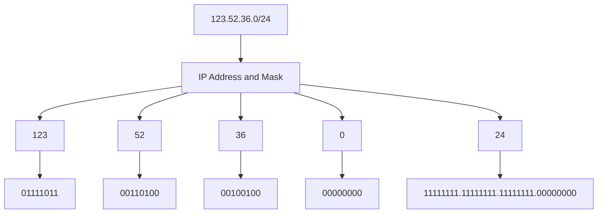

## RFC 1918 - Standard for Private IP addressing

| Class | Internal Addresses Range | CIDR Prefix |
|:-:|:-:|:-:|
| A | 10.0.0.0 – 10.255.255.255 | 10.0.0.0/8 |
| B | 172.16.0.0 – 172.31.255.255 | 172.16.0.0/12 |
| C | 192.168.0.0 – 192.168.255.255 | 192.168.0.0/16 |

# Google Compute SLA

| Covered Service | Monthly Uptime Percentage (SLO) |
| --- | --- |
| Instances in Multiple Zones | >= 99.99% |
| A Single Instance | >= 99.5% |
| Load balancing | >= 99.99% |

# SSH into VMs

## Your own keys

By creating and managing SSH keys, you can let users access a Linux instance through third-party tools.

An SSH key consists of the following files:
1) A public SSH key file that is applied to instance-level metadata or project-wide metadata. 
2) A private SSH key file that the user stores on their local devices. If a user presents their private SSH key, they can use a third-party tool to connect to any instance that is configured with the matching public SSH key file, even if they aren't a member of your Google Cloud project. 

Therefore, you can control which instances a user can access by changing the public SSH key metadata for one or more instances.

# Migrating VMs

## Requirements
- The migration is a "cold" migration. The VM must be stopped before it can be migrated.
- The VM must not be in an instance group or network endpoint group (NEG):
    - if in unmanaged instance group or NEG, you should take it out from there.
    - If in MIG, you cannot move it, you should create a template and launche it in the new VPC.

## Supported migrations
1. From legacy network to a VPC network in the same project.
2. From one VPC network to another VPC network in the same project.
3. From one subnet of a VPC network to another subnet of the same network.
4. From a service project network to the shared network of a Shared VPC host project.
> NOTE: the VM stays in the region and zone where it was before. Only the attached network changes

## Limitations
- You cannot migrate a VM interface to a legacy network.
- The MAC address allocated to the NIC will change during the migration. This could impact on services coupled with MAC addresses (e.g. somelicense agreements)
- The internal IP address of your instance must change to the target subnet IP range, you can keep it if the IP range is the same and is not used.
- The external IP can be kept, but you you must have the compute.subnetworks.useExternalIp permission on the target network, and the target network cannot have external IP addresses disabled by the constraints/compute.vmExternalIpAccess constraint

# IAM Roles

The **Compute Network Admin** role grants access to create, modify, and delete networking resources, except for firewall rules and SSL certificates. 

The **Network Admin** role allows read-only access to firewall rules, SSL certificates, and instances (to view their ephemeral IP addresses). It does not allow a user to create, start, stop, or delete instances.

The **Compute Security Admin** has permissions to create, modify, and delete firewall rules and SSL certificates, and also to configure Shielded VM settings.

The **Logs Viewer** role already gives you read-only access to all features of Logging except Access Transparency logs and Data Access audit logs.

## Policy Intelligence

Policy Intelligence provides several tools for analyzing, simulating, troubleshooting, and recommending Cloud IAM policies. 

The Policy Analyzer would be the best tool in this or similar scenarios where the goal is to to determine which identities have what sort of access to which resources.

### Policy Simulator when changing IAM

Policy Simulator helps you determine what impact a change to an allow policy might have for your users. To do this, it uses access logs to focus on the permission changes that would actually affect your users. To find out how a change to an allow policy might impact a principal's access, Policy Simulator determines which access attempts from the last 90 days have different results under the proposed allow policy and the current allow policy. Then, it reports these results as a list of access changes

Role recommendations are generated by the IAM recommender. The **IAM recommender** is one of the recommenders that [Recommender](https://cloud.google.com/recommender/docs) offers.

Each role recommendation suggests that you remove or replace a role that gives your principals excess permissions. At scale, these recommendations help you enforce the principle of least privilege by ensuring that principals have only the permissions that they actually need.

The IAM recommender identifies excess permissions using *policy insights*. Policy insights are ML-based findings about a principal's permission usage.

# VPC Networks

A Virtual Private Cloud (VPC) network is a virtual version of a physical network that:

- Provides connectivity for your Compute Engine virtual machine (VM) instances.
- Offers native Internal TCP/UDP Load Balancing and proxy systems for Internal HTTP(S) Load Balancing.
- Distributes traffic from Google Cloud external load balancers to backends.
- Projects can contain multiple VPC networks. (Max 50 VPC per project)
- New projects start with a default network (an auto mode VPC network) that has one subnetwork (subnet) in each region.
    - Google-recommended practice: create a custom mode VPC network.
- It's Global resources → Does not belong to any Region
- Placeholder to keep your resources
- No IP range Assigned to VPC
- Network contain subnets
- Subnets are used for segregate resources
- Subnets has IP ranges expressed as CIDR notation
- VPC must have minimum one subnet
- Subnet belongs to one single region in GCP

Use the Default Network is a bad practice because of many reasons so that it is better to deactivate its use at the Org Policy Level (_Skip Default Network Creation Org Policy_):
- Lots of unnecessary subnets
- Same name – confusion
- Broad ranges in IP address
- Can not delete subnet
- Default Firewall rules are broad
- Can not go beyond /16 (start with a /20)

There are four reserved IP addresses in each subnet's primary IPv4 range. There are no reserved IP addresses in the secondary IPv4 ranges.

| Reserved IP address | Description | Example |
|---|---|---|
| Network | First address in the primary IP range for the subnet | 10.1.2.0 in 10.1.2.0/24 |
| Default gateway | Second address in the primary IP range for the subnet | 10.1.2.1 in 10.1.2.0/24 |
| Second-to-last address | Second-to-last address in the primary IP range for the subnet that is reserved by Google Cloud for potential future use | 10.1.2.254 in 10.1.2.0/24 |
| Broadcast | Last address in the primary IP range for the subnet | 10.1.2.255 in 10.1.2.0/24 |

When configuring VPC networks and their subnetworks, you can expand the primary range of a subnet (to max /16 size in auto networks or to the size supported by the IP block in custom networks) as long as the expansion does not introduce overlap to other existing subnets. 
When doing such expansion, any firewall rules depending on the older range should be updated. 

Deleting a subnet first requires deleting all VMs in that subnet.


## Subnets and IPv6 support

- VPC networks now support IPv6 addresses.
- Support for IPv6 addresses can vary per subnet.
- To support IPv6, Google Cloud has introduced the concept of a subnet stack.
    - Single-stack subnets support IPV4.
    - Dual-stack subnets support IPv4 and IPv6.
- IPv6 addresses can be assigned to objects in a subnet that supports IPv6.

**To use IPv6, set up a dual-stack subnet**

- You can configure the IPv6 access type as internal or external.
- Internal IPv6 addresses are used for communication between VMs within VPC networks.
- External IPv6 addresses:
    - Can be used for communication between VMs within VPC networks.
    - Are also routable on the internet.
- Connected VMs inherit the IPv6 access type from the subnet.

**Assigning IPv6 address ranges to a VPC network**

- To enable internal IPv6 on a subnet, you must first assign an internal IPv6 range on the VPC network.
- A /48 ULA (Unique Local Addresses) range from within fd20:/20 is assigned to the network.
    - All internal IPv6 subnet ranges in the network are assigned from this /48 range.
    - The /48 range can be automatically assigned, or you can select a specific range from within fd20::/20.

**Assigning IPv6 address ranges to a subnet**

- When you enable IPv6 on a VM, the VM is assigned a 196 range from the subnet.
- The first IP address in that range is assigned to the primary interface.
- You don't configure whether a VM gets internal or external IPv6 addresses.
    - The VM inherits the IPv6 access type from the subnet.

**IPv6 caveats**

1. Dual-stack subnets are not supported on auto mode VPC networks or legacy networks.
2. Any interface on a VM can have IPv6 addresses configured.

## Types of VPC

- Default
    - Created when compute engine API enabled
    - Every project has default VPC
    - There is one subnet per regions
- Auto
    - With Auto mode, Default VPC can be created
    - Fixed subnetwork ranges per region
    - Can expand from /20 to /16
        
        When expanding the IP range of an automatically created subnet in an auto mode network (or in a custom mode network that was previously an auto mode network), the broadest prefix (subnet mask) you can use is /16. Any prefix broader than /16 would conflict with the primary IP ranges of the other automatically created subnets.
        
    - Default firewall can be added easily.
- Custom
    - No Subnet automatically created
    - Subnet creation manual
    - Custom IP range allocation
    - No necessary to create subnet in each region

NOTE: When you want to expand a subred IP range, it only accept superset of the current range (wider range e.g. /28 → /24)

## VPC Routes

### Routes

- Define the paths that network traffic takes from a virtual machine (VM) instance to other destinations.
- Apply to traffic that egresses a VM.
- Forward traffic to most specific route.
- Deliver traffic only if it also matches a firewall rule.
- Can be fine-tuned using network tags.
- Are created when a subnet is created.
- Enable VMs on same network to communicate.
- Types:
    1. System-generated
        - default
        - subnets
    2. Custom
    3. Peering
    4. NCC (Network Connectivity Center) => a subnet IP range in a VPC spoke 
    5. Policy based routes apply to packets based on source IP, destination IP, protocol, or a combination thereof.

**System-generated default routes**

- Default gateway to internet
    - When you create a VPC network, it includes a system-generated IPv4 default route (0.0.0.0/0).
    - When you create a dual-stack subnet with an external IPv6 address range, a system-generated IPv6 default route (::/0) is added to the VPC network.
- Out to the VPC network
    - The IPv4 and IPv6 default routes define a path to external IP addresses.
- Standard path to Google Private Access APIs
    - System-generated routes can serve as a path to Google APIs and services when you are not using a Private Service Connect endpoint.
- Can be deleted, if all packets destined to IP ranges not covered by other routes will be dropped
- **Using system-generated default routes**
    - A default route is used only if a route with a more specific destination does not apply to a packet.
    - To completely isolate a network from the internet or to replace the default route with a custom route, delete the default route:
        - IPv4 only: to route internet traffic to a different next hop, replace the default route with a custom static or dynamic route.
        - IPv4 and IPv6: if you delete the default route and don't replace it, packets destined to IP ranges that are not covered by other routes are dropped.

**System-generated subnet routes**

- When you create a subnet, system-generated subnet routes are automatically created.
- Subnet routes:
    - Apply to the subnet, not to the whole network.
    - Always have the most specific destinations.
    - Cannot be overridden by higher priority routes (lower number equals higher priority).
- Each subnet has at least one subnet route whose destination matches the subnet's primary IP range.
- If the subnet has secondary IP ranges, each secondary IP address range has a corresponding subnet route.

| Type | Destination | Next Hop | Removable |
| --- | --- | --- | --- |
| Subnet route | Primary and Secondary subnet IP ranges | VPC network, forwards packets to VMs in its subnets | Only if Subnet is deleted or we change secondary IP range |
| Default route | 0.0.0.0/0 | Default internet gateway | Yes |

**Custom static routes**

- Custom static routes forward packets to a static route next hop and are useful for small, stable topologies.
- Benefits over dynamic routing:
    - Quicker routing performance (lower processing overhead).
    - More security (no route advertisement).
- Limitations:
    - Cannot point to a VLAN attachment.
    - Require more maintenance, because routes are not dynamically updated.
    - Custom routes cannot match or be contained in subnet routes, so there would be no way to enforce subnet bound traffic to go through the VM.
- The controller is kept informed of all routes from the network's routing table.
- Route changes are propagated to the VM controllers.
- **Create custom static routes**
    - Option 1: Manually, by using either the Google Cloud console, gloud CLI compute routes create command, or the routes.insert API.
        - Set a name
        - Set a VPC
        - Select next hop:
            - Default internet gateway
            - Specify an instance
                - The instance must allow IP forwarding when VM is created
                - Must have fw rules to allow incoming packages
            - Specify IP address
            - Specify a VPN tunnel
            - Specify a forwarding rule of internal TCP/UDP LB
    - Option 2: Automatically, by using either the console to create a Classic VPN tunnel with policy-based routing or as a route-based VPN.
    NOTE: You can limit which VMs would use a custom route by adding a tag to the custom route that matches a tag on the appropriate VMs.

**Dynamic routes**

- Routes are added and removed automatically by Cloud Routers in your VPC network.
- Always represent IP address ranges outside your VPC network, which are received from a BGP peer.
- Dynamic routes are used by:
    - Dedicated Interconnect
    - Partner Interconnect
    - HA VPN tunnels
    - Classic VPN tunnels that use dynamic routing
    - NCC Router appliances
- Routes apply to VMs according to the VPC network's dynamic routing mode.

### Route Order

Routes are global within the route table, each route associate it to a VPC network. All the packets pass through a virtual router

Routes Order:

- VM instance
- Route Table: Subnet routes, for those of the primary and secondary ranges, and peer networks
- Custom routes

**Static Route vs Dynamic Route**

| Type | Destination | Next hop | Removable | Applies To |
| --- | --- | --- | --- | --- |
| Static Route | - IP range broader than a subnet IP range<br>- IP range does not overlap with subnet IP range | One of:<br>- Instance by name<br>- Instance by IP address<br>- Cloud VPN tunnel | Yes | Either:<br>- All instance in network<br>- Specific instance in network identified by network tag |
| Dynamic Route | - IP range broader than a subnet IP range<br>- IP range does not overlap with subnet IP | IP address of the Cloud Router's BGP peer. | Only by a Cloud Router if it no longer receives router from its BGP peer. | - Instances in the same Region as the Cloud Router if the VPC network is in regional dynamic routing<br>- If Global-all intances in the VPC |

**Custom versus system-generated routes**

| Type | Destination | Next Hop | Removable | Applies-to |
| --- | --- | --- | --- | --- |
| Custom Static  | - IP range broader than a subnet IP range<br>- IP range does not overlap with subnet IP range | One of:<br>- Instance by name<br>- Instance by IP address<br>- Cloud VPN tunnel | Yes | Either:<br>- All instance in network<br>- Specific instance in network identified by network tag |
| System-generated | - Internet Networks<br>- Default Gateway - external networks | Internal Subnet Gateway | Yes, delete VPC subnet<br>Yes, Isolate VPC traffic | - All instances in network |

NOTE: ProxyVM Configuration to inspect egress traffic: 
    1. Delete the system-generated default route
    2. Create a custom route to destination 0.0.0.0/0
    3. Specify the next hop as the proxy VM
    4. Configure the proxy VM to enable IP forwarding.


# Cloud Router

- Use BGP which requires a ASN to idenitify different domains
    - there are some private ASN so that it identifies the traffic is routing
    - Once BGP session is established between two routers the BGP routes are shared (dynamic routes)
    - The subnets should not overlap
- Two routing modes (configured at the VPC):
    - **Regional (default)**: Only share the routes on the region where the router has been provisioned
    - **Global**: Share all the routes in the subnets to and from all regions with a single VPN or interconnect or Cloud Router
        NOTE: However, the average latency will not be as low as if there are separate Cloud VPN gateways and Cloud Routers per region

- Cloud Routers have **default and custom route advertisement modes** that can be set for the router as a whole or separately for each BGP session.
    - The **default advertisement mode** will advertise all subnets in the same region when the VPC in the Cloud Router is set to regional dynamic routing mode, or all subnets in all regions when the VPC is set to global dynamic routing mode.
    - When in **custom route advertisement mode**, the Cloud Router can be configured to advertise a specified set of IP ranges. In addition, Cloud Router can also be configured to advertise all subnets in the region or across all regions, based on the VPC's dynamic routing mode.
- For **99.99% availability for Dedicated and Partner Interconnect**, **2 Cloud Routers in distinct regions are required**. 
- To achieve this same 99.99% availability **with HA VPN, only a single Cloud Router in a single region is necessary**.
- Cloud Router **doesn't use ECMP across routes with different origin ASNs**. For cases where you have multiple on-premises routers connected to a single Cloud Router, the **Cloud Router learns and propagates routes from the router with the lowest ASN**. Cloud Router ignores advertised routes from routers with higher ASNs, which might result in unexpected behavior. For example, you might have two on-premises routers advertise routes that are using two different Cloud VPN tunnels. You expect traffic to be load balanced between the tunnels, but Google Cloud uses only one of the tunnels because Cloud Router only propagated routes from the on-premises router with the lower ASN.

## Bidirectional Forwarding Detection (BFD) for Cloud Router

Bidirectional Forwarding Detection (BFD) is a network protocol that provides fast failure detection for paths between forwarding engines, allowing for rapid failover in the event of a link failure.

### Key benefits
- **Fast failure detection:** Detects network failures much faster than standard BGP (seconds vs minutes).
- **Improved availability:** Enables quicker failover to backup paths.
- **Protocol-agnostic:** Works with any routing protocol, including BGP.

### How it works
- BFD establishes sessions between routers.
- Routers exchange lightweight BFD control packets at regular intervals.
- If a router stops receiving BFD packets from its peer, it considers the path down.
- When a failure is detected, BFD notifies BGP, which then fails over to an alternate path.

### Configuration
- BFD can be enabled per BGP session in Cloud Router.
- You can configure parameters such as minimum transmit interval and minimum receive interval.
- Default settings are typically sufficient for most deployments.

### Use cases
- High-availability hybrid connectivity with Cloud Interconnect or Cloud VPN.
- Environments that require rapid detection of link failures.

**Reference:**  
[BFD for Cloud Router](https://cloud.google.com/network-connectivity/docs/router/concepts/bfd)

# Firewall rules

- Firewall rules control incoming or outgoing traffic to an instance.
- Trust nothing by default
- Some default rules:
    - Allow all outgoing traffic - egress
    - Deny all incoming traffic - ingress
- Common port/protocol
    - 22 – SSH, 3389 - RDP
    - ICMP – ping
    - 80/443 - HTTP/HTTPS
- Configuration at VPC Level.
    - Parameters of the configuration:
        1. Source FIlter
            1. IPv4 Range
            2. IPv6 Range
            3. Source tags
            4. Service accounts
        2. Targets
            1. All instances in the network
            2. Specified Target tags
            3. Specified Service accounts
        3. Priorities (0-65535) - Lower the number higher priority
        4. Direction of the traffic:
            1. Ingress - incoming
            2. Egress - outgoing
        5. Action on match:
            1. Allow
            2. Deny
        6. Protocols and ports
    
    NOTE: If you use a service account as a target in a firewall rule, you cannot use network tags as a source, you should either IP range or service account instead.
    
    NOTE: A VM can only change its service account when it stopped. Use gcloud auth list to know the service account that is working in a VM

## Advanced Microsegmentation with Secure Tags

Google Cloud allows you to implement microsegmentation not only with network tags and service accounts, but also with **secure tags**. Secure tags are managed at the organization level and enable more granular and centralized segmentation, especially when used with Cloud Next Generation Firewall (NGFW).

- **Secure tags** can be assigned to resources and then used as sources or targets in firewall rules.
- Example use case: create a secure tag "env-prod" and apply it to all production VMs, then create a firewall rule that only allows traffic between resources with that tag.

**Example commands:**
```sh
gcloud compute network-security secure-tags create env-prod --description="Production resources"
gcloud compute instances add-secure-tags my-vm --secure-tags=env-prod
```


# VM to VM Communication

- 2 VM Communication in Same Zone (Same VPC) ✅
- 2 VM Communication in Different Zone of Same Region (Same VPC) ✅
- 2 VM Communication in Different Region (Same VPC) ✅
- 2 VM Communication in Different VPC ⛔

## Performance

Outbound or egress traffic from a virtual machine is subject to **maximum network egress throughput caps**. These caps are dependent on the number of vCPUs that a virtual machine instance has. **Each core is subject to a 2 Gbits/second** (Gbps) cap for peak performance. Each additional core increases the network cap, up to a theoretical **maximum of 16 Gbps for each virtual machine**.

# VPC Network Peering

- Connect to VPCs: no matter whether in the same project, different projects or different organizations
- No central management → It needs to be activated at both projects
- Requires peering in both directions.
- VPC Managed by individual project team & control all ingress egress traffic
- Compute Engine internal DNS names created in a network are not accessible to peered networks. The IP address of the VM should be used to reach the VM instances in peered network.
- Cannot overlap CIDR blocks, the peering is denied if this happens
- All subnets routes are shared accross the peered connection
- There is no controls over the exchanged routes, you need to use fw rules on each VPC.
- Both VPC peered networks must config the export and import of custom: static or dynamic routes.
- The roles needed to create a VPC peering connection is **Project Owner** or **Editor** or **Network Admin**.
- Transitive peering is not supported


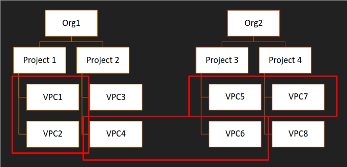

# Centralized VPC - Shared VPC

- Host Project - Shared VPC
- Multiple Service Project
- Central management of VPC
- Large organization use shared VPC
- Max Host project – 100
- Max Service Project – up to 100
- Shared VPC is only available for projects within an organization node only
- Requires the permissions of **Shared VPC Admin (compute.xpnAdmin)** at Organization Level
    - During the creation process it will ask to give **Service project Admin** to specific Roles in the __service projects__
    - Also you can share only certain subnets only, you dont need to share all the subnets in the VPC

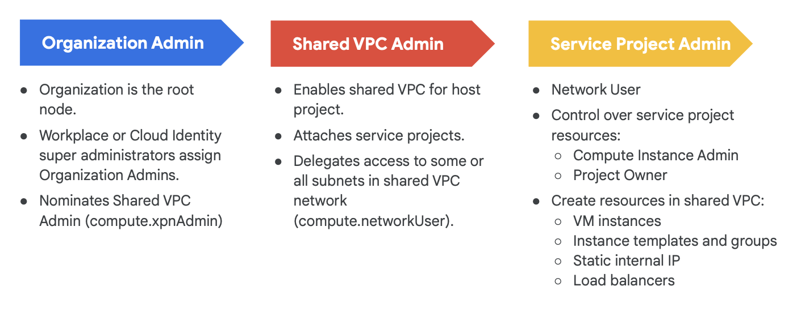

# Configure Private Access

Four scenarios for configuring private access:

## Private Google Access
- When we are accessing Google APIs or services using their private IPs instead of the external domains (for example using gsutil to access a GCS bucket in a VM with internal IP only).
- This **configuration is performed at subnet level**, and it is a flag to be set in the configuration of the subnet (off by default): Private Google Access
- By default, when a Compute Engine VM lacks an external IP address assigned to its network interface, it can only send packets to other internal IP address destinations. You can allow these VMs to connect to the set of external IP addresses used by Google APIs and services by enabling Private Google Access on the subnet used by the VM's network interface.
- Use `private.googleapis.com` to access Google APIs and services by using a set of IP addresses only routable from within Google Cloud. Choose this option when:
    - You don't use VPC Service Controls.
    - You do use VPC Service Controls, but you also need to access Google APIs and services that are not supported by VPC Service Controls.
- Use `restricted.googleapis.com`(199.36.153.4/30)  to access Google APIs and services by using a set of IP addresses only routable from within Google Cloud.
    - Choose when you **only** need access to Google APIs and services that **are** supported by VPC Service Controls.
    - The `restricted.googleapis.com` domain does not permit access to Google APIs and services that do not support VPC Service Controls.
    - Use this for Private Google Access for on-premises host.
- Private Google Access has no effect on instances that have external IP addresses.
### Caveats
    - Legacy Networks not supported
    - Proper Google APIs should be enabled
    - The VPC network must have appropriate routes and egress firewalls defined
    - Either you use `private.googleapis.com` or `restricted.googleapis.com`, DNS records should be created to direct traffic to the IP addresses that are associated to those domains.
    - If using IPv6: 1) The Vm should have a /96 IPv6 and the sw running in the VM must send packets from that shourse. 2) Use the default domains

## Private Service Access (PSA)
- When we are accessing a service within Google cloud from internal IPs. (For example using internal access to access a Cloud SQL instance)
- Basically you create a VPC Peering of one VPC that belongs to Google (Control plane, where Google deploys the service, in this case the Cloud SQL instances) and one of your networks in your project. If you go to the VPC details you can see this in the VPC Network Peering tab.
- Then in the tab Private Service Connections, you can see the range of the IPs that could be use by this services (this Range has been set during the Cloud SQL instance configuration)

### Compatible services
There are only some few services compatible with Private Service Access:
- Cloud SQL
- Memorystore
- Google Kubernetes Engine (GKE) control plane
- Filestore
- Data Fusion
- Vertex AI Workbench (Notebooks)
- AlloyDB
- Cloud Functions (some configs)
- CLoud TPU
- Other Google-managed services that require private access

### Configuring PSA
- Enable Service networking API
- Service producers mut allocate an IPv4 address range in the VPC network that contains the service.
- Service consumir must also allocate IPv4 address
- If a service producer offers multiple services, you only need one private connection. For example, if a consumer uses Cloud SQL and Cloud TPU, only one private connection is created.
- GCP uses VPC Network Peering to implement the connection between the consumer and producer VPC networks.

### Deleting a connection
- Consumers can disable the PSA connection between their VPC network and the producer VPC network. Consumers can also edit their VPC network settings to disable access. 
- Disabling the private services access connection does not delete the VPC Network Peering to the producer VPC network. You can delete the VPC Network Peering connection by editing the VPC network.
- Likewise, disabling the private services access connection does not release the IPv4 address range. Consumers must edit the VPC network to release the IPv4 address range.

### Caveats
- For PSA to an on-premises network to work, you must export custom routes from the on-premises network to the producer VPC network.
- Not all Google services are supported. 
- The same quota and limits that apply to VPC Network Peering also apply to PSA. 

## Serverless VPC Access
- When you access to a Google deployed services VPC (Control Plane) from  serverless services (AKA Cloud Run, App Engine Standard or Google Functions)
- Go to VPC Networks → Serverless VPC Access → Create a connector
    - Choose a region and a network
    - Establish IP Range
    - Establish scalability params (min 2 and max 10 n# of instances)
- When creating the Cloud functions you can select the connector to use for calling the service.

## Private Service Connect (PSC)
- PSC allows *consumers* to access *managed services* privately from inside their VPC network. Similarly, it allows managed service *producers* to host these services in their own separate VPC networks and offer a private connection to their consumers.
- Consumers can use their own internal IP addresses to access services without leaving their VPC networks or using external IP addresses. Traffic remains entirely within Google Cloud. PSC provides service-oriented access between consumers and producers with granular control over how services are accessed.
- Consumer POV, it connects to an endpoint within the VPC network (hence an internal IP address) and maps to the service attachment in the producer VPC network. The service attachment receives requests redirected from the PSC endpoint and sends it to a forwarding rule, and the forwarding rule to the appropiate VM or service.
- All communications between the consumer VPC network and service producer VPC network must be initiated by the consumer.
- Producers can choose to deploy a multi-tenant model, where your VPC network contains services that are used by multiple consumer VPCs. The consumer networks can have overlapping subnet ranges.
- Service producers can scale services to as many VM instances as required, without asking consumers for more IP addresses.
- Service producers don’t need to change firewall rules based on the subnet ranges in the consumer VPC networks.
- PSC supports access to the following types of published VPC-hosted services, which include the following:
    - [Google published services](https://cloud.google.com/vpc/docs/private-service-connect-compatibility#google-services), such as Apigee or the GKE control plane
    - [Third-party published services](https://cloud.google.com/vpc/docs/private-service-connect-compatibility#third-party-services) provided by Private Service Connect partners
    - Intra-organization [published services](https://cloud.google.com/vpc/docs/private-service-connect#published-services), where the consumer and producer might be two different VPC networks within the same company
    - [Google APIs](https://cloud.google.com/vpc/docs/private-service-connect-compatibility#google-apis-global), such as Cloud Storage or BigQuery

### Using a LB

You can use a LB to access a PSC service that includes some perks:
    - Assign DNS to these internal IPs (or even Google services) for a better terminology
    - Control which traffic goes to which endpoint demonstrating traffic stays within GCP
    - Log requests by enabling LB logging
    - Enable data residency in transit by connecting to regional endpoints for Google APIs from workloads in the same region.
    - With PSC and consumer HTTP(S) service controls that use a global external Application LB, consumers connect to an external IP address. PSC uses a network endpoint group to route the request to the service producer.

### Private Service Connect Interfaces
- A PSC interface is a special type of network interface that refers to a network attachment. 
- A PSC Interface enables services in a producer VPC network to securely reach resources and destinations within a consumer VPC network. 
- Producer and consumer networks can be in different projects and organizations.
- If the service consumer accepts the connection, GCP allocates the interface an IP address from a subnet in the consumer VPC network that's specified by the network attachment. The VM of the PSC interface has a second standard network interface that connects to the producer's VPC network.
- A connection between a PSC interface and a network attachment is similar to the connection between a PSC endpoint and a service attachment, but it has two key differences:
    1. A PSC interface lets a producer network initiate connections to a consumer network (managed service egress), while an endpoint lets a consumer network initiate connections to a producer network (managed service ingress).
    2. A PSC interface connection is transitive. This means that a producer network can communicate with other networks that are connected to the consumer network.
- A common use case is when a managed service needs to securely access data within a customer's VPC network. 

### Service Connection Policies
- It lets a network administrator specify which producer services can be deployed and connected through service connectivity automation.
- It is a regional resource
- If a service connection policy exists for a managed service, a consumer service administrator can deploy that service.

#### Fields
| Service Class | specifies the type of managed service that the policy is for.<br>Each producer that supports service connection policies has its own globally unique service class. |
| VPC Network | specifies the VPC network that the policy is scoped for |
| Subnets | specifies the subnets that IP addresses for PSC endpoints are allocated from. |
| Connection limit | specifies the maximum number connections that a producer can create in the policy's VPC network and region. |

#### Steps
1. A consumer network administrator creates a service connection policy for their VPC network
2. The service connection policy references a service class
3. A consumer service administrator deploys a managed service. 
    - Google producer Service Attachments can be found using the UI or a describe command
    - Self-hosted and third-party service attachments URI’s may be shared programmatically or through email 
4. The producer receives the consumer's connectivity configuration and passes this information to a service connection map
5. PSC service connectivity automation creates an endpoint in the consumer VPC network. This endpoint connects to a service attachment in the producer VPC network.

### Caveats
1. Consumer and Producer cannot be in the same VPC network.
2. The address counts towards the project quota for global internal IP addresses
3. PSC endpoints cannot be accessed from peered VPC networks, you can workaround this creating yet another PSC endpoint in the peared network.
4. Connections from on-premises environments to non-Google services must use Cloud VPN tunnels. These on-premises environments must be in the same region as the PSC endpoint.


# Cloud Identity-Aware Proxy (IAP)

- Single point of control for managing user access to webapp (HTTP/s) and other cloud services (TCP or SSH accessed)
- Escenarios where IAP is useful
    1. **Accessing a VM which doesn't have an external IP address via SSH with your user**
        - In the gcloud compute ssh command add the flag —tunnel-through-iap
    2. **Accessing a VM which doesn't have an external IP address via SSH with an external user**
        - Go to IAM → IAP → SSH & TCP resources tap
        - Add a principal to the resource (VM in this case) and grant the **role "IAP-secure tunnel user"**
        - You can provide this role at VM level, at the region level as well as the user level.
    3. **Protecting a Google App Engine service**
        - Go to IAM → IAP → Configure Consent Screen
            - Select user type: internal o external
            - Include App Info: Name, support email and logo
            - Include App Domain: home page, privacy link and terms of service
            - Include Authorized domains
            - Add developer context information
            - Add resources scope
            - Add test users (if any)
        - Enable the resource (GAE Service) which appears in the HTTPS Resources tab
        - The users who want to access the service should have the **role "IAP-secure Webapp User"**
    
    NOTE: In escenarios 1 and 2, we should add a firewall rule which allows only the traffic from the tunnels IP range. [IAP connections](https://cloud.google.com/iap/docs/using-tcp-forwarding) come from a specific set of IP addresses (**35.235.240.0/20**). Therefore, you can limit the rule to this CIDR range.
    
    NOTE: Use the following command to create an encrypted tunnel to the RDP port of the VM instance:
    
    `gcloud compute start-iap-tunnel windows-iap 3389 --local-host-port=localhost:0  --zone=us-east1-c`
    

# Configure IP Address

- Types of IP Address in VMs:
    - Internal IP: Private IP, access from inside your GCP VPC
    - External IP: Access from internet
- Also the IPs can be:
    - Ephemeral: temporary (lost when restart the VM)
    - Static: Permanent
- Pricing
    - No charge for static or ephemeral when they are internal IPs.
    - For external IPs, cost increases if you reserve but don't use/attach it, also the pricing is cheaper for preemptible machines
    - Not charged if the IP is used within a forwarding rule or similar.
- Escenarios:
    1. Ephemeral Internal IP in a VM
        - Automatic: IP provided by DHCP
        - Custom: Manually set up (within the range of the IPs of the subnet)
    2. Static Internal IP in a VM
        - Set a name for the IP and you can either select automatically or choose it from the subnet IP range
        - It can be reused after the machine reboots
    3. Ephemeral External IP in a VM
        - Change when stop and start the VM
    4. Static External IP in a VM
        - Reserved static IP, just basically se it a name, you can't choose the IP

# Multiple IP Addresses

## Multiple network interfaces

VPC networks are isolated by default

- VPC networks
    - Use an internal IP to communicate within networks.
    - Use an external IP to communicate across networks.
- To communicate internally with multiple networks, add multiple network interface controllers (NICs).

**Network interface controllers (NIC)**

Each NIC:

- Is attached to a separate VPC network.
- Uses an internal IP to communicate across networks.

**Multiple network interface caveats**

1. Network interfaces can only be configured when you create an instance.
    - Cannot delete interface without deleting the VM.
    - Internal DNS (Domain Name System) is only associated to nic0.
    - You can have up to 8 NICs, depending on the VM.
        - if VM≤ 2 vCPU ⇒ 2 NICs
        - if VM> 2 vCPU ⇒ 1 NIC per vCPU (max: 8)
2. Each interface must be in a different network.
3. The network IP ranges cannot overlap.
4. The networks must exist before you create the VM.
5. Each NIC in a VM with multiple NICs must be in a separate VPC and each VPC can have its own independent set of custom routes (in addition to the default routes) and custom routes can have next hops on a VM with multiple NICs that act as **a gateway between the VPCs**. 
This pattern can be useful in scenarios where VPCs with overlapping subnet ranges need to be connected for private IP communication, or in cases where traffic needs to be scanned between trusted and untrusted networks without using public IP addresses.

# Alias IP & Secondary IP Ranges

- A subnet can have a secondary IP range apart from the primary range
- Range of IP addresses can be attached with GCE or GKE as Alias IP
- Just one single VPC (no multiple VPCs)
- There can be several secondary ranges within the same subnet
- At VM level you can assign IPs from the secondary range, then you can assign a service to each of those IPs.
- Secondary ranges cannot be expanded or changed and must be deleted and recreated.

## Alias IP in GKE

### Public clusters

- We use the secondary IP ranges in our subnet as the IP range for Pods and other IP range for services
- This is set-up in the network configuration during the cluster creation

### Private clusters

- We remove the external IP from the control plane and set a IP range for the control plane (not need to be a secondary IP range, as the control plane runs in a different project, handled by Google)
- For the pods and services we proceed in the same manner taking the secondary IP ranges from the subnet, if you don't specify these secondary ranges, GKE will create a couple of ranges automatically (unless you are in a service project on a Shared VPC, where the IP ranges should have been created in advance).
- Then we create a jump machine to connect to the cluster
    - Install kubectl with apt
    - Add the scope to be able to have full access to the GKE API in order to do so the VM needs to be stopped.
    - Get the credentials from the cluster with `gcloud container clusters get-credentials`
- Expose the Pods with a Cluster IP (only available from the cluster not from outside)

NOTE: 

You can also specify the maximum number of Pods per node when creating a node pool in an existing cluster. Creating a new node pool lets you optimize IP address allocation, even in existing clusters where there is no configured default maximum number of Pods per node at the cluster level.

Setting the maximum number of Pods at the node pool level overrides the cluster-level default maximum. If you do not configure a maximum number of Pods per node when you create the node pool, the cluster-level maximum applies.

# GKE Networking

Two types of networking models:

- **Routes based**:
    - A routes-based cluster has a range of IP addresses that are used for **Pods and Services**. Even though the range is used for both Pods and Services, **it is called the Pod address range**. The **last /20** of the Pod address range is **used for Service**s. A /20 range has 2 power to 12 = 4096 addresses. So 4096 addresses are used for Services, and the rest of the range is used for Pods.
    - Pods connect through a **network gateway** and are assigned a unique private IP address within the cluster subnet. The network gateway manages communication between the pods and other services in the network. This setup is easier to configure than VPC-native, but it can be less scalable and have lower performance in large and complex networks.
    - Uses routes to pass traffic to the K8s network, count against custom route quota.
- **VPC-native**: 
    - The ranges are taken from the alias IP Ranges. You can either pre-create the secondary ranges or simply specify them when creating the cluster
    - Ability to customize pods per node. When selecting the value for the number of pods per node, the value should be between 8 and 110 pods per Node. In order to provide 15 IP Addresses and to support rolling updates of pods, we need at least 30 IP addresses assigned. Using a /27 provides 32 IP addresses for pods per node.
    - Pod IP addresses are taken from the cluster subnet's secondary IP address range for Pods. Unless you set a different [maximum number of Pods per node](https://cloud.google.com/kubernetes-engine/docs/how-to/flexible-pod-cidr), GKE allocates a `/24` [alias IP range](https://cloud.google.com/vpc/docs/alias-ip) (256 addresses) to each node for the Pods running on it. On each node, those 256 alias IP addresses are used to support up to 110 Pods.
    - Services IP range is distinctly reserved independent of the pod address range.
    - You can create [firewall rules](https://cloud.google.com/vpc/docs/firewalls) that apply to just Pod IP address ranges instead of any IP address on the cluster's nodes.
    - In a VPC-native cluster, pods connect directly to the underlying VPC network and are assigned internal IP addresses from the VPC network, allowing them to communicate directly with other services in the network. This configuration is recommended by Google Cloud as it provides higher performance and scalability compared to routes-based clusters.
    - Required for shared VPC clusters

## Private clusters

Three options:

1. **Public masters - Public nodes**
    - Default Cluster config, allows access from non-GCP sources to reach both master and node external IP addresses
2. **Public Master - Private Nodes**
    - Removes the external IP from Nodes, enables access to Masters via public external IP. Use cloud NAT to enable outbound connectivity for node workloads
3. **Private master - Private Nodes**
    - Removes external IP from Master and Nodes. Use **Authorized master networks** to enable connectivity from outside the VPC
    - Enable master-authorised networks to block untrusted non-GCP source IPs from accessing the Kubernetes master through HTTPS. Authorized masters can be enabled for both public and private GKE Clusters by specifying the IP CIDR ranges during or after cluster creation. Removing external IP addresses is part of enabling a private cluster, however not necessary for public clusters.
    - To enable access to the controller from another VPC network or from on-premises connected through another VPC network peering (such as in hub-and-spoke designs), create a proxy hosted in authorized IP address space, because VPC network peering is non-transitive.

## Shared VPC Clusters

1. **Pre-create the IP address for Clusters**
Node, Pod & services IP ranges must be pre-defined in the Host Project prior to the Service Project GKE cluster creation
2. Only supported by VPC-Native Clusters
3. Roles for GKE Service accounts. The permissions to grant to the GKE Service accounts  (belonging to the service project: service-service-project-num@container-engine-robot.iam.gserviceaccount.com) to use the VPC Networks resources. 
    1. Host Service Agent User (`roles/container.hostServiceAgentUser`)
    2. Network user role (`roles/compute.networkUser`) 
    NOTE: this roles must be assigned in the Host Project .

NOTE: This will allow the cluster to create an ALB for an ingress declared in the cluster.

## Network Policy

- Enabling network Policy for GKE allows you to limit the connections between PODs. Therefore network policies provide better security by reducing the compromise radius. Network Policies can be configured to allow and block both incoming and outgoing traffic.
- It is enabled when you create the cluster (it is a flag in Network security)
- If you need to add it later, you have to recreate the node pool
- Then you have to apply a yaml file with the network policy configuration.
    - Each NetworkPolicy includes a `podSelector` which selects the grouping of pods to which the policy applies. The example policy selects pods with the label `role=db`. An empty `podSelector` selects all pods in the namespace.
- This requires additional computing effort, so you need to resize the clusters.

## Cloud NAT with GKE Clusters

- In order to use Cloud NAT with a private GKE Cluster, which IP Address ranges must be selected for the clusters?
    - When a Cloud NAT gateway is configured to provide NAT for a private cluster, we must select to allow the primary IP address range, the secondary IP address used for Pods in cluster, and the secondary IP address range used for Services in the cluster. Cloud NAT is regional so allowing all VPC networks is not an option, there are no controllers that need to be configured, and Nodes cannot use secondary IP addresses.

## Autoscaling

- In GKE workloads, autoscaling is typically accomplished using a HorizontalPodAutoscaler, though VerticalPodAutoscaler and MultidimPodAutoscaler are possible alternatives. GKE cluster autoscaling occurs based on the resource demands and scheduling of pods across all workloads using a given node pool.

# Bring Your own IP (BYOIP)

- BYOIP enables customers to:
    - Assign IPs from a public IP range that they own to GCP resources.
    - Route traffic directly from the internet to their VMs.
- Google Cloud manages these BYOIP addresses in the same way as Google-provided IP addresses, except that:
    - The IP addresses are available only to the customer who brought them.
    - Idle or in-use IP addresses incur no charges.

## BYOIP guidelines

The object that the IP address is assigned to:

- Can have a regional scope or a global scope.
- Must support an external address type.
- Cannot be a Classic VPN gateway, GKE (Google Kubernetes Engine) node, GKE pod, autoscaling MIG (managed instance group).

## BYOIP caveats

1. BYOIP prefixes cannot overlap with subnet or alias ranges in the VPC.
2. The IP address must be IPv4.
3. Overlapping BGP route announcements can be problematic.
- Google does not support overlapping BYOIP route announcements. For example, importing **`203.0.112.0/23`**  is not supported if **`203.0.112.0/23`**  or a subset of this prefix, such as **`203.0.112.0/24`** , is advertised outside Google. If Google and another network advertise the same route with matching or mismatched prefix lengths, you might experience unexpected routing and packet loss.
4. Takes up to four weeks to be proviisioned
5. Public advertised prefix (PAP), min range of /24 initially then you can break it
6. Public delegated prefixes (PDP), a subset of the of PAP configured within a single scope (a specific region or global)

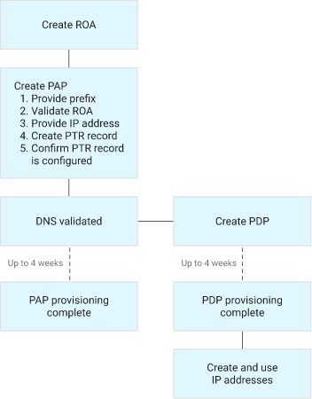

- IAM permissions to use the IP address:
    - compute.addresses.* for regional IPs
    - compute.globalAddresses.* for global IPs
    - roles/compute.publicIpAdmin → administrator for your BYOIP prefixes and addresses

# GCP Hybrid connectivity

1. VPN - IPSec
2. Cloud Interconnect:
    1. Dedicated Interconnect
    2. Partner Interconnect
3. Peering with Google:
    1. Direct peering
    2. Carrier peering

## Cloud VPN

- GCE resources connect to our private network on prem or other cloud (e.g. AWS)
- Very quick to setup
- Traffic encrypted in one VPN Gateway and decrypted by the other
- You want to selectively advertise routes between VPC networks.
- Traffic travels through internet publicly
- Each tunnel VPN is 3 Gbps bandwidth (ingress+egress) 1.5 if traverse internet, 3Gbp in direct
- Cloud VPN is transitive (A+B and A+C allows B+C)
- Use an Active/Passive configuration for a consistent bandwidth experience.
- Active/Active configurations may offer a less consistent experience. Unless combined traffic for both tunnels is within single tunnel capacity, failure can cause the available bandwidth to be cut in half.

### VPN Configurations
Google Cloud has HA and Classic VPN gateways. 

## Classic VPN
Classic VPN can be used with [dynamic or static routing](https://cloud.google.com/network-connectivity/docs/vpn/concepts/choosing-networks-routing).

**Classic VPN with static routing** supports route-based or policy-based tunnels
- **Policy-based routing.** Local IP ranges (left side) and remote IP ranges (right side) are defined as part of the tunnel creation process.
    - Policy-based tunnels allow configuration of both, local and remote traffic selectors
- **Route-based VPN.** When you use the Google Cloud console to create a route-based VPN, you only specify a list of remote IP ranges. Those
ranges are used *only* to create routes in your VPC network to peer resources.
    - Classic VPN route-based tunnels use 0.0.0.0/0 as local and remote traffic selectors.

The Classic VPN gateway local and remote selectors should match the peer VPN gateway remote and local selectors.

Use Classic VPN when the on-premises VPN gateway does not support BGP. Using Classic VPN for dynamic routing is no longer supported—with one exception. To connect to VPN gateway software running inside a Compute Engine instance, you can still use Classic VPN.

Classic VPN only supports 99.9% availability.

## HA VPN Gateways
- **HA VPN gateways** only support dynamic routing with BGP (hence a Cloud Router) and can't be used if the peer on-premises VPN gateway does not support BGP
- HA VPN gateways provide 2 interfaces, and both must have tunnels to peer VPN gateway interfaces with BGP sessions to provide 99.99% availability. When configuring HA VPN gateways, an external VPN gateway resource must be created that matches the number of interfaces available on the peer VPN gateway.

**Topologies**
1. **An HA VPN gateway to peer VPN devices.** Require two VPN tunnels from the perspective of the HA VPN gateway.
    - An HA VPN gateway to two separate peer VPN devices where each peer device has its own external IP address.
    - An HA VPN gateway to one peer VPN device that has two separate external IP addresses.
    - An HA VPN gateway to one peer VPN device that has one external IP address.
2. **An HA VPN gateway to an Amazon Web Services (AWS) virtual private gateway**, which is a peer gateway configuration with four interfaces.
3. **Two HA VPN gateways connected to each other. (within Google projects)**
4. **One or more HA VPN gateways associated with two VLAN attachments in an HA VPN over Cloud Interconnect deployment. Each HA VPN gateway is connected to one or more peer VPN devices.**

**Configure HA VPN for more bandwidth**
- To increase the bandwidth of your HA VPN gateways, add more HA VPN tunnels.
- To calculate how many tunnels you will need, use 3 Gbps as the sum of ingress and egress bandwidth available for each tunnel.
- Consider the following guidelines when increasing HA VPN bandwidth.
    - **Check VPN tunnel quotas**
        
        Unless you are connecting an HA VPN gateway to another HA VPN gateway, each HA VPN gateway supports an unlimited number of VPN tunnels on each interface.
        
        However, the [VPN tunnels quota](https://cloud.google.com/network-connectivity/docs/vpn/quotas#quotas) limits the total number of VPN tunnels in your project.
        
    - **Add HA VPN gateways to add tunnels between two HA VPNs**
        
        When you connect an HA VPN gateway to another HA VPN gateway, you can only connect one tunnel per interface, 0 or 1, to the corresponding interface, 0 or 1, on the other HA VPN gateway. In other words, between a pair of HA VPN gateways, you have a maximum of two HA VPN tunnels.
        
        Therefore, to increase the number of VPN tunnels between HA VPN gateways, you must create additional pairs of HA VPN gateways.
        
    - **Add pairs of VPN tunnels**
        
        To increase the bandwidth between HA VPN and an on-premises peer VPN gateway, add VPN tunnel pairs.
        
        For example, to double the bandwidth of an HA VPN gateway that connects to an on-premises peer VPN gateway with two tunnels (one active, one passive), add two more VPN tunnels. Add one more "active" tunnel and one more "passive" tunnel.
        
        The BGP sessions for all four tunnels receive the same prefixes. The two active tunnels receive the prefixes with the same higher priority, and the two passive tunnels receive the prefixes with the same lower priority.
        
    - **Match interfaces on the peer VPN gateway**
        
        You must match the interfaces on your peer VPN gateway to continue receiving a 99.99% uptime SLA.
        
        When doubling the bandwidth of an HA VPN gateway that connects to an on-premises VPN gateway, match the tunnels to the interfaces on the peer VPN gateway. Place the two active tunnels on interface 0 and the two passive tunnels on interface 1. Alternatively, place the two active tunnels on interface 1 and the two passive tunnels on interface 0.
        
- To create alerting policies for the bytes per second (bps) and packets per second (pps) limits described in [Network bandwidth](https://cloud.google.com/network-connectivity/docs/vpn/concepts/overview#network-bandwidth), use Monitoring Query Language (MQL)

## Creating a VPN Connection with routes-based routing options

- Select between:
    - HA ⇒ Dynamic routing only, 99.99% SLA, IPv4/IPv6
    - Classic ⇒ Dynamic/static routing, no SLA, IPv4 only
- Set-up VPN Gateway
    - Name
    - Network
    - Region
    - Select the IP address reserved for this gateway
- Set-up the tunnel
    - Name
    - Target IP address (on the other side of the tunnel)
    - Set preshared key
    - Routing options:
        - Dynamic
        - Routes based ⇒ This requires to set the target IP range.
        - Policy based
    
    NOTE: You can add more tunnels to get more bandwidth
    
    NOTE: If you choose routes-based in the routing options, when a new subnet is added to the VPC, we will need to add a new route in the routes configuration of the VPC so that the  the next hop for communication with that ip range should be the tunnel. This doesn't scale very well and that's why we have dynamic routing
    
    When creating VPN gateways with the gcloud tool, the routes directing appropriate traffic to the gateway are not created automatically and require creation with separate gcloud commands.
    
    Cloud VPN disallows editing any traffic selectors after you have created a VPN. To change either the local or the remote traffic selector for a Cloud VPN tunnel, you must delete the tunnel and then re-create it. You do **not** have to delete the Cloud VPN gateway, though.
    

## Creating a VPN Connection with dynamic routing

- We will need a **Cloud router** in order to set up dynamic routing
    - Fully distributed and automanaged service
    - Use BGP to advertise IP ranges
    - Detect all changes and create new optimal rules
    - Intelligent decisions and exchange info about the changes in the network (discovery, find new paths when current path is not available)
- Creating a router (you suppose to have one on each side of the VPN connection)
    - Set the name
    - Set the network
    - Set the region
    - Establish the Google ASN (Autonomous system Number: google gives you some hint about the number ranges you can use)
    - BGP Keep alive period (Optional)
    - Set advertised rules:
        - All subnets visible to the Cloud Router
        - Create custom routes
- This time we will setup a HA VPN
    - Set up the VPN Gateway
        - Select IPv4 only or dual stack (iPv4 and IPv6)
        - The system will reserve two external IPs (because it is HA)
    - Set up the tunnel
        - Set Peer VPN Gateway type
            - On premise or Non GCP
            - GCP (this one follows this workflow)
        - Select VPN Gateway
        - Select # of tunnels, in our case 2: the ones reserved for the VPN Gateway
        - Set the tunnel name
        - Set the pre-shared key
        - Set the protocol → IKEv2
        - Add the router already created
    - Configure the BGP sessions
        - Provide peer ASN of the router on the other side of the VPN and in this side too.
        - Allocate BGP address: automatically or manually. (e.g. 169.254.0.1)
        
        **Important:** Each BGP session on the same Cloud Router must use a unique **`/30`** CIDR from the **`169.254.0.0/16`** block.
        
- Now the configuration is done, you can either add/remove subnets and the routes will be automatically updates, with one restriction, they will be only updated if the changes belong to the same region.
- If we want to add subnets in other region and get automatically sync by the VPN, we will need to activate it at the VPC level, there is config parameter "dynamic routing mode" that can be either global or regional (the latter is the default). Change it into Global to make the configuration globally synchronized.
- When creating BGP sessions in Cloud Routers for VPN tunnels or Interconnect VLAN attachments, the base advertised route priority can be configured for the BGP session. That value is sent as a multi-exit discriminator (MED) attribute. That particular tunnel or attachment is typically preferred, because lower values are preferred to higher values with all else being equal. Two BGP sessions with equal advertised priority would be equally preferred (active/active) and with different values, one would be prioritized (active/passive).

## Static vs dynamic routing

| Static routing | Dynamic routing |
| --- | --- |
| Manual update | Update routes based on BGP |
| Downtime (when tunnel is deleted) | No downtime |
| No standardization | BGP |
| Static routes are ok for stable nw (don't change often) | Dynamic routes updates automatically |

# Cloud NAT (Network address translation)

- Translate from internal to external IPs
- Connect to internet without external IP
- Usable for GCE or GKE pods to communicate to internet
- Specific to a region
- The Cloud NAT gateway implements **outbound NAT**, but **not inbound NAT:** hosts outside of your VPC network can only respond to connections initiated by your instances; they cannot initiate their own, new connections to your instances via NAT.
- You can select a Minimum port per instances and increase the connection channels from a instance to outside. There are 64k available ports (TCP and UDP ports) so there is a limit of the amount of instances you may put to reach internet. You need to be conscious in the case of GKE because this number of ports are shared among all the pods running in the instance.

## IP allocations methods
1. Auto
    - f(n# ports/VM, VM and Network Tier)
    - scale in-out automatically
    - No connection interruption when reducing de number of IPs
2. Manual
    - Don't scale, it drops packet if needed
    - Can use either Standard or Premium Network Tier (cannot be mixed in the same rule)
    - When removing IPs you choose:
        - Break on-fly connections
        - Drain
NOTE: Can switch from auto ↔ manual but IPs are not preserved

## Ports allocation

1 IP ↔ 64512 ports

Two modes:
1. SNAT (static):
    - Select min port allocation per VM
    - Choose when all the VMs have similar internet using
2. DNAT (dynamic):
    - Select min & max ports per VM
    - Increase gradually (double each time the minimum) until reaching the max
    - Cannot be used with Endpoint Independent Mapping (EIM)

NOTE: When using with GKE, the address translation is performed at Node level

## Port reservation procedure

1. Cloud NAT determines from internal IP of the VMs to do the NAT, through the ranges of subnet IP range where the NAT is located (it could include the alias ranges)
2. Adjust the minimum # ports
    1. Static ⇒ min (1024, selected min port per VM)
        1. Static default: 64
        2. Dynamic default: 32
3. Reserve IP and ports per VM
    1. A NAT connection of IP and port can use more than one external IP
        1. Static port allocation: source IP & port are fixed and can't use more
        2. Dynamic port allocation: change with demand

**Considerations:**
- Closed connections are unstable for 120 secs after closing
- Limits to unique destination (IP, port and protocol)
- *Endpoint-Independent Mapping* means that if a VM sends packets from a given internal IP address and port pair to multiple different destinations, then the
gateway maps all of those packets to the same NAT IP address and port pair, regardless of the destination of the packets.
- With Private Google Access, Cloud NAT never performs NAT (network address translation) for traffic sent to the select external IP addresses of Google APIs and services. Google Cloud routes this traffic internally.

## Creating a NAT

- Go to Network services → Cloud NAT
- Set a name
- Select the network
- Select the region
- Select the Cloud router (this is the control plane)
- Set the Cloud NAT Mapping:
    - Primary and secondary IP ranges
    - Primary IP ranges only
    - Selected subnets
- Set the Cloud NAT IP address
    - Automatically
    - Manually can reserve multiple IPs
- Destination is fixed to internet
- Set Advanced Options
    - Logging:
        - None
        - Transactions and errors
        - Transactions only
        - Errors only
    - Enable dynamic port allocation
    - Enable Endpoint-Independent Mapping
    - Timeouts by protocol

## NAT Logging
One log entry can be generated for each of the following:
1. When a network connection using NAT is created.
2. When a packet (only TCP/UDP egress not ingress even it is a respone to outbound traffic) is dropped because no port was available for NAT. 

You can choose to log both kinds of events, or only one. 

# Private NAT and Secure Web Proxy

## Private NAT

Private NAT allows  to perform NAT for traffic between VPC networks or between on-premises and VPC networks, without exposing resources to the public internet. Unlike Cloud NAT, which is used for outbound internet access, Private NAT is used for private, internal connectivity.

**Key use cases:**
- Enable private connectivity between VPCs or from on-premises to GCP without using public IPs.
- Use with Network Connectivity Center (NCC) to provide NAT between spokes in a hub-and-spoke topology.

**Reference:**  
[Private NAT documentation](https://cloud.google.com/network-connectivity/docs/network-connectivity-center/how-to/private-nat)

---

## Secure Web Proxy

Secure Web Proxy is a managed service that provides secure, scalable, and policy-driven outbound web access for your workloads in Google Cloud. It allows you to enforce security policies, filter web traffic, and monitor usage for compliance.

**Key features:**
- Outbound HTTP/HTTPS proxy for VMs and GKE workloads.
- URL filtering, user/group-based access control, and threat protection.
- Integrated with Cloud Logging and Security Command Center.
- Can be used to enforce compliance and prevent data exfiltration.

**Reference:**  
[Secure Web Proxy documentation](https://cloud.google.com/secure-web-proxy/docs/overview)

# Cloud Interconnect

- Extend your on-premise VPC to GCP.
- High availability, low latency connection
- Access your resources with internal IP address
- Setup time is quickly (??)
- No encryption while traffic travels
- when you set up peering between two VPC networks, all the subnet routes are advertised.
- Two types:
    - Dedicated: Requires google presence close to your DC.
    - Partner: Requires a partner when your not close to google location.
- Creating a Dedicated Interconnect:
    - Name
    - Location → List of the available DCs
    - Capacity → From 10 Gbps to 100 Gbps (the price increases with the capacity)
    - Order a second redundant interconnect
    - Include company name and technical contact.
- Creating a Partner Interconnect → It takes to a link to see the list of the partners by Area.

**Dedicated vs Partner**

| Dedicated Interconnect | Partner Interconnect |
| --- | --- |
| No encryption | No encryption |
| SLA: Your DC & Google VPC | SLA: Partner |
| Pricing is high | Pricing is lower than dedicated |
| Bandwidth: 10 Gbps to 200 Gbps | Bandwidth: 50 Mbps to 10 Gbps |
| No service provider required | Service provider required |
| Internal IP Communication | Internal IP Communication |

Multiple VLAN attachments are necessary to provide for high availability configurations for both Dedicated and Partner Interconnect. Dedicated Interconnect also requires multiple connections for high availability.

Multiple VLAN attachments may also be required to provide for the capacity requirements of connections as they have a maximum capacity of 50 Gbps whereas connections can have capacities up to 200 Gbps.

To share an Interconnect connection to on-premises infrastructure across multiple projects you can use Shared VPC or VPC peering. For projects with their own VPC networks, you can create separate VLAN attachments and Cloud Routers per project. Shared VPC is the recommended approach as the configuration is simpler and the solution is easier to scale compared to VPC peering and cheaper than having separate VLAN attachments per project. In Shared VPC, the Interconnect and associated resources should all be created in the Shared VPC host project.

After you order an interconnect, Google sends you and the NOC (technical contact) an email with your LOA-CFAs (one PDF file per interconnect). You must send these LOA-CFAs to your vendor so that they can install your cross connects. If you don't, your interconnects won't get connected.

## Dedicated Interconnect (DI)

Google Cloud and on-premises networks and supports 1-8 10 Gbps or 1-2 100 Gbps circuits per connection.

## Partner Interconnect (PI)

The two main classes of Partner Interconnect are **Layer 2 and Layer 3 Partner Interconnect**. 

- for Layer 2 BGP configuration must be done for the on-premises routers, as the BGP session is established between them and the Cloud Routers in GCP
- for Layer 3, the BGP configuration is done in the partner's routers.

Setting up a **Layer 3 Partner interconnect** steps:

1. **Establish a connection to the selected partner service provider.**
2. **Create VLAN attachments in Google Cloud and receive the Google-generated pairing keys.**
3. **Request connections for the VLAN attachments from the partner, specifying the region, capacity, and providing the attachment pairing key.**
4. **Activate the VLAN attachments in Google Cloud.**

> **Note:** Optionally, the VLAN attachment can be pre-activated after it is created.

For PI, all the Cloud Routers must have a local ASN of 16550. DI and Cloud VPN do not have this requirement. ASN misconfiguration in the Cloud Router or on-premises router is a common cause of failure to establish a BGP session in the Cloud Router.

## MACsec for Cloud Interconnect

Media Access Control Security (MACsec) is an IEEE 802.1AE standard for securing Layer 2 connectivity. With Cloud Interconnect, MACsec provides encryption for your traffic as it travels between your on-premises network and Google Cloud.

### Key benefits
- **Data confidentiality:** Encrypts traffic between your on-premises network and Google Cloud.
- **Data integrity:** Ensures traffic hasn't been tampered with in transit.
- **Replay protection:** Prevents replay attacks.

### How it works
- MACsec operates at Layer 2 (data link layer) of the OSI model.
- Encrypts traffic between your dedicated interconnect locations and Google Cloud.
- Uses 128-bit AES-GCM encryption.

### Requirements and limitations
- Only available for Dedicated Interconnect (not Partner Interconnect).
- Requires MACsec-capable routers in your on-premises environment.
- Both 10 Gbps and 100 Gbps connections support MACsec.
- You need to configure Connectivity Association Key (CAK) and Connectivity Association Key Name (CKN).

### Configuration steps
1. Create a Cloud Interconnect connection with MACsec enabled.
2. Configure MACsec on your on-premises router.
3. Exchange encryption keys securely.
4. Verify the encrypted connection.

**Reference:**  
[MACsec for Cloud Interconnect](https://cloud.google.com/network-connectivity/docs/interconnect/concepts/macsec)


# Cloud Load Balancer

- Distribute traffic accross multiple instances of your apps
- Fully distributed, software defined, managed service
- Health checks
    - Route traffic only to healthy instances
    - Maintain min # of instances
    
    NOTE:
    
    - Content-based HC
        - HTTP(s/2) → specifying expected response string and optionally a request path.
        - TCP/SSL→ specifying expected response string and optionally a request string.
    - Headers:
        - Health checks that use any protocol, but not legacy health checks, allow you to set a proxy header by using the `--proxy-header` flag.
        - Health checks that use HTTP, HTTPS, or HTTP/2 protocols and legacy health checks allow you to specify an HTTP `Host` header by using the `--host` flag.
- Autoscale based on traffic
- High availability
- Single anycast IP
- Built-in defense against infra DDoS attacks

## Global vs Regional LB

**Global LB:** 

- Backend distributed accross multiple regions
- Provide access w\ a single anycast IP
- Require Premium Tier of Network Service Tier

**Regional LB:**

- Backend in one region
- You require IPv4 only
- Can work with Standard Tier of Network Service Tier

## Internal vs External LB

**External** 

Distributed the traffic coming from internet to your GCP VPC

**Internal** 

Distribute traffic to instance inside GCP

## Layer 4 vs Layer 7 LB

**L4: Transport (TCP/UDP) LB**

- Distribute traffic based on **IP and port**
- Not much intelligent
- TCP → High reliability
- UDP → Good performance

**L7: HTTP/HTTPs/SMTP LB**

- Use **data** in package to distribute the traffic
- Smarter than L4
- Most of apps communicate at L7

## Types of LB

**Global**

- Global External HTTPS LB
- External HTTPS LB (Classic)
- SSL Proxy LB
- TCP Proxy LB

**Regional**

- Regional External HTTPs LB
- Internal HTTPs LB
- Internal TCP/UDP LB
- External TCP/UDP LB

## Choosing a LB

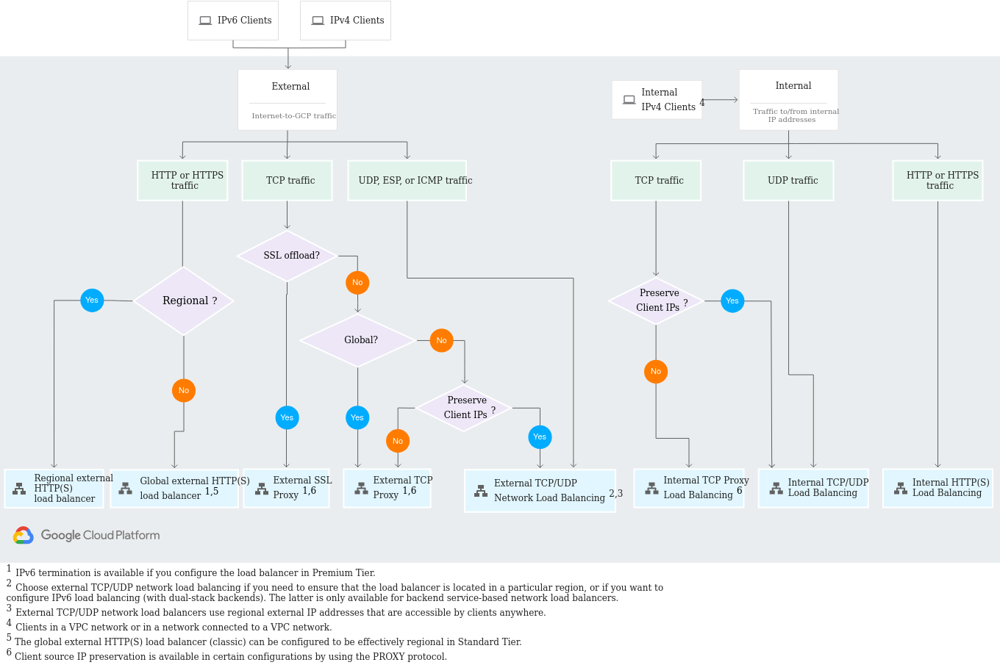

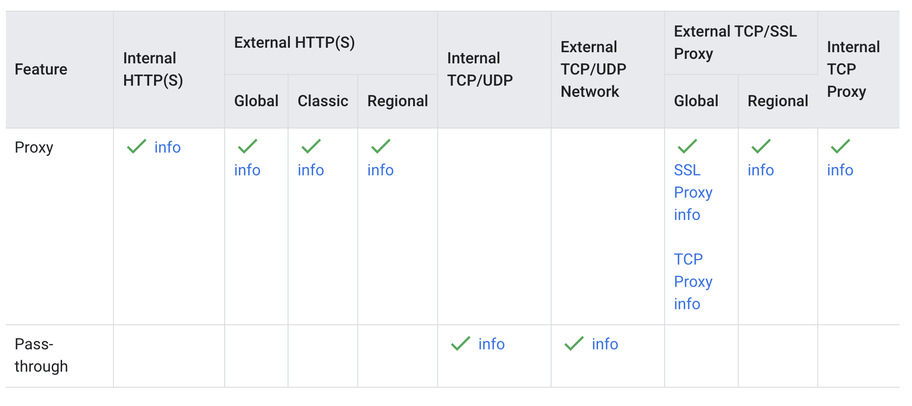

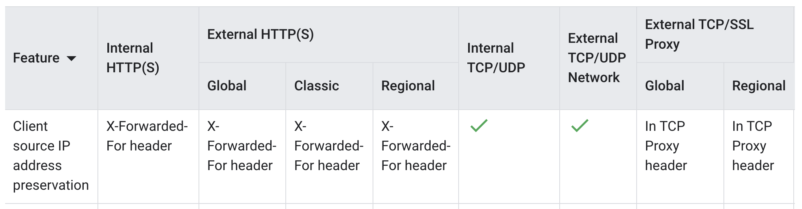

### Other Notes:

- When supporting both HTTP and HTTPS for the same domains, the recommended approach is to use 2 separate target proxies. Each target proxy requires a forwarding rule. One of the target proxies is used to redirect HTTP requests to HTTPS and requires no backend bucket or service. Each target proxy would also have a URL map that it uses to either redirect traffic, or direct traffic to backend services or backend buckets based on the domain or path of the request. This is referred to as **content-based load balancing**.
- Zonal network endpoint groups (**Zonal NEGs**) connect the load balancer directly to the pods for container-native load balancing in GKE. The ReplicaSet of pod replicas can autoscale based on the amount of traffic arriving at the associated Service via the HorizontalPodAutoscaler.
- Serverless network endpoint groups connect load balancers to App Engine, Cloud Run, Cloud Functions, or API Gateway services
- Managed instance groups (**MIGs**) are always groups of identical VMs. Network endpoint groups(**NEGs**) can be more general, such as FQDN/port or IP/port combinations, or managed services. In GKE you can use either managed instance groups or network endpoint groups, but container-native load balancing only uses network endpoint groups.
- Because Network Load Balancing is a **pass-through load balancer,** you **control access** to the load balancer's backends using **Google Cloud firewall rules**.
- DDoS Attacks
    - All the LB bring DDoD protection and it can be expanded with Cloud Armor (except in NLB passthrough)
    - Cloud Armor uses machine learning algorithms that can analyze network patterns and detect anomalies which can be blocked to deal with DDoS attack.
    - Increase the maximum autoscaling backend to accommodate the severe bursty traffic - This is a valid strategy for dealing with DDoS attack. Google will refund any cost inured during a DDoS attach caused by autoscalling of backend for enterprise customers.

## Session Affinitiy

Session affinity, also known as session persistence, is a load balancing feature that directs client requests to the same backend instance for the duration of a session. This can be useful for applications that require clients to maintain a stateful connection to a particular instance, such as applications that use HTTP cookies or that rely on client IP address for authentication.

## New terminology for Load balancer

- Application Load Balancer
    - External
        - global
        - regional
    - Internal
        - regional
- Network Load Balancer
    - Proxy (TCP/SSL offloading)
        - External
            - Global
            - Regional
        - Internal
            - regional
    - Pass-through (TCP, UDP, ESP ICMP, GRE)[IPv4 or IPv6]
        - External
            - regional
        - Internal
            - regional
    
    NOTE: 
    
    - Global support IPv6
    
    Google HTTPS Load Balancers support both IPv4 and IPv6 Forwarding rules or multiple forwarding rules of both IPv4 and IPv6. Create a new Forwarding Rule with the IPv6 address. Then you can associate both IPv6 and IPv4 with the same load balancer and back end instances. Update DNS with the new IPv6 Address record to map the domain IPv6 request to the new IPv6 IP.
    
    - Regional does no support IPv6
    - Global terminate locations in anywhere (small latency)
    - Proxy terminate the connections at GFE or envoy proxies
    - Passthrough DO NOT terminate the client connections, the responses go directly to the client without going through the LB (Direct server return=DSR)

## Overview of LB

Cloud Load Balancing can route traffic to:

- Managed instance groups: a group of virtual machines created from a template.
- Network endpoint groups (NEG): a group of services or workloads.
- Cloud Storage buckets

Network Endpoint Groups (NEG)

- A NEG is a configuration object that specifies a group of backend endpoints or services.
- There are five types of NEGs:
    - **Zonal**: contains one or more endpoints that can be Compute Engine virtual machines (VMs) or services that run on the VMs (i.e. GKE). Each endpoint is specified either by an IP address or an IP:port combination.
    - **Internet** contains a single endpoint that is hosted outside of Google Cloud. This endpoint is specified by hostname FQDN:port or IP:port.
    - **Serverless**: to a Cloud Run, App Engine, Cloud Functions, or API Gateway service in the same region as the NEG.
    - **Private Service Connect:** contains a single endpoint. That endpoint that resolves to either a Google-managed regional API endpoint or a managed service published by using Private Service Connect.
    - **Hybrid connectivity:** points to Traffic Director services that run outside of Google Cloud. Add the hybrid connectivity NEGs to a hybrid load balancer backend. A hybrid connectivity NEG must only include endpoints outside Google Cloud. Traffic might be dropped if a hybrid NEG includes endpoints for resources within a Google Cloud VPC network.


NOTE:  In GKE you can use either managed instance groups or network endpoint groups, but container-native load balancing only uses network endpoint groups. In GKE workloads, autoscaling is typically accomplished using a HorizontalPodAutoscaler, though VerticalPodAutoscaler and MultidimPodAutoscaler are possible alternatives. GKE cluster autoscaling occurs based on the resource demands and scheduling of pods across all workloads using a given node pool.

## Hybrid LB

- Global external HTTP(S) load balancer
- Global external HTTP(S) load balancer (classic)
- Regional external HTTP(S) load balancer
- Internal HTTP(S) Load Balancing
- External TCP Proxy Load Balancing
- External SSL Proxy Load Balancing

## Traffic management

- Traffic management provides enhanced features to route load balancer traffic based on criteria that you specify.
- With traffic management, you can:
    - Direct traffic to a backend based on HTTPS parameters.such as the host, path, headers, and other request parameters.
    - Perform request-based and response-based actions such as redirects and header transformations.
    - Use traffic policies to fine-tune load balancing behavior.such as retry policies, request mirroring, and cross-origin resource sharing (CORS).
- Supported LB:
    - Global external HTTP(S) load balancer
    - Global external HTTP(S) load balancer (classic)
    - Regional external HTTP(S) load balancer

## Hands on Cloud LB (after the DNS Setup)

### For Serverless

- Create a Backend
    - Select a NEG (Network Endpoint Gateway for GAE, Cloud Run, …)
- Create host and path rules
- Create a FE
    - Select protocol HTTP

### With a Manage Instance Group(MIG)

- Add a new FE for HTTPs
- Can create a certificate (Google managed or Uplodad your own certificate)
    - Add your domain to the cert
    - By default 3 months of validity y se renueva automaticamente.
- Add a MIG as a Backend
    - Create Machine template
    - Config Health check
    - Autoscaling (Min/Max VMs)
    - VM w/o external IP + cloud NAT for a startup script that install the required utilities.
- Add another host and path to the MIG
- Create a Firewall for the incoming healtchecks IP range (check this on the google doc)
    - 35.191.0.0/16
    - 130.211.0.0/22
    
    NOTE: Be aware, the VMs web server should have the same path you are setting in the LB, for example /dynamic
    
### With an Unmanaged Instance Group(UMIG)

- Same as with MIG but you select an Unmanaged Instance Group

### With a Cloud Storage Bucket

- Create a bucket and detect it as a Backend
- You must configured the bucket to be accessed publicly

### Redirect from HTTP to HTTPs

- Add yet another LB
    - Without BE
    - Set the host & path with the advanced rule:
        - redirect the client to a different host & path
            - Full pact redirect
            - HTTPs redirect on
    - Set FE with HTTP config.

# Cloud DNS

**A simple DNS primer**

1. A client makes a DNS request to obtain an IP address; the request is sent to a recursive resolver.
2. A recursive resolver requests the IP address from a name server.
3. The name server responds with the IP address.
4. The recursive resolver sends the IP to the client.

**Features**

- High scalable, reliable and managed DNS
- 100% SLA
- Cloud domains is another product (DNS Registrar)

### Type of DNS in GCP

1. Internal DNS
- Internal DNS and Cloud DNS are different offerings.
- Internal DNS names are names that Google Cloud creates automatically.
- Format: `[INSTANCE_NAME].[ZONE].c.[PROJECT_ID].internal`
- On **Linux**, by default, the VM's metadata server (169.254.169.254) resolves internal DNS names.
- On **Windows**, by default, the subnet's default gateway resolves internal DNS names.

2. Private Zone
- A private DNS zone contains DNS records that are only visible internally within your GCP network(s) or hybrid.
- Supports DNS Forwarding & DNS Peering.

3. Public Zone
- A public zone is visible to the internet. Usually purchased through a Registrar. 

### Managed Zones in DNS

- A container that contains all the records that share the same DNS domain

**Private Zones**

- Private zones provide a namespace that is visible only inside the VPC or hybrid network environment.
- For example, an organization would use a private zone for a domain dev.gcp.example.com, which is reachable only from within the company intranet.
- Creation
    - Include zone name and domain
    - Select which VPCs can access this zone.
    - Create records with the internal IPs
    
**Public zones**

- Public zones provide authoritative DNS resolution to clients on the public internet.
- For example, a business would use a public zone for its external website, cymbal.com accessible, which is directly from the internet.
- Creation
    - Include zone name and domain
    - Need to update the name servers to forward queries to Cloud DNS name servers at your Registrar Provider (e.g. GoDaddy)
    - Allow DNSSec available
- Migrate public zones
    - Step 1: Create public zone in Cloud DNS
    - Step 2: Export DNS records in a supported format (BIND or YAML records format), from On-prem network.
        - delete all existing flag to remove all the SOA before importing
    - Step 3. Import DNS records in Cloud DNS
    - Step 4: Update name servers to Cloud DNS name servers.

## Supported Cloud DNS policies
After you create the DNS zones and artifacts needed for lookups, create Cloud DNS policies.

1. **Server policies** apply private DNS configuration to a VPC network.
2. **Response policies** enable you to modify the behavior of the DNS resolver by using rules that you define.
3. **Routing policies:** steer traffic based on geolocation or round robin.

### Server policies

- Use server policies to set up hybrid deployments for DNS resolutions.
- Each VPC network can have one DNS server policy.
- Types depends on the direction of DNS resolutions: inbound, outbound or both
    - For workloads that use an on-premises DNS resolver, use an outbound server policy to set up DNS forwarding zones.
    - If you want on-premises workloads to resolve names on Google Cloud, set up an inbound server policy.

### Response policies

- A response policy is a Cloud DNS private zone concept that contains **rules instead of records.**
- Lets you introduce customized rules in DNS servers within your network **that the DNS resolver consults during lookups.**
- If a rule in the response policy affects the incoming query, it's processed (otherwise, the lookup proceeds normally).
- The rules **enable you to return modified results to DNS clients**.

### Routing policies

- DNS routing policies steer your traffic based on specific criteria.
- Three types of DNS routing policies:
    1. **Weighted round robin**: lets you specify different weights per DNS target.
    2. **Geolocation:** lets you map the traffic that originates from Google Cloud regions to specific DNS targets.
    
    ```bash
    #define a DNS Record of type A pointing to the IP of the web server in US when the traffic comes from us-east1
    # in the case of a different region, it will resolve the closest one.
    # STEP 1: Create Zone
    gcloud dns managed-zones create example --description=test --dns-name=example.com --networks=default --visibility=private
    # Step 2: Create routing policy
    gcloud dns record-sets create geo.example.com \
    --ttl=5 --type=A --zone=example \
    --routing-policy-type=GEO \
    --routing-policy-data="us-east1=$US_WEB_IP;europe-west2=$EUROPE_WEB_IP"
    ```
    
    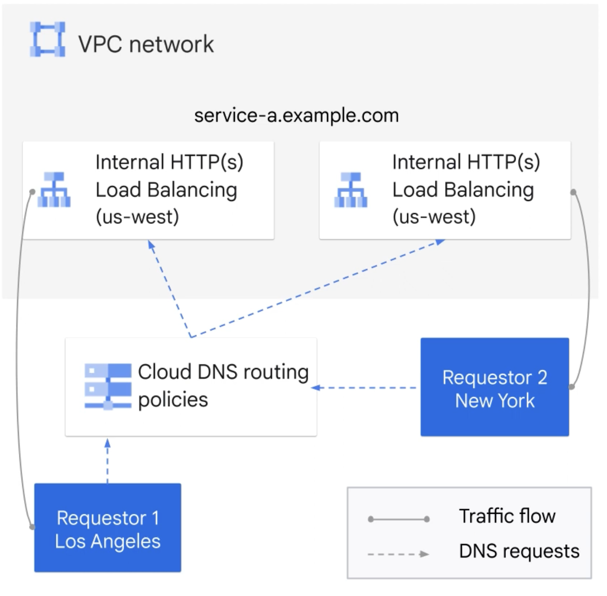
    
    3. **Geofencing and failover:** lets you set up active backup configurations (only for private zones)

    **Routing policy caveats**
    
    1. Only one type of routing policy can be applied to a resource record set at a time.
    2. Nesting or otherwise combining routing policies is not supported.
    

### DNS Forwarding & DNS Peering

- DNS Forwarding for hybrid computing, send the DNS request to on-prem or viceversa
    - Inbound (from on-prem to Cloud VPC)
    - Outbound (from Cloud VPC to On-prem)
    - **Cannot** be used between two different Google cloud projects environments
    - Applies to **specific domains entries**
- As an alternative to DNS Forwarding we can use DNS Server Policy (Inbound or outbound)
    - it will apply to all the DNS queries
- DNS Peering extends the scope of the private zones
    - Connect to VPC Network to share DNS services
    - NOTE this is not VPC Peering
- DNS Peering is recommended to avoid outbound DNS forwarding from multiple VPCs which can cause problems with return traffic. DNS peering allows a single forwarding zone to be associated with a single VPC and then other VPCs to have their requests forwarded by DNS peering with the forwarding zone.

Separate managed zones must be created for different domains, public vs private DNS, DNS
peering, or DNS forwarding.

## Summary of the different config options:
1.  🔐 Private Zone
    - Cloud DNS Private zones support DNS services for a GCP Project. 
    - VPCs in the same project can use the same name servers.
2. 🔁 DNS Forwarding for Private Zones
    - Overrides normal DNS resolution of the specified zones.
    - Instead, queries for the specified zones are forwarded to the listed forwarding targets.
3. 🔄 DNS Peering for Private Zones
    - DNS peering lets you send requests for records that come from one zone's namespace to another VPC network.
4. 📤 DNS Policy Outbound
    - When enabled in Cloud DNS, forwards all DNS requests for a VPC network to name server targets.
    - Disables internal DNS for the selected Networks.
5. 📥 DNS Policy Inbound
    - Create an inbound DNS Policy to allow inbound connections from on-premises systems to use that network's VPC name resolution order.
    
NOTE: Cloud DNS doesn't support zone transfers, so you cannot use zone transfers to synchronize DNS records with your on-premises DNS servers.

## DNS Security

- Protect Public domains zone from DNS spoofing
    - Public records DNSKEY with the public keys and signatures RRSIG to authenticate your zone's content in the registrar setup
    - In the public zone you should add the DS (delegation signer) record in the domain
    - Assure that your DNS clients is able to tackle with DNSSEc
    - There is also a Transfer mode where you are moving the DNS, before importing the records
        - Add the DS Records at the source and update the NS to Cloud DNS, and then activate DNSSEC
    

### Removing DNSSEC
To resolve the issue of DNSSEC validating resolvers being unable to resolve names in your Cloud DNS-managed zone, you should perform the following steps:

1. Check the state of your DNSSEC configuration in the Cloud DNS console: Make sure that you have correctly disabled DNSSEC for the zone, and that the change has taken effect.
2. Check the state of the DS records: Confirm that the DS records have been properly removed from the zone file, and that they have been purged from the cache.
3. Check the state of your domain registrar: Make sure that the domain registrar is not still configured to use DNSSEC, as this may be the source of the issue. You can check the DNSSEC settings for your domain at your domain registrar's control panel.
4. Check the state of your name servers: Confirm that your name servers are properly configured and are returning the correct information for your zone.
5. Check for other issues with your network: Consider checking for other issues with your network that may be affecting the resolution of your names, such as network congestion or routing issues.

### Summary of DNSSEC

1️⃣ **Cloud DNS SECurity for Public Zones**
- DNS zone for your domain must serve special DNSSEC records for public keys (DNSKEY) and signatures (RRSIG) to authenticate your zone's contents.

2️⃣ **How to enable and disable DNSSEC**
- Activate or Disable DNSSEC at your domain registrar by adding a DS record in the zone to be validated.
When DNSSEC is active, clients must use a resolver that supports DNSSEC.

3️⃣ **Migrate Domain to Cloud DNS with DNSSEC**
- Turn off DNSSEC and re-enable after the transfer.
Understand how to use the Google Cloud DNS DNSSEC "Transfer" and "Import" features.


## Querying order for DNS

1. DNS Server Policy forwarding rule
2. Private DNS forwarding zones
3. Private Zones and peering zones
4. Compute engine internal DNS
5. Queries public zones

## Other notes about DNS

- Shared VPC⇒ Recommended to create the zone in the host project and then add the authorized networks

## Advanced Cloud DNS Configuration

Cloud DNS supports advanced scenarios for hybrid and containerized environments.

### Split-Horizon DNS
- Serve different DNS responses based on the source of the query (e.g., internal vs. external clients).
- Achieved by creating separate public and private zones for the same domain.

### External-DNS Operator for GKE
- Automate DNS record management for Kubernetes services using the external-dns operator.
- Automatically creates, updates, and deletes DNS records as services are deployed or removed.
- [External-DNS for GKE documentation](https://cloud.google.com/kubernetes-engine/docs/how-to/external-dns)

### Migrating Public Zones
- Steps:
  1. Create the public zone in Cloud DNS.
  2. Export DNS records from the current provider (BIND or YAML format).
  3. Import records into Cloud DNS.
  4. Update registrar to use Cloud DNS name servers.
- [Migration guide](https://cloud.google.com/dns/docs/migrating-to-cloud-dns)

# Cloud Content Delivery Network (CDN)

- Fast reliable web and video CDN with global scale and reach
- Requirements
    - Premium Network Tier
    - Attached to a Global HTTP(s) LB
    - Content can be sourced from various types of backends (AKA origin servers): instance groups, NEGs, and GCS Buckets
    - Edge Location Cache Server
- Content: image, video, audio and other (PDF, ZIP) up to 5TB in size.
- Cache hit miss (if the data is no in the CDN cache, it goes to the original source)
    - Cache fill retrieves the data from the source
- Delivers the content the closest to the customers.
- For enabling it, in the Cloud LB Backend configuration, check the flag "Enable Cloud CDN)

## Cloud CDN Cache Control

- Add Origin to the Cloud CDN
    - You have a summary setting and monitoring tool
- Complete Request URI is used as the Cache key
- We can create custom cache key to improve cache hit ratio (ex. remove the host from the URL )
- Cache Control setting (set-cache, for time sensitive content)by priority:
    - s-maxage → shared caches
    - maxage
    - Expires
- Byte Range request: Only caches the changes of the files (differential changes only)
- You have a cache invalidation tool to remove keys from the cache: only one per minute so try to use folders to do it.
- Invalidation removes content from the Cloud CDN distributed cache servers before the cache entry expires. Invalidation is eventually consistent.
- DDoS protection similar to LB

**Example: Invalidating cached content**
```sh
gcloud compute url-maps invalidate-cdn-cache [URL_MAP_NAME] \
    --path "/images/*" --async
```
- Use cache invalidation to remove outdated or sensitive content from the CDN before its TTL expires.

## CDN with Signed URLs

- With a command or your own code
    - `gcloud compute signed-url` requires a key-name and key-file
        
        ```sh
        gcloud compute signed-url create gs://[BUCKET]/[OBJECT] \
            --duration=[DURATION] \
            --key-file=[KEY_FILE] \
            --key-name=[KEY_NAME]
        ```
        
    - These parameters can be obtained from the "origin" configuration in the Cloud CDN Console.
    - The key can be generated using the interface or provided by us.
    - Set the time during which this information will be available.
    - This allows only the CDN to access the content of the bucket; for this, you must grant the Cloud CDN service account the `objectViewer` permission.
    - Signed URLs allow you to restrict access to CDN-cached content for a limited time and to specific users.
    - You can configure the cache max-age for signed URLs with `--signed-url-cache-max-age`.

### Summary CDN and Signing URLs

1. **Cloud CDN Keys for Signing URLs**  
   Enable support for Cloud CDN signed URLs by creating one or more keys on a Cloud CDN-enabled backend or bucket.

2. **Maxage setting for Signed URLs**  
   The length of time Cloud CDN will cache a response to a signed URL request.  
   `--signed-url-cache-max-age [max-age]`

3. **Cloud CDN Service Account**  
   Grant bucket viewer role to  
   `service-PROJECT_NUM@cloud-cdn-fill.iam.gserviceaccount.com`

## Cache Modes

### Cache mode: CACHE_ALL_STATIC 
Automatically caches successful responses with static content that aren't https://cloud.google.com/cdn/docs/caching#non-cacheable_content. Origin responses that set valid caching directives are also cached.

This is the default behavior for Cloud CDN-enabled backends created by using the Google Cloud CLI or the REST API.

CACHE_ALL_STATIC will cache static content based on Content-Type/MIME matching standard static types such as Javascript, CSS, photos, video, and audio, unless Cache-Control metadata for the associated object in Cloud Storage has a private or no-store directive. 

When the mode is CACHE_ALL_STATIC, a configuration parameter called Default TTL, which defaults to 1h, sets the lifetime for static file types that don't have Cache-Control specified expiry time. If they do have Cache-Control specified expiry time, they use the specified value. Other file types that are not in the set identified as static would be cached or not based on Cache-Control metadata normally.

### Cache mode: USE_ORIGIN_HEADERS
Requires successful origin responses to set https://cloud.google.com/cdn/docs/caching#cacheability. Successful responses without these directives are forwarded from the origin.

### Cache mode: FORCE_CACHE_ALL 
It will enforce caching of all objects regardless of Cache-Control metadata and will also use the Default TTL value for expiry time.

FORCE_CACHE_ALL Unconditionally caches successful responses, overriding any cache directives set by the origin. This mode is not appropriate if the backend serves private, per-user content, such as dynamic HTML or API responses.

NOTE:
USE_ORIGIN_HEADERS strictly uses the Cache-Control headers for controlling the caching. In addition to the Default TTL parameter there are also Max TTL and Client TTL configuration parameters that can adjust the behavior in the CACHE_ALL_STATIC and FORCE_CACHE_ALL modes.

## External Origins

CDN Interconnect lets you:

- Select third-party Cloud CDN providers to establish Direct Interconnect links at edge locations in the Google network.
- Direct your traffic from your VPC networks to a provider network.
- Optimize your Cloud CDN cache population costs.

If your CDN provider is already part of the program, you don't have to do anything. Traffic from supported Google Cloud locations to your CDN provider automatically takes advantage of the direct connection and reduced pricing.

Typical use cases for CDN Interconnect

- High-volume egress traffic.
- Frequent content updates.

# Cloud Armor

- Network security Product
- WAF + L3-L7 DDoS attack preemtive
- Intelligent filtering not just IP/port → Lots of customization with a custom rules language
- ML based adaptative filtering can be enabled
- Works with Cloud Load Balancing
- Need an Organization Node to be able to enable it
- Predefined rulesets against OWASP Top 10 Webapps vulnerabilities (SQLi, XSS, insecure deserialization)
- Allow blocking traffic originating from specific countries and regions
- It basically works creating security policies: What to do [the action], when to do it [the condition], and where to apply the rule [the target]
- Control access to your GCP resources at your network's edge
- Use it for protecting your non-CDN HTTP LB
- Rate limiting
- Creating a security policy 
    - Set a name
    - Set a policy type:
        - Backend security (+ protección)
        - Edge security
    - Set default rule action
        - Allow
        - Deny → you should indicate the returning HTTP Status (403, 404, 502)
    - Add policy to targets
        - Our LBs
    - Set advance configuration
        - Enable adaptative protection flag
- Adding more rules:
    - Set name
    - Set condition
        - Basic (IP Address/Range only)
        - Advanced
    - Set match
        - IP range
    - Set action:
        - allow
        - Deny
        - Throttle
        - Others
    - Set previously (low number higher priority)
    
    NOTE: Be aware that if you delete the default policy, all the rules will be deleted.
    
- When selecting advanced in the condition you can do some scripting to match the requests.

- There exists a Standard and an Enterprise version

# Logging and monitoring

## Network Service Tier

Premium ⇒ It arrives to google pretty much faster

Standard ⇒ It arrives in more hops to google (not recommended, only for very sensitive to cost customers). It uses ISPs network. If you are not going to use CDN or having multiple regions.

## VPC Flow Logs

- VPC flow logs can be enabled and configured on a subnet level and capture a maximum of 10% of traffic. That amount can be further reduced by sampling and/or filtering and is aggregated over a configurable period which defaults to 5 seconds. Log entries are created for the aggregate traffic from the period and information about the source and destination IP addresses and ports, the protocol, and other useful information is provided in the log entry.
- **Configure logs** to expose the following fields:

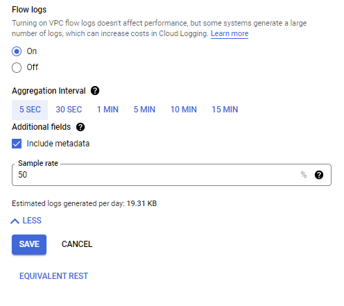

The purpose of each field is explained below.

- **Aggregation time interval:** Sampled packets for a time interval are aggregated into a single log entry. This time interval can be 5 sec (default), 30 sec, 1 min, 5 min, 10 min, or 15 min.
- **Metadata annotations:** By default, flow log entries are annotated with metadata information, such as the names of the source and destination VMs or the geographic region of external sources and destinations. This metadata annotation can be turned off to save storage space.
- **Log entry sampling:** Before being written to the database, the number of logs can be sampled to reduce their number. By default, the log entry volume is scaled by 0.50 (50%), which means that half of entries are kept. You can set this from 1.0 (100%, all log entries are kept) to 0.0 (0%, no logs are kept).

This allows you to trade off longer interval updates for lower data volume generation which lowers logging costs. 

From the same subnet details page you can access to the log explorer.

## Firewall Rules Logging

- Firewall logs capture all of the detailed information about firewall activity but can produce large logs. These logs may require filtering to effectively find activity related to the traffic flows of interest.
- When troubleshooting, it's also important to remember that logs and insights are not captured for the implicit deny all ingress and allow all egress firewall rules.
- Firewall rule logging is supported for TCP and UDP only. Reply traffic is allowed due to connection tracking. Reply traffic does not cause any logging to occur, regardless of firewall rules in that direction

## Packet mirroring (PM)

- Each packet mirroring policy sends traffic from a collection of source VMs, which must all be in the same project, VPC, and region, to a destination internal TCP/UDP load balancer configured for packet mirroring.
- The source VMs can be specified in the packet mirroring policy by name, tag, or subnet, with different limitations depending on the approach taken.
- The destination load balancer can be connected to one or more VMs in an unmanaged or managed instance group (instance group of collector instances). It must also be in the same region, but can be in either the same VPC or a peered VPC.
- Packet mirroring policies can be configured to forward only ingress or only egress traffic, or to limit the traffic to only include certain source or destination IP ranges and/or protocols.
- Proper firewall rules should be also in place.
- The mirroring happens on the virtual machine (VM) instances, not on the network. Hence PM consumes additional bandwidth on the hosts.

## Load balancing logging

- As with most networking services in Google Cloud there are logs collected related to the functionality of the HTTP(S) Load Balancer.
- These logs also include logs related to functionality of the Cloud CDN and Cloud Armor which are tightly integrated with the HTTP(S) LB.
- Backend buckets will provide logs automatically, but backend services require configuration to enable logs and set the logs sampling rate.
- Each Cloud CDN request is automatically logged within Google Cloud. These logs will indicate a "Cache hit" or "Cache miss" status for each HTTP request of the load balancer. 

## VPN Monitoring

- Alert to notify you when a Cloud VPN tunnel approaches the limits for bandwidth.
    - An alert can be set to notify if the tunnel is reaching the bandwidth maximum of 375 MBps or 250,000 packets per second.
    - Metrics:
        - [vpn.googleapis.com/network/sent_bytes_count](http://vpn.googleapis.com/network/sent_bytes_count)
        - [vpn.googleapis.com/network/sent_packets_count](http://vpn.googleapis.com/network/sent_packets_count)
        - [vpn.googleapis.com/network/received_bytes_count](http://vpn.googleapis.com/network/received_bytes_count)
        - [vpn.googleapis.com/network/received_packets_count](http://vpn.googleapis.com/network/received_packets_count)

## PerfKit Benchmarker

Before you migrate workloads to the cloud, you need to benchmark network performance to understand how that performance affects your business applications. 

PerfKit Benchmarker is an open-source tool created inside Google that makes network performance benchmarking faster and easier.
For more information on this tool, the performance metrics it supports, and deployment use
cases, read the article [Performance art: Making cloud network performance benchmarking
faster and easier](https://cloud.google.com/blog/products/networking/perfkit-benchmarker-for-evaluating-cloud-network-performance).

## Roles in Monitoring

| **Role ID/Role Name** | **Description** |
|---|---|
| **Monitoring Viewer**   | Gives you read-only access to Monitoring in the Google Cloud Console and API. |
| **Monitoring Editor**   | Gives you read-write access to Monitoring in the Google Cloud Console and API, and lets you write monitoring data to a Workspace. |
| **Monitoring Admin**  | Gives you full access to Monitoring in the Google Cloud Console. |
| **Monitoring Metric Writer** | Permits writing monitoring data to a Workspace; doesn't permit access to Monitoring in the Google Cloud Console. For service accounts. |

## Network Intelligence Center

### Firewall Insights

- Provides high-level details for quick analysis and detection of problems, such as shadowed rules, overly permissive rules, and active deny rules. It doesn't directly provide detailed information about the firewall rule activity.
- Provide high-level details about the behavior of firewall rules and help diagnose problems.
- Requires:
    - Enable the Firewall Insights API
    - Enable firewall rules logging for all rules to be included in the insights.
    - Several insights, such as the Deny rules with hits, also require configuring an observation period over which the insight will be calculated.
- [Shadowed firewall rule](https://cloud.google.com/network-intelligence-center/docs/firewall-insights/concepts/insights-categories-states#shadowed-firewall-rules) insights, which are derived from data about how you have configured your firewall rules. A shadowed rule shares attributes—such as IP address ranges—with other rules of higher or equal priority.
- [Overly permissive rule](https://cloud.google.com/network-intelligence-center/docs/firewall-insights/concepts/insights-categories-states#overly-permissive-rules) insights, including each of the following:
    - `Allow` rules with no hits
    - `Allow` rules that are unused based on trend analysis
    - `Allow` rules with unused attributes
    - `Allow` rules with overly permissive IP addresses or port ranges
    - `Deny` rule insights with no hits during the [observation period](https://cloud.google.com/network-intelligence-center/docs/firewall-insights/how-to/configure-observation-period#observation-period).

### Network Topology

This tool provides a topological visualization of your VPC networks and the infrastructure within, as well as links to on-premises networks and the internet. 

The tool also provides real-time metrics/graphs on traffic and latency between resources and across links e.g. config details, performance metrics and log)

This visual representation aids in identifying bottlenecks, optimizing traffic flows, and troubleshooting network issues more effectively.

It maintains a historical record of six weeks, organizaed by hourly snapshots. Even if resources are created and deleted within an hour, they are still documented in the snapshot. This allows to see your networks's evolution.

It aggregates related resources into hierarchical entities, you can expand and collapse this entities to have different level of abstraction, entities are connected if they are sending traffic

The tool supports various traffic protocols (TCP, UDP, ICMP, ICMPV6, ESP, GRE) for specific paths, visualizing traffic within and across VPC networks, between Google Cloud and the internet, and to/from VPN gateways, Interconnect connections, and router appliances.

In the GKE view, Network Topology shows traffic within a cluster (between pods on different nodes), between pods on the same node if intranode visibility is enabled, and between clusters and external IPs.

### Performance Dashboard

This tool provides metrics on packet loss and latency between zones within and across regions. 

Automatically collected, requires zero setup, it needs a minimum of VMs and it takes 10 min start appearing

**Options:**

- Traffic type:
    - Cross-zonal
    - To the internet
- Metrics:
    - Latency
    - Packet loss
- Time Period
- Network Tier
- GCP Regions:
    - in use by project
    - all
    - selected region

Graphs:

- Packet loss
    - Packet Loss Summary
    - Average packet loss between region pairs
- Latency
    - Latency summary
    - Average latency between region pairs

NOTE: 

- Share VPC may not be able to access to all the info (only where traffic is inter-exchange)
- VPC peering is the same case, only appears when there is traffic.

### Connectivity Tests

This tool provides static and dynamic connectivity tests to verify if the network configuration is blocking connectivity. 

Google brings with one tool that help us to troubleshoot the connectivity between two resources (it is like a tracert or traceroute command) so that you can see all the hops between two IPs

### Network Analyzer

Network Analyzer is another component of Network Intelligence Center that provides automated analysis of your network configuration to identify issues, misconfigurations, and optimization opportunities.

**Key features:**
- **Proactive analysis:** Continuously analyzes your network configurations to detect potential issues before they impact your workloads.
- **Prioritized recommendations:** Provides recommendations prioritized by impact and urgency.
- **Configuration validation:** Detects misconfigurations in load balancers, firewalls, routes, and other network components.

**Types of insights provided:**
- **Network failures:** Identifies configuration errors that could lead to network failures.
- **Suboptimal configurations:** Highlights inefficient configurations that may affect performance.
- **Utilization warnings:** Alerts about resources approaching capacity limits.
- **Security risks:** Identifies potential security vulnerabilities in your network configuration.

**Benefits:**
- Reduce troubleshooting time by identifying the root cause of network issues.
- Improve network reliability by proactively addressing potential problems.
- Optimize network performance by implementing recommended configurations.

**Reference:**  
[Network Analyzer documentation](https://cloud.google.com/network-intelligence-center/docs/network-analyzer)

# Organization Policies

- You need the `[roles/orgpolicy.policyAdmin](https://cloud.google.com/iam/docs/understanding-roles#organization-policy-roles)`
- You can set an organization policy to inherit the parent organization policy or to use the Google-managed default behavior.
- Deny overrides allow.

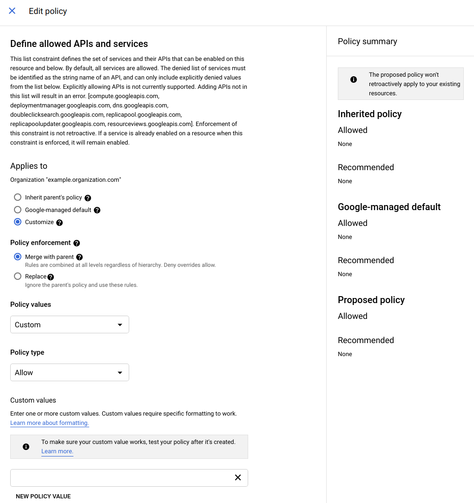

- **Restrict network configuration - apply org policies on appropriate folders to:**
    - Control which projects can use Shared VPCs (constraints/compute.restrictSharedVpcHostProjects)
    - Control which subnets part of a Shared VPC projects can use  (constraints/compute.restrictSharedVpcSubnetworks)
    - Control which networks underlying projects can be VPC peered with (constraints/compute.restrictVpcPeering)
    
    There are many more:
    
    [https://cloud.google.com/resource-manager/docs/organization-policy/org-policy-constraints](https://cloud.google.com/resource-manager/docs/organization-policy/org-policy-constraints)
    

## Organization Restrictions

The organization restrictions feature lets you prevent data exfiltration through phishing or insider attacks. For managed devices in an organization, the organization restrictions feature restricts access only to resources in authorized Google Cloud organizations.

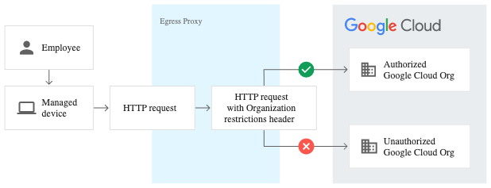

# VPC Service Controls

You can use VPC Service Controls to create perimeters that protect the resources and data of services that you explicitly specify.

Provides an extra layer of security defense for Google Cloud services that is independent of IAM. While IAM enables granular *identity-based access control*, VPC Service Controls enables broader *context-based perimeter security*, including controlling data egress across the perimeter. We recommend using both VPC SC and IAM for defense in depth.

VPC Service Controls is not designed to enforce comprehensive controls on metadata movement.

VPC Service Controls lets you define security policies that **prevent access to Google-managed services outside of a trusted perimeter, block access to data from untrusted locations, and mitigate data exfiltration risks**. You can use VPC Service Controls for the following use cases:

- [Isolate Google Cloud resources and VPC networks](https://cloud.google.com/vpc-service-controls/docs/overview#isolate) into service perimeters
- [Extend perimeters to on-premises networks](https://cloud.google.com/vpc-service-controls/docs/overview#hybrid_access) to authorized VPN or Cloud Interconnect
- [Control access to Google Cloud resources](https://cloud.google.com/vpc-service-controls/docs/overview#internet) from the internet
- [Protect data exchange across perimeters and organizations](https://cloud.google.com/vpc-service-controls/docs/secure-data-exchange) by using ingress and egress rules
- [Allow context-aware access to resources](https://cloud.google.com/vpc-service-controls/docs/context-aware-access) based on client attributes by using ingress rules

Access from the internet to managed resources within a service perimeter is denied by default. Optionally, you can enable access based on the context of the request. To do so, you can create **access levels** that control access based on various attributes, such as the source IP address. If requests made from the internet do not meet the criteria defined in the access level, the requests are denied.

You can configure VPC Service Controls as described in the following high-level steps:

1. Create an access policy. (at organization level)
2. Secure Google-managed resources with service perimeters. within the access policy
3. Set up VPC accessible services to add additional restrictions to how services can be used inside your perimeters (optional).
4. Set up private connectivity from a VPC network (optional).
5. Allow context-aware access from outside a service perimeter using ingress rules (optional).
6. Configure secure data exchange using ingress and egress rules (optional).

# Network Connectivity Center (NCC)

Network Connectivity Center (NCC) is a Google Cloud service that provides a central hub for managing and monitoring network connectivity across hybrid, multi-cloud, and multi-VPC environments.

## Key Features

- **Centralized connectivity management:** Create and manage complex topologies (hub-and-spoke, mesh, etc.) from a single place.
- **Hybrid and multi-cloud support:** Integrate on-premises, other clouds, and multiple GCP VPCs.
- **Spokes:** Attachments to the hub, two types:
    1) A VPC Network (VPC Spoke)
    2) Hybrid Spoke
        - HA  VPN tunnels
        - VLAN attachments (Interconnect)
        - Router Appliances (image of a NCC partner or your custom image)
- **Visualization:** Provides a graphical view of your network topology and traffic flows.

## Common Topologies

### Hub-and-spoke
- There are three ways in GCP to create a hub-and-spoke: 
    1) VPC Network Peering (efficient and low latency)
    2) Cloud VPN (flexible, higher latency, add'al config)
    3) **Network Connectiviy Center** 
- Central hub VPC connects to multiple spoke VPCs or on-premises networks. 
- Simplifies routing and security

#### Caveats
- IP addresses spaces between the hub, spoke and on-prem don't overlap
- IPv6 is not supported
- Privately used public IPs (PUPIs) are not supported

### Mesh
- All networks are interconnected, but this can be complex to manage at scale.
- Two types: 1) Fully mesh or 2) Partial mesh
- Benefits:
    - High availability and resilience, ideal for mission critical apps
    - Improved performance, better load balancing and reduce network congestion
    - Not having a central point of failure helps security

### Mirrored
- Creating a replica of your network infra in another env or region. (e.g. for DR, testing and dev, global workload distribution)

### Gating topologies
- fine-grained control over data movement between your cloud and external resources, ensuring security and compliance
- Types:
    - Gated egress: Controls outbound traffic from the cloud.
    - Gated ingress: Controls inbound traffic to the cloud.
    - Gated ingress and egress: Controls inbound and outbound traffic between hybrid and multi-cloud environments.

## Example Use Cases

- Centralizing connectivity between multiple VPCs and on-premises networks.
- Simplifying management of hybrid and multi-cloud architectures.
- Enabling transitive routing between VPCs (which is not possible with VPC peering alone).


## Reference

- [Network Connectivity Center documentation](https://cloud.google.com/network-connectivity/docs/connectivity-center)

# Cloud Next Generation Firewall (NGFW)

Cloud Next Generation Firewall (NGFW) is an advanced firewall solution in Google Cloud that provides centralized, scalable, and context-aware security controls for your cloud workloads.

## Key Features

- **Hierarchical firewall policies:** Apply firewall rules at the organization, folder, or project level for consistent security posture.
- **FQDN objects:** Create firewall rules based on fully qualified domain names (e.g., allow egress to `*.github.com`).
- **Secure tags:** Use organization-level tags for granular microsegmentation (see section above).
- **Intrusion Prevention Service (IPS):** Detect and block known threats and vulnerabilities at the network level.
- **Layer 7 (L7) inspection:** Inspect and control traffic based on application-level protocols and content.
- **Logging and monitoring:** Integrated with Cloud Logging and Security Command Center.

## Example Use Cases

- Allow egress only to specific domains (e.g., `*.googleapis.com`) using FQDN objects.
- Block known malicious traffic patterns with IPS.
- Apply organization-wide firewall policies to enforce compliance.
- Use L7 inspection to block or allow specific application protocols.

## Migration

- You can migrate from legacy VPC firewall rules to NGFW policies for enhanced control and visibility.

## Reference

- [Cloud NGFW documentation](https://cloud.google.com/firewall/docs/next-generation-firewall-overview)

## Advanced Cloud Armor Features

Cloud Armor provides advanced security features to protect your applications from web attacks, abuse, and threats.

### Web Application Firewall (WAF)
- Built-in WAF rules to detect and block common vulnerabilities such as SQL injection (SQLi), cross-site scripting (XSS), and remote file inclusion.
- Preconfigured rulesets (OWASP Top 10) can be enabled with a single click.

### Rate Limiting
- Define rules to limit the number of requests per client IP or per user over a specified time window.
- Helps mitigate DDoS attacks and abusive traffic patterns.

### Bot Management
- Detect and manage automated bot traffic using predefined rules and custom signatures.
- Allow, block, or redirect bot traffic based on behavior or identity.

### Threat Intelligence
- Integrate with Google Threat Intelligence to block traffic from known malicious IPs and emerging threats.
- Automatically update security policies with threat data from Google.

### Adaptive Protection
- Uses machine learning to detect and mitigate novel Layer 7 DDoS attacks in real time.
- Continuously learns from traffic patterns and adapts protections automatically.

**Reference:**
- [Cloud Armor documentation](https://cloud.google.com/armor/docs)
- [Cloud Armor WAF rules](https://cloud.google.com/armor/docs/waf-rules)
- [Adaptive Protection](https://cloud.google.com/armor/docs/adaptive-protection-overview)
# References

[Partner Advantage Portal](https://partner.cloudskillsboost.google/course_sessions/2386512/documents/374298)

[A Cloud Guru - Professional Cloud Network Engineer](https://learn.acloud.guru/course/gcp-certified-professional-cloud-network-engineer/)
