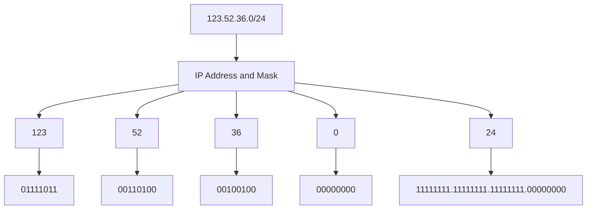
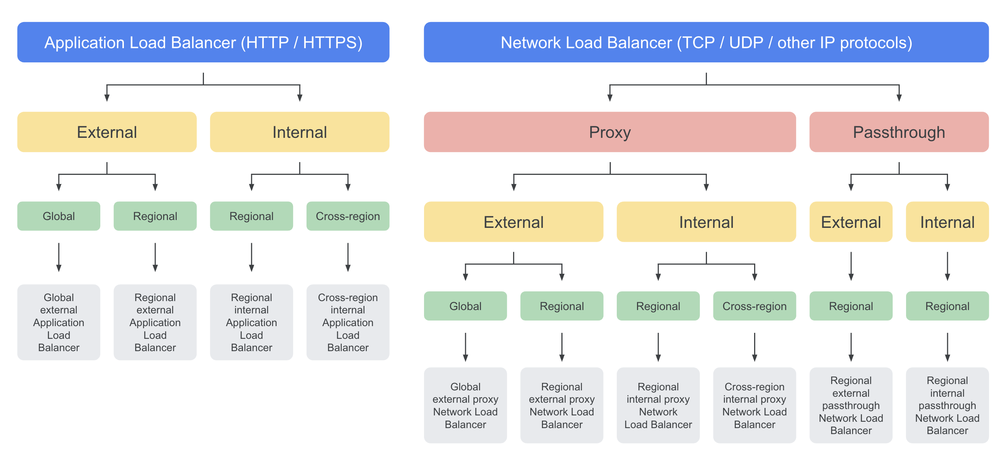

# GCP Professional Cloud Network Engineer

# CIDR Notation


## RFC 1918 - Standard for Private IP addressing

| Class | Internal Addresses Range | CIDR Prefix |
|:-:|:-:|:-:|
| A | 10.0.0.0 – 10.255.255.255 | 10.0.0.0/8 |
| B | 172.16.0.0 – 172.31.255.255 | 172.16.0.0/12 |
| C | 192.168.0.0 – 192.168.255.255 | 192.168.0.0/16 |

## Non-RFC 1918 Addressing

**Privately Used Public IPs (PUPIs):**
- Use public IP ranges privately within VPC
- Not routed to internet from VPC
- Useful when RFC 1918 space exhausted or conflicts

**Use cases:**
- Large organizations with RFC 1918 exhaustion
- Avoiding IP conflicts in mergers/acquisitions
- Hybrid environments with overlapping private ranges

**Limitations:**
- Cannot use with some Google services
- Not supported in NCC hub-and-spoke
- Requires careful routing configuration
- May conflict with internet routing

# Hybrid IP Address Planning

**Avoiding overlaps:**
- Reserve separate RFC 1918 blocks per environment
- Use /16 for on-premises, /8 for cloud
- Document IP allocation in IPAM system

**Multi-cloud strategies:**
- Use different RFC 1918 classes per cloud
- Plan for future acquisitions/mergers
- Consider using non-RFC 1918 for conflicts

**Best practices:**
- Start with larger subnets, subdivide as needed
- Leave room for growth (50% buffer)
- Use consistent naming conventions
- Plan for disaster recovery IP ranges

# Google Compute SLA

| Covered Service | Monthly Uptime Percentage (SLO) |
| --- | --- |
| Instances in Multiple Zones | >= 99.99% |
| A Single Instance | >= 99.5% |
| Load balancing | >= 99.99% |

# Disaster Recovery Patterns

**Multi-region strategies:**
- Active-Passive: Primary region + standby
- Active-Active: Traffic distributed across regions  
- Pilot Light: Minimal secondary + rapid scale

**Network DR:**
- Global HTTP(S) LB: automatic regional failover
- Multiple VPN/Interconnect: redundant connectivity
- DNS health checks: automatic DNS failover
- Cross-region Cloud Routers: BGP route advertisement

# SSH into VMs

## Your own keys

By creating and managing SSH keys, you can let users access a Linux instance through third-party tools.

An SSH key consists of the following files:
1) A public SSH key file that is applied to instance-level metadata or project-wide metadata. 
2) A private SSH key file that the user stores on their local devices. If a user presents their private SSH key, they can use a third-party tool to connect to any instance that is configured with the matching public SSH key file, even if they aren't a member of your Google Cloud project. 

Therefore, you can control which instances a user can access by changing the public SSH key metadata for one or more instances.

# Migrating VMs

## Requirements
- The migration is a "cold" migration. The VM must be stopped before it can be migrated.
- The VM must not be in an instance group or network endpoint group (NEG):
    - if in unmanaged instance group or NEG, you should take it out from there.
    - If in MIG, you cannot move it, you should create a template and launche it in the new VPC.

## Supported migrations
1. From legacy network to a VPC network in the same project.
2. From one VPC network to another VPC network in the same project.
3. From one subnet of a VPC network to another subnet of the same network.
4. From a service project network to the shared network of a Shared VPC host project.
> NOTE: the VM stays in the region and zone where it was before. Only the attached network changes

## Limitations
- You cannot migrate a VM interface to a legacy network.
- The MAC address allocated to the NIC will change during the migration. This could impact on services coupled with MAC addresses (e.g. somelicense agreements)
- The internal IP address of your instance must change to the target subnet IP range, you can keep it if the IP range is the same and is not used.
- The external IP can be kept, but you you must have the compute.subnetworks.useExternalIp permission on the target network, and the target network cannot have external IP addresses disabled by the constraints/compute.vmExternalIpAccess constraint

# IAM Roles

## Core Networking Roles

The **Compute Network Admin** role grants access to create, modify, and delete networking resources, except for firewall rules and SSL certificates. 

The **Network Viewer** role allows read-only access to networking resources

The **Network Admin** role allows read-only access to firewall rules, SSL certificates, and instances (to view their ephemeral IP addresses). It does not allow a user to create, start, stop, or delete instances.

The **Security Admin** has permissions to create, modify, and delete firewall rules and SSL certificates, and also to configure Shielded VM settings.

The **Logs Viewer** role already gives you read-only access to all features of Logging except Access Transparency logs and Data Access audit logs.

**Additional Networking Roles:**
- `roles/compute.loadBalancerAdmin`: Manage LB resources
- `roles/dns.admin`: Full DNS control
- `roles/dns.reader`: Read-only DNS access
- `roles/resourcemanager.projectIamAdmin`: Required for Shared VPC setup

Also See Shared VPC related roles in the Shared VPC section.

NOTE: 
- Child policies cannot restrict access granted at the parent level
- Deny Policies  prevent certain principals from using certain permissions, regardless of the roles they're granted.
- Deny policies take precedence over access policies,


## Policy Intelligence

Policy Intelligence provides several tools for analyzing, simulating, troubleshooting, and recommending Cloud IAM policies. 

The Policy Analyzer would be the best tool in this or similar scenarios where the goal is to to determine which identities have what sort of access to which resources.

### Policy Simulator when changing IAM

Policy Simulator helps you determine what impact a change to an allow policy might have for your users. To do this, it uses access logs to focus on the permission changes that would actually affect your users. To find out how a change to an allow policy might impact a principal's access, Policy Simulator determines which access attempts from the last 90 days have different results under the proposed allow policy and the current allow policy. Then, it reports these results as a list of access changes

Role recommendations are generated by the IAM recommender. The **IAM recommender** is one of the recommenders that [Recommender](https://cloud.google.com/recommender/docs) offers.

Each role recommendation suggests that you remove or replace a role that gives your principals excess permissions. At scale, these recommendations help you enforce the principle of least privilege by ensuring that principals have only the permissions that they actually need.

The IAM recommender identifies excess permissions using *policy insights*. Policy insights are ML-based findings about a principal's permission usage.

# VPC Networks

A Virtual Private Cloud (VPC) network is a virtual version of a physical network that:

- Provides connectivity for your Compute Engine virtual machine (VM) instances.
- Offers native Internal TCP/UDP Load Balancing and proxy systems for Internal HTTP(S) Load Balancing.
- Distributes traffic from Google Cloud external load balancers to backends.
- Projects can contain multiple VPC networks. (Max 50 VPC per project)
- New projects start with a default network (an auto mode VPC network) that has one subnetwork (subnet) in each region.
    - Google-recommended practice: create a custom mode VPC network.
- It's Global resources → Does not belong to any Region
- Placeholder to keep your resources
- No IP range Assigned to VPC
- Network contain subnets
- Subnets are used for segregate resources
- Subnets has IP ranges expressed as CIDR notation
- VPC must have minimum one subnet
- Subnet belongs to one single region in GCP

Use the Default Network is a bad practice because of many reasons so that it is better to deactivate its use at the Org Policy Level (_Skip Default Network Creation Org Policy_):
- Lots of unnecessary subnets
- Same name – confusion
- Broad ranges in IP address
- Can not delete subnet
- Default Firewall rules are broad (default-allow-internal, ssh, rdp and icmp, priority 655534)
- Can not go beyond /16 (start with a /20)

There are four reserved IP addresses in each subnet's primary IPv4 range. There are no reserved IP addresses in the secondary IPv4 ranges.

| Reserved IP address | Description | Example |
|---|---|---|
| Network | First address in the primary IP range for the subnet | 10.1.2.0 in 10.1.2.0/24 |
| Default gateway | Second address in the primary IP range for the subnet | 10.1.2.1 in 10.1.2.0/24 |
| Second-to-last address | Second-to-last address in the primary IP range for the subnet that is reserved by Google Cloud for potential future use | 10.1.2.254 in 10.1.2.0/24 |
| Broadcast | Last address in the primary IP range for the subnet | 10.1.2.255 in 10.1.2.0/24 |

When configuring VPC networks and their subnetworks, you can expand the primary range of a subnet (to max /16 size in auto networks or to the size supported by the IP block in custom networks) as long as the expansion does not introduce overlap to other existing subnets. 
When doing such expansion, any firewall rules depending on the older range should be updated. 

Deleting a subnet first requires deleting all VMs in that subnet.


## Subnets and IPv6 support

- VPC networks now support IPv6 addresses.
- Support for IPv6 addresses can vary per subnet.
- To support IPv6, Google Cloud has introduced the concept of a subnet stack.
    - Single-stack subnets support IPV4.
    - Dual-stack subnets support IPv4 and IPv6.
- IPv6 addresses can be assigned to objects in a subnet that supports IPv6.

**To use IPv6, set up a dual-stack subnet**

- You can configure the IPv6 access type as internal or external.
- Internal IPv6 addresses are used for communication between VMs within VPC networks.
- External IPv6 addresses:
    - Can be used for communication between VMs within VPC networks.
    - Are also routable on the internet.
- Connected VMs inherit the IPv6 access type from the subnet.

**Assigning IPv6 address ranges to a VPC network**

- To enable internal IPv6 on a subnet, you must first assign an internal IPv6 range on the VPC network.
- A /48 ULA (Unique Local Addresses) range from within fd20:/20 is assigned to the network.
    - All internal IPv6 subnet ranges in the network are assigned from this /48 range.
    - The /48 range can be automatically assigned, or you can select a specific range from within fd20::/20.

**Assigning IPv6 address ranges to a subnet**

- When you enable IPv6 on a VM, the VM is assigned a 196 range from the subnet.
- The first IP address in that range is assigned to the primary interface.
- You don't configure whether a VM gets internal or external IPv6 addresses.
    - The VM inherits the IPv6 access type from the subnet.

**IPv6 caveats**

1. Dual-stack subnets are not supported on auto mode VPC networks or legacy networks.
2. Any interface on a VM can have IPv6 addresses configured.

## Types of VPC

- Default
    - Created when compute engine API enabled
    - Every project has default VPC
    - There is one subnet per regions
- Auto
    - With Auto mode, Default VPC can be created
    - Fixed subnetwork ranges per region
    - Can expand from /20 to /16
        
        When expanding the IP range of an automatically created subnet in an auto mode network (or in a custom mode network that was previously an auto mode network), the broadest prefix (subnet mask) you can use is /16. Any prefix broader than /16 would conflict with the primary IP ranges of the other automatically created subnets.
        
    - Default firewall can be added easily.
- Custom
    - No Subnet automatically created
    - Subnet creation manual
    - Custom IP range allocation
    - No necessary to create subnet in each region

NOTE: When you want to expand a subred IP range, it only accept superset of the current range (wider range e.g. /28 → /24)

# VPC Troubleshooting Common Issues

## VPC Peering Issues
- **Overlapping CIDR ranges:** Cannot peer VPCs with overlapping subnets
- **Transitive routing:** VPC peering is not transitive (A-B, B-C ≠ A-C)
- **Route limits:** Max 25 peered networks per VPC
- **Custom routes:** Not automatically shared, must be exported/imported

## Subnet Expansion Failures
- **Invalid range:** New range must be superset of current range
- **Overlap conflicts:** Cannot expand if conflicts with other subnets
- **Secondary ranges:** Cannot expand secondary ranges, must recreate
- **Firewall dependencies:** Update firewall rules after expansion

## Private Google Access Issues
- **Subnet setting:** Must enable Private Google Access on subnet
- **DNS resolution:** Check private.googleapis.com or restricted.googleapis.com
- **Routes:** Ensure default route exists (0.0.0.0/0)
- **Firewall:** Allow egress to Google API IP ranges

## Shared VPC Troubleshooting
- **IAM permissions:** Service project needs Network User role
- **Subnet access:** Check if specific subnets are shared with service project
- **Cross-project resources:** Verify service account permissions

## QUOTA_EXCEEDED Error When Creating a VPC
If you get a `QUOTA_EXCEEDED` error when creating a VPC, go to the [Quotas page](https://console.cloud.google.com/iam-admin/quotas) in IAM and request a quota increase. Wait for approval before proceeding.

## VPC Routes

### Routes

- Define the paths that network traffic takes from a virtual machine (VM) instance to other destinations.
- Apply to traffic that egresses a VM.
- Forward traffic to most specific route.
- Deliver traffic only if it also matches a firewall rule.
- Can be fine-tuned using network tags.
- Are created when a subnet is created.
- Enable VMs on same network to communicate.
- Types:
    1. System-generated
        - default
        - subnets
    2. Custom
    3. Peering
    4. NCC (Network Connectivity Center) => a subnet IP range in a VPC spoke 
    5. Policy based routes apply to packets based on source IP, destination IP, protocol, or a combination thereof.

**System-generated default routes**

- Default gateway to internet
    - When you create a VPC network, it includes a system-generated IPv4 default route (0.0.0.0/0).
    - When you create a dual-stack subnet with an external IPv6 address range, a system-generated IPv6 default route (::/0) is added to the VPC network.
- Out to the VPC network
    - The IPv4 and IPv6 default routes define a path to external IP addresses.
- Standard path to Google Private Access APIs
    - System-generated routes can serve as a path to Google APIs and services when you are not using a Private Service Connect endpoint.
- Can be deleted, if all packets destined to IP ranges not covered by other routes will be dropped
- **Using system-generated default routes**
    - A default route is used only if a route with a more specific destination does not apply to a packet.
    - To completely isolate a network from the internet or to replace the default route with a custom route, delete the default route:
        - IPv4 only: to route internet traffic to a different next hop, replace the default route with a custom static or dynamic route.
        - IPv4 and IPv6: if you delete the default route and don't replace it, packets destined to IP ranges that are not covered by other routes are dropped.

**System-generated subnet routes**

- When you create a subnet, system-generated subnet routes are automatically created.
- Subnet routes:
    - Apply to the subnet, not to the whole network.
    - Always have the most specific destinations.
    - Cannot be overridden by higher priority routes (lower number equals higher priority).
- Each subnet has at least one subnet route whose destination matches the subnet's primary IP range.
- If the subnet has secondary IP ranges, each secondary IP address range has a corresponding subnet route.

| Type | Destination | Next Hop | Removable |
| --- | --- | --- | --- |
| Subnet route | Primary and Secondary subnet IP ranges | VPC network, forwards packets to VMs in its subnets | Only if Subnet is deleted or we change secondary IP range |
| Default route | 0.0.0.0/0 | Default internet gateway | Yes |

**Custom static routes**

- Custom static routes forward packets to a static route next hop and are useful for small, stable topologies.
- Benefits over dynamic routing:
    - Quicker routing performance (lower processing overhead).
    - More security (no route advertisement).
- Limitations:
    - Cannot point to a VLAN attachment.
    - Require more maintenance, because routes are not dynamically updated.
    - Custom routes cannot match or be contained in subnet routes, so there would be no way to enforce subnet bound traffic to go through the VM.
- The controller is kept informed of all routes from the network's routing table.
- Route changes are propagated to the VM controllers.
- **Create custom static routes**
    - Option 1: Manually, by using either the Google Cloud console, gloud CLI compute routes create command, or the routes.insert API.
        - Set a name
        - Set a VPC
        - Select next hop:
            - Default internet gateway
            - Specify an instance
                - The instance must allow IP forwarding when VM is created
                - Must have fw rules to allow incoming packages
            - Specify IP address
            - Specify a VPN tunnel
            - Specify a forwarding rule of internal TCP/UDP LB
    - Option 2: Automatically, by using either the console to create a Classic VPN tunnel with policy-based routing or as a route-based VPN.
    NOTE: You can limit which VMs would use a custom route by adding a tag to the custom route that matches a tag on the appropriate VMs.

**Policy-based Routing in GCP**

**GCP Implementation:**
- **Network tags on custom routes:** Route specific VMs based on tags
- **Classic VPN policy-based tunnels:** Define local/remote traffic selectors
- **Route priorities:** Control which route takes precedence
- **NVA integration:** Route through network virtual appliances

**GCP-specific use cases:**
- Route tagged VMs through security appliances (firewall, IDS)
- Direct development vs production traffic to different gateways
- Implement hub-and-spoke routing with NVAs
- Classic VPN with specific traffic selectors

**Configuration in GCP:**
- Custom routes with network tags (gcloud compute routes create --tags)
- Classic VPN policy-based routing (local/remote traffic selectors)
- Route priorities to control traffic flow
- NVA instances with IP forwarding enabled

**GCP Limitations:**
- Network tags only apply to VM instances, not subnets
- Policy-based VPN limited to Classic VPN (not HA VPN)
- Route-based routing preferred for most scenarios
- Limited to destination-based routing (no source-based routing natively)

**Dynamic routes**

- Routes are added and removed automatically by Cloud Routers in your VPC network.
- Always represent IP address ranges outside your VPC network, which are received from a BGP peer.
- Dynamic routes are used by:
    - Dedicated Interconnect
    - Partner Interconnect
    - HA VPN tunnels
    - Classic VPN tunnels that use dynamic routing
    - NCC Router appliances
- Routes apply to VMs according to the VPC network's dynamic routing mode.

### Route Order

Routes are global within the route table, each route associate it to a VPC network. All the packets pass through a virtual router

Routes Order:

- VM instance
- Route Table: Subnet routes, for those of the primary and secondary ranges, and peer networks
- Custom routes

**Static Route vs Dynamic Route**

| Type | Destination | Next Hop | Removable | Applies To |
| --- | --- | --- | --- | --- |
| Static Route | - IP range broader than a subnet IP range<br>- IP range does not overlap with subnet IP range | One of:<br>- Instance by name<br>- Instance by IP address<br>- Cloud VPN tunnel | Yes | Either:<br>- All instance in network<br>- Specific instance in network identified by network tag |
| Dynamic Route | - IP range broader than a subnet IP range<br>- IP range does not overlap with subnet IP | IP address of the Cloud Router's BGP peer. | Only by a Cloud Router if it no longer receives router from its BGP peer. | - Instances in the same Region as the Cloud Router if the VPC network is in regional dynamic routing<br>- If Global-all intances in the VPC |

**Custom versus system-generated routes**

| Type | Destination | Next Hop | Removable | Applies-to |
| --- | --- | --- | --- | --- |
| Custom Static  | - IP range broader than a subnet IP range<br>- IP range does not overlap with subnet IP range | One of:<br>- Instance by name<br>- Instance by IP address<br>- Cloud VPN tunnel | Yes | Either:<br>- All instance in network<br>- Specific instance in network identified by network tag |
| System-generated | - Internet Networks<br>- Default Gateway - external networks | Internal Subnet Gateway | Yes, delete VPC subnet<br>Yes, Isolate VPC traffic | - All instances in network |

NOTE: ProxyVM Configuration to inspect egress traffic: 
    1. Delete the system-generated default route
    2. Create a custom route to destination 0.0.0.0/0
    3. Specify the next hop as the proxy VM
    4. Configure the proxy VM to enable IP forwarding.

## Routing Troubleshooting

**Route precedence issues:**
- Subnet routes always win (most specific)
- Custom routes by priority (lower number = higher priority)
- Check route table for conflicts

**Common routing problems:**
- **Asymmetric routing:** Return path different from forward path
- **Route loops:** Circular routing between networks
- **Missing routes:** Traffic dropped due to no matching route
- **Priority conflicts:** Multiple routes with same destination

**Debugging tools:**
- Network Intelligence Center connectivity tests
- VPC Flow Logs for traffic analysis
- Route table inspection
- Traceroute from instances

# Cloud Router

- Use BGP which requires a ASN to idenitify different domains
    - there are some private ASN so that it identifies the traffic is routing
    - Once BGP session is established between two routers the BGP routes are shared (dynamic routes)
    - The subnets should not overlap
- Two routing modes (configured at the VPC):
    - **Regional (default)**: Only share the routes on the region where the router has been provisioned
    - **Global**: Share all the routes in the subnets to and from all regions with a single VPN or interconnect or Cloud Router
        NOTE: However, the average latency will not be as low as if there are separate Cloud VPN gateways and Cloud Routers per region

- Cloud Routers have **default and custom route advertisement modes** that can be set for the router as a whole or separately for each BGP session.
    - The **default advertisement mode** will advertise all subnets in the same region when the VPC in the Cloud Router is set to regional dynamic routing mode, or all subnets in all regions when the VPC is set to global dynamic routing mode.
    - When in **custom route advertisement mode**, the Cloud Router can be configured to advertise a specified set of IP ranges. In addition, Cloud Router can also be configured to advertise all subnets in the region or across all regions, based on the VPC's dynamic routing mode.
        - **Custom Advertised Routes:** You can explicitly define which IP ranges (static routes or specific VPC subnets) the Cloud Router advertises to its BGP peers. This provides granular control over what parts of your GCP network are visible to your on-premises or other connected networks. You can also assign custom MED values to these advertised routes to influence path selection on the peer side.

## BGP Configuration Details

Each BGP session on a Cloud Router involves several key attributes:

-   **Peer ASN:** The Autonomous System Number of the remote BGP peer.
-   **Local ASN (Google ASN):** The ASN for your Cloud Router. Google assigns a private ASN (e.g., from the 64512-65534 range, or 16550 for Partner Interconnect) or you can use your own public ASN if you meet the requirements.
-   **BGP Speaker IP Addresses (Link-Local IPs):**
    *   For each BGP session, Cloud Router and the peer router use IP addresses from the `169.254.0.0/16` link-local address space to establish peering.
    *   For HA VPN, these are typically auto-allocated from a `/30` range within `169.254.0.0/16` for each tunnel interface.
    *   For Cloud Interconnect VLAN attachments, you can specify these or have Google auto-allocate them.
-   **Route Priority / Multi-Exit Discriminator (MED):**
    *   Cloud Router advertises a MED value for the routes it sends to BGP peers. This is known as the "base advertised route priority".
    *   Default MED is 100 for routes advertised from GCP subnets. For custom advertised static IP routes, the default MED is 1000.
    *   Lower MED values are preferred by BGP peers. You can customize this base priority per BGP session to influence how your on-premises network prefers paths into GCP (e.g., for active/passive setups).
-   **Authentication (MD5):**
    *   Cloud Router supports MD5 authentication for BGP sessions to enhance security by ensuring that BGP updates are only accepted from trusted peers.
    *   You configure an MD5 authentication key (password) on both the Cloud Router BGP peer configuration and the corresponding on-premises BGP peer.

## Custom Learned Routes

-   **Route Reception:** Cloud Router learns routes advertised by its BGP peers (e.g., your on-premises router). These become "custom learned routes" in your VPC network's routing table.
-   **Route Propagation:**
    *   By default, learned routes are propagated according to the VPC network's dynamic routing mode (Regional or Global).
    *   The best path for a given destination prefix learned from BGP peers is selected based on standard BGP path selection attributes (e.g., AS path length, MED if received from peer).
-   **Influence on Learned Routes (Limited):**
    *   GCP Cloud Router itself does not offer extensive inbound filtering or modification capabilities for learned routes directly (like route maps in traditional routers).
    *   The primary way to influence which routes are learned and preferred from on-premises is by controlling what your on-premises router advertises and how it sets BGP attributes (like AS path prepending or MED values) on those advertisements.
    *   If multiple paths exist to the same prefix from different BGP peers connected to the *same* Cloud Router, and all BGP attributes are equal, Cloud Router may use ECMP (Equal Cost Multi-Path) to distribute traffic if the paths are to different BGP peers.
    *   Cloud Router **doesn't use ECMP across routes with different origin ASNs** if learned by a single Cloud Router instance. It prefers routes from the peer with the lowest ASN.
-   **Viewing Learned Routes:** You can view learned routes in the Google Cloud Console under the Cloud Router details or via `gcloud compute routers get-status`.

- For **99.99% availability for Dedicated and Partner Interconnect**, **2 Cloud Routers in distinct regions are required**.
- To achieve this same 99.99% availability **with HA VPN, only a single Cloud Router in a single region is necessary**.
- Cloud Router **doesn't use ECMP across routes with different origin ASNs**. For cases where you have multiple on-premises routers connected to a single Cloud Router, the **Cloud Router learns and propagates routes from the router with the lowest ASN**. Cloud Router ignores advertised routes from routers with higher ASNs, which might result in unexpected behavior. For example, you might have two on-premises routers advertise routes that are using two different Cloud VPN tunnels. You expect traffic to be load balanced between the tunnels, but Google Cloud uses only one of the tunnels because Cloud Router only propagated routes from the on-premises router with the lower ASN.

## Bidirectional Forwarding Detection (BFD) for Cloud Router

Bidirectional Forwarding Detection (BFD) is a network protocol that provides fast failure detection for paths between forwarding engines, allowing for rapid failover in the event of a link failure.

### Key benefits
- **Fast failure detection:** Detects network failures much faster than standard BGP (seconds vs minutes).
- **Improved availability:** Enables quicker failover to backup paths.
- **Protocol-agnostic:** Works with any routing protocol, including BGP.

### How it works
- BFD establishes sessions between routers.
- Routers exchange lightweight BFD control packets at regular intervals.
- If a router stops receiving BFD packets from its peer, it considers the path down.
- When a failure is detected, BFD notifies BGP, which then fails over to an alternate path.

### Configuration
- BFD can be enabled per BGP session in Cloud Router.
- You can configure parameters such as minimum transmit interval and minimum receive interval.
- Default settings are typically sufficient for most deployments.

### Use cases
- High-availability hybrid connectivity with Cloud Interconnect or Cloud VPN.
- Environments that require rapid detection of link failures.

**Reference:**  
[BFD for Cloud Router](https://cloud.google.com/network-connectivity/docs/router/concepts/bfd)

# Branch Office Connectivity

**SD-WAN Integration:**
- Deploy SD-WAN appliances as Compute Engine instances
- Use custom routes to direct traffic through SD-WAN
- Supports multiple ISP connections for redundancy

**Branch office patterns:**
- **Hub-and-spoke:** Branch → Regional hub → GCP
- **Direct connect:** Each branch with own VPN to GCP
- **Mesh:** Branch-to-branch + branch-to-GCP connectivity

**IPSec VPN for branches:**
- Use HA VPN for 99.99% availability
- Policy-based VPN for simple branch configs
- Cloud Router for dynamic routing with branches

# Network Virtual Appliances (NVA)

**Policy-based routing for NVA:**
- Route traffic through third-party security appliances
- Use network tags to selectively route traffic
- Common for firewalls, IDS/IPS, load balancers

**NVA deployment patterns:**
- **Inline:** All traffic passes through NVA (single point of failure)
- **Out-of-band:** Mirror traffic to NVA for inspection
- **Hub-and-spoke:** NVA in hub, spokes route through it

**Configuration requirements:**
- NVA VM must have IP forwarding enabled
- Custom routes pointing to NVA instance
- Appropriate firewall rules for NVA traffic
- Health checks for NVA availability

# Firewall rules

- Firewall rules control incoming or outgoing traffic to an instance.
- Trust nothing by default
- Stateful (allow bidireccional)
- Some default rules (cannot be removed, but they have the lowest priorities):
    - Allow all outgoing traffic - egress
    - Deny all incoming traffic - ingress
- Common port/protocol
    - 22 – SSH, 3389 - RDP
    - ICMP – ping
    - 80/443 - HTTP/HTTPS
- Configuration at VPC Level.
    - Parameters of the configuration:
        1. Source FIlter
            1. IPv4 Range
            2. IPv6 Range
            3. Source tags
            4. Service accounts
        2. Targets
            1. All instances in the network
            2. Specified Target tags
            3. Specified Service accounts
        3. Priorities (0-65535) - Lower the number higher priority
        4. Direction of the traffic:
            1. Ingress - incoming
            2. Egress - outgoing
        5. Action on match:
            1. Allow
            2. Deny
        6. Protocols and ports
    
    NOTE: If you use a service account as a target in a firewall rule, you cannot use network tags as a source, you should either IP range or service account instead.
    
    NOTE: A VM can only change its service account when it stopped. Use gcloud auth list to know the service account that is working in a VM

- The first rules that matches is the one to be applied
- Deny action rules override allow action ones when they have the same priority

## Firewall policies
- Allow to apply firewall rules to multiple VPC networks in an org
- It uses tags

## Advanced Microsegmentation with Secure Tags

Google Cloud allows you to implement microsegmentation not only with network tags and service accounts, but also with **secure tags**. Secure tags are managed at the organization level and enable more granular and centralized segmentation, especially when used with Cloud Next Generation Firewall (NGFW).

- **Secure tags** can be assigned to resources and then used as sources or targets in firewall rules.
- Example use case: create a secure tag "env-prod" and apply it to all production VMs, then create a firewall rule that only allows traffic between resources with that tag.

**Example commands:**
```sh
gcloud compute network-security secure-tags create env-prod --description="Production resources"
gcloud compute instances add-secure-tags my-vm --secure-tags=env-prod
```

## Traffic always allowed
Firewall rules don't apply to:
1. Packets to/from Google Cloud metadata server
2. Packets to the VM's own NICs:
    - primary internal IPv4/IPv6 address or alias IP
    - internal/external IPv4 address associated with a forwarding rule for a LB or protocol forwarding if the instance is a backend for the LB or is a target instance for protocol forwarding.
    - loopback address
    - any address config as a nw overlay sw within the vm

## Taffic always blocked
- Incoming DHCP offers and ACK from all sources except from the metadata server
- External IPv4 and IPv6 addresses only accept TCP, UDP, ICMP, ICMPv6, IPIP, AH, ESP, SCTP, and GRE packets.

## Best practices
1. Least privilge model
2. Minimize direct exposure to internet (avoid 0.0.0.0/0 range)
3. Create a fw rule with the lowest priority that blocks all outboung traffic for all protocols and ports, then create allow rules accordingly.
4. Adopt standard naming convention, e.g. $direction-$service/protocol-$from/to-$source: allow-ssh-from-onprem
5. Use service account based rules better than tag-based

# VM to VM Communication

- 2 VM Communication in Same Zone (Same VPC) ✅
- 2 VM Communication in Different Zone of Same Region (Same VPC) ✅
- 2 VM Communication in Different Region (Same VPC) ✅
- 2 VM Communication in Different VPC ⛔

## Performance

Outbound or egress traffic from a virtual machine is subject to **maximum network egress throughput caps**. These caps are dependent on the number of vCPUs that a virtual machine instance has. **Each core is subject to a 2 Gbits/second** (Gbps) cap for peak performance. Each additional core increases the network cap, up to a theoretical **maximum of 16 Gbps for each virtual machine**.

# VPC Network Peering

- Connect to VPCs: no matter whether in the same project, different projects or different organizations
- No central management → It needs to be activated at both projects
- Requires peering in both directions.
- VPC Managed by individual project team & control all ingress egress traffic
- Compute Engine internal DNS names created in a network are not accessible to peered networks. The IP address of the VM should be used to reach the VM instances in peered network.
- Cannot overlap CIDR blocks, the peering is denied if this happens
- All subnets routes are shared accross the peered connection
- There is no controls over the exchanged routes, you need to use fw rules on each VPC.
- Both VPC peered networks must config the export and import of custom: static or dynamic routes.
- The roles needed to create a VPC peering connection is **Project Owner** or **Editor** or **Network Admin**.
- Transitive peering is not supported

## Custom Route Import/Export over VPC Peering

**Route sharing configuration:**
- **Export custom routes:** Share routes from local VPC to peered VPC
- **Import custom routes:** Accept routes from peered VPC
- Both directions must be configured independently

**Configuration steps:**
1. Enable custom route export on source VPC peering
2. Enable custom route import on destination VPC peering
3. Verify route propagation in routing table

**Best practices:**
- Be selective with route sharing (avoid unnecessary routes)
- Use route priorities to control traffic flow
- Monitor route limits (max 25 peered networks)
- Document route sharing for troubleshooting

**Limitations:**
- Subnet routes are always shared (cannot be disabled)
- Default routes are not shared over peering
- Route sharing is not transitive


# Centralized VPC - Shared VPC

- Host Project - Shared VPC
- Multiple Service Project
- Central management of VPC
- Large organization use shared VPC
- Max Host project – 100
- Max Service Project – up to 100
- Shared VPC is only available for projects within an organization node only
- Requires the permissions of **Shared VPC Admin (compute.xpnAdmin)** at Organization Level
    - During the creation process it will ask to give **Service project Admin** to specific Roles in the __service projects__
    - Also you can share only certain subnets only, you dont need to share all the subnets in the VPC


# Configure Private Access

Four scenarios for configuring private access:

## Private Google Access
- When we are accessing Google APIs or services using their private IPs instead of the external domains (for example using gsutil to access a GCS bucket in a VM with internal IP only).
- This **configuration is performed at subnet level**, and it is a flag to be set in the configuration of the subnet (off by default): Private Google Access
- By default, when a Compute Engine VM lacks an external IP address assigned to its network interface, it can only send packets to other internal IP address destinations. You can allow these VMs to connect to the set of external IP addresses used by Google APIs and services by enabling Private Google Access on the subnet used by the VM's network interface.
- Use `private.googleapis.com` to access Google APIs and services by using a set of IP addresses only routable from within Google Cloud. Choose this option when:
    - You don't use VPC Service Controls.
    - You do use VPC Service Controls, but you also need to access Google APIs and services that are not supported by VPC Service Controls.
- Use `restricted.googleapis.com`(199.36.153.4/30)  to access Google APIs and services by using a set of IP addresses only routable from within Google Cloud.
    - Choose when you **only** need access to Google APIs and services that **are** supported by VPC Service Controls.
    - The `restricted.googleapis.com` domain does not permit access to Google APIs and services that do not support VPC Service Controls.
    - Use this for Private Google Access for on-premises host.
- Private Google Access has no effect on instances that have external IP addresses.
### Caveats
    - Legacy Networks not supported
    - Proper Google APIs should be enabled
    - The VPC network must have appropriate routes and egress firewalls defined
    - Either you use `private.googleapis.com` or `restricted.googleapis.com`, DNS records should be created to direct traffic to the IP addresses that are associated to those domains.
    - If using IPv6: 1) The Vm should have a /96 IPv6 and the sw running in the VM must send packets from that shourse. 2) Use the default domains

## Private Service Access (PSA)
- When we are accessing a service within Google cloud from internal IPs. (For example using internal access to access a Cloud SQL instance)
- Basically you create a VPC Peering of one VPC that belongs to Google (Control plane, where Google deploys the service, in this case the Cloud SQL instances) and one of your networks in your project. If you go to the VPC details you can see this in the VPC Network Peering tab.
- Then in the tab Private Service Connections, you can see the range of the IPs that could be use by this services (this Range has been set during the Cloud SQL instance configuration)

### Compatible services
There are only some few services compatible with Private Service Access:
- Cloud SQL
- Memorystore
- Google Kubernetes Engine (GKE) control plane
- Filestore
- Data Fusion
- Vertex AI Workbench (Notebooks)
- AlloyDB
- Cloud Functions (some configs)
- CLoud TPU
- Other Google-managed services that require private access

### Configuring PSA
- Enable Service networking API
- Service producers mut allocate an IPv4 address range in the VPC network that contains the service.
- Service consumir must also allocate IPv4 address
- If a service producer offers multiple services, you only need one private connection. For example, if a consumer uses Cloud SQL and Cloud TPU, only one private connection is created.
- GCP uses VPC Network Peering to implement the connection between the consumer and producer VPC networks.

### Deleting a connection
- Consumers can disable the PSA connection between their VPC network and the producer VPC network. Consumers can also edit their VPC network settings to disable access. 
- Disabling the private services access connection does not delete the VPC Network Peering to the producer VPC network. You can delete the VPC Network Peering connection by editing the VPC network.
- Likewise, disabling the private services access connection does not release the IPv4 address range. Consumers must edit the VPC network to release the IPv4 address range.

### Caveats
- For PSA to an on-premises network to work, you must export custom routes from the on-premises network to the producer VPC network.
- Not all Google services are supported. 
- The same quota and limits that apply to VPC Network Peering also apply to PSA. 

## Serverless VPC Access
- When you access to a Google deployed services VPC (Control Plane) from  serverless services (AKA Cloud Run, App Engine Standard or Google Functions)
- Go to VPC Networks → Serverless VPC Access → Create a connector
    - Choose a region and a network
    - Establish IP Range
    - Establish scalability params (min 2 and max 10 n# of instances)
- When creating the Cloud functions you can select the connector to use for calling the service.

## Private Service Connect (PSC)
- PSC allows *consumers* to access *managed services* privately from inside their VPC network. Similarly, it allows managed service *producers* to host these services in their own separate VPC networks and offer a private connection to their consumers.
- Consumers can use their own internal IP addresses to access services without leaving their VPC networks or using external IP addresses. Traffic remains entirely within Google Cloud. PSC provides service-oriented access between consumers and producers with granular control over how services are accessed.
- Consumer POV, it connects to an endpoint within the VPC network (hence an internal IP address) and maps to the service attachment in the producer VPC network. The service attachment receives requests redirected from the PSC endpoint and sends it to a forwarding rule, and the forwarding rule to the appropiate VM or service.
- All communications between the consumer VPC network and service producer VPC network must be initiated by the consumer.
- Producers can choose to deploy a multi-tenant model, where your VPC network contains services that are used by multiple consumer VPCs. The consumer networks can have overlapping subnet ranges.
- Service producers can scale services to as many VM instances as required, without asking consumers for more IP addresses.
- Service producers don't need to change firewall rules based on the subnet ranges in the consumer VPC networks.
- PSC supports access to the following types of published VPC-hosted services, which include the following:
    - [Google published services](https://cloud.google.com/vpc/docs/private-service-connect-compatibility#google-services), such as Apigee or the GKE control plane
    - [Third-party published services](https://cloud.google.com/vpc/docs/private-service-connect-compatibility#third-party-services) provided by Private Service Connect partners
    - Intra-organization [published services](https://cloud.google.com/vpc/docs/private-service-connect#published-services), where the consumer and producer might be two different VPC networks within the same company
    - [Google APIs](https://cloud.google.com/vpc/docs/private-service-connect-compatibility#google-apis-global), such as Cloud Storage or BigQuery

### Using a LB

You can use a LB to access a PSC service that includes some perks:
    - Assign DNS to these internal IPs (or even Google services) for a better terminology
    - Control which traffic goes to which endpoint demonstrating traffic stays within GCP
    - Log requests by enabling LB logging
    - Enable data residency in transit by connecting to regional endpoints for Google APIs from workloads in the same region.
    - With PSC and consumer HTTP(S) service controls that use a global external Application LB, consumers connect to an external IP address. PSC uses a network endpoint group to route the request to the service producer.

### Private Service Connect Interfaces
- A PSC interface is a special type of network interface that refers to a network attachment. 
- A PSC Interface enables services in a producer VPC network to securely reach resources and destinations within a consumer VPC network. 
- Producer and consumer networks can be in different projects and organizations.
- If the service consumer accepts the connection, GCP allocates the interface an IP address from a subnet in the consumer VPC network that's specified by the network attachment. The VM of the PSC interface has a second standard network interface that connects to the producer's VPC network.
- A connection between a PSC interface and a network attachment is similar to the connection between a PSC endpoint and a service attachment, but it has two key differences:
    1. A PSC interface lets a producer network initiate connections to a consumer network (managed service egress), while an endpoint lets a consumer network initiate connections to a producer network (managed service ingress).
    2. A PSC interface connection is transitive. This means that a producer network can communicate with other networks that are connected to the consumer network.
- A common use case is when a managed service needs to securely access data within a customer's VPC network. 

### Service Connection Policies
- It lets a network administrator specify which producer services can be deployed and connected through service connectivity automation.
- It is a regional resource
- If a service connection policy exists for a managed service, a consumer service administrator can deploy that service.

#### Fields
| Service Class | specifies the type of managed service that the policy is for.<br>Each producer that supports service connection policies has its own globally unique service class. |
| VPC Network | specifies the VPC network that the policy is scoped for |
| Subnets | specifies the subnets that IP addresses for PSC endpoints are allocated from. |
| Connection limit | specifies the maximum number connections that a producer can create in the policy's VPC network and region. |

#### Steps
1. A consumer network administrator creates a service connection policy for their VPC network
2. The service connection policy references a service class
3. A consumer service administrator deploys a managed service. 
    - Google producer Service Attachments can be found using the UI or a describe command
    - Self-hosted and third-party service attachments URI's may be shared programmatically or through email 
4. The producer receives the consumer's connectivity configuration and passes this information to a service connection map
5. PSC service connectivity automation creates an endpoint in the consumer VPC network. This endpoint connects to a service attachment in the producer VPC network.

### Caveats
1. Consumer and Producer cannot be in the same VPC network.
2. The address counts towards the project quota for global internal IP addresses
3. PSC endpoints cannot be accessed from peered VPC networks, you can workaround this creating yet another PSC endpoint in the peared network.
4. Connections from on-premises environments to non-Google services must use Cloud VPN tunnels. These on-premises environments must be in the same region as the PSC endpoint.


# Cloud Identity-Aware Proxy (IAP)

- Single point of control for managing user access to webapp (HTTP/s) and other cloud services (TCP or SSH accessed)
- Escenarios where IAP is useful
    1. **Accessing a VM which doesn't have an external IP address via SSH with your user**
        - In the gcloud compute ssh command add the flag —tunnel-through-iap
    2. **Accessing a VM which doesn't have an external IP address via SSH with an external user**
        - Go to IAM → IAP → SSH & TCP resources tap
        - Add a principal to the resource (VM in this case) and grant the **role "IAP-secure tunnel user"**
        - You can provide this role at VM level, at the region level as well as the user level.
    3. **Protecting a Google App Engine service**
        - Go to IAM → IAP → Configure Consent Screen
            - Select user type: internal o external
            - Include App Info: Name, support email and logo
            - Include App Domain: home page, privacy link and terms of service
            - Include Authorized domains
            - Add developer context information
            - Add resources scope
            - Add test users (if any)
        - Enable the resource (GAE Service) which appears in the HTTPS Resources tab
        - The users who want to access the service should have the **role "IAP-secure Webapp User"**
    
    NOTE: In escenarios 1 and 2, we should add a firewall rule which allows only the traffic from the tunnels IP range. [IAP connections](https://cloud.google.com/iap/docs/using-tcp-forwarding) come from a specific set of IP addresses (**35.235.240.0/20**). Therefore, you can limit the rule to this CIDR range.
    
    NOTE: Use the following command to create an encrypted tunnel to the RDP port of the VM instance:
    
    `gcloud compute start-iap-tunnel windows-iap 3389 --local-host-port=localhost:0  --zone=us-east1-c`
    

# Configure IP Address

- Types of IP Address in VMs:
    - Internal IP: Private IP, access from inside your GCP VPC
    - External IP: Access from internet
- Also the IPs can be:
    - Ephemeral: temporary (lost when restart the VM)
    - Static: Permanent
- Pricing
    - No charge for static or ephemeral when they are internal IPs.
    - For external IPs, cost increases if you reserve but don't use/attach it, also the pricing is cheaper for preemptible machines
    - Not charged if the IP is used within a forwarding rule or similar.
- Escenarios:
    1. Ephemeral Internal IP in a VM
        - Automatic: IP provided by DHCP
        - Custom: Manually set up (within the range of the IPs of the subnet)
    2. Static Internal IP in a VM
        - Set a name for the IP and you can either select automatically or choose it from the subnet IP range
        - It can be reused after the machine reboots
    3. Ephemeral External IP in a VM
        - Change when stop and start the VM
    4. Static External IP in a VM
        - Reserved static IP, just basically se it a name, you can't choose the IP

# Multiple IP Addresses

## Multiple network interfaces

VPC networks are isolated by default

- VPC networks
    - Use an internal IP to communicate within networks.
    - Use an external IP to communicate across networks.
- To communicate internally with multiple networks, add multiple network interface controllers (NICs).

**Network interface controllers (NIC)**

Each NIC:

- Is attached to a separate VPC network.
- Uses an internal IP to communicate across networks.

**Multiple network interface caveats**

1. Network interfaces can only be configured when you create an instance.
    - Cannot delete interface without deleting the VM.
    - Internal DNS (Domain Name System) is only associated to nic0.
    - You can have up to 8 NICs, depending on the VM.
        - if VM≤ 2 vCPU ⇒ 2 NICs
        - if VM> 2 vCPU ⇒ 1 NIC per vCPU (max: 8)
2. Each interface must be in a different network.
3. The network IP ranges cannot overlap.
4. The networks must exist before you create the VM.
5. Each NIC in a VM with multiple NICs must be in a separate VPC and each VPC can have its own independent set of custom routes (in addition to the default routes) and custom routes can have next hops on a VM with multiple NICs that act as **a gateway between the VPCs**. 
This pattern can be useful in scenarios where VPCs with overlapping subnet ranges need to be connected for private IP communication, or in cases where traffic needs to be scanned between trusted and untrusted networks without using public IP addresses.

# Alias IP & Secondary IP Ranges

- A subnet can have a secondary IP range apart from the primary range
- Range of IP addresses can be attached with GCE or GKE as Alias IP
- Just one single VPC (no multiple VPCs)
- There can be several secondary ranges within the same subnet
- At VM level you can assign IPs from the secondary range, then you can assign a service to each of those IPs.
- Secondary ranges cannot be expanded or changed and must be deleted and recreated.

## Alias IP in GKE

### Public clusters

- We use the secondary IP ranges in our subnet as the IP range for Pods and other IP range for services
- This is set-up in the network configuration during the cluster creation

### Private clusters

- We remove the external IP from the control plane and set a IP range for the control plane (not need to be a secondary IP range, as the control plane runs in a different project, handled by Google)
- For the pods and services we proceed in the same manner taking the secondary IP ranges from the subnet, if you don't specify these secondary ranges, GKE will create a couple of ranges automatically (unless you are in a service project on a Shared VPC, where the IP ranges should have been created in advance).
- Then we create a jump machine to connect to the cluster
    - Install kubectl with apt
    - Add the scope to be able to have full access to the GKE API in order to do so the VM needs to be stopped.
    - Get the credentials from the cluster with `gcloud container clusters get-credentials`
- Expose the Pods with a Cluster IP (only available from the cluster not from outside)

NOTE: 

You can also specify the maximum number of Pods per node when creating a node pool in an existing cluster. Creating a new node pool lets you optimize IP address allocation, even in existing clusters where there is no configured default maximum number of Pods per node at the cluster level.

Setting the maximum number of Pods at the node pool level overrides the cluster-level default maximum. If you do not configure a maximum number of Pods per node when you create the node pool, the cluster-level maximum applies.

# GKE IP Address Planning

## RFC 1918 vs Non-RFC 1918 in GKE

**RFC 1918 (Recommended):**
- Standard private IP ranges (10.x, 172.16-31.x, 192.168.x)
- Full compatibility with all GKE features
- Works with Private Google Access
- Supported in all cluster types

**Non-RFC 1918 in GKE:**
- Use when RFC 1918 space is exhausted
- **Limitations:**
  - May not work with some Google services
  - Limited Private Google Access support
  - Requires careful routing configuration
  - Not recommended for most use cases

**PUPI (Privately Used Public IPs) in GKE:**
- Public IP ranges used privately within cluster
- **Use cases:**
  - Large organizations with IP conflicts
  - Hybrid environments with overlapping ranges
- **Considerations:**
  - Requires custom routing
  - May conflict with internet routing
  - Limited Google services compatibility

## IPv6 in GKE

**Dual-stack clusters:**
- Pods get both IPv4 and IPv6 addresses
- Services can be IPv4, IPv6, or dual-stack
- Requires dual-stack subnet configuration

**IPv6 considerations:**
- External IPv6 addresses for internet connectivity
- Internal IPv6 for VPC-internal communication
- Load balancer IPv6 support required

## IP Planning Best Practices

**Sizing calculations:**
- Default: 110 pods per node, /24 range per node (256 IPs)
- Custom: Adjust pods per node based on workload needs
- Plan for 30% growth buffer

**Scale planning:**
- Calculate total IPs needed: nodes × pods per node
- Consider multiple node pools with different ranges
- Plan for cluster expansion and new environments

**IP exhaustion scenarios:**
- Add additional Pod IP ranges to existing clusters
- Create new node pools with new IP ranges
- Use smaller Pod CIDR ranges (/27, /28) for efficiency

### Maximum Pods per Node with /23 Pod IP Range
If a GKE node is configured with a /23 Pod IP address range (512 IPs), the maximum number of Pods that can be scheduled on the node is **256**. This is because GKE allocates only half of the available IPs for Pods on each node, providing a buffer to prevent Pods from becoming unschedulable due to a transient lack of IP addresses.  

# GKE Networking

Two types of networking models:

- **Routes based**:
    - A routes-based cluster has a range of IP addresses that are used for **Pods and Services**. Even though the range is used for both Pods and Services, **it is called the Pod address range**. The **last /20** of the Pod address range is **used for Service**s. A /20 range has 2 power to 12 = 4096 addresses. So 4096 addresses are used for Services, and the rest of the range is used for Pods.
    - Pods connect through a **network gateway** and are assigned a unique private IP address within the cluster subnet. The network gateway manages communication between the pods and other services in the network. This setup is easier to configure than VPC-native, but it can be less scalable and have lower performance in large and complex networks.
    - Uses routes to pass traffic to the K8s network, count against custom route quota.
- **VPC-native**: 
    - The ranges are taken from the alias IP Ranges. You can either pre-create the secondary ranges or simply specify them when creating the cluster
    - Ability to customize pods per node. When selecting the value for the number of pods per node, the value should be between 8 and 110 pods per Node. In order to provide 15 IP Addresses and to support rolling updates of pods, we need at least 30 IP addresses assigned. Using a /27 provides 32 IP addresses for pods per node.
    - Pod IP addresses are taken from the cluster subnet's secondary IP address range for Pods. Unless you set a different [maximum number of Pods per node](https://cloud.google.com/kubernetes-engine/docs/how-to/flexible-pod-cidr), GKE allocates a `/24` [alias IP range](https://cloud.google.com/vpc/docs/alias-ip) (256 addresses) to each node for the Pods running on it. On each node, those 256 alias IP addresses are used to support up to 110 Pods.
    - Services IP range is distinctly reserved independent of the pod address range.
    - You can create [firewall rules](https://cloud.google.com/vpc/docs/firewalls) that apply to just Pod IP address ranges instead of any IP address on the cluster's nodes.
    - In a VPC-native cluster, pods connect directly to the underlying VPC network and are assigned internal IP addresses from the VPC network, allowing them to communicate directly with other services in the network. This configuration is recommended by Google Cloud as it provides higher performance and scalability compared to routes-based clusters.
    - Required for shared VPC clusters

## Private clusters

Three options:

1. **Public masters - Public nodes**
    - Default Cluster config, allows access from non-GCP sources to reach both master and node external IP addresses
2. **Public Master - Private Nodes**
    - Removes the external IP from Nodes, enables access to Masters via public external IP. Use cloud NAT to enable outbound connectivity for node workloads
3. **Private master - Private Nodes**
    - Removes external IP from Master and Nodes. Use **Authorized master networks** to enable connectivity from outside the VPC
    - Enable master-authorised networks to block untrusted non-GCP source IPs from accessing the Kubernetes master through HTTPS. Authorized masters can be enabled for both public and private GKE Clusters by specifying the IP CIDR ranges during or after cluster creation. Removing external IP addresses is part of enabling a private cluster, however not necessary for public clusters.
    - To enable access to the controller from another VPC network or from on-premises connected through another VPC network peering (such as in hub-and-spoke designs), create a proxy hosted in authorized IP address space, because VPC network peering is non-transitive.

## Shared VPC Clusters

1. **Pre-create the IP address for Clusters**
Node, Pod & services IP ranges must be pre-defined in the Host Project prior to the Service Project GKE cluster creation
2. Only supported by VPC-Native Clusters
3. Roles for GKE Service accounts. The permissions to grant to the GKE Service accounts  (belonging to the service project: service-service-project-num@container-engine-robot.iam.gserviceaccount.com) to use the VPC Networks resources. 
    1. Host Service Agent User (`roles/container.hostServiceAgentUser`)
    2. Network user role (`roles/compute.networkUser`) 
    NOTE: this roles must be assigned in the Host Project .

NOTE: This will allow the cluster to create an ALB for an ingress declared in the cluster.

## Network Policy

- Enabling network Policy for GKE allows you to limit the connections between PODs. Therefore network policies provide better security by reducing the compromise radius. Network Policies can be configured to allow and block both incoming and outgoing traffic.
- It is enabled when you create the cluster (it is a flag in Network security)
- If you need to add it later, you have to recreate the node pool
- Then you have to apply a yaml file with the network policy configuration.
    - Each NetworkPolicy includes a `podSelector` which selects the grouping of pods to which the policy applies. The example policy selects pods with the label `role=db`. An empty `podSelector` selects all pods in the namespace.
- This requires additional computing effort, so you need to resize the clusters.

## Cloud NAT with GKE Clusters

- In order to use Cloud NAT with a private GKE Cluster, which IP Address ranges must be selected for the clusters?
    - When a Cloud NAT gateway is configured to provide NAT for a private cluster, we must select to allow the primary IP address range, the secondary IP address used for Pods in cluster, and the secondary IP address range used for Services in the cluster. Cloud NAT is regional so allowing all VPC networks is not an option, there are no controllers that need to be configured, and Nodes cannot use secondary IP addresses.

## Autoscaling

- In GKE workloads, autoscaling is typically accomplished using a HorizontalPodAutoscaler, though VerticalPodAutoscaler and MultidimPodAutoscaler are possible alternatives. GKE cluster autoscaling occurs based on the resource demands and scheduling of pods across all workloads using a given node pool.

# Bring Your own IP (BYOIP)

- BYOIP enables customers to:
    - Assign IPs from a public IP range that they own to GCP resources.
    - Route traffic directly from the internet to their VMs.
- Google Cloud manages these BYOIP addresses in the same way as Google-provided IP addresses, except that:
    - The IP addresses are available only to the customer who brought them.
    - Idle or in-use IP addresses incur no charges.

## BYOIP guidelines

The object that the IP address is assigned to:

- Can have a regional scope or a global scope.
- Must support an external address type.
- Cannot be a Classic VPN gateway, GKE (Google Kubernetes Engine) node, GKE pod, autoscaling MIG (managed instance group).

## BYOIP caveats

1. BYOIP prefixes cannot overlap with subnet or alias ranges in the VPC.
2. The IP address must be IPv4.
3. Overlapping BGP route announcements can be problematic.
- Google does not support overlapping BYOIP route announcements. For example, importing **`203.0.112.0/23`**  is not supported if **`203.0.112.0/23`**  or a subset of this prefix, such as **`203.0.112.0/24`** , is advertised outside Google. If Google and another network advertise the same route with matching or mismatched prefix lengths, you might experience unexpected routing and packet loss.
4. Takes up to four weeks to be proviisioned
5. Public advertised prefix (PAP), min range of /24 initially then you can break it
6. Public delegated prefixes (PDP), a subset of the of PAP configured within a single scope (a specific region or global)


- IAM permissions to use the IP address:
    - compute.addresses.* for regional IPs
    - compute.globalAddresses.* for global IPs
    - roles/compute.publicIpAdmin → administrator for your BYOIP prefixes and addresses

# GCP Hybrid connectivity

1. VPN - IPSec
2. Cloud Interconnect:
    1. Dedicated Interconnect
    2. Partner Interconnect
    3. Cross-cloud Interconnect
3. Peering with Google:
    1. Direct peering
    2. Carrier peering

# Google Peering Options

**What is Peering:**
- BGP routing relationship between networks
- Exchange traffic directly without intermediaries
- Different from Interconnect (dedicated physical connection)
- Peering = routing agreement, Interconnect = physical infrastructure

**Direct Peering:**
- Direct BGP connection to Google's edge network
- Requires meeting Google's peering requirements
- Free data transfer for eligible traffic
- Use case: Large ISPs, content providers

**Verified Peering Provider:**
- Indirect connection through verified partner
- Lower requirements than direct peering
- Partner manages BGP relationship with Google
- Use case: Smaller organizations, easier setup

**When to choose:**
- Direct: High volume, meet peering requirements
- Verified: Lower volume, simpler setup

**Peering vs Interconnect:**
- Peering: Internet traffic, public IPs, BGP routing
- Interconnect: Private connectivity, RFC 1918 IPs, dedicated bandwidth

## Cloud VPN

- GCE resources connect to our private network on prem or other cloud (e.g. AWS)
- Very quick to setup
- Traffic encrypted in one VPN Gateway and decrypted by the other
- You want to selectively advertise routes between VPC networks (with Interconnect you share all).
- Traffic travels through internet publicly
- Each tunnel VPN is 3 Gbps bandwidth (ingress+egress) 1.5 if traverse internet, 3Gbp in direct
- Cloud VPN is transitive (A+B and A+C allows B+C)
- Use an Active/Passive configuration for a consistent bandwidth experience.
- Active/Active configurations may offer a less consistent experience. Unless combined traffic for both tunnels is within single tunnel capacity, failure can cause the available bandwidth to be cut in half.

### VPN Configurations
Google Cloud has HA and Classic VPN gateways. 

## Classic VPN
Classic VPN can be used with [dynamic or static routing](https://cloud.google.com/network-connectivity/docs/vpn/concepts/choosing-networks-routing).

**Classic VPN with static routing** supports route-based or policy-based tunnels
- **Policy-based routing.** Local IP ranges (left side) and remote IP ranges (right side) are defined as part of the tunnel creation process.
    - Policy-based tunnels allow configuration of both, local and remote traffic selectors
- **Route-based VPN.** When you use the Google Cloud console to create a route-based VPN, you only specify a list of remote IP ranges. Those
ranges are used *only* to create routes in your VPC network to peer resources.
    - Classic VPN route-based tunnels use 0.0.0.0/0 as local and remote traffic selectors.

The Classic VPN gateway local and remote selectors should match the peer VPN gateway remote and local selectors.

Use Classic VPN when the on-premises VPN gateway does not support BGP. Using Classic VPN for dynamic routing is no longer supported—with one exception. To connect to VPN gateway software running inside a Compute Engine instance, you can still use Classic VPN.

Classic VPN only supports 99.9% availability.

## HA VPN Gateways
- **HA VPN gateways** only support dynamic routing with BGP (hence a Cloud Router) and can't be used if the peer on-premises VPN gateway does not support BGP
- HA VPN gateways provide 2 interfaces, and both must have tunnels to peer VPN gateway interfaces with BGP sessions to provide 99.99% availability. When configuring HA VPN gateways, an external VPN gateway resource must be created that matches the number of interfaces available on the peer VPN gateway.

**Topologies**
1. **An HA VPN gateway to peer VPN devices.** Require two VPN tunnels from the perspective of the HA VPN gateway.
    - An HA VPN gateway to two separate peer VPN devices where each peer device has its own external IP address.
    - An HA VPN gateway to one peer VPN device that has two separate external IP addresses.
    - An HA VPN gateway to one peer VPN device that has one external IP address.
    NOTE: REDUNDANCY_TYPE = TWO_IPS_REDUNDANCY => 99.99% HA
2. **An HA VPN gateway to an Amazon Web Services (AWS) virtual private gateway**, which is a peer gateway configuration with four interfaces.
3. **Two HA VPN gateways connected to each other. (within Google projects)**
4. **One or more HA VPN gateways associated with two VLAN attachments in an HA VPN over Cloud Interconnect deployment. Each HA VPN gateway is connected to one or more peer VPN devices.**
- Each tier requires its own Cloud router
    1. The Cloud Router for Cloud Interconnect is used exclusively to exchange VPN gateway prefixes between the VLAN attachments.
    2. The Cloud Router for HA VPN exchanges prefixes between your VPC network and your on-premises network. 

**Configure HA VPN for more bandwidth**
- To increase the bandwidth of your HA VPN gateways, add more HA VPN tunnels.
- To calculate how many tunnels you will need, use 3 Gbps as the sum of ingress and egress bandwidth available for each tunnel.
- Consider the following guidelines when increasing HA VPN bandwidth.
    - **Check VPN tunnel quotas**
        
        Unless you are connecting an HA VPN gateway to another HA VPN gateway, each HA VPN gateway supports an unlimited number of VPN tunnels on each interface.
        
        However, the [VPN tunnels quota](https://cloud.google.com/network-connectivity/docs/vpn/quotas#quotas) limits the total number of VPN tunnels in your project.
        
    - **Add HA VPN gateways to add tunnels between two HA VPNs**
        
        When you connect an HA VPN gateway to another HA VPN gateway, you can only connect one tunnel per interface, 0 or 1, to the corresponding interface, 0 or 1, on the other HA VPN gateway. In other words, between a pair of HA VPN gateways, you have a maximum of two HA VPN tunnels.
        
        Therefore, to increase the number of VPN tunnels between HA VPN gateways, you must create additional pairs of HA VPN gateways.
        
    - **Add pairs of VPN tunnels**
        
        To increase the bandwidth between HA VPN and an on-premises peer VPN gateway, add VPN tunnel pairs.
        
        For example, to double the bandwidth of an HA VPN gateway that connects to an on-premises peer VPN gateway with two tunnels (one active, one passive), add two more VPN tunnels. Add one more "active" tunnel and one more "passive" tunnel.
        
        The BGP sessions for all four tunnels receive the same prefixes. The two active tunnels receive the prefixes with the same higher priority, and the two passive tunnels receive the prefixes with the same lower priority.
        
    - **Match interfaces on the peer VPN gateway**
        
        You must match the interfaces on your peer VPN gateway to continue receiving a 99.99% uptime SLA.
        
        When doubling the bandwidth of an HA VPN gateway that connects to an on-premises VPN gateway, match the tunnels to the interfaces on the peer VPN gateway. Place the two active tunnels on interface 0 and the two passive tunnels on interface 1. Alternatively, place the two active tunnels on interface 1 and the two passive tunnels on interface 0.
        
- To create alerting policies for the bytes per second (bps) and packets per second (pps) limits described in [Network bandwidth](https://cloud.google.com/network-connectivity/docs/vpn/concepts/overview#network-bandwidth), use Monitoring Query Language (MQL)

## Creating a VPN Connection with routes-based routing options

- Select between:
    - HA ⇒ Dynamic routing only, 99.99% SLA, IPv4/IPv6
    - Classic ⇒ Dynamic/static routing, no SLA, IPv4 only
- Set-up VPN Gateway
    - Name
    - Network
    - Region
    - Select the IP address reserved for this gateway
- Set-up the tunnel
    - Name
    - Target IP address (on the other side of the tunnel)
    - Set preshared key
    - Routing options:
        - Dynamic
        - Routes based ⇒ This requires to set the target IP range.
        - Policy based
    
    NOTE: You can add more tunnels to get more bandwidth
    
    NOTE: If you choose routes-based in the routing options, when a new subnet is added to the VPC, we will need to add a new route in the routes configuration of the VPC so that the  the next hop for communication with that ip range should be the tunnel. This doesn't scale very well and that's why we have dynamic routing
    
    When creating VPN gateways with the gcloud tool, the routes directing appropriate traffic to the gateway are not created automatically and require creation with separate gcloud commands.
    
    Cloud VPN disallows editing any traffic selectors after you have created a VPN. To change either the local or the remote traffic selector for a Cloud VPN tunnel, you must delete the tunnel and then re-create it. You do **not** have to delete the Cloud VPN gateway, though.
    

## Creating a VPN Connection with dynamic routing

- We will need a **Cloud router** in order to set up dynamic routing
    - Fully distributed and automanaged service
    - Use BGP to advertise IP ranges
    - Detect all changes and create new optimal rules
    - Intelligent decisions and exchange info about the changes in the network (discovery, find new paths when current path is not available)
- Creating a router (you suppose to have one on each side of the VPN connection)
    - Set the name
    - Set the network
    - Set the region
    - Establish the Google ASN (Autonomous system Number: google gives you some hint about the number ranges you can use)
    - BGP Keep alive period (Optional)
    - Set advertised rules:
        - All subnets visible to the Cloud Router
        - Create custom routes
- This time we will setup a HA VPN
    - Set up the VPN Gateway
        - Select IPv4 only or dual stack (iPv4 and IPv6)
        - The system will reserve two external IPs (because it is HA)
    - Set up the tunnel
        - Set Peer VPN Gateway type
            - On premise or Non GCP
            - GCP (this one follows this workflow)
        - Select VPN Gateway
        - Select # of tunnels, in our case 2: the ones reserved for the VPN Gateway
        - Set the tunnel name
        - Set the pre-shared key
        - Set the protocol → IKEv2
        - Add the router already created
    - Configure the BGP sessions
        - Provide peer ASN of the router on the other side of the VPN and in this side too.
        - Allocate BGP address: automatically or manually. (e.g. 169.254.0.1)
        
        **Important:** Each BGP session on the same Cloud Router must use a unique **`/30`** CIDR from the **`169.254.0.0/16`** block.
        
- Now the configuration is done, you can either add/remove subnets and the routes will be automatically updates, with one restriction, they will be only updated if the changes belong to the same region.
- If we want to add subnets in other region and get automatically sync by the VPN, we will need to activate it at the VPC level, there is config parameter "dynamic routing mode" that can be either global or regional (the latter is the default). Change it into Global to make the configuration globally synchronized.
- When creating BGP sessions in Cloud Routers for VPN tunnels or Interconnect VLAN attachments, the base advertised route priority can be configured for the BGP session. That value is sent as a multi-exit discriminator (MED) attribute (default value for base priority is 100). That particular tunnel or attachment is typically preferred, because lower values are preferred to higher values with all else being equal. Two BGP sessions with equal advertised priority would be equally preferred (active/active) and with different values, one would be prioritized (active/passive).

## Static vs dynamic routing

| Static routing | Dynamic routing |
| --- | --- |
| Manual update | Update routes based on BGP |
| Downtime (when tunnel is deleted) | No downtime |
| No standardization | BGP |
| Static routes are ok for stable nw (don't change often) | Dynamic routes updates automatically |

# Cloud NAT (Network address translation)

- Translate from internal to external IPs
- Connect to internet without external IP
- Usable for GCE or GKE pods to communicate to internet
- Specific to a region
- The Cloud NAT gateway implements **outbound NAT**, but **not inbound NAT:** hosts outside of your VPC network can only respond to connections initiated by your instances; they cannot initiate their own, new connections to your instances via NAT.
- You can select a Minimum port per instances and increase the connection channels from a instance to outside. There are 64k available ports (TCP and UDP ports) so there is a limit of the amount of instances you may put to reach internet. You need to be conscious in the case of GKE because this number of ports are shared among all the pods running in the instance.

## IP allocations methods
1. Auto
    - f(n# ports/VM, VM and Network Tier)
    - scale in-out automatically
    - No connection interruption when reducing de number of IPs
2. Manual
    - Don't scale, it drops packet if needed
    - Can use either Standard or Premium Network Tier (cannot be mixed in the same rule)
    - When removing IPs you choose:
        - Break on-fly connections
        - Drain
NOTE: Can switch from auto ↔ manual but IPs are not preserved

## Ports allocation

1 IP ↔ 64512 ports

Two modes:
1. SNAT (static):
    - Select min port allocation per VM
    - Choose when all the VMs have similar internet using
2. DNAT (dynamic):
    - Select min & max ports per VM
    - Increase gradually (double each time the minimum) until reaching the max
    - Cannot be used with Endpoint Independent Mapping (EIM)

NOTE: When using with GKE, the address translation is performed at Node level

## Port reservation procedure

1. Cloud NAT determines from internal IP of the VMs to do the NAT, through the ranges of subnet IP range where the NAT is located (it could include the alias ranges)
2. Adjust the minimum # ports
    1. Static ⇒ min (1024, selected min port per VM)
        1. Static default: 64
        2. Dynamic default: 32
3. Reserve IP and ports per VM
    1. A NAT connection of IP and port can use more than one external IP
        1. Static port allocation: source IP & port are fixed and can't use more
        2. Dynamic port allocation: change with demand

**Considerations:**
- Closed connections are unstable for 120 secs after closing
- Limits to unique destination (IP, port and protocol)
- *Endpoint-Independent Mapping* means that if a VM sends packets from a given internal IP address and port pair to multiple different destinations, then the
gateway maps all of those packets to the same NAT IP address and port pair, regardless of the destination of the packets.
- With Private Google Access, Cloud NAT never performs NAT (network address translation) for traffic sent to the select external IP addresses of Google APIs and services. Google Cloud routes this traffic internally.

## Creating a NAT

- Go to Network services → Cloud NAT
- Set a name
- Select the network
- Select the region
- Select the Cloud router (this is the control plane)
- Set the Cloud NAT Mapping:
    - Primary and secondary IP ranges
    - Primary IP ranges only
    - Selected subnets
- Set the Cloud NAT IP address
    - Automatically
    - Manually can reserve multiple IPs
- Destination is fixed to internet
- Set Advanced Options
    - **Customizing Timeouts:**
        - **TCP Established Connection Idle Timeout:** (Default: 1200s) How long an established TCP connection can be idle before NAT closes it.
        - **TCP Transitory Connection Idle Timeout:** (Default: 30s) How long a TCP connection that is in a transitory state (e.g., SYN-SENT, FIN-WAIT) can be idle.
        - **UDP Mapping Idle Timeout:** (Default: 30s) How long a UDP mapping can be idle.
        - **ICMP Mapping Idle Timeout:** (Default: 30s) How long an ICMP mapping can be idle.
    - Logging:
        - None
        - Transactions and errors
        - Transactions only
        - Errors only
    - Enable dynamic port allocation
    - Enable Endpoint-Independent Mapping

## NAT Logging
One log entry can be generated for each of the following:
1. When a network connection using NAT is created.
2. When a packet (only TCP/UDP egress not ingress even it is a respone to outbound traffic) is dropped because no port was available for NAT. 

You can choose to log both kinds of events, or only one. 

## Organization Policy Constraints for Cloud NAT

To control the use of Cloud NAT within an organization, you can use the following organization policy constraints:

-   **`constraints/compute.restrictCloudNat`**: 
    *   Restricts the creation or update of Cloud NAT gateways based on specified conditions (e.g., allow only in certain projects/folders, or deny entirely).
    *   Can be used with tags to allow/deny NAT for specific VPC networks.
-   **`constraints/compute.requireCloudNat`**: 
    *   Can be used to require that Cloud NAT is used for internet egress from VMs in specific projects/folders, often in conjunction with rules that block direct external IP assignment to VMs.
-   **`constraints/compute.restrictCloudNatExternalIpAddresses`**:
    *   Restricts the use of external IP addresses for Cloud NAT to only those that are explicitly allowed (e.g., from a pre-approved list of static IPs).
    *   Helps in maintaining a consistent and known set of egress IPs for whitelisting purposes by external services.

These constraints help enforce security and cost management policies related to internet egress.

# Private NAT and Secure Web Proxy

## Private NAT

Private NAT performs NAT for traffic between VPC networks or on-premises without internet exposure.

**Key differences vs Cloud NAT:**
- Cloud NAT: VM → Internet
- Private NAT: VPC ↔ VPC or On-premises ↔ VPC

**Use cases:**
- Hub-and-spoke with NCC: NAT between spokes
- Overlapping IP ranges: Enable communication between VPCs with same CIDR
- On-premises integration: NAT traffic from on-prem to GCP

**Configuration:**
- Requires NCC hub and router appliance
- Configure NAT rules on router appliance
- Used with hybrid connectivity (VPN/Interconnect)

**Reference:**  
[Private NAT documentation](https://cloud.google.com/network-connectivity/docs/network-connectivity-center/how-to/private-nat)

---

## Secure Web Proxy

Secure Web Proxy is a managed service that provides secure, scalable, and policy-driven outbound web access for your workloads in Google Cloud. It allows you to enforce security policies, filter web traffic, and monitor usage for compliance.

**Key features:**
- Outbound HTTP/HTTPS proxy for VMs and GKE workloads.
- URL filtering, user/group-based access control, and threat protection.
- Integrated with Cloud Logging and Security Command Center.
- Monitored access to untrusted websites: identifies and logs any traffic that deviates from your established policies, providing you with valuable insights. 
- Essentially creating an allowlist of approved web destinations, preventing your systems from communicating with potentially harmful or unauthorized websites
- Can be used to enforce compliance and prevent data exfiltration.

**Reference:**  
[Secure Web Proxy documentation](https://cloud.google.com/secure-web-proxy/docs/overview)

# Cloud Interconnect

- Extend your on-premise VPC to GCP.
- High availability, low latency connection
- Access your resources with internal IP address
- Setup time is quickly (??)
- No encryption while traffic travels
- when you set up peering between two VPC networks, all the subnet routes are advertised.
- Three types:
    - Dedicated: Requires google presence close to your DC.
    - Partner: Requires a partner when your not close to google location.
    - Cross-cloud: Dedicated physical connection between Google VPC and other cloud service provider network
- Creating a Dedicated Interconnect:
    - Name
    - Location → List of the available DCs
    - Capacity → From 10 Gbps to 100 Gbps (the price increases with the capacity)
    - Order a second redundant interconnect
    - Include company name and technical contact.
- Creating a Partner Interconnect → It takes to a link to see the list of the partners by Area.

**Dedicated vs Partner**

| Dedicated Interconnect | Partner Interconnect |
| --- | --- |
| No encryption | No encryption |
| SLA: Your DC & Google VPC | SLA: Partner |
| Pricing is high | Pricing is lower than dedicated |
| Bandwidth: 10 Gbps to 200 Gbps | Bandwidth: 50 Mbps to 10 Gbps |
| No service provider required | Service provider required |
| Internal IP Communication | Internal IP Communication |

Multiple VLAN attachments are necessary to provide for high availability configurations for both Dedicated and Partner Interconnect. Dedicated Interconnect also requires multiple connections for high availability.

Multiple VLAN attachments may also be required to provide for the capacity requirements of connections as they have a maximum capacity of 50 Gbps whereas connections can have capacities up to 200 Gbps.

To share an Interconnect connection to on-premises infrastructure across multiple projects you can use Shared VPC or VPC peering. For projects with their own VPC networks, you can create separate VLAN attachments and Cloud Routers per project. Shared VPC is the recommended approach as the configuration is simpler and the solution is easier to scale compared to VPC peering and cheaper than having separate VLAN attachments per project. In Shared VPC, the Interconnect and associated resources should all be created in the Shared VPC host project.

## Dedicated Interconnect (DI)

Google Cloud and on-premises networks and supports 1-8 10 Gbps or 1-2 100 Gbps fiber circuits per connection.

Upon establishing a VLAN attachment, it is linked with a Cloud Router. This Cloud Router initiates a BGP session for both the VLAN attachment and its corresponding on-premises peer router. Through this BGP session, the Cloud Router receives routes advertised by the on-premises router. These routes are then integrated into your VPC network as custom dynamic routes. Simultaneously, the Cloud Router advertises routes for Google Cloud resources to the on-premises peer router, ensuring bi-directional route exchange.

### HA with peering edge placement
To achieve **99.99%** high availability, consider the following: 
1. Create at least 4 Interconnect connections, 2 in each metropolitan areas. 
2. In a metro, place 2 connections in different edge availability domains (metro availability zones).   
3. Deploy a minimum of 2 Cloud Routers across at least 2 regions
NOTE: On prem you will need 4 routers.

### Creating a DI
1. Order your connection. 
2. Google sends you a LOA-CFA—that is, a Letter of Authorization and Connecting Facility Assignment. 
    - The LOA-CFA identifies the connection ports that Google has assigned for your Dedicated Interconnect connection. 
    - The LOA-CFA also grants permission for a vendor in a colocation facility to connect to them.
3. Send LOA-CFAs to the colocation facility, so they can complete your connection setup. Your vendor will let you know when this setup is complete.
4. Test the connection. Google sends you automated emails with configuration information for two different tests. 
    - First, Google sends an IP address configuration to test light levels on every circuit in a Dedicated Interconnect connection. 
    - After those tests pass, Google sends the final IP address configuration to test the IP connectivity of each connection. 
6. Apply these configurations to your Cloud Routers so that Google can confirm connectivity. 
7.After all tests have passed, your Dedicated Interconnect connection is ready to use.

Create VLAN attachments and establish BGP sessions. You can do this using the Google Cloud console.

Configure the on-premises routers to establish a BGP session with your Cloud Router. To configure your on-premises router, use the VLAN ID, interface IP address, and peering IP address provided by the VLAN attachment.


## Partner Interconnect (PI)

The two main classes of Partner Interconnect are **Layer 2 and Layer 3 Partner Interconnect**. 

- for Layer 2 BGP configuration must be done for the on-premises routers, as the BGP session is established between them and the Cloud Routers in GCP
- for Layer 3, the BGP configuration is done in the partner's routers.

### Creating a PI
1. Order your connection from a supported service provider. 
2. Create a VLAN attachment, which creates a pairing key. 
    - The pairing key is unique and lets a service provider identify and connect to the associated Cloud Router. 
    - The service provider uses this key to finish configuring your VLAN attachment.
3. Request a connection from your service provider. 
4. Submit the pairing key and other connection details, such as the connection capacity and location. 
5. Your service provider configures your connection; they must confirm that they can serve your requested capacity. 
6. When the configuration is complete, you'll receive an email.
7. In the VLAN attachment, activate your connection. After the connection is activated, it can start passing traffic.
8. Configure the on-premises routers to establish a BGP session with your Cloud Router. 
9. To configure your on-premises routers, use the VLAN ID, interface IP address, and peering IP address provided by the VLAN attachment.


## Cross-cloud Interconnect (XI)
- Requires Primary and redundant ports (Google Cloud  and remote cloud service provider)
- Bandwidth 10 Gbps or 100 Gbps per connection
- Supported providers: Amazon Web Services (AWS), Microsoft Azure, Oracle Cloud Infrastructure (OCI), and Alibaba Cloud.
- It requires you to have, minimally, two connections: each in a different edge availability domain (EAD) of a metropolitan area. This approach gives you 99.9% availability.
    - if you add two EAD in different metro areas you can reach 99.99% HA


Setting up a **Layer 3 Partner interconnect** steps:

1. **Establish a connection to the selected partner service provider.**
2. **Create VLAN attachments in Google Cloud and receive the Google-generated pairing keys.**
3. **Request connections for the VLAN attachments from the partner, specifying the region, capacity, and providing the attachment pairing key.**
4. **Activate the VLAN attachments in Google Cloud.**

> **Note:** Optionally, the VLAN attachment can be pre-activated after it is created.

For PI, all the Cloud Routers must have a local ASN of 16550. DI and Cloud VPN do not have this requirement. ASN misconfiguration in the Cloud Router or on-premises router is a common cause of failure to establish a BGP session in the Cloud Router.

## MACsec for Cloud Interconnect

Media Access Control Security (MACsec) is an IEEE 802.1AE standard for securing Layer 2 connectivity. With Cloud Interconnect, MACsec provides encryption for your traffic as it travels between your on-premises network and Google Cloud.

### Key benefits
- **Data confidentiality:** Encrypts traffic between your on-premises network and Google Cloud.
- **Data integrity:** Ensures traffic hasn't been tampered with in transit.
- **Replay protection:** Prevents replay attacks.

### How it works
- MACsec operates at Layer 2 (data link layer) of the OSI model.
- Encrypts traffic between your dedicated interconnect locations and Google Cloud.
- Uses 128-bit AES-GCM encryption.

### Requirements and limitations
- Requires MACsec-capable routers in your on-premises environment.
- You need to configure Connectivity Association Key (CAK) and Connectivity Association Key Name (CKN).

### Encryption by flavour
- Dedicated Interconnect: between Google's peering edge router and an on-premises router.
- Partner Interconnect: between Google's peering edge router and the service provider's peering edge router.
- Cross Cloud Interconnect: between Google's peering edge router and router run by remote cloud.

MACsec for Cloud Interconnect doesn't provide encryption in transit within Google. For stronger security, we recommend that you use MACsec with other network security protocols, such as IP Security (IPsec) and Transport Layer Security (TLS).

### Configuration steps
1. Create a Cloud Interconnect connection with MACsec enabled.
2. Configure MACsec on your on-premises router.
3. Exchange encryption keys securely.
4. Verify the encrypted connection.

**Reference:**  
[MACsec for Cloud Interconnect](https://cloud.google.com/network-connectivity/docs/interconnect/concepts/macsec)

## HA VPN over Cloud Interconnect

HA VPN over Cloud Interconnect provides an IPsec-encrypted, high-availability connection between your on-premises network and your Google Cloud VPC network, leveraging the private, dedicated bandwidth of Cloud Interconnect. This combines the security of VPN with the reliability and performance of Interconnect.

**Purpose:**
-   Encrypt traffic over a Dedicated or Partner Interconnect.
-   Add an additional layer of security for sensitive workloads.
-   Meet compliance requirements that mandate encryption over private connections.

**Key Components:**
1.  **Cloud Interconnect Connection:** A Dedicated or Partner Interconnect providing the underlying Layer 2 or Layer 3 connectivity.
2.  **VLAN Attachments:** Logical connections over the Interconnect. You'll typically have redundant VLAN attachments for HA.
3.  **HA VPN Gateway in GCP:** A regional Google Cloud resource providing two external IP addresses for VPN tunnel termination.
4.  **Cloud Router(s) in GCP:** Used by both Cloud Interconnect (for BGP over VLANs) and HA VPN (for BGP over VPN tunnels) to exchange routes. Often, separate Cloud Routers are used for each function for clarity, or carefully configured BGP sessions on shared routers.
5.  **On-premises VPN Gateway(s):** Your physical or virtual VPN devices in your data center.
6.  **IPsec Tunnels:** Encrypted tunnels established between the HA VPN gateway in GCP and your on-premises VPN gateway(s). These tunnels run *over* the Cloud Interconnect connection.

**Configuration Steps (High-Level):**
1.  **Establish Cloud Interconnect:** Ensure your Dedicated or Partner Interconnect is provisioned and VLAN attachments are active. BGP sessions over these VLANs should be established with your on-premises routers, advertising on-premises routes to GCP.
2.  **Create HA VPN Gateway:** In your GCP project, create an HA VPN gateway in the same region as your VLAN attachments.
3.  **Configure Cloud Router for HA VPN:** Create a Cloud Router (or use an existing one, carefully configured) for the BGP sessions of the HA VPN. This Cloud Router will learn routes from your on-premises VPN gateway and advertise GCP VPC routes.
4.  **Create VPN Tunnels:**
    *   Define VPN tunnels on the GCP HA VPN gateway, pointing to the on-premises VPN gateway's IP addresses (which are reachable via the Interconnect).
    *   Configure corresponding tunnels on your on-premises VPN gateway(s).
    *   Use IKEv2 and a strong pre-shared key.
5.  **Establish BGP Sessions over VPN Tunnels:**
    *   Configure BGP sessions between the GCP Cloud Router (for HA VPN) and your on-premises VPN gateway(s) *through the VPN tunnels*.
    *   These BGP sessions will exchange the actual workload prefixes.
6.  **Route Advertisement & Prioritization:**
    *   Ensure your on-premises network advertises its prefixes to GCP over the VPN BGP sessions.
    *   GCP will advertise its VPC subnet prefixes to your on-premises network over the VPN BGP sessions.
    *   You might need to adjust BGP metrics (e.g., MED values) if you want to prefer routes learned over the Interconnect directly vs. routes learned over the HA VPN (though typically, with HA VPN *over* Interconnect, the VPN path is the intended path for encrypted traffic).
7.  **Firewall Rules:** Configure firewall rules in GCP to allow traffic from your on-premises network through the VPN tunnels to your VPC resources, and vice-versa.

**Redundancy:**
-   HA VPN inherently provides two interfaces and supports two tunnels for high availability.
-   Redundant VLAN attachments for the underlying Cloud Interconnect are crucial.
-   Redundant on-premises VPN gateways are recommended.

**Considerations:**
-   **IP Addressing:** The on-premises VPN gateway IP addresses must be reachable from GCP via the Cloud Interconnect path (e.g., private IPs advertised over Interconnect BGP).
-   **MTU:** IPsec encapsulation adds overhead. Ensure your MTU settings are consistent across the path (VLAN attachments, VPN tunnels, on-premises devices) to avoid fragmentation. Typically, the MTU for VLAN attachments is 1440, 1460, or 1500. For HA VPN over Cloud Interconnect, you might need to adjust the MTU on your VMs or the VPN gateway. The gateway MTU for HA VPN tunnels is 1460 bytes.
-   **Performance:** While Cloud Interconnect provides dedicated bandwidth, VPN encryption/decryption adds some processing overhead.

**Reference:**
-   [HA VPN over Cloud Interconnect overview](https://cloud.google.com/network-connectivity/docs/vpn/concepts/ha-vpn-over-interconnect)

# Cloud Load Balancer

- Distribute traffic accross multiple instances of your apps
- Fully distributed, software defined, managed service
- Health checks
    - Route traffic only to healthy instances
    - Maintain min # of instances
    
    NOTE:
    
    - Content-based HC
        - HTTP(s/2) → specifying expected response string and optionally a request path.
        - TCP/SSL→ specifying expected response string and optionally a request string.
    - Headers:
        - Health checks that use any protocol, but not legacy health checks, allow you to set a proxy header by using the `--proxy-header` flag.
        - Health checks that use HTTP, HTTPS, or HTTP/2 protocols and legacy health checks allow you to specify an HTTP `Host` header by using the `--host` flag.
- Autoscale based on traffic
- High availability
- Single anycast IP
- Built-in defense against infra DDoS attacks

## Global vs Regional LB

**Global LB:** 

- Backend distributed accross multiple regions
- Provide access w\ a single anycast IP
- Require Premium Tier of Network Service Tier

**Regional LB:**

- Backend in one region
- You require IPv4 only
- Can work with Standard Tier of Network Service Tier

## Internal vs External LB

**External** 

Distributed the traffic coming from internet to your GCP VPC

**Internal** 

Distribute traffic to instance inside GCP

## Layer 4 vs Layer 7 LB

**L4: Transport (TCP/UDP) LB**

- Distribute traffic based on **IP and port**
- Not much intelligent
- TCP → High reliability
- UDP → Good performance

**L7: HTTP/HTTPs/SMTP LB**

- Use **data** in package to distribute the traffic
- Smarter than L4
- Most of apps communicate at L7

## Types of LB

**Global**

- Global External HTTPS LB
- External HTTPS LB (Classic)
- SSL Proxy LB
- TCP Proxy LB

**Regional**

- Regional External HTTPs LB
- Internal HTTPs LB
- Internal TCP/UDP LB
- External TCP/UDP LB

## Choosing a LB


### Other Notes:

- When supporting both HTTP and HTTPS for the same domains, the recommended approach is to use 2 separate target proxies. Each target proxy requires a forwarding rule. One of the target proxies is used to redirect HTTP requests to HTTPS and requires no backend bucket or service. Each target proxy would also have a URL map that it uses to either redirect traffic, or direct traffic to backend services or backend buckets based on the domain or path of the request. This is referred to as **content-based load balancing**.
- Zonal network endpoint groups (**Zonal NEGs**) connect the load balancer directly to the pods for container-native load balancing in GKE. The ReplicaSet of pod replicas can autoscale based on the amount of traffic arriving at the associated Service via the HorizontalPodAutoscaler.
- Serverless network endpoint groups connect load balancers to App Engine, Cloud Run, Cloud Functions, or API Gateway services
- Managed instance groups (**MIGs**) are always groups of identical VMs. Network endpoint groups(**NEGs**) can be more general, such as FQDN/port or IP/port combinations, or managed services. In GKE you can use either managed instance groups or network endpoint groups, but container-native load balancing only uses network endpoint groups.
- Because Network Load Balancing is a **pass-through load balancer,** you **control access** to the load balancer's backends using **Google Cloud firewall rules**.
- DDoS Attacks
    - All the LB bring DDoD protection and it can be expanded with Cloud Armor (except in NLB passthrough)
    - Cloud Armor uses machine learning algorithms that can analyze network patterns and detect anomalies which can be blocked to deal with DDoS attack.
    - Increase the maximum autoscaling backend to accommodate the severe bursty traffic - This is a valid strategy for dealing with DDoS attack. Google will refund any cost inured during a DDoS attach caused by autoscalling of backend for enterprise customers.

## Session Affinitiy

Session affinity, also known as session persistence, is a load balancing feature that directs client requests to the same backend instance for the duration of a session. This can be useful for applications that require clients to maintain a stateful connection to a particular instance, such as applications that use HTTP cookies or that rely on client IP address for authentication.

## New terminology for Load balancer




- Application Load Balancer
    - External
        - global
        - regional
    - Internal
        - regional
        - cross-regional
- Network Load Balancer
    - Proxy (TCP/SSL offloading)
        - External
            - Global
            - Regional
        - Internal
            - regional
            - cross-regional
    - Pass-through (TCP, UDP, ESP ICMP, GRE)[IPv4 or IPv6]
        - External
            - regional
        - Internal
            - regional
    
    NOTE: 
    
    - Global support IPv6
    
    Google HTTPS Load Balancers support both IPv4 and IPv6 Forwarding rules or multiple forwarding rules of both IPv4 and IPv6. Create a new Forwarding Rule with the IPv6 address. Then you can associate both IPv6 and IPv4 with the same load balancer and back end instances. Update DNS with the new IPv6 Address record to map the domain IPv6 request to the new IPv6 IP.
    
    - Regional does no support IPv6
    - Global terminate locations in anywhere (small latency)
    - Proxy terminate the connections at GFE or envoy proxies
    - Passthrough DO NOT terminate the client connections, the responses go directly to the client without going through the LB (Direct server return=DSR)
    - When you use an internal IP address to specify the next hop, the internal load balancer can be in the same VPC network or a peered VPC network.

## Overview of LB

Cloud Load Balancing can route traffic to:

- Managed instance groups: a group of virtual machines created from a template.
- Network endpoint groups (NEG): a group of services or workloads.
- Cloud Storage buckets

### Backend Service: Key Configuration Aspects

When configuring a **Backend Service**, which is a central component of the load balancer, you define how traffic is distributed to backends and how much load they can handle. Key aspects to configure include:

**1. Backends:**
    - These are the groups of instances (MIGs) or endpoints (NEGs) that will receive traffic.
    - **Types of NEGs:** (Already covered in detail later in the notes: Zonal, Internet, Serverless, Private Service Connect, Hybrid connectivity)

**2. Balancing Modes:**
    Determine how the load balancer distributes new traffic to healthy backend instances or endpoints.
    - **`RATE` (RPS - Requests Per Second):** For backends that handle a certain number of requests per second. You must specify `max-rate` (for zonal/regional MIGs) or `max-rate-per-instance`/`max-rate-per-endpoint`. Ideal for Application Load Balancers.
    - **`UTILIZATION` (CPU Utilization):** Keeps the average CPU utilization of backends (MIGs) below a target (e.g., 0.8 for 80%). The load balancer distributes traffic to not exceed this threshold. Common for Application Load Balancers with MIGs.
    - **`CONNECTION`:** For backends that handle a certain number of concurrent TCP/UDP connections. Used with `max-connections` (or `max-connections-per-instance`/`max-connections-per-endpoint`). Typical for Network Load Balancers.

**3. Serving Capacity (Capacity Scaler):**
    - A multiplier (from 0.0 to 1.0) that adjusts the fraction of the maximum configured capacity (RPS, CPU, Connections) that a backend can handle.
    - **`capacity-scaler`**: If set to `0.5`, the backend will only receive 50% of the traffic it could handle according to its balancing mode and maximum capacity. If `0.0`, no new traffic is sent (useful for draining connections). `1.0` is full capacity.

**4. Session Affinity:**
    - (Already covered in the notes) Ensures that requests from the same client are directed to the same backend. Options: `NONE`, `CLIENT_IP`, `GENERATED_COOKIE`, `HTTP_COOKIE`, `HEADER_FIELD`.

**5. Health Checks:**
    - (Already covered in the notes) Essential for the load balancer to send traffic only to healthy backends. Configured at the Backend Service level.

**6. Other Settings:**
    - **Timeout:** Backend response timeout.
    - **Connection Draining (Deregistration Delay):** Time for existing connections to complete before removing an unhealthy backend or during an update. (Mentioned in your AWS notes, the concept is similar).
    - **Cloud CDN:** Enable for Application Load Balancers (already covered).
    - **IAP (Identity-Aware Proxy):** To protect access (already covered).
    - **Security Policy (Cloud Armor):** To apply security policies (already covered).

### Network Endpoint Groups (NEG)

- A NEG is a configuration object that specifies a group of backend endpoints or services.
- There are five types of NEGs:
    - **Zonal**: contains one or more endpoints that can be Compute Engine virtual machines (VMs) or services that run on the VMs (i.e. GKE). Each endpoint is specified either by an IP address or an IP:port combination.
    - **Internet** contains a single endpoint that is hosted outside of Google Cloud. This endpoint is specified by hostname FQDN:port or IP:port.
    - **Serverless**: to a Cloud Run, App Engine, Cloud Functions, or API Gateway service in the same region as the NEG.
    - **Private Service Connect:** contains a single endpoint. That endpoint that resolves to either a Google-managed regional API endpoint or a managed service published by using Private Service Connect.
    - **Hybrid connectivity:** points to Traffic Director services that run outside of Google Cloud. Add the hybrid connectivity NEGs to a hybrid load balancer backend. A hybrid connectivity NEG must only include endpoints outside Google Cloud. Traffic might be dropped if a hybrid NEG includes endpoints for resources within a Google Cloud VPC network.

NOTE:  In GKE you can use either managed instance groups or network endpoint groups, but container-native load balancing only uses network endpoint groups. In GKE workloads, autoscaling is typically accomplished using a HorizontalPodAutoscaler, though VerticalPodAutoscaler and MultidimPodAutoscaler are possible alternatives. GKE cluster autoscaling occurs based on the resource demands and scheduling of pods across all workloads using a given node pool.

## Protocol Forwarding

**Protocol Forwarding** is used to forward traffic based on IP protocol and port from a regional external IP address directly to a single **Target Instance** in a specific zone within the same region.

- **Not a load balancer:** It does not distribute traffic among multiple instances or perform health checks.
- **Use cases:**
    - Running your own VPN gateway software on a VM.
    - Setting up virtual appliance gateways.
    - When you need a specific regional external IP to point to a particular VM for non-TCP/UDP protocols (e.g., GRE).
- **Components:**
    - **Regional External Forwarding Rule:** Defines the external IP, IP protocol (TCP, UDP, ESP, GRE, ICMP, L3_DEFAULT), and optionally ports.
    - **Target Instance:** Specifies the VM that will receive the traffic. The VM must be in the same region as the forwarding rule.
- **Limitations:**
    - Only for regional external traffic.
    - Supports a single backend (the target instance).
    - The VM must have IP forwarding enabled (`canIpForward=true`) if it is to forward packets.

## Hybrid LB

A hybrid load balancing lets you extend Cloud LB to workloads that run on your existing infrastructure outside of GCP.

You configure a load balancer backend service to communicate to the external endpoints by using a hybrid NEG.

The external environments can use Cloud Interconnect or Cloud VPN to communicate with Google Cloud. The load balancer must be able to reach each service with a valid IP address:Port combination.

You can use hybrid load balancing with the following:
- Global external Application Load Balancer
- Classic Application Load Balancer
- Regional external Application Load Balancer
- Cross-region internal Application Load Balancer
- Regional internal Application Load Balancer
- External proxy Network Load Balancer (global and regional)
- Regional internal proxy Network Load Balancer
- Cross-region internal proxy Network Load Balancer

### Configuration of an hybrid LB
- The frontend configuration is the same as any other load balancer. 
- The backend servicerequires special configu. 
    1. Configure one or more hybrid connectivity network endpoint groups (NEG).
    2. Add each non-Google Cloud network endpoint IP:Port combination to a hybrid connectivity NEG. 
    3. Ensure that the IP address and port are reachable from GCP. 
    NOTE: Set the network endpoint type to NON_GCP_PRIVATE_IP_PORT.
    4. Create the NEG in a GCP zone that is as close as possible to your other env.
    5. Add a health check to the NEG.
    6. Add the hybrid connectivity NEGs to a hybrid LB backend. 
    NOTE A hybrid connectivity NEG must only include endpoints outside GCP otherwise traffic might be dropped.

### Caveats:
1. To create, delete, or manage a LB with mixed zonal and hybrid connectivity NEGs backends in a single backend service, you must use the Google Cloud CLI or the REST API. 
2. Regional dynamic routing and static routes are not supported. The Cloud Router used for hybrid connectivity must be enabled with global dynamic routing.
3. The internal ALB and hybrid connectivity must be configured in the same region. If they are configured in different regions, you might see backends as healthy, but client requests will not be forwarded to the backend.
4. Ensure that you also review the security settings on your hybrid connectivity configuration. 
    - HA Cloud VPN connections are encrypted by default, using IPsec encryption. 
    - Cloud Interconnect connections are not encrypted by default.


## Traffic management

- Traffic management provides enhanced features to route load balancer traffic based on criteria that you specify.
- With traffic management, you can:
    - Direct traffic to a backend based on HTTPS parameters.such as the host, path, headers, and other request parameters.
    - Perform request-based and response-based actions such as redirects and header transformations.
    - Use traffic policies to fine-tune load balancing behavior.such as retry policies, request mirroring, and cross-origin resource sharing (CORS).
- Supported LB:
    - Global external application load balancer
    - Global external aaplication load balancer (classic)
    - Regional external aaplication load balancer
    - Internal application load balancer

- Configured in a URL map, it contains rules that define the criteria to route incoming tarffic to a backend service or bucket. Two modes:
1. Simple host and path rule
2. Advance host, path and route rule (i.e. priority and additional config options)
- Path rules are evaluated on a longest-path-match-first basis, if no path is found it sends the traffic to the default backend service. 

### Caveats
- Not all load balancers support all traffic management features [Routing and traffic management GCP doc](https://cloud.google.com/load-balancing/docs/features#routing-traffic-management).
- Wildcards are supported, but only after a forward slash (/) => /* is correct /video* is not
- Rule matching does not use regular expressions or substring matching. => /videos/hd* does not match /videos(hd-pdq

## Internal LB
- Super fast because don't ahave the overhead associated with other Cloud LBs.
- Routes connections directly from clients to the healthy backend without any interruption. 
- There's no intermediate device or single point of failure. 
- Client requests to the LB IP address go directly to the healthy backend VMs. 
- Responses from the healthy backend VMs go directly to the clients, not back through the load balancer. TCP responses use direct server return.

### Specifying the next hop
Three options depending the location of the next hop LB:
1. If next hop LB within the same VPC network
    - Specify Fowarding rule name and LB region
2. If next hop LB within a peered VPC network
    - Specify Forwarding rule IP
3. If the forwarding rule's network match the route's VPC network
    - Specify Forwarding rule link
    - The forwarding rule can be kicated in:
        - the project that contains the forwarding's network (standalone or Shared VPC Host)
        - Shared VPC service project

### Benefits
- When the load balancer is a next hop for a static route:
    - no special configuration is needed within the client VMs. 
    - Client VMs send packets to the load balancer backends through VPC network routing
    - Same benefits as standalone internal passthrough network LB

### Caveats
1. Enable global access on the VPC network so that the next hop is usable from all regions.
2. Even if all health checks fail, the load balancer next hop is still in effect.
3. The load balancer must use an IP address that is unique to a load balancer forwarding rule.
4. Two or more custom static route next hops with the same destination that use different load balancers are never distributed by using ECMP.
5. To route identical source IP addresses to the same backend, use the client IP, no destination (CLIENT_IP_NO_DESTINATION) session affinity option.
 
## Hands on Cloud LB (after the DNS Setup)

### For Serverless

- Create a Backend
    - Select a NEG (Network Endpoint Gateway for GAE, Cloud Run, …)
- Create host and path rules
- Create a FE
    - Select protocol HTTP

### With a Manage Instance Group(MIG)

- Add a new FE for HTTPs
- Can create a certificate (Google managed or Uplodad your own certificate)
    - Add your domain to the cert
    - By default 3 months of validity y se renueva automaticamente.
- Add a MIG as a Backend
    - Create Machine template
    - Config Health check
    - Autoscaling (Min/Max VMs)
    - VM w/o external IP + cloud NAT for a startup script that install the required utilities.
- Add another host and path to the MIG
- Create a Firewall for the incoming healtchecks IP range (check this on the google doc)
    - 35.191.0.0/16
    - 130.211.0.0/22
    
    NOTE: Be aware, the VMs web server should have the same path you are setting in the LB, for example /dynamic
    
### With an Unmanaged Instance Group(UMIG)

- Same as with MIG but you select an Unmanaged Instance Group

### With a Cloud Storage Bucket

- Create a bucket and detect it as a Backend
- You must configured the bucket to be accessed publicly

### Redirect from HTTP to HTTPs

- Add yet another LB
    - Without BE
    - Set the host & path with the advanced rule:
        - redirect the client to a different host & path
            - Full pact redirect
            - HTTPs redirect on
    - Set FE with HTTP config.

### Application LB: Draining, Redirecting, and Troubleshooting

Application Load Balancers (Global/Regional External HTTP(S) LB, Internal HTTP(S) LB) provide mechanisms for graceful maintenance and traffic management.

**Connection Draining:**
-   **Purpose:** Ensures that existing, in-flight requests are completed before a backend instance/endpoint is removed from service (e.g., during instance group updates, scaling down, or when an instance becomes unhealthy).
-   **Configuration:** Set a `connectionDraining.drainingTimeoutSec` (0-3600 seconds) on the Backend Service.
    -   When an instance is marked for removal, the load balancer stops sending new requests to it.
    -   It waits for the specified timeout for existing connections to complete.
    -   After the timeout, any remaining connections are terminated.
-   **Use Cases:** Minimizing impact during rolling updates, instance replacements, or manual backend removal.
-   **Troubleshooting Draining Issues:**
    *   **Premature connection termination:** Check if `drainingTimeoutSec` is sufficient for long-lived requests.
    *   **Backends not draining:** Verify health check status; unhealthy instances are removed without full draining. Ensure instance group autohealing/update policies respect the draining period.
    *   **Monitoring:** Check `spilled_requests_count` or `backend_request_count` with `response_code_class=5XX` during draining, which might indicate issues.

**Redirecting Traffic:**
-   **URL Maps:** The core of traffic management for Application Load Balancers. URL maps allow:
    *   **HTTP to HTTPS Redirects:** Configure a rule to redirect HTTP traffic to HTTPS. Typically involves a separate forwarding rule and target proxy for HTTP, with a URL map action to redirect.
    *   **Path/Host based Redirects:** Redirect requests based on host or path to different URLs or services.
    *   **Conditional Redirects:** Use advanced routing rules (CEL expressions) for more complex redirect logic.
-   **`defaultUrlRedirect` on Forwarding Rule:** A simpler way to redirect all traffic from one forwarding rule to another (e.g., for domain aliasing).
-   **Maintenance Pages:** Redirect traffic to a static maintenance page (e.g., in a Cloud Storage bucket backend) during planned outages.
    *   Change the default backend service in the URL map temporarily.
    *   Alternatively, use traffic splitting to send a small percentage of traffic to the live service for testing while most users see the maintenance page.
-   **Troubleshooting Redirect Issues:**
    *   **Redirect loops:** Carefully check redirect configurations to avoid `ERR_TOO_MANY_REDIRECTS`.
    *   **Incorrect target URL:** Verify the destination of the redirect.
    *   **URL map rule order:** Ensure rules are evaluated in the intended order. More specific rules should have higher precedence (or be ordered correctly in path-based routing).
    *   **Caching:** Client-side or CDN caching can sometimes serve stale redirect responses.

# Cloud DNS

Cloud DNS is a scalable, reliable, and managed authoritative Domain Name System (DNS) service running on the same infrastructure as Google. It offers 100% SLA. (Cloud Domains is a separate product for domain registration).

## Core DNS Concepts

### Features
- High scalability and reliability.
- Low-latency access to DNS records from anywhere in the world.

### Types of DNS in GCP
1.  **Internal DNS:**
    *   Automatically created names for VMs: `[INSTANCE_NAME].[ZONE].c.[PROJECT_ID].internal`.
    *   Resolved by metadata server (Linux) or default gateway (Windows).
2.  **Cloud DNS Private Zones:**
    *   Visible only within authorized VPC networks or hybrid environments.
    *   Used for internal naming (e.g., `dev.gcp.example.com`).
3.  **Cloud DNS Public Zones:**
    *   Visible to the public internet.
    *   Used for external-facing domains (e.g., `www.example.com`).

### Managed Zones
- A container for DNS records (e.g., A, AAAA, CNAME, MX, TXT, SRV, etc.) that share the same DNS name suffix (e.g., `example.com`).
- **Creating Private Zones:**
    *   Define zone name, DNS name, and authorize VPC networks for access.
    *   Populate with records mapping to internal IP addresses.
- **Creating Public Zones:**
    *   Define zone name and DNS name.
    *   Requires updating NS records at your domain registrar to point to Cloud DNS name servers.

### Managing DNS Records
- Cloud DNS supports various record types, including:
    *   **A:** Maps a hostname to an IPv4 address.
    *   **AAAA:** Maps a hostname to an IPv6 address.
    *   **CNAME:** Alias for another domain name.
    *   **MX:** Mail exchange records for email routing.
    *   **TXT:** Text records for various purposes (e.g., SPF, DKIM, domain verification).
    *   **PTR:** Pointer records for reverse DNS lookups.
    *   **SRV:** Service records.
- Records are added, modified, or deleted within a managed zone.

## DNS Policies

Cloud DNS allows configuring policies to influence DNS resolution behavior.

1.  **Server Policies:**
    *   Apply private DNS configuration to a VPC network.
    *   Used for hybrid DNS setups (see Hybrid DNS Strategies).
2.  **Response Policies:**
    *   Modify DNS resolver behavior with custom rules (e.g., for security or to block specific domains).
    *   Rules can override standard resolution for specified queries within your VPC.
3.  **Routing Policies:**
    *   Steer traffic based on specific criteria for records within a zone.
    *   **Weighted Round Robin (WRR):** Distribute traffic based on weights.
    *   **Geolocation:** Route traffic based on the source region of the query.
        ```bash
        # Example: Geolocation routing policy
        gcloud dns record-sets create geo.example.com \
          --ttl=5 --type=A --zone=example \
          --routing-policy-type=GEO \
          --routing-policy-data="us-east1=1.2.3.4;europe-west2=5.6.7.8"
        ```
    *   **Geofencing and Failover:** Set up active-backup configurations (private zones only).
    *   *Caveat:* Only one routing policy type per record set; nesting is not supported.

## Hybrid and Multi-VPC DNS Strategies

For integrating on-premises DNS with Google Cloud or managing DNS across multiple VPCs.

### DNS Forwarding
- **Outbound Forwarding:** Queries from your VPC network for specific DNS zones are forwarded to your on-premises (or other external) DNS servers.
    *   Configured by creating a "Forwarding Zone" in Cloud DNS that points to your external resolvers.
- **Inbound Forwarding:** Allows on-premises systems to resolve names in your Cloud DNS private zones.
    *   Configured using a DNS server policy with inbound forwarding enabled. This provides IP addresses in your VPC network that on-premises systems can query.
- *Use Case:* Integrating on-premises DNS with Cloud DNS private zones, allowing resources in GCP to resolve on-prem names and vice-versa.
- *Limitation:* Cannot be used for direct project-to-project forwarding between different Google Cloud projects (use DNS Peering for that).

### DNS Server Policies for Hybrid DNS
- As mentioned above, server policies are key for hybrid DNS:
    *   **Outbound Server Policy:** Forwards all DNS queries from a VPC network (not just specific zones) to alternative name servers (e.g., on-premises). Can disable internal DNS.
    *   **Inbound Server Policy:** Creates DNS entry points in GCP that on-premises systems can use to resolve GCP private DNS names.

### DNS Peering
- Allows a private DNS zone in one VPC network (producer network) to be queried by another VPC network (consumer network).
- Extends the scope of private zones across different VPCs (even in different projects).
- Useful for shared services or centralized DNS management.
- *Note:* This is different from VPC Network Peering.

### Split-Horizon DNS
- Presenting different DNS information for the same domain name depending on the origin of the query (internal vs. external).
- Achieved by creating:
    *   A **public zone** for `example.com` with public IP addresses.
    *   A **private zone** for `example.com` (authorized for your VPCs) with internal IP addresses.
- Internal clients resolve internal IPs, external clients resolve public IPs.

## DNS Security (DNSSEC)

DNSSEC protects against DNS spoofing and cache poisoning by adding cryptographic signatures to DNS records.

- **Enabling DNSSEC for Public Zones:**
    *   Cloud DNS manages the signing of your zone (DNSKEY, RRSIG records).
    *   You must add a DS (Delegation Signer) record at your domain registrar, which points to the public keys in your Cloud DNS zone.
    *   Clients must use DNSSEC-validating resolvers.
- **Disabling DNSSEC:**
    *   Remove the DS record from your registrar first.
    *   Then disable DNSSEC in the Cloud DNS zone configuration.
- **Migrating with DNSSEC:**
    *   **Option 1 (Recommended):** Disable DNSSEC at the old provider, transfer the domain and records, then re-enable DNSSEC on Cloud DNS and add the new DS record at the registrar.
    *   **Option 2 (Transfer Mode):** Cloud DNS has a "Transfer" mode for DNSSEC. Configure DNSSEC in transfer mode, get DS records for Cloud DNS, add them to your registrar *before* changing NS records. Once NS records point to Cloud DNS, complete the transfer by switching DNSSEC to "On".

## Migrating to Cloud DNS

Primarily for public zones, but private zone concepts are similar if moving from another internal DNS.
1.  **Create Managed Zone(s) in Cloud DNS:** Replicate your existing zone structure (public or private).
2.  **Export Records:** From your current DNS provider, export records in a standard format (BIND zone file or YAML).
3.  **Import Records:** Import the exported records into your Cloud DNS managed zone(s).
    *   Use `gcloud dns record-sets import` or the console.
    *   Review and test imported records.
4.  **Update Name Servers (for Public Zones):** At your domain registrar, change the NS records for your domain to point to the Cloud DNS name servers assigned to your public zone.
5.  **Testing:** After DNS propagation, test resolution thoroughly.
6.  **Decommission Old DNS:** Once confident, decommission your old DNS service.

## Cloud DNS for GKE

### External-DNS Operator for GKE
- Automates the creation and management of DNS records in Cloud DNS for Kubernetes Ingress and Service resources.
- When you expose a service via Ingress or a LoadBalancer Service in GKE, External-DNS can automatically:
    *   Create A records in a Cloud DNS public zone pointing to the external IP of the Ingress/LB.
    *   Create CNAME records.
- Requires configuring the operator with permissions to manage Cloud DNS records in your project.
- [External-DNS for GKE documentation](https://cloud.google.com/kubernetes-engine/docs/how-to/external-dns)

## Other Considerations

### Shared VPC
- For Shared VPC environments, it's generally recommended to create and manage Cloud DNS zones (especially private zones) in the **host project**.
- Service projects can then be authorized to use these centrally managed private zones.

### DNS Querying Order (within a VPC network)
When a VM in a VPC network makes a DNS query, Google Cloud attempts to resolve the name in the following order:
1.  **DNS Server Policy (Outbound Forwarding):** If an outbound server policy is configured for the VPC network and matches the query, it's forwarded to the specified alternative name servers.
2.  **Private DNS Forwarding Zones:** If the query matches a configured Cloud DNS forwarding zone, it's sent to that zone's targets.
3.  **Cloud DNS Private Zones:** If the query matches a private zone authorized for the VPC network (including peered zones).
4.  **Compute Engine Internal DNS:** For `*.internal` names.
5.  **Cloud DNS Public Zones / Public Internet:** If not resolved by any of the above, the query is resolved against public DNS servers.

*Note: Cloud DNS does not support traditional zone transfers (AXFR/IXFR) for synchronizing with on-premises DNS servers. Hybrid integration relies on forwarding.*

# Cloud Content Delivery Network (CDN)

- Fast reliable web and video CDN with global scale and reach
- Requirements
    - Premium Network Tier
    - Attached to a Global HTTP(s) LB
    - Content can be sourced from various types of backends (AKA origin servers): 
        - Managed Instance Groups (MIGs)
        - Zonal Network Endpoint Groups (NEGs) (for GCE VMs or GKE Pods)
        - Serverless NEGs (for Cloud Run, App Engine, Cloud Functions)
        - Cloud Storage Buckets
        - Internet NEGs (for external origins)
    - Edge Location Cache Server
- Content: image, video, audio and other (PDF, ZIP) up to 5TB in size.
- Cache hit miss (if the data is no in the CDN cache, it goes to the original source)
    - Cache fill retrieves the data from the source
- Delivers the content the closest to the customers.
- For enabling it, in the Cloud LB Backend configuration, check the flag "Enable Cloud CDN)

## Cloud CDN Cache Control

- Add Origin to the Cloud CDN
    - You have a summary setting and monitoring tool
- Complete Request URI is used as the Cache key
- We can create custom cache key to improve cache hit ratio (ex. remove the host from the URL )
- Cache Control setting (set-cache, for time sensitive content)by priority:
    - s-maxage → shared caches
    - maxage
    - Expires
- Byte Range request: Only caches the changes of the files (differential changes only)
- You have a cache invalidation tool to remove keys from the cache: only one per minute so try to use folders to do it.
- Invalidation removes content from the Cloud CDN distributed cache servers before the cache entry expires. Invalidation is eventually consistent.
- DDoS protection similar to LB

**Example: Invalidating cached content**
```sh
gcloud compute url-maps invalidate-cdn-cache [URL_MAP_NAME] \
    --path "/images/*" --async
```
- Use cache invalidation to remove outdated or sensitive content from the CDN before its TTL expires.

## CDN with Signed URLs

- With a command or your own code
    - `gcloud compute signed-url` requires a key-name and key-file
        
        ```sh
        gcloud compute signed-url create gs://[BUCKET]/[OBJECT] \
            --duration=[DURATION] \
            --key-file=[KEY_FILE] \
            --key-name=[KEY_NAME]
        ```
        
    - These parameters can be obtained from the "origin" configuration in the Cloud CDN Console.
    - The key can be generated using the interface or provided by us.
    - Set the time during which this information will be available.
    - This allows only the CDN to access the content of the bucket; for this, you must grant the Cloud CDN service account the `objectViewer` permission.
    - Signed URLs allow you to restrict access to CDN-cached content for a limited time and to specific users.
    - You can configure the cache max-age for signed URLs with `--signed-url-cache-max-age`.

### Summary CDN and Signing URLs

1. **Cloud CDN Keys for Signing URLs**  
   Enable support for Cloud CDN signed URLs by creating one or more keys on a Cloud CDN-enabled backend or bucket.

2. **Maxage setting for Signed URLs**  
   The length of time Cloud CDN will cache a response to a signed URL request.  
   `--signed-url-cache-max-age [max-age]`

3. **Cloud CDN Service Account**  
   Grant bucket viewer role to  
   `service-PROJECT_NUM@cloud-cdn-fill.iam.gserviceaccount.com`

## Cloud CDN Access Control

Cloud CDN offers three ways to help you control access to your cached content:

- **Signed URLs**: Let you serve responses from Google Cloud's globally distributed caches when you need requests to be authorized. Anyone with the signed URL can access the resource for a limited time.

- **Signed cookies**: Also let you access a resource for a limited time. They are helpful when you need to sign tens or hundreds of URLs for each user.

- **Private origin authentication**: Lets you limit connections to your Amazon Simple Storage Service (Amazon S3) buckets or other compatible object stores and prevent users from accessing them directly.

## Cache Modes

### Cache mode: CACHE_ALL_STATIC 
Automatically caches successful responses with static content that aren't https://cloud.google.com/cdn/docs/caching#non-cacheable_content. Origin responses that set valid caching directives are also cached.

This is the default behavior for Cloud CDN-enabled backends created by using the Google Cloud CLI or the REST API.

CACHE_ALL_STATIC will cache static content based on Content-Type/MIME matching standard static types such as Javascript, CSS, photos, video, and audio, unless Cache-Control metadata for the associated object in Cloud Storage has a private or no-store directive. 

When the mode is CACHE_ALL_STATIC, a configuration parameter called Default TTL, which defaults to 1h, sets the lifetime for static file types that don't have Cache-Control specified expiry time. If they do have Cache-Control specified expiry time, they use the specified value. Other file types that are not in the set identified as static would be cached or not based on Cache-Control metadata normally.

### Cache mode: USE_ORIGIN_HEADERS
Requires successful origin responses to set https://cloud.google.com/cdn/docs/caching#cacheability. Successful responses without these directives are forwarded from the origin.

### Cache mode: FORCE_CACHE_ALL 
It will enforce caching of all objects regardless of Cache-Control metadata and will also use the Default TTL value for expiry time.

FORCE_CACHE_ALL Unconditionally caches successful responses, overriding any cache directives set by the origin. This mode is not appropriate if the backend serves private, per-user content, such as dynamic HTML or API responses.

NOTE:
USE_ORIGIN_HEADERS strictly uses the Cache-Control headers for controlling the caching. In addition to the Default TTL parameter there are also Max TTL and Client TTL configuration parameters that can adjust the behavior in the CACHE_ALL_STATIC and FORCE_CACHE_ALL modes.

## External Origins

Cloud CDN can cache content from origins outside of Google Cloud. These are configured as backends on your external HTTP(S) load balancer using **Internet Network Endpoint Groups (Internet NEGs)**. An Internet NEG defines an external backend by its FQDN or IP address and port.

- **Use Cases for External Origins with CDN:**
    - Caching content from your own on-premises data centers.
    - Caching content from third-party object storage (e.g., AWS S3, Azure Blob Storage).
    - Caching content from any publicly accessible HTTP server.

**CDN Interconnect** (as previously mentioned) can further optimize cache-fill costs when using external origins by providing dedicated, discounted connectivity to select CDN providers or your own deployments.

CDN Interconnect lets you:

- Select third-party Cloud CDN providers to establish Direct Interconnect links at edge locations in the Google network.
- Direct your traffic from your VPC networks to a provider network.
- Optimize your Cloud CDN cache population costs.

If your CDN provider is already part of the program, you don't have to do anything. Traffic from supported Google Cloud locations to your CDN provider automatically takes advantage of the direct connection and reduced pricing.

Typical use cases for CDN Interconnect

- High-volume egress traffic.
- Frequent content updates.

# Cloud Armor

Cloud Armor is a network security service that provides defense against Distributed Denial of Service (DDoS) attacks and web application attacks (WAF). It works with Google Cloud external load balancers to protect your applications and services.

**Core Concepts:**

1.  **Security Policies:**
    *   Containers for a set of rules that define how traffic is inspected and what action to take.
    *   Each policy has a **default rule** (lowest priority, typically `deny` or `allow`) that applies if no other rule matches.
    *   Rules within a policy are evaluated in **priority order** (lower number = higher priority).
    *   **Policy Types:**
        *   **Backend Security Policy:** Applied to Backend Services of supported load balancers (Global/Regional External HTTP(S) LB, SSL Proxy, TCP Proxy). Protects applications at L7 or L4.
        *   **Edge Security Policy:** Applied to services at Google's network edge. 
            *   For **Cloud CDN backends (buckets/services)**: Provides WAF capabilities at the edge before traffic hits the CDN cache or origin.
            *   For **Network Edge services (External IP addresses of LBs or VMs)**: Provides L3/L4 DDoS mitigation and access control for specific public IPs. This is also known as a **Network Edge Security Policy**.

2.  **Rules:**
    *   **Match Condition:** Defines the traffic to which the rule applies. Can be basic (IP address/range) or advanced using Common Expression Language (CEL) for complex expressions (e.g., `request.path.matches('/admin')`, `request.headers['user-agent'].contains('badbot')`).
    *   **Action:** What to do when traffic matches:
        *   `allow`: Permit the request.
        *   `deny(STATUS)`: Block the request with a specific HTTP status (e.g., `deny(403)`, `deny(404)`, `deny(502)`).
        *   `throttle`: Apply rate limiting.
        *   `redirect`: Redirect to a different URL (supports Google reCAPTCHA Enterprise for bot verification).
    *   **Priority:** Determines evaluation order.

3.  **Targets:**
    *   Security policies are attached to target resources. For Backend Security Policies, the target is a Backend Service. For Edge Security Policies, targets can be Cloud CDN enabled backend services/buckets or external IP addresses.

**Key Features & Configuration Considerations:**

*   **Web Application Firewall (WAF) Rules:**
    *   **Preconfigured WAF Rules:** Address common web attacks (OWASP Top 10) like SQL injection (SQLi), Cross-Site Scripting (XSS), Remote File Inclusion (RFI), etc. Can be enabled with rules like `evaluatePreconfiguredExpr('sqli-stable')` or `evaluatePreconfiguredExpr('xss-stable')`.
    *   **Custom WAF Rules:** Use CEL to define fine-grained rules based on request attributes (headers, path, query params, method, etc.).

*   **DDoS Protection & Service Tiers:**
    *   **Cloud Armor Standard:** Provides always-on protection against common network and protocol-based DDoS attacks for all external load balancers. WAF capabilities are pay-as-you-go.
    *   **Cloud Armor Managed Protection Plus (Enterprise Tier):** Subscription-based service offering:
        *   **Advanced Network DDoS Protection:** Higher volume protection, faster DART (DDoS Attack Response Team) engagement.
        *   **Adaptive Protection (L7 DDoS):** Uses machine learning to detect and help mitigate L7 DDoS attacks by learning traffic patterns and suggesting protective rules.
        *   **Threat Intelligence:** Integrates feeds of malicious IPs (e.g., Tor exit nodes, known attacking IPs) that can be blocked. Use `evaluateThreatIntelligence('iplist-name')`.
        *   WAF rules and policies included without per-policy/per-rule fees.
        *   DDoS response support and bill protection.

*   **Rate Limiting:**
    *   Limits the number of requests from a client IP address or a client identified by other means (e.g., JA3 fingerprint, reCAPTCHA token) over configurable time windows.
    *   Helps prevent abuse, brute-force attacks, and scraping.
    *   Action type: `throttle`.
    *   Can also ban clients exceeding thresholds for a period (`exceed_action: 'deny'`).

*   **Bot Management:**
    *   Integrates with **Google Cloud reCAPTCHA Enterprise** to distinguish between human users and bots.
    *   Allows rules based on reCAPTCHA token validity, score, and other signals.
    *   Can redirect suspicious traffic to reCAPTCHA assessment or block outright.

*   **Geo-based Access Control:**
    *   Allow or deny traffic based on the geographic origin (country/region) of the request using `origin.region_code == 'US' `.

*   **Attaching Policies:**
    *   Backend Security Policies are attached to Backend Services.
    *   Edge Security Policies are attached to CDN-enabled Backend Services/Buckets or directly to Forwarding Rules (for Network Edge protection of specific IPs).

*   **Logging and Monitoring:**
    *   Requests allowed/denied by Cloud Armor are logged in Cloud Logging.
    *   Provides visibility into threats and policy effectiveness.

**Need an Organization Node to be able to enable Managed Protection Plus.**

# Cloud IDS

- It is a fully managed service.
- It is an intrusion detection service that provides threat detection for intrusions, malware, spyware, and command-and-control attacks on your network.
- Works by creating a Google-managed peered network with mirrored VMs. Traffic in the peered network is mirrored, and then inspected by Palo Alto Networks threat protection technologies to provide advanced threat detection. 
- Provides full visibility into network traffic, including both north-south and east-west traffic, letting you monitor VM-to-VM communication to detect lateral movement.
- Gives you immediate indications when attackers are attempting to breach your network, and the service can also be used for compliance validation, like PCI 11.
- Automatically updates all signatures without any user intervention, enabling users to focus on analyzing and resolving threats without managing or updating signatures.

## How it works
- Uses a resource known as an IDS endpoint, a zonal resource that can inspect traffic from any zone in its region. 
- Each IDS endpoint receives mirrored traffic and performs threat detection analysis.
- Uses Google Cloud packet mirroring, which creates a copy of the network traffic. 
- After creating an IDS endpoint, you must atta ch one or more packet mirroring policies to it. 
- These policies send mirrored traffic to a single IDS endpoint for inspection. 
- The packet mirroring logic sends all traffic from individual VMs to Google-managed IDS VMs. 
- For example, all traffic mirrored from VM1 and VM2 will always be sent to IDS-VM1.

# Network Security best practices

1. **Zero Trust Model**
   - No implicit trust in users or devices
   - Verify identity and context for each access request
   - Shift security controls from network perimeter to individual users/devices

2. **Secure On-Premise to Cloud Connections**
   - Prioritize secure connectivity across environments
   - Use Cross-Cloud Interconnect, Dedicated/Partner Interconnect, IPsec VPNs
   - Implement Private Service Connect for secure Google APIs access

3. **Default Networks Management**
   - Disable automatic default network creation
   - Strategic IP address allocation planning
   - Limit to one VPC per project for better access control

4. **Cloud Perimeter Security**
   - Deploy firewalls and VPC Service Controls
   - Use Shared VPC for centralized network management
   - Implement multi-level firewall policies (org, folder, VPC)
   - Base rules on IPs, protocols, ports, service accounts, secure tags

5. **Network Analysis**
   - Use Cloud IDS for VPC traffic visibility
   - Implement Packet Mirroring for VM traffic analysis
   - Perform security inspection in Compute Engine and GKE

6. **Web Application Firewall**
   - Deploy Cloud Armor for web application protection
   - Implement DDoS attack protection
   - Utilize Managed Protection Plus advanced features

7. **Automated Infrastructure**
   - Leverage Terraform, Jenkins, or Cloud Build
   - Create immutable environments
   - Use Google Cloud security blueprints

8. **Network Monitoring**
   - Enable VPC Flow Logs and Firewall Rules Logging
   - Real-time traffic visibility
   - Use Cloud Logging, Monitoring, Firewall Insights, Network Intelligence Center
   - Track, analyze, and optimize security and performance

# Logging and monitoring

## Network Service Tier

Premium ⇒ Global routing, required for global LB/CDN, higher cost

Standard ⇒ Regional routing, ISP networks, lower cost, no global LB/CDN

**Limitations Standard Tier:**
- No global HTTP(S) LB, SSL Proxy, TCP Proxy
- No Cloud CDN
- No global anycast IPs

## VPC Flow Logs

- VPC flow logs can be enabled and configured on a subnet level and capture a maximum of 10% of traffic. That amount can be further reduced by sampling and/or filtering and is aggregated over a configurable period which defaults to 5 seconds. Log entries are created for the aggregate traffic from the period and information about the source and destination IP addresses and ports, the protocol, and other useful information is provided in the log entry.
- **Configure logs** to expose the following fields:


The purpose of each field is explained below.

- **Aggregation time interval:** Sampled packets for a time interval are aggregated into a single log entry. This time interval can be 5 sec (default), 30 sec, 1 min, 5 min, 10 min, or 15 min.
- **Metadata annotations:** By default, flow log entries are annotated with metadata information, such as the names of the source and destination VMs or the geographic region of external sources and destinations. This metadata annotation can be turned off to save storage space.
- **Log entry sampling:** Before being written to the database, the number of logs can be sampled to reduce their number. By default, the log entry volume is scaled by 0.50 (50%), which means that half of entries are kept. You can set this from 1.0 (100%, all log entries are kept) to 0.0 (0%, no logs are kept).

This allows you to trade off longer interval updates for lower data volume generation which lowers logging costs. 

From the same subnet details page you can access to the log explorer.

## Firewall Rules Logging

- Firewall logs capture all of the detailed information about firewall activity but can produce large logs. These logs may require filtering to effectively find activity related to the traffic flows of interest.
- When troubleshooting, it's also important to remember that logs and insights are not captured for the implicit deny all ingress and allow all egress firewall rules.
- Firewall rule logging is supported for TCP and UDP only. Reply traffic is allowed due to connection tracking. Reply traffic does not cause any logging to occur, regardless of firewall rules in that direction

## Packet mirroring (PM)

- Each packet mirroring policy sends traffic from a collection of source VMs, which must all be in the same project, VPC, and region, to a destination internal TCP/UDP load balancer configured for packet mirroring.
- Useful when you need to monitor and analyze your security status. It exports all traffic, not only the traffic between sampling periods
- The source VMs can be specified in the packet mirroring policy by name, tag, or subnet, with different limitations depending on the approach taken.
- The destination load balancer can be connected to one or more VMs in an unmanaged or managed instance group (instance group of collector instances). It must also be in the same region, but can be in either the same VPC or a peered VPC.
- Packet mirroring policies can be configured to forward only ingress or only egress traffic, or to limit the traffic to only include certain source or destination IP ranges and/or protocols. The max number of filters is 30.
- Proper firewall rules should be also in place.
- The mirroring happens on the virtual machine (VM) instances, not on the network. Hence PM consumes additional bandwidth on the hosts.

## Load balancing logging

- As with most networking services in Google Cloud there are logs collected related to the functionality of the HTTP(S) Load Balancer.
- These logs also include logs related to functionality of the Cloud CDN and Cloud Armor which are tightly integrated with the HTTP(S) LB.
- Backend buckets will provide logs automatically, but backend services require configuration to enable logs and set the logs sampling rate.
- Each Cloud CDN request is automatically logged within Google Cloud. These logs will indicate a "Cache hit" or "Cache miss" status for each HTTP request of the load balancer. 

## VPN Monitoring

- Alert to notify you when a Cloud VPN tunnel approaches the limits for bandwidth.
    - An alert can be set to notify if the tunnel is reaching the bandwidth maximum of 375 MBps or 250,000 packets per second.
    - Metrics:
        - [vpn.googleapis.com/network/sent_bytes_count](http://vpn.googleapis.com/network/sent_bytes_count)
        - [vpn.googleapis.com/network/sent_packets_count](http://vpn.googleapis.com/network/sent_packets_count)
        - [vpn.googleapis.com/network/received_bytes_count](http://vpn.googleapis.com/network/received_bytes_count)
        - [vpn.googleapis.com/network/received_packets_count](http://vpn.googleapis.com/network/received_packets_count)

## PerfKit Benchmarker

Before you migrate workloads to the cloud, you need to benchmark network performance to understand how that performance affects your business applications. 

PerfKit Benchmarker is an open-source tool created inside Google that makes network performance benchmarking faster and easier.
For more information on this tool, the performance metrics it supports, and deployment use
cases, read the article [Performance art: Making cloud network performance benchmarking
faster and easier](https://cloud.google.com/blog/products/networking/perfkit-benchmarker-for-evaluating-cloud-network-performance).

## Roles in Monitoring

| **Role ID/Role Name** | **Description** |
|---|---|
| **Monitoring Viewer**   | Gives you read-only access to Monitoring in the Google Cloud Console and API. |
| **Monitoring Editor**   | Gives you read-write access to Monitoring in the Google Cloud Console and API, and lets you write monitoring data to a Workspace. |
| **Monitoring Admin**  | Gives you full access to Monitoring in the Google Cloud Console. |
| **Monitoring Metric Writer** | Permits writing monitoring data to a Workspace; doesn't permit access to Monitoring in the Google Cloud Console. For service accounts. |

## Network Intelligence Center

### Firewall Insights

- Provides high-level details for quick analysis and detection of problems, such as shadowed rules, overly permissive rules, and active deny rules. It doesn't directly provide detailed information about the firewall rule activity.
- Provide high-level details about the behavior of firewall rules and help diagnose problems.
- Requires:
    - Enable the Firewall Insights API
    - Enable firewall rules logging for all rules to be included in the insights.
    - Several insights, such as the Deny rules with hits, also require configuring an observation period over which the insight will be calculated.
- [Shadowed firewall rule](https://cloud.google.com/network-intelligence-center/docs/firewall-insights/concepts/insights-categories-states#shadowed-firewall-rules) insights, which are derived from data about how you have configured your firewall rules. A shadowed rule shares attributes—such as IP address ranges—with other rules of higher or equal priority.
- [Overly permissive rule](https://cloud.google.com/network-intelligence-center/docs/firewall-insights/concepts/insights-categories-states#overly-permissive-rules) insights, including each of the following:
    - `Allow` rules with no hits
    - `Allow` rules that are unused based on trend analysis
    - `Allow` rules with unused attributes
    - `Allow` rules with overly permissive IP addresses or port ranges
    - `Deny` rule insights with no hits during the [observation period](https://cloud.google.com/network-intelligence-center/docs/firewall-insights/how-to/configure-observation-period#observation-period).
- Uses Cloud monitoring metrics and Recommender insights

### Network Topology

This tool provides a topological visualization of your VPC networks and the infrastructure within, as well as links to on-premises networks and the internet. 

The tool also provides real-time metrics/graphs on traffic and latency between resources and across links e.g. config details, performance metrics and log)

This visual representation aids in identifying bottlenecks, optimizing traffic flows, and troubleshooting network issues more effectively.

It maintains a historical record of six weeks, organizaed by hourly snapshots. Even if resources are created and deleted within an hour, they are still documented in the snapshot. This allows to see your networks's evolution.

It aggregates related resources into hierarchical entities, you can expand and collapse this entities to have different level of abstraction, entities are connected if they are sending traffic

The tool supports various traffic protocols (TCP, UDP, ICMP, ICMPV6, ESP, GRE) for specific paths, visualizing traffic within and across VPC networks, between Google Cloud and the internet, and to/from VPN gateways, Interconnect connections, and router appliances.

In the GKE view, Network Topology shows traffic within a cluster (between pods on different nodes), between pods on the same node if intranode visibility is enabled, and between clusters and external IPs.

### Performance Dashboard

This tool provides metrics on packet loss and latency between zones within and across regions. 

Automatically collected, requires zero setup, it needs a minimum of VMs and it takes 10 min start appearing

**Options:**

- Traffic type:
    - Cross-zonal
    - To the internet
- Metrics:
    - Latency
    - Packet loss
- Time Period
- Network Tier
- GCP Regions:
    - in use by project
    - all
    - selected region

Graphs:

- Packet loss
    - Packet Loss Summary
    - Average packet loss between region pairs
- Latency
    - Latency summary
    - Average latency between region pairs

NOTE: 

- Share VPC may not be able to access to all the info (only where traffic is inter-exchange)
- VPC peering is the same case, only appears when there is traffic.

### Connectivity Tests

This tool provides static and dynamic connectivity tests to verify if the network configuration is blocking connectivity. 

Google brings with one tool that help us to troubleshoot the connectivity between two resources (it is like a tracert or traceroute command) so that you can see all the hops between two IPs

### Network Analyzer

Network Analyzer is another component of Network Intelligence Center that provides automated analysis of your network configuration to identify issues, misconfigurations, and optimization opportunities.

**Key features:**
- **Proactive analysis:** Continuously analyzes your network configurations to detect potential issues before they impact your workloads.
- **Prioritized recommendations:** Provides recommendations prioritized by impact and urgency.
- **Configuration validation:** Detects misconfigurations in load balancers, firewalls, routes, and other network components.

**Types of insights provided:**
- **Network failures:** Identifies configuration errors that could lead to network failures.
- **Suboptimal configurations:** Highlights inefficient configurations that may affect performance.
- **Utilization warnings:** Alerts about resources approaching capacity limits.
- **Security risks:** Identifies potential security vulnerabilities in your network configuration.

**Benefits:**
- Reduce troubleshooting time by identifying the root cause of network issues.
- Improve network reliability by proactively addressing potential problems.
- Optimize network performance by implementing recommended configurations.

**Reference:**  
[Network Analyzer documentation](https://cloud.google.com/network-intelligence-center/docs/network-analyzer)

# Organization Policies

- You need the `[roles/orgpolicy.policyAdmin](https://cloud.google.com/iam/docs/understanding-roles#organization-policy-roles)`
- You can set an organization policy to inherit the parent organization policy or to use the Google-managed default behavior.
- Deny overrides allow.


- **Restrict network configuration - apply org policies on appropriate folders to:**
    - Control which projects can use Shared VPCs (constraints/compute.restrictSharedVpcHostProjects)
    - Control which subnets part of a Shared VPC projects can use  (constraints/compute.restrictSharedVpcSubnetworks)
    - Control which networks underlying projects can be VPC peered with (constraints/compute.restrictVpcPeering)
    
    There are many more:
    
    [https://cloud.google.com/resource-manager/docs/organization-policy/org-policy-constraints](https://cloud.google.com/resource-manager/docs/organization-policy/org-policy-constraints)
    

## Organization Restrictions

The organization restrictions feature lets you prevent data exfiltration through phishing or insider attacks. For managed devices in an organization, the organization restrictions feature restricts access only to resources in authorized Google Cloud organizations.


# VPC Service Controls

You can use VPC Service Controls to create perimeters that protect the resources and data of services that you explicitly specify.

Provides an extra layer of security defense for Google Cloud services that is independent of IAM. While IAM enables granular *identity-based access control*, VPC Service Controls enables broader *context-based perimeter security*, including controlling data egress across the perimeter. We recommend using both VPC SC and IAM for defense in depth.

VPC Service Controls is not designed to enforce comprehensive controls on metadata movement.

VPC Service Controls lets you define security policies that **prevent access to Google-managed services outside of a trusted perimeter, block access to data from untrusted locations, and mitigate data exfiltration risks**. You can use VPC Service Controls for the following use cases:

- [Isolate Google Cloud resources and VPC networks](https://cloud.google.com/vpc-service-controls/docs/overview#isolate) into service perimeters
- [Extend perimeters to on-premises networks](https://cloud.google.com/vpc-service-controls/docs/overview#hybrid_access) to authorized VPN or Cloud Interconnect
- [Control access to Google Cloud resources](https://cloud.google.com/vpc-service-controls/docs/overview#internet) from the internet
- [Protect data exchange across perimeters and organizations](https://cloud.google.com/vpc-service-controls/docs/secure-data-exchange) by using ingress and egress rules
- [Allow context-aware access to resources](https://cloud.google.com/vpc-service-controls/docs/context-aware-access) based on client attributes by using ingress rules

Access from the internet to managed resources within a service perimeter is denied by default. Optionally, you can enable access based on the context of the request. To do so, you can create **access levels** that control access based on various attributes, such as the source IP address. If requests made from the internet do not meet the criteria defined in the access level, the requests are denied.

You can configure VPC Service Controls as described in the following high-level steps:

1. Create an access policy. (at organization level)
2. Secure Google-managed resources with service perimeters. within the access policy
3. Set up VPC accessible services to add additional restrictions to how services can be used inside your perimeters (optional).
4. Set up private connectivity from a VPC network (optional).
5. Allow context-aware access from outside a service perimeter using ingress rules (optional).
6. Configure secure data exchange using ingress and egress rules (optional).

# Network Connectivity Center (NCC)

Network Connectivity Center (NCC) is a Google Cloud service that provides a central hub for managing and monitoring network connectivity across hybrid, multi-cloud, and multi-VPC environments.

## Key Features

- **Centralized connectivity management:** Create and manage complex topologies (hub-and-spoke, mesh, etc.) from a single place.
- **Hybrid and multi-cloud support:** Integrate on-premises, other clouds, and multiple GCP VPCs.
- **Spokes:** Attachments to the hub, these are logical representations of network resources that connect to the NCC hub. They enable route exchange between the hub and the connected resources.
    1)  **VPC Spokes:** Connect a VPC network directly to the hub.
    2)  **Hybrid Spokes:** Connect external networks (on-premises or other clouds) to the hub. These can be:
        *   **HA VPN Tunnels:** Connect via HA VPN gateways and their tunnels.
        *   **VLAN Attachments (Cloud Interconnect):** Connect via Dedicated or Partner Interconnect VLAN attachments.
        *   **Router Appliance Instances:** Connect via custom router VMs (NVAs) deployed in GCP, often from third-party vendors or custom-built.
- **Visualization:** Provides a graphical view of your network topology and traffic flows.

## Common Topologies

### Hub-and-spoke
- There are three ways in GCP to create a hub-and-spoke: 
    1) VPC Network Peering (efficient and low latency)
    2) Cloud VPN (flexible, higher latency, add'al config)
    3) **Network Connectiviy Center** 
- Central hub VPC connects to multiple spoke VPCs or on-premises networks. 
- Simplifies routing and security

#### Caveats
- IP addresses spaces between the hub, spoke and on-prem don't overlap
- IPv6 is not supported
- Privately used public IPs (PUPIs) are not supported

### Mesh
- All networks are interconnected, but this can be complex to manage at scale.
- Two types: 1) Fully mesh or 2) Partial mesh
- Benefits:
    - High availability and resilience, ideal for mission critical apps
    - Improved performance, better load balancing and reduce network congestion
    - Not having a central point of failure helps security

### Mirrored
- Creating a replica of your network infra in another env or region. (e.g. for DR, testing and dev, global workload distribution)

### Gating topologies
- fine-grained control over data movement between your cloud and external resources, ensuring security and compliance
- Types:
    - Gated egress: Controls outbound traffic from the cloud.
    - Gated ingress: Controls inbound traffic to the cloud.
    - Gated ingress and egress: Controls inbound and outbound traffic between hybrid and multi-cloud environments.

## Configuring Hybrid Spokes and Router Appliances

Network Connectivity Center enables site-to-site data transfer and connectivity to on-premises or other clouds primarily through **Hybrid Spokes**. These spokes leverage existing connectivity options like Cloud VPN and Cloud Interconnect, or specialized Router Appliance instances.

### 1. Creating Hybrid Spokes (VPN or Interconnect)

-   **Concept:** A hybrid spoke in NCC represents your connection to an external network (on-premises or another cloud) via Cloud VPN or Cloud Interconnect.
-   **Prerequisites:**
    *   An existing, functioning HA VPN connection (with its tunnels and BGP sessions via Cloud Router) OR
    *   An existing, functioning Cloud Interconnect (Dedicated or Partner) with VLAN attachments and associated BGP sessions via Cloud Router.
-   **Creating the Spoke:**
    1.  Navigate to Network Connectivity Center in the Google Cloud Console.
    2.  Select or create an NCC Hub.
    3.  Add a new spoke, selecting the hybrid spoke type.
    4.  Choose the VPN tunnels or Interconnect VLAN attachments that will form this spoke.
    5.  The Cloud Router associated with these VPN/Interconnect resources will manage BGP route exchange with the NCC hub.
-   **Route Exchange:** Routes learned from the on-premises network via these hybrid spokes are imported into the NCC hub's route table and can be re-advertised to other VPC spokes connected to the same hub (subject to hub routing policies), enabling transitive routing.

### 2. Creating and Using Router Appliance Instances (RAs)

-   **Concept:** A Router Appliance (RA) spoke in NCC uses a Compute Engine VM instance that functions as a BGP speaker to connect an external network (typically on-premises or another cloud via VPN/Interconnect not directly managed by NCC) to the NCC hub.
    *   This VM runs routing software (e.g., from a third-party vendor available on Google Cloud Marketplace, or a custom routing setup like FRR).
    *   The RA instance establishes BGP sessions with the NCC hub and with your on-premises router.
-   **Use Cases for Router Appliances:**
    *   Integrating third-party SD-WAN solutions with GCP via NCC.
    *   Custom routing logic or policies that are not natively supported by Cloud Router.
    *   Connecting networks where direct VPN/Interconnect spoke creation is not suitable.
    *   Enabling site-to-site data transfer where the RA acts as a gateway and BGP peer for the external site.
-   **Creating a Router Appliance Spoke:**
    1.  **Deploy the Router Appliance VM:** Launch a Compute Engine VM and install/configure the necessary routing software. Ensure it has an interface in the VPC network that will connect to the NCC hub.
    2.  **Configure BGP on the RA VM:** Set up BGP peering from this VM towards the NCC hub (Google provides BGP peering IPs on the hub for RA spokes) and towards your on-premises/external router.
    3.  **Create the RA Spoke in NCC:**
        *   In NCC, add a new spoke of type "Router Appliance".
        *   Specify the VM instance acting as the RA.
        *   Provide the BGP peering details for connecting the RA to the NCC hub (e.g., link-local IPs, peer ASN for the hub side).
-   **Site-to-Site Data Transfer:** Once the RA spoke is configured and BGP sessions are up (RA-to-Hub and RA-to-OnPrem), routes are exchanged. The RA instance then forwards traffic between your on-premises network and other networks connected to the NCC hub (like VPC spokes), enabling site-to-site data transfer.

**Data Transfer within NCC:**
-   Data transfer between VPC spokes connected to the same hub is generally free within the same region, but cross-region costs apply.
-   Data transfer involving hybrid spokes (VPN, Interconnect, RA) will incur standard egress/ingress costs associated with those underlying products, plus any NCC data processing fees if applicable.

## Example Use Cases

- Centralizing connectivity between multiple VPCs and on-premises networks.
- Simplifying management of hybrid and multi-cloud architectures.
- Enabling transitive routing between VPCs (which is not possible with VPC peering alone).

## Reference

- [Network Connectivity Center documentation](https://cloud.google.com/network-connectivity/docs/connectivity-center)

# Cloud Next Generation Firewall (NGFW)

Cloud Next Generation Firewall (NGFW) provides advanced firewall capabilities using **global and regional firewall policies**. These policies group firewall rules for more granular and centralized control. NGFW integrates with Identity and Access Management (IAM) and offers features like secure tags, intrusion prevention (IPS), and FQDN objects.

## Key NGFW Components

### 1. Firewall Policies
Containers for firewall rules. They can be of two types:
    - **Global Network Firewall Policies:** Apply to all regions within a VPC network. Useful for consistent rules across the entire VPC.
    - **Regional Network Firewall Policies:** Apply to a single specific region within a VPC network. Allow for more granular regional control.

### 2. Firewall Rules
Define allowed or denied traffic. Each rule within a policy has:
    - **Priority:** An integer from 0 to 65535. Lower numbers indicate higher priority.
    - **Action:** `allow`, `deny`, `goto_next` (for hierarchical policies).
    - **Direction:** `INGRESS` or `EGRESS`.
    - **Matching Criteria:**
        - **Sources/Destinations:** IP addresses (CIDR), network tags, service accounts, secure tags, geolocations.
        - **Protocols and Ports:** TCP, UDP, ICMP, SCTP, ESP, AH, IPIP, and specific ports or ranges.
        - **FQDN Objects:** Fully qualified domain names to filter traffic to/from specific domains.
        - **IPS Profiles:** To apply intrusion detection and prevention.
    - **Logging Enablement:** Can be enabled per rule.

### 3. Hierarchical Firewall Policies
Allow applying policies at the Organization or Folder level, which are then inherited by underlying projects and VPCs.
    - Rules from higher-level policies are evaluated before lower-level ones.
    - `goto_next` allows delegating the decision to lower-level policies.

### 4. Intrusion Prevention Service (IPS)
Inspects traffic for known threats and malware.
    - Configured via **IPS security profiles** (e.g., `strict`, `balanced`, `relaxed`) that define the severity of threats to block.
    - Profiles are associated with firewall rules.

### 5. FQDN Objects
Allow defining rules based on fully qualified domain names (e.g., `*.example.com`). NGFW resolves these names to IP addresses and updates rules dynamically.

## Configuration and Management

### A. Creating Firewall Policies and Rules
**Global vs. Regional Policies:**
- **Global policies** are created without specifying a region and are associated with a VPC network. All rules within this policy apply to all regions of that VPC.
  ```sh
  gcloud compute security-policies create GLOBAL_POLICY_NAME \
      --type=GLOBAL_NETWORK
  ```
- **Regional policies** are created by specifying a region and are associated with a VPC network. Rules only apply to traffic in that region.
  ```sh
  gcloud compute security-policies create REGIONAL_POLICY_NAME \
      --type=REGIONAL_NETWORK \
      --region=REGION_NAME
  ```

**Associating Policies with VPC Networks:**
Once created, the policy must be associated with one or more VPC networks for its rules to take effect.
  ```sh
  gcloud compute security-policies add-association NAME \
      --network=VPC_NETWORK_NAME \
      [--security-policy=GLOBAL_POLICY_NAME | --security-policy=REGIONAL_POLICY_NAME --security-policy-region=REGION_NAME]
  ```

**Creating Rules within a Policy:**
  ```sh
  gcloud compute security-policies rules create PRIORITY \
      --security-policy=POLICY_NAME \
      --action=allow|deny \
      --direction=INGRESS|EGRESS \
      --src-ip-ranges=CIDR_RANGE \
      --dst-ip-ranges=CIDR_RANGE \
      --layer4-configs=PROTOCOL:PORT \
      --description="My firewall rule"
      [--global-security-policy | --region=REGION_NAME]
  ```

### B. Mapping Targets: Network Tags, Service Accounts, and Secure Tags

NGFW rules can use different identifiers to specify sources and destinations:

- **Network Tags:** Applied to VM instances. Rules can target `--target-tags` or filter by `--source-tags`. They are project-specific.
  ```sh
  gcloud compute security-policies rules create 1000 \
      --security-policy=MY_POLICY \
      --action=allow \
      --direction=INGRESS \
      --target-tags=web-server \
      --source-ranges=0.0.0.0/0 \
      --rules-file=my-rules.yaml # Alternativamente, definir protocolos/puertos en un archivo
  ```
- **Service Accounts:** Rules can target VMs running a specific service account (`--target-service-accounts`) or filter by traffic originating by VMs with a service account (`--source-service-accounts`). Useful for microsegmentation based on workload identity.
  ```sh
  gcloud compute security-policies rules create 1010 \
      --security-policy=MY_POLICY \
      --action=allow \
      --direction=INGRESS \
      --target-service-accounts=my-app-sa@project-id.iam.gserviceaccount.com \
      --source-ranges=10.0.0.0/8
  ```
- **Secure Tags:** Tags managed at the Organization or Folder level, providing a centralized and hierarchical way to segment resources. Used with `--source-secure-tags` or `--target-secure-tags`. Require specific IAM permissions for management.
  ```sh
  gcloud compute security-policies rules create 1020 \
      --security-policy=MY_POLICY \
      --action=allow \
      --direction=INGRESS \
      --target-secure-tags=tagValues/123456789012 # ID numérico del TagValue
  ```

### C. Migrating VPC Firewall Rules to NGFW Firewall Policies

Migration involves recreating the logic of legacy VPC firewall rules within the NGFW policy and rule structure.
**General Steps:**
1.  **Analysis:** Review existing VPC firewall rules, identify their purpose, sources, destinations, protocols, ports, and priorities.
2.  **NGFW Policy Design:** Decide whether to use global, regional, or a combination of policies. Group rules logically into policies.
3.  **NGFW Policy and Rule Creation:** Create policies and then add corresponding rules, translating VPC rule criteria.
    - Use equivalent or adjusted priorities.
    - Map `targetTags` to `--target-tags` or `--target-service-accounts`.
    - Map `sourceRanges`, `sourceTags`, `sourceServiceAccounts` to their NGFW equivalents.
4.  **Policy Association:** Associate the new NGFW policies with the relevant VPC networks.
5.  **Testing:** Verify that traffic flows as expected and NGFW rules are working correctly.
6.  **Deactivation/Deletion of VPC Rules:** Once validated, legacy VPC firewall rules can be deactivated or deleted. It's recommended to do this gradually.
**Consideraciones:**
- NGFW ofrece mayor granularidad y características (FQDN, IPS, Secure Tags).
- Hierarchical policies can simplify management if applied at the Organization/Folder level.

### D. Configuring Firewall Rule Criteria (Priority, Protocols, etc.)

As mentioned, each NGFW rule is defined with:
- **`--priority`**: Entero de 0 a 65535. Menor número = mayor precedencia. Las reglas se evalúan en orden de prioridad.
- **`--action`**: `allow` o `deny`. Para políticas jerárquicas también `goto_next` o `apply_security_profile_group` (para IPS).
- **`--direction`**: `INGRESS` o `EGRESS`.
- **`--layer4-configs`**: Especifica protocolos (tcp, udp, sctp, icmp, esp, ah, ipip) y opcionalmente puertos. Ejemplo: `tcp:80,tcp:443,udp:53`.
- **`--source-ip-ranges` / `--destination-ip-ranges`**: CIDRs de origen/destino.
- **`--disabled`**: Para deshabilitar una regla temporalmente sin borrarla.
- **`--description`**: Texto descriptivo.

### E. Configuring Firewall Rules Logging for NGFW

El logging se puede habilitar a nivel de regla individual dentro de una política NGFW.
  ```sh
  gcloud compute security-policies rules update RULE_PRIORITY \
      --security-policy=POLICY_NAME \
      --enable-logging \
      [--global-security-policy | --region=REGION_NAME]
  ```
- Los logs se envían a Cloud Logging y contienen detalles sobre las conexiones que coinciden con la regla (IPs, puertos, protocolo, acción tomada, etc.).
- Es útil para auditoría, troubleshooting y para alimentar Firewall Insights.
- Considerar el impacto en el volumen de logs y costos asociados. Se recomienda habilitar logging en reglas importantes o durante periodos de diagnóstico.

### F. Configuring Hierarchical Firewall Policies

Las políticas jerárquicas permiten definir una postura de seguridad base a nivel de Organización o Carpeta.
1.  **Crear la Política Jerárquica:**
    ```sh
    gcloud compute firewall-policies create HIERARCHICAL_POLICY_NAME \
        --organization=ORGANIZATION_ID  # o --folder=FOLDER_ID
        --description="Base security policy for org"
    ```
2.  **Añadir Reglas a la Política Jerárquica:** Similar a las políticas de red, pero se aplican a la organización/carpeta.
    ```sh
    gcloud compute firewall-policies rules create 100 \
        --firewall-policy=HIERARCHICAL_POLICY_NAME \
        --action=deny \
        --src-ip-ranges=0.0.0.0/0 \
        --all-ip-protocols \
        --description="Default deny all ingress"
    ```
3.  **Asociar la Política a la Organización/Carpeta:**
    ```sh
    gcloud compute firewall-policies add-association HIERARCHICAL_POLICY_NAME \
        --organization=ORGANIZATION_ID # o --folder=FOLDER_ID
        --name=org-association-name
    ```
**Evaluación:**
- Las políticas de la Organización se evalúan primero.
- Luego las políticas de Carpeta (si existen).
- Luego las políticas de Red VPC (Globales y Regionales).
- Finalmente, las reglas de firewall VPC heredadas (si aún existen y no hay políticas NGFW asociadas a la VPC).
- La acción `goto_next` en una regla de política jerárquica pasa la evaluación al siguiente nivel en la jerarquía.

### G. Configuración del Intrusion Prevention Service (IPS)

IPS ayuda a detectar y prevenir amenazas explotando vulnerabilidades.
1.  **Crear un Grupo de Perfiles de Seguridad (Security Profile Group) para IPS:**
    ```sh
    gcloud network-security security-profile-groups create MY_IPS_PROFILE_GROUP \
        --organization=ORGANIZATION_ID \ # o --project=PROJECT_ID si es a nivel de proyecto
        --description="IPS Profile Group"
    ```
2.  **Añadir un Perfil de Seguridad de tipo `threat-prevention` al grupo:**
    Este perfil define las severidades de amenazas que se bloquearán (CRITICAL, HIGH, MEDIUM, LOW, INFORMATIONAL).
    ```sh
    gcloud network-security security-profiles create MY_THREAT_PREVENTION_PROFILE \
        --type=THREAT_PREVENTION \
        --security-profile-group=MY_IPS_PROFILE_GROUP \
        --organization=ORGANIZATION_ID \ # o --project=PROJECT_ID
        --description="Block critical and high severity threats" \
        --override-critical-severity-action=DENY \
        --override-high-severity-action=DENY \
        --override-medium-severity-action=ALERT \
        --override-low-severity-action=ALERT \
        --default-action=ALLOW # Acción para severidades no especificadas
    ```
3.  **Asociar el Grupo de Perfiles de Seguridad a una Regla de Firewall NGFW:**
    Se usa la acción `apply_security_profile_group`.
    ```sh
    gcloud compute security-policies rules create 500 \
        --security-policy=MY_VPC_POLICY \
        --action=apply_security_profile_group \
        --security-profile-group=organizations/ORGANIZATION_ID/locations/global/securityProfileGroups/MY_IPS_PROFILE_GROUP \ # O la ruta del proyecto
        --src-ip-ranges=0.0.0.0/0 \
        --direction=INGRESS \
        --layer4-configs=all \
        --description="Apply IPS to all ingress traffic"
        [--global-security-policy | --region=REGION_NAME]
    ```
- IPS requiere que el tráfico pase por el firewall para inspección.
- Las firmas de amenazas son actualizadas por Google.

### H. Implementación de Objetos de Firewall FQDN

Los objetos FQDN permiten crear reglas basadas en nombres de dominio.
1.  **Usar FQDN en una Regla de Firewall:**
    Se usa `--source-fqdns` o `--destination-fqdns` directamente en la creación o actualización de la regla. No se crea un "objeto FQDN" por separado primero.
    ```sh
    gcloud compute security-policies rules create 2000 \
        --security-policy=MY_VPC_POLICY \
        --action=allow \
        --direction=EGRESS \
        --destination-fqdns=*.googleapis.com,*.github.com \
        --layer4-configs=tcp:443 \
        --description="Allow egress to critical services via FQDN"
        [--global-security-policy | --region=REGION_NAME]
    ```
**Consideraciones FQDN:**
- NGFW resuelve los FQDNs a IPs y actualiza las reglas internamente.
- Soporta wildcards (e.g., `*.example.com`).
- Útil para permitir acceso a servicios SaaS cuyas IPs pueden cambiar.
- Aplica a tráfico HTTP, HTTPS, TLS y SSL.

## Comparación: Reglas de Firewall VPC (Heredadas) vs. Políticas de Firewall NGFW

| Característica         | Reglas de Firewall VPC (Heredadas) | Políticas de Firewall NGFW                      |
|------------------------|------------------------------------|-------------------------------------------------|
| **Alcance**            | Red VPC (Global)                   | Red VPC (Global o Regional), Org, Carpeta       |
| **Gestión**            | Individual por regla               | Agrupadas en Políticas                          |
| **Jerarquía**          | No explícita (solo prioridad)      | Sí (Org/Carpeta/VPC)                            |
| **Secure Tags**        | No Soportado                       | Soportado                                       |
| **FQDN Objects**       | No Soportado                       | Soportado                                       |
| **IPS**                | No Soportado                       | Soportado                                       |
| **Logging**            | Por regla                          | Por regla                                       |
| **Acción `goto_next`** | No                                 | Sí (para políticas jerárquicas)                 |
| **Complejidad**        | Más simple para redes pequeñas     | Más potente y escalable para redes complejas    |

## Referencias
- [Cloud Next Generation Firewall overview](https://cloud.google.com/firewall/docs/next-generation-firewall-overview)
- [Hierarchical firewall policies](https://cloud.google.com/vpc/docs/firewall-policies)
- [Intrusion prevention service](https://cloud.google.com/firewall/docs/using-intrusion-prevention-service)
- [FQDN objects](https://cloud.google.com/firewall/docs/fqdn-objects)

## Advanced Cloud Armor Features

Cloud Armor provides advanced security features to protect your applications from web attacks, abuse, and threats.

### Web Application Firewall (WAF)
- Built-in WAF rules to detect and block common vulnerabilities such as SQL injection (SQLi), cross-site scripting (XSS), and remote file inclusion.
- Preconfigured rulesets (OWASP Top 10) can be enabled with a single click.

### Rate Limiting
- Define rules to limit the number of requests per client IP or per user over a specified time window.
- Helps mitigate DDoS attacks and abusive traffic patterns.

### Bot Management
- Detect and manage automated bot traffic using predefined rules and custom signatures.
- Allow, block, or redirect bot traffic based on behavior or identity.

### Threat Intelligence
- Integrate with Google Threat Intelligence to block traffic from known malicious IPs and emerging threats.
- Automatically update security policies with threat data from Google.

### Adaptive Protection
- Uses machine learning to detect and mitigate novel Layer 7 DDoS attacks in real time.
- Continuously learns from traffic patterns and adapts protections automatically.

**Reference:**
- [Cloud Armor documentation](https://cloud.google.com/armor/docs)
- [Cloud Armor WAF rules](https://cloud.google.com/armor/docs/waf-rules)
- [Adaptive Protection](https://cloud.google.com/armor/docs/adaptive-protection-overview)

# References

[Partner Advantage Portal](https://partner.cloudskillsboost.google/course_sessions/2386512/documents/374298)

[A Cloud Guru - Professional Cloud Network Engineer](https://learn.acloud.guru/course/gcp-certified-professional-cloud-network-engineer/)

# GKE Load Balancer Configuration (Deep Dive)

GKE provides several mechanisms to expose services externally or internally, each with different capabilities, integration levels, and recommended use cases. The main options are: **Gateway API (GKE Gateway Controller)**, **Ingress**, **LoadBalancer Services**, and **Network Endpoint Groups (NEGs)**.

---

## 1. Gateway API (GKE Gateway Controller)

**What is it?**  
The Gateway API is a Kubernetes standard for service networking, designed to be more expressive, extensible, and role-oriented than Ingress. GKE implements this via the GKE Gateway controller, which configures Google Cloud Application Load Balancers (L7) for HTTP(S) and (optionally) TCP/UDP traffic.

**Key features:**
- **Multi-cluster support:** A single Gateway can be shared across multiple GKE clusters, enabling cross-cluster traffic management and high availability ([docs](https://cloud.google.com/kubernetes-engine/docs/concepts/gateway-api)).
- **Multi-namespace delegation:** Gateways can be managed by cluster operators, while application teams manage their own routes (separation of concerns).
- **Advanced traffic management:** Supports HTTP routing, header-based routing, traffic splitting, and more.
- **Multi-protocol:** Supports HTTP, HTTPS, TCP, and UDP listeners.
- **Centralized security:** TLS configuration, authentication, and policy enforcement at the Gateway level.
- **Integration with Google Cloud Load Balancing:** Automatically provisions and manages global/regional L7 load balancers.
- **Recommended for:** New deployments, multi-cluster/multi-tenant environments, advanced routing/security needs.

**Limitations:**
- Still evolving; not all features of Ingress are available yet.
- Requires enabling the Gateway API and using supported GatewayClasses (e.g., `gke-l7-global-external-managed`).

**Example:**
```yaml
apiVersion: gateway.networking.k8s.io/v1beta1
kind: Gateway
metadata:
  name: my-gateway
spec:
  gatewayClassName: gke-l7-global-external-managed
  listeners:
    - name: http
      port: 80
      protocol: HTTP
---
apiVersion: gateway.networking.k8s.io/v1beta1
kind: HTTPRoute
metadata:
  name: my-route
spec:
  parentRefs:
    - name: my-gateway
  rules:
    - backendRefs:
        - name: my-service
          port: 80
```
**References:**  
- [Gateway API overview](https://cloud.google.com/kubernetes-engine/docs/concepts/gateway-api)

---

## 2. Ingress

**What is it?**  
Ingress is the original Kubernetes API for HTTP(S) traffic routing. GKE provides a managed Ingress controller that creates and manages Google Cloud HTTP(S) Load Balancers.

**Key features:**
- **Single-cluster only:** An Ingress resource is always scoped to a single cluster. It cannot be shared across clusters ([docs](https://cloud.google.com/kubernetes-engine/docs/concepts/ingress)).
- **HTTP/HTTPS only:** Ingress only supports L7 (HTTP/HTTPS) traffic.
- **Automatic provisioning:** When you create an Ingress, GKE automatically provisions a global (external) or regional (internal) HTTP(S) Load Balancer.
- **Path and host-based routing:** Supports routing based on URL paths and hostnames.
- **TLS termination:** Supports Google-managed or custom SSL certificates.
- **BackendConfig and FrontendConfig:** GKE-specific CRDs to configure advanced LB features (e.g., Cloud Armor, CDN, IAP, etc.).
- **Types of Ingress:**
  - **External (XLB):** Global, internet-facing ([docs](https://cloud.google.com/kubernetes-engine/docs/concepts/ingress-xlb))
  - **Internal (ILB):** Regional, VPC-internal only ([docs](https://cloud.google.com/kubernetes-engine/docs/concepts/ingress-ilb))

**Limitations:**
- No multi-cluster support (use Multi-Cluster Ingress or Gateway API for that).
- Only HTTP/HTTPS (no TCP/UDP).
- Some advanced features require GKE-specific annotations or CRDs.

**References:**  
- [Ingress overview](https://cloud.google.com/kubernetes-engine/docs/concepts/ingress)
- [External Ingress (XLB)](https://cloud.google.com/kubernetes-engine/docs/concepts/ingress-xlb)
- [Internal Ingress (ILB)](https://cloud.google.com/kubernetes-engine/docs/concepts/ingress-ilb)

---

## 3. LoadBalancer Services

**What is it?**  
A Kubernetes Service of type `LoadBalancer` provisions a Layer 4 (TCP/UDP) Network Load Balancer (NLB) in Google Cloud.

**Key features:**
- **L4 (TCP/UDP) support:** Exposes any TCP/UDP service externally or internally.
- **Passthrough mode:** The load balancer does not terminate connections; it forwards traffic directly to backend Pods/VMs.
- **Weighted load balancing:** Optionally, traffic can be distributed based on the number of serving Pods per node.
- **Internal or external:** Can be used for both internet-facing and VPC-internal services.
- **No HTTP routing:** No path/host-based routing, no SSL termination at the LB.

**Limitations:**
- No L7 features (use Ingress or Gateway for HTTP/HTTPS).
- No multi-cluster support (use Multi-Cluster Service for that).

**References:**  
- [About load balancing in GKE](https://cloud.google.com/kubernetes-engine/docs/concepts/about-load-balancing)

---

## 4. Network Endpoint Groups (NEG) & Container-native Load Balancing

**What is it?**  
A NEG is a Google Cloud resource representing a group of network endpoints (e.g., Pods, VMs, FQDNs). In GKE, NEGs enable **container-native load balancing**: traffic is sent directly to Pod IPs, not just node IPs.

**Key features:**
- **Pod-level load balancing:** Improves performance, health checks, and observability ([docs](https://cloud.google.com/kubernetes-engine/docs/concepts/container-native-load-balancing)).
- **Required for advanced L7 features:** All GKE-managed L7 load balancers (Ingress, Gateway) use NEGs under the hood.
- **Types of NEGs:**
  - **Zonal NEGs:** For GKE Pods in a specific zone.
  - **Serverless NEGs:** For Cloud Run, Functions, App Engine.
  - **Hybrid NEGs:** For endpoints outside GCP.
- **Standalone NEGs:** You can manually create NEGs and configure your own load balancer, for advanced use cases.

**How to enable:**  
Add the annotation to your Service:
```yaml
cloud.google.com/neg: '{"exposed_ports": {"80":{}}}'
```

**References:**  
- [Container-native load balancing](https://cloud.google.com/kubernetes-engine/docs/concepts/container-native-load-balancing)

---

## Comparative Table

| Feature/Capability         | Gateway API (GKE Gateway) | Ingress                | LoadBalancer Service | NEGs / Container-native LB |
|---------------------------|---------------------------|------------------------|---------------------|----------------------------|
| **Multi-cluster**         | Yes                       | No                     | No                  | Yes (with Multi-cluster)   |
| **Multi-namespace**       | Yes (delegation)          | No                     | No                  | N/A                        |
| **Protocols**             | HTTP, HTTPS, TCP, UDP     | HTTP, HTTPS            | TCP, UDP            | All                        |
| **L7 Routing**            | Yes (advanced)            | Yes (basic)            | No                  | N/A                        |
| **L4 Routing**            | Yes                       | No                     | Yes                 | N/A                        |
| **TLS Termination**       | Yes                       | Yes                    | No                  | N/A                        |
| **Traffic splitting**     | Yes                       | No                     | No                  | N/A                        |
| **Cloud Armor, CDN, IAP** | Yes                       | Yes (via CRDs)         | No                  | N/A                        |
| **Pod-level LB**          | Yes                       | Yes                    | No (unless NEGs)    | Yes                        |
| **Internal/External**     | Both                      | Both                   | Both                | Both                       |
| **Recommended for**       | New, multi-cluster, L7/L4 | Simpler HTTP/HTTPS     | Simple TCP/UDP      | Advanced, hybrid, serverless|

---

## Key Takeaways

- **Gateway API** is the most flexible and future-proof, supporting multi-cluster, multi-namespace, and advanced L7/L4 routing. Use it for new projects or when you need advanced traffic management and security.
- **Ingress** is simpler, single-cluster, and HTTP/HTTPS only. Good for legacy or simple web apps.
- **LoadBalancer Service** is for exposing TCP/UDP services at L4, with no HTTP routing or SSL termination.
- **NEGs** enable direct Pod-level load balancing and are used by all GKE L7 load balancers. You can also use them for hybrid or serverless backends.

---

**References consultadas:**
- [About load balancing in GKE](https://cloud.google.com/kubernetes-engine/docs/concepts/about-load-balancing)
- [Gateway API in GKE](https://cloud.google.com/kubernetes-engine/docs/concepts/gateway-api)
- [Ingress in GKE](https://cloud.google.com/kubernetes-engine/docs/concepts/ingress)
- [External Ingress (XLB)](https://cloud.google.com/kubernetes-engine/docs/concepts/ingress-xlb)
- [Internal Ingress (ILB)](https://cloud.google.com/kubernetes-engine/docs/concepts/ingress-ilb)
- [Container-native load balancing](https://cloud.google.com/kubernetes-engine/docs/concepts/container-native-load-balancing)

# Choosing between GKE Autopilot Mode and Standard Mode

Google Kubernetes Engine (GKE) offers two operation modes: **Autopilot** and **Standard**. Each mode is designed for different operational needs and levels of control.

## GKE Autopilot Mode

**What is it?**
- A fully managed Kubernetes experience where Google manages the entire cluster infrastructure, including nodes, scaling, security, and maintenance.
- You only pay for the resources (CPU, memory, storage) requested by your Pods, not for the underlying nodes.

**Key Features:**
- **No node management:** Google provisions and manages nodes automatically.
- **Pod-level billing:** Pay only for the resources your workloads actually request.
- **Security by default:** Nodes are locked down, with minimal permissions and hardened configurations.
- **Automatic scaling:** Cluster and node pool scaling is handled by Google.
- **Best for:** Teams who want to focus on deploying workloads without managing infrastructure.

**Limitations:**
- Less flexibility for custom node configurations (e.g., custom images, privileged DaemonSets, GPU/TPU support is limited).
- Some advanced Kubernetes features (like node-level customizations, SSH access to nodes) are not available.
- Fewer options for network and storage customization.

**Networking implications:**
- Limited network customization options
- No custom CNI plugins
- Dataplane V2 enabled by default
- Restricted privileged networking workloads
- Google manages IP allocation automatically

## GKE Standard Mode

**What is it?**
- A more traditional Kubernetes experience where you manage the cluster nodes, node pools, and have full control over the infrastructure.
- You pay for the Compute Engine VMs (nodes) that make up your cluster, regardless of Pod usage.

**Key Features:**
- **Full node control:** Customize node pools, machine types, disk types, and node-level settings.
- **Access to all Kubernetes features:** Including privileged workloads, custom networking, GPUs/TPUs, and more.
- **SSH access:** You can SSH into nodes for troubleshooting or custom configuration.
- **Best for:** Teams needing advanced configurations, custom integrations, or running workloads that require privileged access.

**Limitations:**
- You are responsible for node management, upgrades, scaling, and security hardening.
- Potential for over-provisioning and higher costs if nodes are underutilized.

**Networking implications:**
- Full network customization available
- Support for custom CNI plugins
- Choice of dataplane (V1 or V2)
- Support for privileged networking workloads
- Manual control over Pod IP ranges and sizing

## Comparison Table

| Feature/Aspect         | Autopilot Mode                        | Standard Mode                      |
|-----------------------|---------------------------------------|------------------------------------|
| Node management       | Fully managed by Google               | User-managed                       |
| Billing model         | Per-Pod resource requests             | Per-node (VM)                      |
| Custom node config    | Limited                               | Full                               |
| SSH to nodes          | Not available                         | Available                          |
| Privileged workloads  | Not supported                         | Supported                          |
| GPU/TPU support       | Limited                               | Full                               |
| Network/storage opts  | Limited                               | Full                               |
| Security hardening    | By default                            | User responsibility                |
| Use case              | Simplicity, no infra ops              | Advanced, custom, infra control    |

## When to choose each mode?

- **Choose Autopilot if:**
  - You want a hands-off, serverless Kubernetes experience.
  - You prefer to focus on applications, not infrastructure.
  - Your workloads fit within the supported features and limitations.

- **Choose Standard if:**
  - You need full control over nodes, networking, or storage.
  - You require advanced features, custom integrations, or privileged workloads.
  - You have specific compliance or operational requirements.

**References:**
- [GKE Autopilot overview](https://cloud.google.com/kubernetes-engine/docs/concepts/autopilot-overview)
- [GKE Standard vs Autopilot comparison](https://cloud.google.com/kubernetes-engine/docs/concepts/types-of-clusters)

# Enabling GKE Dataplane V2

**What is GKE Dataplane V2?**
- GKE Dataplane V2 is an advanced dataplane architecture for Google Kubernetes Engine that leverages eBPF (extended Berkeley Packet Filter) for high-performance, secure, and observable networking.
- It replaces the legacy IPTables-based dataplane with a more modern, efficient, and extensible approach.
- Dataplane V2 is available for both Autopilot and Standard clusters (with some limitations).

**Key Benefits:**
- **Improved network performance:** Lower latency and higher throughput for pod-to-pod and pod-to-service traffic.
- **Enhanced security:** Native support for Kubernetes Network Policies with better enforcement and scalability.
- **Advanced observability:** Enables features like GKE Dataplane V2 observability, providing deep visibility into network flows and troubleshooting.
- **Simplified operations:** Reduces complexity by removing the need for kube-proxy and legacy IPTables rules.

**How to enable Dataplane V2:**
- You can enable Dataplane V2 when creating a new GKE cluster by specifying the `--enable-dataplane-v2` flag (CLI) or by selecting the option in the Google Cloud Console.
- Example (CLI):
```sh
gcloud container clusters create CLUSTER_NAME \
  --enable-dataplane-v2 \
  --region=REGION \
  [other options]
```
- Once enabled, Dataplane V2 cannot be disabled for the cluster.
- For Autopilot clusters, Dataplane V2 is enabled by default and cannot be disabled.

**Considerations:**
- Some advanced networking features or third-party CNI plugins may not be compatible with Dataplane V2.
- Not all legacy clusters can be upgraded in-place; you may need to create a new cluster to use Dataplane V2.
- Review the [official documentation](https://cloud.google.com/kubernetes-engine/docs/concepts/dataplane-v2) for the latest compatibility and feature support.

**References:**
- [GKE Dataplane V2 overview](https://cloud.google.com/kubernetes-engine/docs/concepts/dataplane-v2)
- [Enable Dataplane V2](https://cloud.google.com/kubernetes-engine/docs/how-to/dataplane-v2)

# Adding Additional Pod Ranges to an Existing GKE Cluster

As your GKE cluster grows, you may need to schedule more Pods than your initial Pod IP range allows. GKE supports adding **additional Pod IP ranges** (also known as secondary ranges) to VPC-native clusters, enabling you to scale beyond the original Pod CIDR.

## When do you need additional Pod ranges?
- When the initial secondary IP range for Pods is exhausted (e.g., you need to add more nodes or increase the number of Pods per node).
- When you want to create new node pools with a different Pod range (for isolation or scaling purposes).

## Requirements
- Your cluster must be **VPC-native** (using Alias IPs).
- The subnet must have one or more unused secondary IP ranges available.
- You must have the necessary IAM permissions to update the cluster and subnet.

## How to add an additional Pod range
1. **Create a new secondary IP range in your subnet** (if you don't have one available):
   ```sh
   gcloud compute networks subnets update SUBNET_NAME \
     --add-secondary-ranges NEW_RANGE_NAME=NEW_RANGE_CIDR \
     --region=REGION
   ```
2. **Update the GKE cluster to add the new Pod range:**
   ```sh
   gcloud container clusters update CLUSTER_NAME \
     --region=REGION \
     --additional-pod-ip-range=NEW_RANGE_NAME
   ```
   - You can repeat this step to add multiple additional Pod ranges.

3. **Create a new node pool using the new Pod range:**
   ```sh
   gcloud container node-pools create NODE_POOL_NAME \
     --cluster=CLUSTER_NAME \
     --region=REGION \
     --pod-ipv4-range=NEW_RANGE_NAME \
     [other options]
   ```
   - The new node pool will allocate Pod IPs from the new range.

## Considerations
- Existing node pools will continue to use their original Pod range unless explicitly updated.
- You cannot remove a Pod range if any node pool is still using it.
- Service ranges (for ClusterIP Services) are managed separately and cannot be expanded after cluster creation.
- Plan your IP ranges to avoid overlap and ensure enough space for future scaling.

**References:**
- [Add Pod IP ranges to a cluster](https://cloud.google.com/kubernetes-engine/docs/how-to/alias-ips#add_pod_ip_range)
- [VPC-native clusters and Alias IPs](https://cloud.google.com/kubernetes-engine/docs/concepts/alias-ips)

## Configuring Cloud Service Mesh (Anthos Service Mesh)

Cloud Service Mesh (Anthos Service Mesh) is a fully managed service mesh based on Istio, providing advanced traffic management, security, and observability for microservices running on GKE.

**Key points:**
- Enables mTLS (mutual TLS), traffic encryption, and service-to-service authentication.
- Provides traffic control features: traffic splitting, retries, circuit breaking, etc.
- Deep observability: telemetry, tracing, and monitoring for all service-to-service calls.
- Can be enabled on GKE clusters via the Google Cloud Console, gcloud, or config files.
- Requires cluster registration and sometimes specific network or firewall settings.

**References:**
- [Anthos Service Mesh overview](https://cloud.google.com/service-mesh/docs/overview)
- [Install Anthos Service Mesh on GKE](https://cloud.google.com/service-mesh/docs/gke-install)

---

## Configuring Source NAT (SNAT) and IP Masquerade Policies in GKE

By default, GKE uses IP masquerading (SNAT) for outbound traffic from Pods to destinations outside the cluster, translating Pod IPs to the node's IP. You can customize this behavior using IP Masquerade Agent policies.

**Key points:**
- **Default:** All egress traffic from Pods to outside the cluster is SNATed to the node IP.
- **Custom policies:** You can configure exceptions so that traffic to certain destinations (e.g., internal VPC ranges) preserves the Pod IP.
- **Use cases:** Required for hybrid networking, on-premises integration, or when you want to see the original Pod IP at the destination.
- **How to configure:**
  - Deploy the [IP Masquerade Agent](https://cloud.google.com/kubernetes-engine/docs/how-to/ip-masquerade-agent) with a custom ConfigMap specifying which IP ranges should not be masqueraded.
  - Example: Exclude RFC1918 ranges to preserve Pod IPs for internal traffic.

**References:**
- [Configure IP masquerading in GKE](https://cloud.google.com/kubernetes-engine/docs/how-to/ip-masquerade-agent)
- [GKE networking SNAT](https://cloud.google.com/kubernetes-engine/docs/concepts/network-overview#ip-masquerading)

# Disaster Recovery (DR) Patterns for GCP Networking

## DR Design Principles
- **Recovery Time Objective (RTO):** Maximum acceptable downtime
- **Recovery Point Objective (RPO):** Maximum acceptable data loss
- **Multi-region deployment:** Essential for true DR capability
- **Automated failover:** Reduces RTO through automation
- **Regular testing:** DR plans must be tested regularly

## Network DR Strategies

### 1. Multi-Region VPC Design
- **Global VPC:** Single VPC spanning multiple regions
- **Regional subnets:** Distribute workloads across regions
- **Cross-region connectivity:** Ensure internal communication paths
- **Consistent IP addressing:** Plan IP ranges to avoid conflicts

### 2. Load Balancer DR Patterns
- **Global HTTP(S) LB:** Automatic failover between regions
- **Health checks:** Detect regional failures automatically
- **Traffic distribution:** Configure primary/secondary region ratios
- **DNS failover:** Use Cloud DNS with health checks for additional layer

### 3. Hybrid Connectivity DR
- **Redundant connections:** Multiple VPN tunnels or Interconnect attachments
- **Cross-region Cloud Routers:** BGP route advertisement across regions
- **On-premises redundancy:** Multiple paths to different GCP regions
- **Route priorities:** Configure primary/backup routing paths

### 4. DNS DR Configuration
- **Multi-region DNS:** Configure DNS records for multiple regions
- **Health check integration:** Automatic DNS failover based on health
- **TTL considerations:** Lower TTL for faster failover (trade-off with caching)
- **Geolocation routing:** Route users to nearest healthy region

## DR Implementation Patterns

### Active-Passive
- **Primary region:** Handles all traffic
- **Secondary region:** Standby, activated during failure
- **Lower cost:** Resources in secondary region can be minimal
- **Higher RTO:** Time needed to scale up secondary region

### Active-Active
- **Both regions active:** Traffic distributed across regions
- **Lower RTO:** Immediate failover capability
- **Higher cost:** Full resources in both regions
- **Data consistency:** More complex to maintain

### Pilot Light
- **Minimal secondary:** Core components running in secondary region
- **Quick scale-up:** Ability to rapidly scale during DR event
- **Balanced approach:** Between cost and RTO

## Network Configuration Backup
- **Terraform/IaC:** Infrastructure as Code for reproducible deployments
- **Configuration exports:** Regular exports of firewall rules, routes, etc.
- **Automated deployment:** Scripts for rapid environment recreation
- **Version control:** Track changes to network configurations

## Testing and Validation
- **Regular DR drills:** Test failover procedures quarterly
- **Chaos engineering:** Intentionally cause failures to test resilience
- **Monitoring and alerting:** Ensure DR systems are monitored
- **Documentation:** Keep runbooks updated and accessible

# Configuring Authorized Networks for GKE Control Plane

**Authorized networks** restrict access to the GKE control plane (API server) to specific IP ranges, enhancing security for private and public clusters.

## Configuration
- **Console:** Cluster → Security → Authorized networks
- **CLI:** `--enable-master-authorized-networks --master-authorized-networks CIDR_RANGE`

## Use cases
- **Private clusters:** Allow access from on-premises networks via VPN/Interconnect
- **Public clusters:** Restrict API access to corporate networks only
- **Hybrid environments:** Enable access from multiple network segments

## Best practices
- Use specific CIDR ranges, avoid 0.0.0.0/0
- Include Cloud Shell ranges if needed: 35.235.240.0/20
- Plan for NAT gateway IPs in hybrid scenarios
- Consider VPN/Interconnect IP ranges for on-premises access

**Example:**
```sh
gcloud container clusters update CLUSTER_NAME \
  --enable-master-authorized-networks \
  --master-authorized-networks 10.0.0.0/8,172.16.0.0/12
```

# Advanced Cloud Service Mesh Configuration

## Installation Methods
1. **Managed ASM:** Google-managed control plane
2. **In-cluster ASM:** Self-managed Istio installation
3. **Fleet registration:** Multi-cluster service mesh

## Key Configuration Areas

### mTLS Configuration
- **Automatic mTLS:** Enabled by default for service-to-service communication
- **Permissive mode:** Allows both mTLS and plain text during migration
- **Strict mode:** Enforces mTLS for all communications

### Traffic Management
- **Virtual Services:** Define routing rules and traffic splitting
- **Destination Rules:** Configure load balancing and circuit breakers
- **Gateways:** Manage ingress and egress traffic

### Security Policies
- **Authorization policies:** Control service-to-service access
- **Request authentication:** JWT validation and RBAC
- **Peer authentication:** mTLS policy enforcement

## Configuration Example
```yaml
apiVersion: security.istio.io/v1beta1
kind: AuthorizationPolicy
metadata:
  name: frontend-policy
spec:
  selector:
    matchLabels:
      app: frontend
  rules:
  - from:
    - source:
        principals: ["cluster.local/ns/default/sa/backend"]
```

# Advanced SNAT and IP Masquerade Configuration

## IP Masquerade Agent Configuration

### Default Behavior
- All egress traffic from Pods is SNATed to node IP
- Traffic to cluster CIDR and service CIDR is not masqueraded
- Google APIs traffic uses Private Google Access

### Custom Configuration
Deploy IP Masquerade Agent with custom ConfigMap:

```yaml
apiVersion: v1
kind: ConfigMap
metadata:
  name: ip-masq-agent
  namespace: kube-system
data:
  config: |
    nonMasqueradeCIDRs:
      - 10.0.0.0/8      # Don't masquerade internal traffic
      - 172.16.0.0/12   # Don't masquerade to on-premises
    masqLinkLocal: false
    resyncInterval: 60s
```

### Use Cases
- **Hybrid networking:** Preserve Pod IPs for on-premises communication
- **Service mesh:** Enable proper source IP identification
- **Compliance:** Meet requirements for source IP tracking
- **Debugging:** Maintain visibility of original Pod IPs

### Configuration Steps
1. Create ConfigMap with desired CIDR ranges
2. Deploy IP Masquerade Agent DaemonSet
3. Verify configuration with network testing
4. Monitor traffic flows and adjust as needed

**References:**
- [IP Masquerade Agent](https://cloud.google.com/kubernetes-engine/docs/how-to/ip-masquerade-agent)
- [GKE networking overview](https://cloud.google.com/kubernetes-engine/docs/concepts/network-overview)

## Network Packet Inspection

This section covers methods for inspecting network traffic within Google Cloud, often for security purposes using third-party appliances or native services.

### 1. Routing and Inspecting Inter-VPC Traffic with Multi-NIC NVAs

-   **Concept:** Network Virtual Appliances (NVAs), such as third-party firewalls, IDS/IPS, or routers, can be deployed as Compute Engine VMs with multiple network interface controllers (NICs).
-   **Multi-NIC for Inter-VPC Routing:** Each NIC on the NVA is attached to a different VPC network. The NVA can then route and inspect traffic flowing between these VPCs.
    *   Requires IP forwarding to be enabled on the NVA's NICs (`canIpForward=true`).
    *   Custom static routes in each VPC are configured to direct relevant traffic through the NVA.
    *   (See details in sections: `#Network Virtual Appliances (NVA)` and `#Multiple network interfaces` - particularly caveat 5 regarding multi-NIC VMs as gateways).
-   **Use Cases:** Enforcing security policies between VPCs, traffic scrubbing, centralized egress/ingress inspection.
-   **Deployment Patterns:** Common patterns include inline inspection (all traffic passes through) or hub-and-spoke where the NVA resides in a central hub VPC.

### 2. Internal Load Balancer as Next Hop for Highly Available Multi-NIC NVA Routing

-   **Challenge with NVAs:** A single NVA VM is a single point of failure.
-   **Solution:** Deploy a group of identical NVA VMs (e.g., in a Managed Instance Group - MIG) and place an **Internal Passthrough Network Load Balancer** in front of them.
-   **ILB as Next Hop:**
    *   The Internal Passthrough Network Load Balancer itself can be configured as the next hop for a custom static route.
    *   The load balancer distributes traffic across the healthy NVA instances in the backend MIG.
    *   Health checks configured on the ILB ensure traffic is only sent to healthy NVA instances, providing high availability for the inspection function.
    *   (See details in section: `#Internal LB` - `### Specifying the next hop`, and `#Custom static routes` regarding ILB forwarding rule as next hop).
-   **Benefits:** Achieves high availability and scalability for your NVA-based inspection an_NAVd routing solution.

### 3. Enabling Layer 7 Packet Inspection in Cloud NGFW

-   **Cloud Next Generation Firewall (NGFW)** provides native capabilities for deep packet inspection, including Layer 7.
-   **Intrusion Prevention Service (IPS):** This is the core feature within Cloud NGFW for L7 inspection.
    *   IPS uses threat intelligence (signatures maintained by Google) to detect and prevent malware, spyware, command-and-control attacks, and other exploits within traffic flows.
    *   It's configured by creating **Security Profile Groups** with **Threat Prevention profiles** that define severities (CRITICAL, HIGH, MEDIUM, LOW, INFORMATIONAL) and actions (DENY, ALERT).
    *   These profiles are then associated with specific firewall rules within a Global or Regional Firewall Policy using the `apply_security_profile_group` action.
    *   Traffic matching the firewall rule is then inspected by IPS according to the profile.
    *   (See details in section: `#Cloud Next Generation Firewall (NGFW)` - `### G. Configuring the Intrusion Prevention Service (IPS)`).
-   **Benefits:** Managed service, integrates directly into firewall policies, signatures automatically updated.

# Logging, Monitoring, and Alerting for Network Operations

Effective network operations rely on comprehensive logging, vigilant monitoring, and timely alerting. Google Cloud Observability (formerly Stackdriver) provides the tools for this.

## General Principles
- **Enable Logs:** Ensure logging is enabled for all relevant network services.
- **Define Metrics:** Identify key performance and health metrics for each component.
- **Set Up Alerts:** Configure alerts based on critical log events or metric thresholds.
- **Regular Review:** Periodically review logs and metrics dashboards for anomalies and trends.
- **IAM Roles for Monitoring & Logging:**
    - **`roles/monitoring.viewer`**: Read-only access to Monitoring.
    - **`roles/monitoring.editor`**: Read-write access, can configure dashboards and alerts.
    - **`roles/logging.viewer`**: Read-only access to logs.
    - **`roles/logging.configWriter`**: Permissions to configure log sinks and exclusions.

## 1. VPC Flow Logs

-   **Enabling and Reviewing Logs:**
    *   Enabled at the **subnet level**.
    *   Captures information about IP traffic (ingress and egress) for VM instances.
    *   Configuration options:
        *   **Aggregation Interval:** (Default: 5s) How often logs are generated (e.g., 5s, 30s, 1m, 5m, 10m, 15m).
        *   **Sampling Rate:** (Default: 0.5, i.e., 50%) Fraction of network flows to log.
        *   **Metadata:** (Default: include all) Option to include VM names, geographic origin, etc., or exclude for smaller logs.
    *   View logs in **Cloud Logging**. Filter by network, subnet, VM, or specific traffic patterns.
    *   Use cases: Network monitoring, forensics, real-time security analysis, expense optimization.

-   **Key Metrics to Monitor (derived from logs or VM Network Interface metrics via Cloud Monitoring):**
    *   **Traffic Volume:**
        *   `compute.googleapis.com/instance/network/received_bytes_count`
        *   `compute.googleapis.com/instance/network/sent_bytes_count`
        *   `compute.googleapis.com/instance/network/received_packets_count`
        *   `compute.googleapis.com/instance/network/sent_packets_count`
        *   (Aggregated at VM, subnet, or VPC level by filtering).
    *   **Connection Analysis (from logs):**
        *   Number of accepted/denied connections by specific firewall rules (requires correlation with Firewall Logs).
        *   Traffic volume to/from specific internal or external IP addresses.
        *   Top talkers/listeners within the VPC.
    *   **Packet Loss (if VMs report this, or inferred):**
        *   `compute.googleapis.com/instance/network/dropped_received_packets_count`
        *   `compute.googleapis.com/instance/network/dropped_sent_packets_count`

## 2. Firewall Logging (Cloud NGFW and Legacy VPC Firewall Rules)

-   **Enabling and Reviewing Logs:**
    *   **Cloud NGFW Policies:** Logging is enabled **per rule** within a global or regional firewall policy. Not enabled by default.
    *   **Legacy VPC Firewall Rules:** Logging is enabled **per individual VPC firewall rule**. Not enabled by default.
    *   Logs capture details about connections that match the rule (both allowed and denied), including source/destination IPs and ports, protocol, and the specific rule matched.
    *   Supported for TCP and UDP traffic. Reply traffic for established connections is allowed due to connection tracking and is typically not logged by the return path's firewall rule.
    *   View logs in **Cloud Logging**. Filter by `firewall.googleapis.com/policy_rule` (for NGFW) or `compute.googleapis.com/firewall_rule` (for legacy).

-   **Firewall Insights (Part of Network Intelligence Center):**
    *   Analyzes firewall rule configurations and (if logging is enabled) activity to provide insights.
    *   Requires the **Firewall Insights API** to be enabled.
    *   To get activity-based insights (e.g., "Deny rules with hits", "Allow rules with no hits"), firewall rule logging must be enabled for the relevant rules.
    *   Configuration-based insights (e.g., "Shadowed rules") do not require logging but analyze the rule set itself.
    *   Key insights include:
        *   **Shadowed rules:** Rules that are preceded by other rules of higher or equal priority that match the same traffic, meaning the shadowed rule will never be hit.
        *   **Overly permissive `allow` rules:** Rules that might be too broad (e.g., unused, allowing any IP `0.0.0.0/0`, or allowing unused ports).
        *   **`Deny` rules with hits:** Indicates that traffic, which might be legitimate, is being blocked.
        *   **Unused `allow` rules:** Rules with no logged hits over an observation period (default 24 hours, configurable).

-   **Key Metrics to Monitor:**
    *   **Firewall Hit Counts:**
        *   `firewallinsights.googleapis.com/insight/rule/hit_count` (Available via Firewall Insights for logged rules).
        *   Can also be derived by analyzing firewall logs in Cloud Logging (count of log entries per rule).
    *   **Number of Shadowed Rules:** `firewallinsights.googleapis.com/firewall_rule/shadowed_rule_count`.
    *   **Traffic Volume by Action (from logs):** Aggregate logged bytes/packets for `allow` vs. `deny` actions.
    *   **Frequency of specific rule hits:** Useful for identifying frequently triggered security rules or potential misconfigurations.

## 3. Cloud VPN

-   **Enabling and Reviewing Logs:**
    *   Cloud VPN gateway logs events like tunnel creation, deletion, negotiation status, and errors.
    *   For dynamic routing (HA VPN), BGP session logs from the associated **Cloud Router** are also crucial (see Cloud Router section).
    *   View logs in **Cloud Logging**. Filter by resource type `Cloud VPN Gateway` (`vpn_gateway`).
    *   Key log entries include IKE handshake status, tunnel errors, and dataplane issues.

-   **Key Metrics to Monitor (via Cloud Monitoring for `vpn.googleapis.com`):**
    *   **Tunnel Status & Availability:**
        *   `tunnel/status`: (1 for UP, 0 for DOWN). Critical for alerting.
        *   `tunnel/uptime`: Percentage of time the tunnel was up.
        *   `tunnel/received_encrypted_packets_count` & `tunnel/sent_encrypted_packets_count`: Indicates if traffic is flowing.
    *   **Traffic Volume:**
        *   `network/sent_bytes_count`
        *   `network/received_bytes_count`
        *   `network/sent_packets_count`
        *   `network/received_packets_count`
    *   **Dropped Packets:**
        *   `dropped_packets_count` (can be aggregated or filtered by `reason` like `AUTHENTICATION_FAILURE`, `SEQUENCE_NUMBER_OUTSIDE_WINDOW`). High numbers indicate problems.
    *   **Bandwidth Utilization:** Compare `network/sent_bytes_count` and `network/received_bytes_count` against the tunnel capacity (approx. 3 Gbps total for Classic and HA VPN tunnels, though HA VPN can scale with multiple tunnels).
    *   **Error Rates:**
        *   `tunnel/ike_error_count`

-   **Alerting Recommendations:**
    *   Tunnel status changes to DOWN.
    *   Consistently high `dropped_packets_count`.
    *   Traffic volume approaching bandwidth limits.
    *   Frequent IKE errors.

## 4. Cloud Router

-   **Enabling and Reviewing Logs:**
    *   Cloud Router logs events related to its lifecycle, BGP session status, and route advertisements.
    *   Logs are automatically sent to **Cloud Logging**. Filter by resource type `Cloud Router` (`cloud_router`).
    *   Key log events:
        *   **Router events:** Start, stop, create, delete router.
        *   **BGP session events:** Session up/down, negotiation errors, authentication issues (if MD5 is used).
        *   **Route events:** Advertised routes, learned routes, changes in advertised/learned routes.

-   **Key Metrics to Monitor (via Cloud Monitoring for `router.googleapis.com`):**
    *   **Router Status:**
        *   `router/status`: (1 for UP, 0 for DOWN).
    *   **BGP Session Status:**
        *   `bgp/session_status`: (1 for UP, 0 for DOWN). Filter by BGP peer name.
        *   `bgp/uptime`: Percentage of time BGP session was established.
        *   **Routes:**
            *   `routes/count`: Number of routes learned or advertised. Use filter `route_type` (`LEARNED` or `ADVERTISED`) and `source` (e.g., BGP peer).
            *   Monitor against [Cloud Router quotas and limits](https://cloud.google.com/network-connectivity/docs/router/quotas) (e.g., max learned routes per BGP session/region/VPC).
        *   **BFD Status (if Bidirectional Forwarding Detection is enabled):**
            *   `bfd/session_status`: (1 for UP, 0 for DOWN) per BGP peer.
            *   `bfd/rx_packet_count`, `bfd/tx_packet_count`.

-   **Alerting Recommendations:**
    *   Router status changes to DOWN.
    *   BGP session status changes to DOWN for any peer.
    *   Number of learned routes drops significantly or unexpectedly.
    *   Number of learned routes approaching quota limits.
    *   BFD session status changes to DOWN (if used).

## 5. VPC Service Controls

-   **Enabling and Reviewing Logs:**
    *   VPC Service Controls generate **Audit Logs** for actions related to perimeters and policy enforcement.
    *   These logs are part of Cloud Audit Logs and can be found by filtering for the service name `vpcservicecontrols.googleapis.com`.
    *   Key logged events:
        *   Creation, deletion, or modification of service perimeters and access levels.
        *   Policy enforcement actions: Details of requests that were allowed or denied due to perimeter policies.
        *   Changes to the list of restricted or accessible services within a perimeter.
    *   **Dry-run mode:** When a perimeter is in dry-run mode, violations are logged but not enforced, allowing you to test policies.
    *   Review these logs in **Cloud Logging** to understand policy impact and troubleshoot access issues.

-   **Key Metrics to Monitor (Primarily derived from analyzing Audit Logs):**
    *   **Number of Denied Requests:** Track the count of requests blocked by service perimeters. A sudden spike might indicate misconfiguration or an attack.
    *   **Frequency of Policy Violations:** Monitor how often ingress/egress rules or perimeter configurations lead to logged violations (even in dry-run mode).
    *   **Rate of Perimeter Updates:** Frequent changes to perimeters might indicate instability or ongoing configuration efforts; less frequent changes suggest a stable policy.
    *   **Access Level Usage:** Monitor which access levels are being evaluated and how often they grant or deny access (requires analyzing log details).

-   **Alerting Recommendations:**
    *   Significant increase in denied requests due to VPC Service Controls.
    *   Unauthorized modifications to service perimeters or access levels (critical audit log events).
    *   Failures in applying or updating perimeter configurations.
    *   Unexpected services being accessed or blocked by a perimeter (requires log analysis and custom alerts).

## 6. Cloud Interconnect and VLAN Attachments

-   **Enabling and Reviewing Logs:**
    *   **Cloud Interconnect (Dedicated/Partner):** Generates Audit Logs for configuration changes (e.g., creating/deleting interconnects, VLAN attachments).
    *   Operational status and BGP information are primarily logged via the associated **Cloud Router(s)** (see Cloud Router section).
    *   **MACsec (if enabled):** Specific logs related to MACsec encryption status, key rotation events, and errors are generated.
    *   View Audit Logs in Cloud Logging, filtering for `Cloud Interconnect` or `compute.googleapis.com` with relevant API calls. MACsec logs also appear under the Interconnect resource.

-   **Key Metrics to Monitor (via Cloud Monitoring for `interconnect.googleapis.com`):**
    *   **Interconnect (Port) Status (for Dedicated Interconnect):**
        *   `interconnect/link_operational`: (1 for UP, 0 for DOWN) for each physical link/port.
        *   `interconnect/light_level_status/tx` & `interconnect/light_level_status/rx`: Optical power levels (OK, LOW, VERY_LOW, NO_LIGHT). Requires Optical Power Monitoring.
    *   **VLAN Attachment Status & Traffic:**
        *   `network/attachment/operational`: (1 for ACTIVE, 0 for INACTIVE).
        *   `network/attachment/sent_bytes_count`
        *   `network/attachment/received_bytes_count`
        *   `network/attachment/sent_packets_count`
        *   `network/attachment/received_packets_count`
        *   `network/attachment/capacity_utilization_ratio`: How much of the VLAN attachment's configured capacity is being used.
    *   **MACsec Metrics (if enabled):**
        *   `network/attachment/macsec/status/operational`: (1 for true, 0 for false).
        *   `network/attachment/macsec/sent_encrypted_packets_count`, `network/attachment/macsec/received_decrypted_packets_count`.
        *   `network/attachment/macsec/errors/integrity_check_failed_count`, `network/attachment/macsec/errors/decryption_failure_count`.
    *   **Cloud Router Metrics:** BGP session status and route counts for BGP sessions over the VLAN attachments are critical (see Cloud Router section).

-   **Alerting Recommendations:**
    *   Interconnect link status changes to DOWN.
    *   VLAN attachment status changes to INACTIVE.
    *   Low light levels on Dedicated Interconnect ports.
    *   High capacity utilization ratio on VLAN attachments.
    *   BGP session down over a VLAN attachment.
    *   MACsec operational status down or significant MACsec errors (if used).

## 7. Load Balancers

-   **Enabling and Reviewing Logs:**
    *   Logging must be **enabled per backend service** for most load balancer types (e.g., Global/Regional External HTTP(S) LB, Internal HTTP(S) LB, TCP/SSL Proxy). It's not enabled by default.
    *   External Passthrough Network Load Balancers and Internal Passthrough Network Load Balancers do **not** generate logs themselves; logging for these relies on VPC Flow Logs for backend VMs and/or Firewall Rules Logging.
    *   Logs capture details like client IP, request URL, user agent, HTTP status codes, latency (total time, backend time), bytes served, and the backend instance that handled the request.
    *   For load balancers integrated with Cloud CDN or Cloud Armor, related CDN cache status and Armor policy actions are also included in these logs.
    *   View logs in **Cloud Logging**. Filter by load balancer type (e.g., `http_load_balancer`, `tcp_ssl_proxy_load_balancer`, `internal_http_load_balancer`).
    *   **Log Sampling:** Can be configured on the backend service to reduce the volume of logs (e.g., log 50% of requests).

-   **Key Metrics to Monitor (via Cloud Monitoring, metrics vary by LB type, generally under `loadbalancing.googleapis.com`):**
    *   **Traffic Volume & Request Rates:**
        *   `https/request_count` (or `tcp/connection_count`, `ssl/connection_count` etc.)
        *   `https/request_bytes` & `https/response_bytes`
    *   **Latency:**
        *   `https/total_latencies`: Total time from when request hits GFE until first byte of response.
        *   `https/backend_latencies`: Time spent by the backend processing the request.
        *   `https/frontend_rtt_latencies`: Round trip time between client and GFE (for External HTTP(S) LB).
    *   **Error Rates & HTTP Status Codes:**
        *   `https/response_count` (can be filtered by `response_code_class`: 2xx, 3xx, 4xx, 5xx, or specific `response_code`).
        *   High rates of 4xx or 5xx errors indicate issues.
    *   **Backend Health & Availability:**
        *   `backend_instance_health` (or `backend_endpoint_health` for NEGs): Percentage of healthy backends.
        *   `https/backend_request_count` (filtered by backend service/instance to see distribution).
    *   **Saturation/Utilization (for Application LBs):**
        *   `https/backend_saturation_utilization`: For MIGs, indicates if CPU utilization or RPS targets are being met.
    *   **Connections (for L4 LBs like Network LB, TCP/SSL Proxy):**
        *   `tcp/active_connections`, `tcp/new_connections`.

-   **Alerting Recommendations:**
    *   High backend latency (e.g., p95 or p99 latency exceeds threshold).
    *   Significant increase in 5xx server error rates.
    *   Significant increase in 4xx client error rates (could indicate client-side issues or attacks).
    *   Low backend health (e.g., less than 75% of backends healthy).
    *   High request queue spillover (for LBs with queuing).
    *   Traffic volume approaching capacity limits of backends or LB itself.

## 8. Google Cloud Armor

-   **Enabling and Reviewing Logs:**
    *   Cloud Armor events (requests allowed, denied, or throttled by security policies) are logged via the **associated Load Balancer's logging mechanism**.
    *   To see Cloud Armor logs, ensure that logging is enabled on the Backend Service to which the Cloud Armor security policy is attached.
    *   The logs will include a `jsonPayload.enforcedSecurityPolicy` field (or similar, like `jsonPayload.securityPolicy`) indicating the policy name, outcome (e.g., ACCEPT, DENY), rule priority, and matched rule signature if applicable (e.g., for preconfigured WAF rules).
    *   **Preview Mode:** When a Cloud Armor rule is in preview mode (`--preview` flag), actions are logged as if they were enforced, but the actual request is not blocked/denied. This is useful for testing rules.
    *   View logs in **Cloud Logging**, typically by querying the logs of the associated load balancer.

-   **Key Metrics to Monitor (via Cloud Monitoring, often prefixed by `loadbalancing.googleapis.com/armor/` or available under the load balancer metrics):**
    *   **Request Count by Policy Action:**
        *   `request_count_by_action` (or similar metric under the LB): Filter by `security_policy_action` (ALLOW, DENY, REDIRECT, THROTTLE).
        *   `blocked_request_count`: Total requests blocked by Cloud Armor.
    *   **Requests by Policy Name/Rule Priority:** Useful for understanding which policies/rules are most active.
        *   `request_count` filtered by `security_policy_name` and `security_policy_rule_priority`.
    *   **Preconfigured WAF Rule Matches:**
        *   Metrics indicating matches for specific WAF signatures (e.g., `sqli_match_count`, `xss_match_count`). These might be part of `matched_rule_signature_count` or similar, filterable by signature name.
    *   **Rate Limiting Metrics (if configured):**
        *   Number of throttled requests.
        *   Number of requests exceeding configured thresholds that were denied (if `exceed_action: DENY`).
    *   **Adaptive Protection Metrics (if Managed Protection Plus is enabled):**
        *   `adaptive_protection/identified_attack_count`
        *   `adaptive_protection/alerted_request_count` (requests matching an attack signature)
        *   `adaptive_protection/denied_request_count_by_suggested_rule` (if suggested rules are deployed)
    *   **Threat Intelligence Metrics (if Managed Protection Plus is enabled):**
        *   `threat_intelligence/blocked_request_count` (requests blocked due to matching Threat Intelligence feeds like `iplist-tor-exit-nodes`).

-   **Alerting Recommendations:**
    *   Significant increase in denied/blocked requests (could indicate an attack or misconfiguration).
    *   High number of requests matching specific critical WAF rule signatures (e.g., SQLi, XSS).
    *   Activation of Adaptive Protection alerts or high volume of requests matching attack signatures.
    *   Rate limiting rules being frequently triggered.
    *   Unexpected traffic being allowed/denied by a specific policy or rule.

## 9. Cloud NAT

-   **Enabling and Reviewing Logs:**
    *   Logging for Cloud NAT can be enabled when creating or editing a NAT gateway.
    *   You can choose to log:
        *   **Translations:** Successful NAT allocations (a log entry for each new connection from an internal IP to an external IP via NAT).
        *   **Errors:** Events like running out of NAT IPs or ports, or endpoint-independent mapping conflicts.
        *   Both translations and errors, or none.
    *   Logs are sent to **Cloud Logging**. Filter by resource type `Cloud NAT Gateway` (`nat_gateway`).
    *   Error logs are important for diagnosing issues like port exhaustion.
    *   Translation logs can be voluminous but are useful for detailed flow analysis or security audits.

-   **Key Metrics to Monitor (via Cloud Monitoring for `nat.googleapis.com`):**
    *   **Gateway Health & Status:**
        *   `gateway/status`: (1 for RUNNING, 0 for other states).
    *   **Port Usage & Availability:**
        *   `nat_port_usage_fraction`: Fraction of total available NAT ports currently in use. A high fraction indicates risk of port exhaustion.
        *   `ports/total_ports`: Total ports available on the gateway.
        *   `ports/allocated_ports`: Ports currently allocated.
    *   **NAT IP Address Usage:**
        *   `nat_ip_address_count`: Number of external IP addresses assigned to the NAT gateway.
        *   `nat_ip_address_utilization_fraction`: If using auto-allocated IPs, how many are in use.
    *   **Traffic Volume:**
        *   `network/sent_bytes_count`
        *   `network/received_bytes_count`
        *   `network/sent_packets_count`
        *   `network/received_packets_count`
    *   **Dropped Packets & Errors:**
        *   `dropped_sent_packets_count` & `dropped_received_packets_count`: Packets dropped by NAT, often due to errors like no ports available. Filter by `reason`.
        *   `errors/allocation_error_count`: Errors assigning NAT IP/port.
        *   `errors/endpoint_independent_mapping_conflict_count`: Conflicts if EIM is enabled.
    *   **Active Connections:**
        *   `active_connections`: Number of active NATted connections.

-   **Alerting Recommendations:**
    *   `nat_port_usage_fraction` exceeding a high threshold (e.g., > 0.8 or 0.9) to preempt port exhaustion.
    *   Significant number of `dropped_sent_packets_count` (especially with reason `OUT_OF_RESOURCES`).
    *   `gateway/status` is not RUNNING.
    *   High `errors/allocation_error_count` or `errors/endpoint_independent_mapping_conflict_count`.

## 10. Cloud DNS

-   **Enabling and Reviewing Logs:**
    *   **DNS Query Logging:** Can be enabled for managed **private zones** and **forwarding zones** that are bound to a VPC network. It's not available for public zones.
    *   When enabled, Cloud DNS logs each DNS query that its name servers receive for the specified zones from VMs or inbound forwarding IP addresses within the associated VPCs.
    *   Logs include details like the source VM (if internal), query name, record type, response code (e.g., NOERROR, NXDOMAIN), and the records returned (if any).
    *   View logs in **Cloud Logging**. Filter by resource type `Cloud DNS Query` (`dns_query`).
    *   **Audit Logs:** Cloud DNS also generates Audit Logs for all configuration changes (e.g., creating/deleting zones, record sets). These are crucial for tracking administrative actions.

-   **Key Metrics to Monitor (via Cloud Monitoring for `dns.googleapis.com`):**
    *   **Query Volume (for logged zones):**
        *   `query_count`: Total number of DNS queries processed. Can be filtered by `zone_name`, `network_name` (VPC), `record_type`, `response_code`.
        *   Useful for understanding query load and identifying spikes or drops in traffic.
    *   **Query Latency (for private zones):**
        *   `query_latencies`: Distribution of query processing time by Cloud DNS servers for private zones.
    *   **Zone Health/Availability (inferred):**
        *   Consistent `NXDOMAIN` or `SERVFAIL` response codes for valid queries (from logs or `query_count` metric filtered by response code) can indicate issues with zone configuration or health.
    *   **DNSSEC Status (for public zones):**
        *   While not a direct metric, monitor the DNSSEC signing status of public zones in the Cloud DNS console to ensure zones are correctly signed and keys are valid.
        *   Audit logs will show DNSSEC configuration changes.

-   **Alerting Recommendations:**
    *   Significant increase in `NXDOMAIN` or `SERVFAIL` responses for critical zones/records.
    *   Unexpected drop in query volume for an important zone.
    *   High query latency for private zones (if impacting application performance).
    *   Alerts on critical Audit Log events related to unauthorized changes in DNS zones or records.

### Combined Troubleshooting with Flow Logs, Firewall Logs, and Packet Mirroring

While VPC Flow Logs, Firewall Logs, and Packet Mirroring are powerful individually, their combined use provides a comprehensive approach to diagnosing complex network connectivity issues.

**Strategy 1: Verifying Reachability and Path (VPC Flow Logs + Firewall Logs)**

This strategy helps determine if traffic is reaching its destination and if firewalls are a factor.

1.  **Identify the Problem Flow:** Clearly define the source IP/Port, destination IP/Port, and protocol of the problematic connection.
2.  **Enable VPC Flow Logs:**
    *   Ensure VPC Flow Logs are enabled on the subnets containing the source and destination VMs.
    *   If traffic traverses intermediate hops (like NVAs or multiple VPCs), enable Flow Logs on those subnets as well.
    *   During active troubleshooting, consider setting the **aggregation interval** to a low value (e.g., 5 seconds) and the **sampling rate** to a high value (e.g., 1.0 or 100%) to capture more granular data. Remember to revert these settings after troubleshooting to manage costs.
3.  **Enable Firewall Logs:**
    *   Ensure logging is enabled on relevant GCP firewall rules (both legacy VPC firewall rules and Cloud NGFW policy rules) that might be impacting the flow.
    *   Crucially, enable logging for both potential `allow` rules you expect to match and any `deny` rules (especially broad or default deny rules) that might be unintentionally blocking the traffic.
4.  **Generate Test Traffic:** Initiate connections or send traffic that replicates the problematic flow.
5.  **Analyze VPC Flow Logs Sequentially:**
    *   **Source VM's Subnet:** Check Flow Logs for egress packets from the source VM. Note `bytes_sent`, `packets_sent`, and the `dest_ip`, `dest_port`.
    *   **Intermediate Hops (if any):** If traffic routes through an NVA or another VPC (via peering/VPN), check Flow Logs on the NVA's ingress NIC/subnet to see if traffic arrived, and then on its egress NIC/subnet to see if it was forwarded.
    *   **Destination VM's Subnet:** Check Flow Logs for ingress packets to the destination VM. Note `bytes_received`, `packets_received`.
    *   **Absence of Logs:** If logs are missing at an expected point (e.g., no ingress logs at the destination VM's subnet), it indicates traffic is being dropped *before* that point in the network path.
6.  **Correlate with Firewall Logs:**
    *   In Cloud Logging, search firewall logs (filtering for `firewall.googleapis.com/policy_rule` for NGFW or `compute.googleapis.com/firewall_rule` for legacy) for entries matching the source IP, destination IP, and port around the timestamp of your test traffic.
    *   **Blocked Traffic:** A log entry with an `action: DENY` (or similar, depending on log format) matching the flow directly indicates the responsible firewall rule and policy.
    *   **Allowed Traffic:** A log entry with an `action: ALLOW` confirms traffic passed that specific firewall point.
    *   **No Matching Firewall Logs:** If VPC Flow Logs show traffic reaching a VM's NIC (i.e., ingress flow log exists for the VM), but no corresponding GCP firewall log entry (neither allow nor deny) is found, consider these possibilities:
        *   The issue might be a host-based firewall on the VM itself (e.g., `iptables`, Windows Firewall).
        *   The application on the destination VM might not be listening on the specified port.
        *   There might be routing issues for the *return* traffic from the destination VM.

7.  **Trace the Path:** By examining logs at each segment, you can pinpoint where traffic stops flowing or gets denied.

**Strategy 2: Deep Packet Inspection for Payload/Application Issues (Packet Mirroring)**

Use this when L3/L4 connectivity appears fine (Flow Logs show packets delivered, Firewall Logs show traffic allowed), but the application still fails. This often points to issues within the packet payload or at higher OSI layers.

1.  **When to Use:**
    *   Application-specific errors despite network connectivity (e.g., TLS handshake failures, HTTP errors like 502/503 that aren't from the LB, database connection timeouts).
    *   Suspected protocol violations or malformed packets.
    *   Need to verify data integrity or inspect encrypted traffic (if you have keys and can decrypt offline).
2.  **Setup Packet Mirroring:**
    *   Create a Packet Mirroring policy in the same region as the VMs to be mirrored.
    *   **Mirrored Sources:** Specify the VM instances whose traffic you want to inspect (can be the source, destination, or both). You can select VMs by name, network tag, or entire subnets.
    *   **Collector Destination:** This must be an Internal Passthrough Network Load Balancer. The backends of this load balancer are one or more "collector" VMs (typically in a MIG for scalability/HA) running packet capture software (e.g., `tcpdump`, Wireshark, or a third-party analysis tool).
    *   **Filters (Optional but Recommended):** To reduce the volume of mirrored traffic, apply filters based on:
        *   CIDR ranges (source or destination).
        *   Protocols (e.g., TCP, UDP, ICMP).
        *   Direction (INGRESS, EGRESS, or BOTH).
3.  **Capture Traffic:** On the collector VM(s), start your packet capture tool (e.g., `sudo tcpdump -i eth0 -w /tmp/capture.pcap host <mirrored_vm_ip_1> or host <mirrored_vm_ip_2>`).
4.  **Analyze Captured Packets (.pcap files):**
    *   Use tools like Wireshark to open the .pcap files.
    *   Look for application-layer errors (e.g., HTTP status codes in responses, TLS alert messages).
    *   Verify protocol handshakes (TCP SYN/ACK, TLS ClientHello/ServerHello).
    *   Check for excessive TCP retransmissions, resets (RST packets), or out-of-order packets.
    *   If inspecting payloads, ensure compliance with data privacy regulations.

**Strategy 3: Diagnosing Asymmetric Routing (VPC Flow Logs)**

Asymmetric routing (where request and response packets take different paths) can break stateful connections.

1.  **Symptoms:** Connections establish but then stall or fail, or work intermittently. Firewalls might drop return packets if they only saw one direction of the flow.
2.  **Method using VPC Flow Logs:**
    *   Enable VPC Flow Logs for subnets containing both the client and server VMs.
    *   Initiate a connection from client to server.
    *   **Client-Side Logs:**
        *   Look for the **outbound** flow log entry from Client_IP:Client_Port to Server_IP:Server_Port.
        *   Look for the **inbound** (reply) flow log entry from Server_IP:Server_Port to Client_IP:Client_Port.
    *   **Server-Side Logs:**
        *   Look for the **inbound** flow log entry from Client_IP:Client_Port to Server_IP:Server_Port.
        *   Look for the **outbound** (reply) flow log entry from Server_IP:Server_Port to Client_IP:Client_Port.
    *   **Analysis:**
        *   If the reply traffic (Server to Client) is not seen in the client's subnet logs, or if the source/destination IPs/ports in the reply logs at the server don't match what the client expects, it could indicate asymmetric routing.
        *   This often happens with multiple NICs on VMs, complex static/dynamic routing configurations, or misconfigured VPNs/Interconnects where routing tables are not consistent for both directions of traffic.

**Key Considerations for Troubleshooting with Logs & Packet Mirroring:**
-   **Log Volume & Cost:** Extensive logging (high sampling, low aggregation for Flow Logs) and continuous packet mirroring generate significant data and can incur substantial costs. Use these settings judiciously, primarily during active troubleshooting, and then revert to more cost-effective defaults.
-   **Time Synchronization (NTP):** Ensure all VMs (sources, destinations, collectors) are synchronized to a reliable time source (like Google's metadata server). This is crucial for accurately correlating events across different logs and packet captures.
-   **IAM Permissions:** Ensure you have the necessary IAM roles:
    *   `roles/logging.viewer` to read logs.
    *   `roles/compute.networkViewer` for network configurations.
    *   `roles/compute.packetMirroringUser` (or Admin) to create/manage packet mirroring policies.
    *   `roles/compute.instanceAdmin.v1` (or equivalent) if you need to log into collector VMs.
-   **Iterative Approach:** Start with broader tools like Flow Logs and Firewall Logs, then narrow down to Packet Mirroring if deeper inspection is needed.
